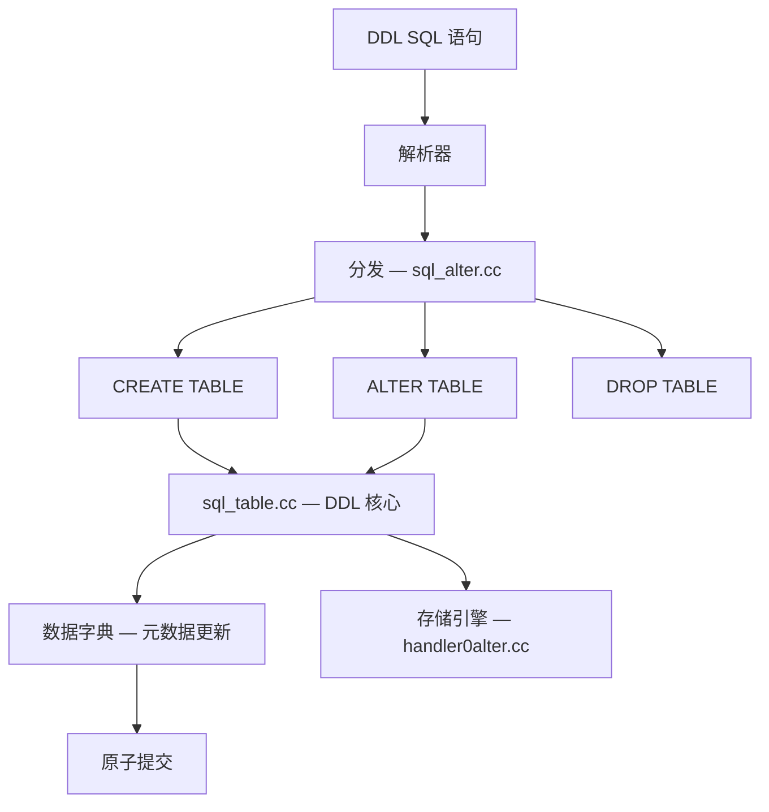
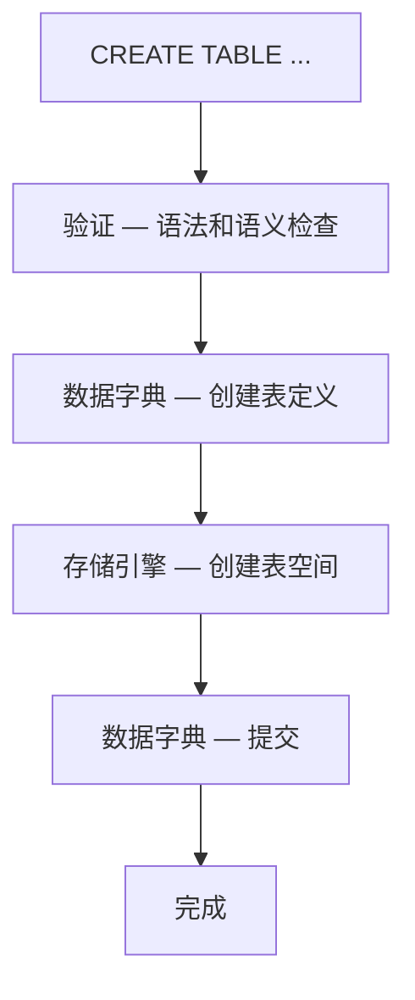
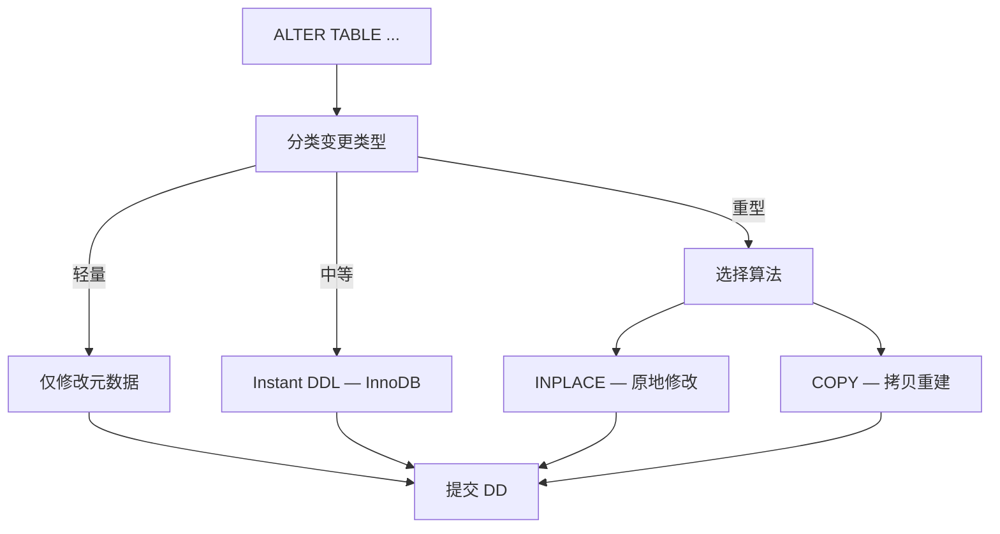
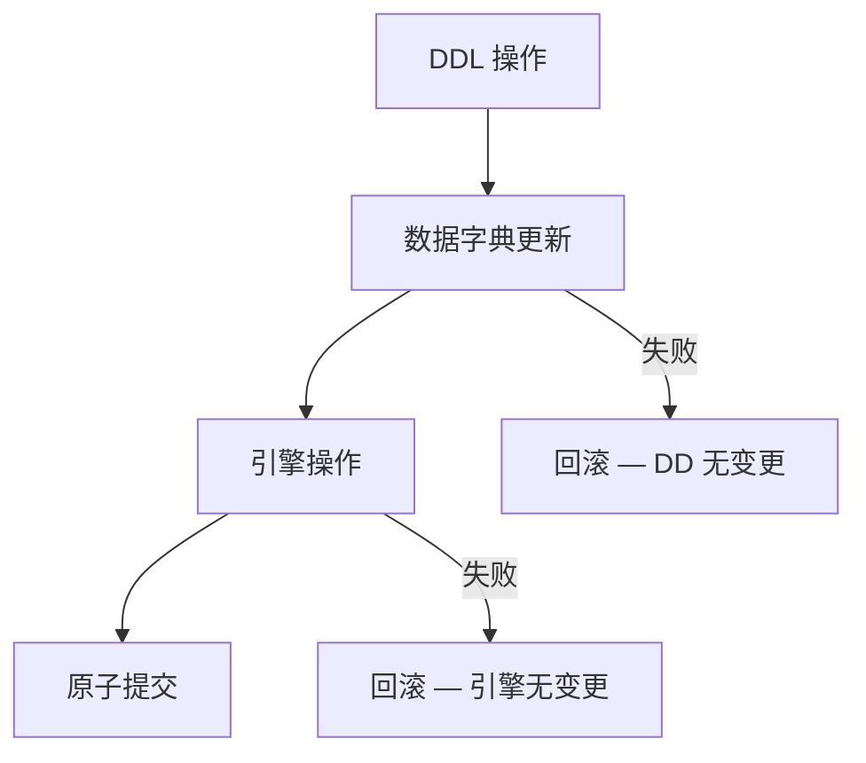

<cite>
**引用文件**
- [sql/sql_table.cc](file://sql/sql_table.cc)
- [sql/sql_alter.cc](file://sql/sql_alter.cc)
- [sql/sql_alter_instance.cc](file://sql/sql_alter_instance.cc)
- [storage/innobase/handler/handler0alter.cc](file://storage/innobase/handler/handler0alter.cc)
- [sql/sql_index.cc](file://sql/sql_index.cc)
- [sql/sql_rename.cc](file://sql/sql_rename.cc)
- [sql/sql_truncate.cc](file://sql/sql_truncate.cc)
</cite>

## 目录
1. [DDL 概述](#ddl-概述)
2. [CREATE TABLE](#create-table)
3. [ALTER TABLE](#alter-table)
4. [在线 DDL（Online DDL）](#在线-ddlonline-ddl)
5. [原子 DDL](#原子-ddl)
6. [其他 DDL 操作](#其他-ddl-操作)

## DDL 概述

DDL（Data Definition Language）负责数据库对象的创建、修改和删除。`sql_table.cc` 是 MySQL 中最大的单文件（~794KB），实现了 CREATE TABLE、ALTER TABLE 等核心 DDL 操作：

| 文件 | 大小 | 说明 |
|------|------|------|
| `sql_table.cc` | ~794KB | DDL 核心 — CREATE/ALTER TABLE |
| `sql_alter.cc` | ~17KB | ALTER TABLE 分发 |
| `sql_alter_instance.cc` | ~8KB | ALTER INSTANCE 操作 |
| `sql_index.cc` | — | 索引 DDL |
| `sql_rename.cc` | — | RENAME TABLE |
| `sql_truncate.cc` | — | TRUNCATE TABLE |
| `handler0alter.cc` | — | InnoDB ALTER TABLE 实现 |



**Sources** · [sql/sql_table.cc](file://sql/sql_table.cc) · [sql/sql_alter.cc](file://sql/sql_alter.cc)

## CREATE TABLE

### 处理流程



### 关键步骤

1. **语法验证** — 检查列定义、约束、索引
2. **字符集处理** — 继承或覆盖表/列字符集
3. **数据字典更新** — 在 DD 中创建表对象
4. **存储引擎调用** — 创建物理表空间和索引
5. **原子提交** — DD 和引擎操作原子化

### 表选项

| 选项 | 说明 |
|------|------|
| `ENGINE=InnoDB` | 存储引擎 |
| `ROW_FORMAT` | 行格式（COMPACT/DYNAMIC/COMPRESSED） |
| `CHARSET` | 字符集 |
| `COLLATE` | 排序规则 |
| `COMMENT` | 表注释 |
| `TABLESPACE` | 表空间 |
| `AUTO_INCREMENT` | 自增起始值 |
| `PARTITION BY` | 分区策略 |

**Sources** · [sql/sql_table.cc](file://sql/sql_table.cc)

## ALTER TABLE

ALTER TABLE 是最复杂的 DDL 操作，`sql_table.cc` 的大部分代码用于此：

### 处理流程



### 算法选择

| 算法 | LOCK 选项 | 说明 |
|------|-----------|------|
| **INSTANT** | `LOCK=NONE` | 仅修改元数据，不触碰数据 |
| **INPLACE** | `LOCK=NONE/SHARED` | 原地修改，不需要拷贝 |
| **COPY** | `LOCK=SHARED/EXCLUSIVE` | 创建新表并拷贝数据 |

```sql
-- 指定算法
ALTER TABLE orders ADD INDEX idx_date (order_date), ALGORITHM=INPLACE, LOCK=NONE;

-- 查看实际使用的算法
ALTER TABLE orders ADD COLUMN status VARCHAR(20), ALGORITHM=INSTANT;
```

**Sources** · [sql/sql_table.cc](file://sql/sql_table.cc)

## 在线 DDL（Online DDL）

InnoDB 支持多种在线 DDL 操作，允许在修改表结构时不阻塞 DML：

### 操作分类

| 操作 | INSTANT | INPLACE | COPY | 允许并发 DML |
|------|---------|---------|------|-------------|
| 添加列 | ✓ (末尾) | — | — | ✓ |
| 添加索引 | — | ✓ | — | ✓ |
| 删除索引 | — | ✓ | — | ✓ |
| 修改列类型 | — | — | ✓ | ✗ |
| 添加外键 | — | ✓ | — | ✓ |
| 修改列默认值 | ✓ | — | — | ✓ |
| 添加全文索引 | — | ✓ | — | ✗ (短暂) |
| 添加空间索引 | — | ✓ | — | ✗ |
| OPTIMIZE TABLE | — | ✓ | — | ✓ |
| 重建表 | — | ✓ | — | ✓ |
| 修改表注释 | ✓ | — | — | ✓ |
| RENAME INDEX | ✓ | — | — | ✓ |

### Instant DDL

MySQL 8.0 引入的 Instant DDL 仅修改数据字典中的表定义，不需要触碰表数据：

```sql
-- Instant 添加列（末尾列）
ALTER TABLE orders ADD COLUMN status VARCHAR(20) DEFAULT 'pending';
-- 立即完成，不需要重建表

-- MySQL 8.0.29+：支持在任意位置添加列
ALTER TABLE orders ADD COLUMN priority INT AFTER customer_id, ALGORITHM=INSTANT;

-- 检查是否使用了 Instant
SELECT * FROM INFORMATION_SCHEMA.INNODB_COLUMNS
WHERE TABLE_NAME = 'orders' AND NAME = 'status';
-- HAS_DEFAULT = YES 表示 Instant 添加
```

### InnoDB DDL 后台

```mermaid
graph TB
    subgraph InnoDB DDL — handler0alter.cc
        PREPARE[准备阶段]
        BUILD[构建阶段 — 创建索引/列]
        SORT[排序阶段 — 排序新索引数据]
        INSERT[插入阶段 — 插入排序后的数据]
        COMMIT[提交阶段]
        CLEANUP[清理阶段]
    end

    PREPARE --> BUILD
    BUILD --> SORT
    SORT --> INSERT
    INSERT --> COMMIT
    COMMIT --> CLEANUP
```

**Sources** · [storage/innobase/handler/handler0alter.cc](file://storage/innobase/handler/handler0alter.cc)

## 原子 DDL

MySQL 8.0+ 的事务型数据字典确保 DDL 操作的原子性：

### 原子性保证



| 场景 | 行为 |
|------|------|
| DDL 成功 | DD 和引擎变更一起提交 |
| DDL 失败 | DD 和引擎变更一起回滚 |
| 崩溃恢复 | 未完成的事务自动回滚 |
| 并发冲突 | 获取 MDL 锁等待或失败 |

### 元数据锁（MDL）

| 锁类型 | 说明 |
|--------|------|
| `SHARED_READ` | 允许并发读 |
| `SHARED_WRITE` | 允许并发读写 |
| `EXCLUSIVE` | 阻塞所有并发访问 |

```sql
-- 查看当前 MDL 锁
SELECT * FROM performance_schema.metadata_locks
WHERE OBJECT_TYPE = 'TABLE';

-- 设置锁等待超时
SET SESSION lock_wait_timeout = 10;
```

**Sources** · [sql/sql_table.cc](file://sql/sql_table.cc)

## 其他 DDL 操作

### RENAME TABLE

```sql
-- 原子重命名
RENAME TABLE orders TO orders_archive, orders_new TO orders;
```

### TRUNCATE TABLE

```sql
-- 截断表（DDL 操作，非 DML）
TRUNCATE TABLE orders;
-- 等价于：DROP TABLE + CREATE TABLE（保持表结构）
```

### ALTER INSTANCE

`sql_alter_instance.cc`（~8KB）实现实例级操作：

```sql
-- 卸载插件
ALTER INSTANCE UNINSTALL PLUGIN plugin_name;

-- 旋转 InnoDB 主密钥
ALTER INSTANCE ROTATE INNODB MASTER KEY;

-- 重新加载 SSL 证书
ALTER INSTANCE RELOAD TLS;

-- 设置 InnoDB 缓冲池大小
ALTER INSTANCE SET innodb_buffer_pool_size = 8589934592;
```

**Sources** · [sql/sql_rename.cc](file://sql/sql_rename.cc) · [sql/sql_truncate.cc](file://sql/sql_truncate.cc) · [sql/sql_alter_instance.cc](file://sql/sql_alter_instance.cc)
