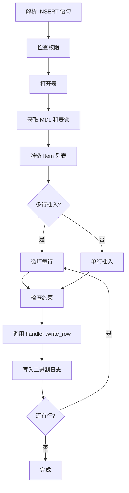
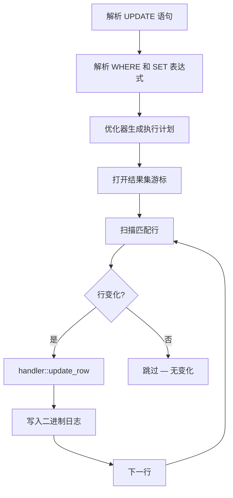
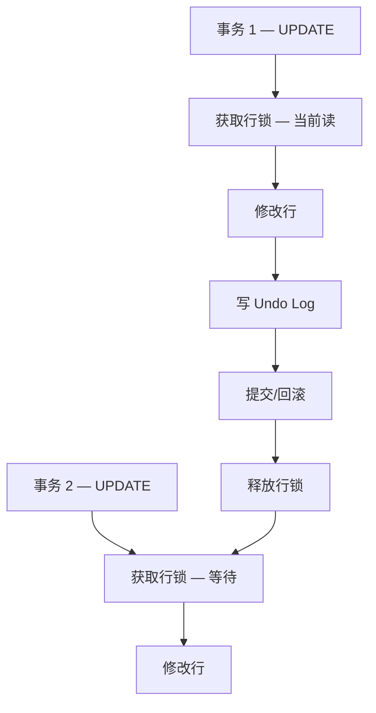
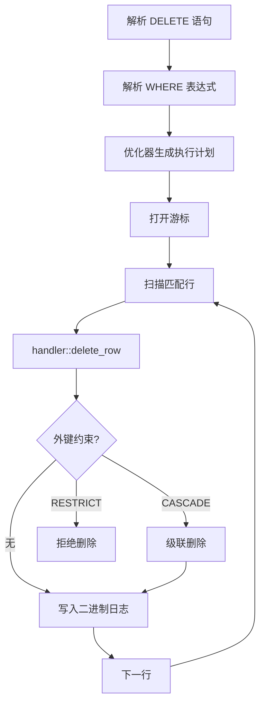
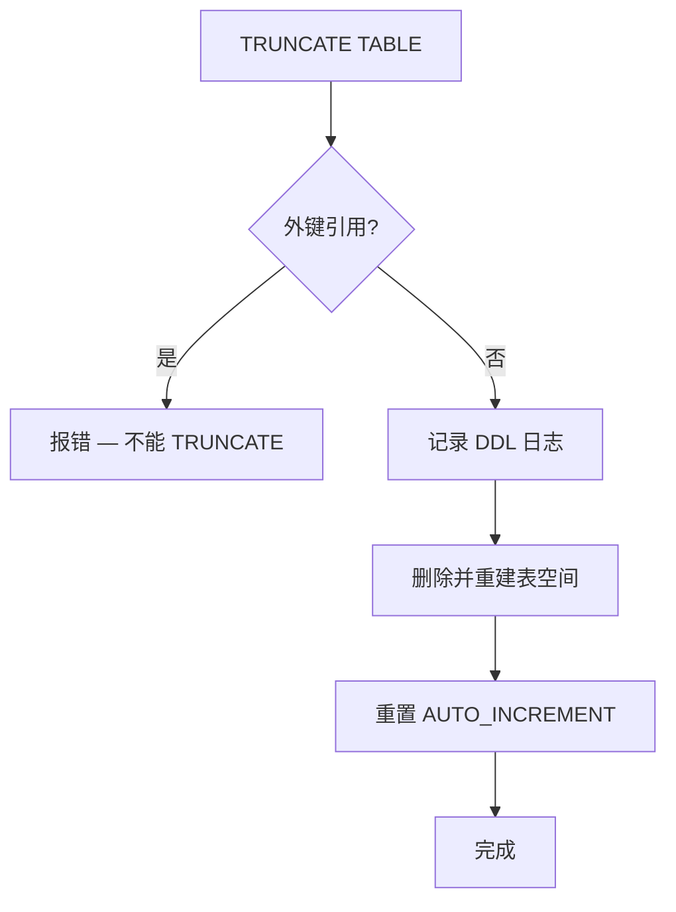
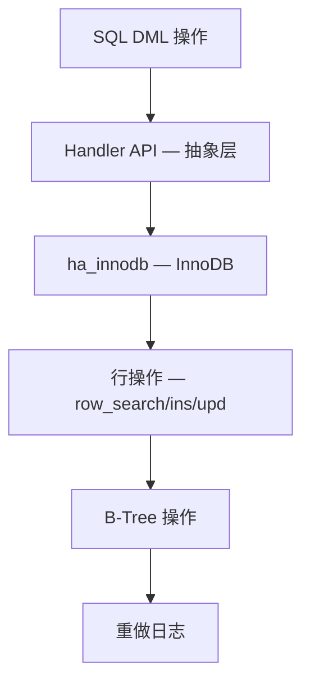

<cite>
**引用文件**
- [sql/sql_insert.cc](file://sql/sql_insert.cc)
- [sql/sql_update.cc](file://sql/sql_update.cc)
- [sql/sql_delete.cc](file://sql/sql_delete.cc)
- [sql/sql_truncate.cc](file://sql/sql_truncate.cc)
- [sql/sql_select.cc](file://sql/sql_select.cc)
- [sql/handler.cc](file://sql/handler.cc)
</cite>

## 目录
1. [DML 操作概述](#dml-操作概述)
2. [INSERT 操作](#insert-操作)
3. [UPDATE 操作](#update-操作)
4. [DELETE 操作](#delete-操作)
5. [TRUNCATE 操作](#truncate-操作)
6. [DML 与存储引擎接口](#dml-与存储引擎接口)
7. [批量操作与优化](#批量操作与优化)

## DML 操作概述

DML（数据操作语言）是 SQL 层处理数据修改的核心，相关文件总计约 470KB：

| 文件 | 大小 | 说明 |
|------|------|------|
| `sql_insert.cc` | ~130KB | INSERT 和 REPLACE |
| `sql_update.cc` | ~119KB | UPDATE 单表和多表更新 |
| `sql_delete.cc` | ~46KB | DELETE 单表和多表删除 |
| `sql_truncate.cc` | ~26KB | TRUNCATE TABLE |

**Sources** · [sql/sql_insert.cc](file://sql/sql_insert.cc) · [sql/sql_update.cc](file://sql/sql_update.cc)

## INSERT 操作

`sql_insert.cc`（~130KB）实现 INSERT、REPLACE 和 LOAD DATA 操作。

### INSERT 执行流程



### INSERT 类型

| 类型 | 类/函数 | 说明 |
|------|--------|------|
| `INSERT ... VALUES` | `Sql_cmd_insert_values` | 标准值插入 |
| `INSERT ... SELECT` | `Sql_cmd_insert_select` | 子查询结果插入 |
| `INSERT ... ON DUPLICATE KEY` | `write_record()` | 重复键更新 |
| `REPLACE INTO` | `Sql_cmd_replace` | 替换插入 |
| `LOAD DATA` | `Sql_cmd_load` | 文件数据加载 |

### INSERT 优化

| 优化 | 说明 |
|------|------|
| **批量插入** | 多行 VALUES 合并为一次 handler 调用 |
| **延迟插入** | `INSERT DELAYED` — 写入缓冲（已弃用） |
| **LOW_PRIORITY** | 降低插入优先级 |
| **HIGH_PRIORITY** | 提高插入优先级 |
| **INSERT IGNORE** | 忽略重复键错误 |

**Sources** · [sql/sql_insert.cc](file://sql/sql_insert.cc)

## UPDATE 操作

`sql_update.cc`（~119KB）实现单表和多表 UPDATE：

### UPDATE 执行流程



### UPDATE 类型

| 类型 | 说明 |
|------|------|
| **单表 UPDATE** | `Sql_cmd_update` — 更新单表中的行 |
| **多表 UPDATE** | `Sql_cmd_multi_update` — 同时更新多个表 |
| **UPDATE with JOIN** | 通过 JOIN 确定更新范围 |

### 并发更新



**Sources** · [sql/sql_update.cc](file://sql/sql_update.cc)

## DELETE 操作

`sql_delete.cc`（~46KB）实现 DELETE 操作：

### DELETE 执行流程



### DELETE 类型

| 类型 | 说明 |
|------|------|
| **单表 DELETE** | `Sql_cmd_delete` — 删除单表中的行 |
| **多表 DELETE** | `Sql_cmd_multi_delete` — 从多个表删除 |
| **DELETE with JOIN** | 通过 JOIN 确定删除范围 |
| **QUICK DELETE** | 不更新索引（`DELETE QUICK`） |
| **LOW_PRIORITY** | 降低删除优先级 |

**Sources** · [sql/sql_delete.cc](file://sql/sql_delete.cc)

## TRUNCATE 操作

`sql_truncate.cc`（~26KB）实现 TRUNCATE TABLE：

### TRUNCATE vs DELETE

| 特性 | TRUNCATE TABLE | DELETE FROM |
|------|---------------|-------------|
| **速度** | 极快 — 重建表 | 慢 — 逐行删除 |
| **日志** | DDL 日志 | 行级二进制日志 |
| **锁** | 独占 MDL 锁 | 行锁 |
| **自增** | 重置 AUTO_INCREMENT | 不重置 |
| **外键** | 有外键引用时禁止 | 受 FK 约束控制 |
| **触发器** | 不触发 | 触发 DELETE 触发器 |

### TRUNCATE 流程



**Sources** · [sql/sql_truncate.cc](file://sql/sql_truncate.cc)

## DML 与存储引擎接口

DML 操作通过 Handler API 与存储引擎交互：

| SQL 操作 | Handler API | 说明 |
|----------|------------|------|
| `INSERT` | `handler::write_row()` | 插入一行 |
| `UPDATE` | `handler::update_row()` | 更新一行 |
| `DELETE` | `handler::delete_row()` | 删除一行 |
| `TRUNCATE` | `handler::truncate()` | 清空表 |
| `SELECT FOR UPDATE` | `handler::rnd_next()` + lock | 锁定读 |

### Handler 调用链



**Sources** · [sql/handler.cc](file://sql/handler.cc)

## 批量操作与优化

### 批量插入优化

```sql
-- 多行插入（比逐行插入快 10-100 倍）
INSERT INTO t VALUES (1, 'a'), (2, 'b'), (3, 'c'), ...;

-- 使用 LOAD DATA（最快的批量加载方式）
LOAD DATA INFILE '/tmp/data.csv' INTO TABLE t
FIELDS TERMINATED BY ',' LINES TERMINATED BY '\n';
```

### 删除优化

```sql
-- 大批量删除优化 — 分批执行
DELETE FROM big_table WHERE date < '2020-01-01' LIMIT 10000;
-- 循环执行直到 ROW_COUNT() = 0

-- TRUNCATE 代替 DELETE（无 WHERE 时）
TRUNCATE TABLE big_table;
```

### 更新优化

```sql
-- 批量更新优化
UPDATE t SET status = 'done' WHERE id BETWEEN 1 AND 10000;
-- 使用主键范围，减少扫描行数
```

**Sources** · [sql/sql_insert.cc](file://sql/sql_insert.cc) · [sql/sql_delete.cc](file://sql/sql_delete.cc)
