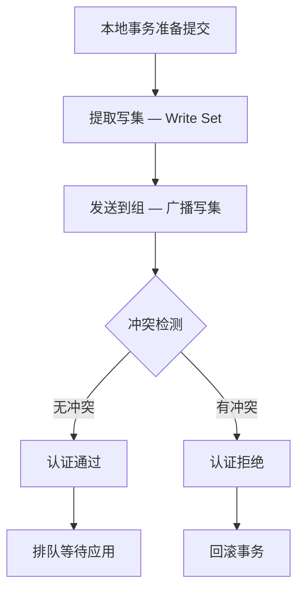
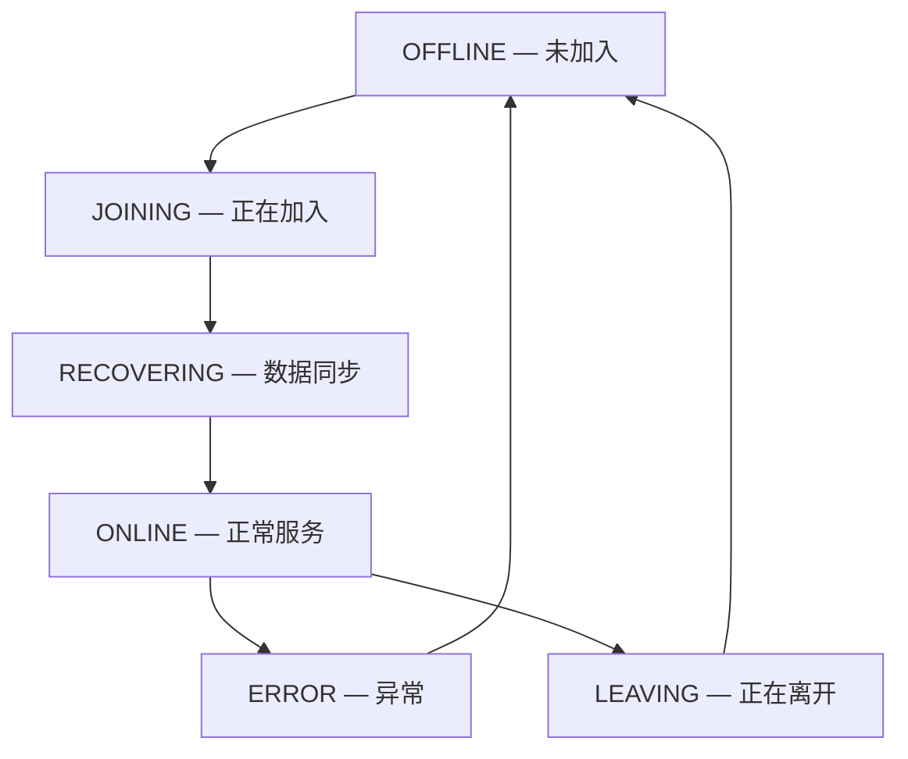
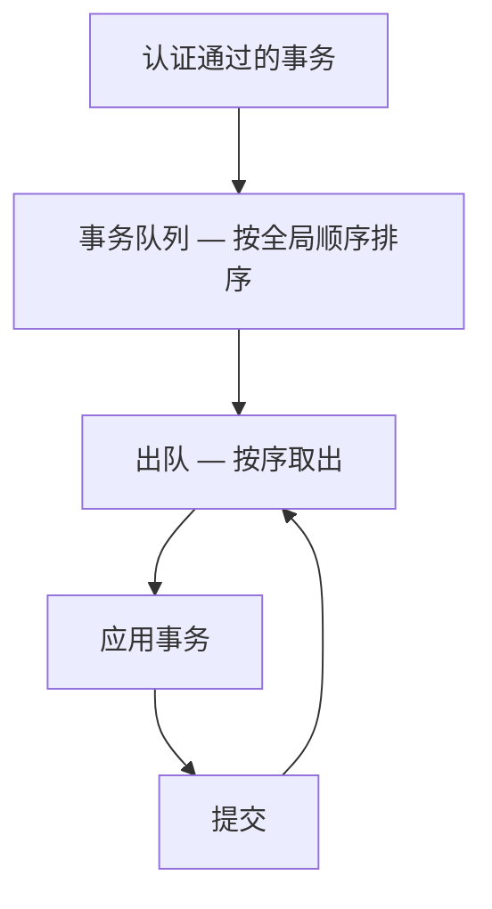
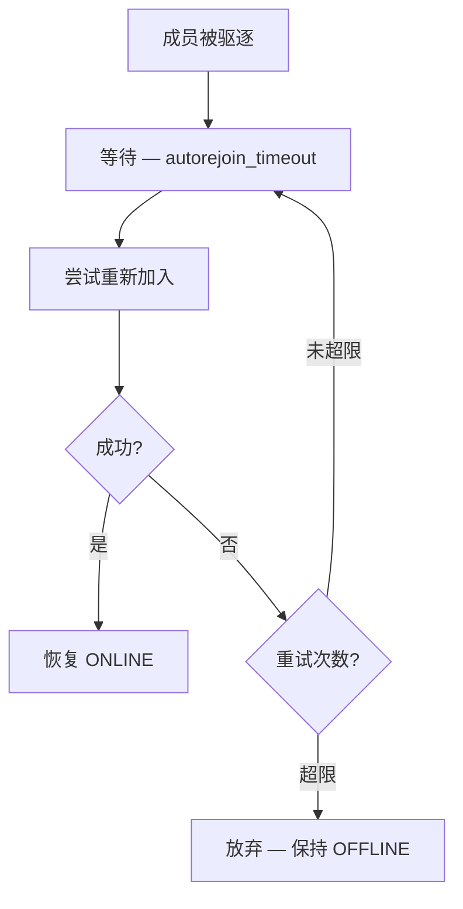
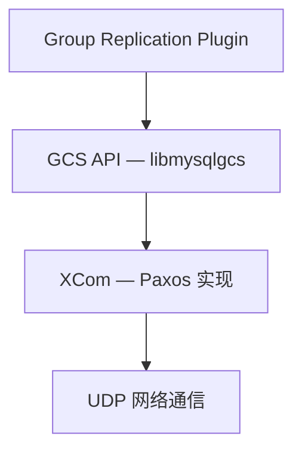

<cite>
**引用文件**
- [plugin/group_replication/src/gcs_event_handlers.cc](file://plugin/group_replication/src/gcs_event_handlers.cc)
- [plugin/group_replication/src/certifier.cc](file://plugin/group_replication/src/certifier.cc)
- [plugin/group_replication/src/applier.cc](file://plugin/group_replication/src/applier.cc)
- [plugin/group_replication/src/consistency_manager.cc](file://plugin/group_replication/src/consistency_manager.cc)
- [plugin/group_replication/src/autorejoin.cc](file://plugin/group_replication/src/autorejoin.cc)
- [plugin/group_replication/libmysqlgcs/](file://plugin/group_replication/libmysqlgcs/)
</cite>

## 目录
1. [Group Replication 概述](#group-replication-概述)
2. [内部架构](#内部架构)
3. [认证器（Certifier）](#认证器certifier)
4. [GCS 事件处理](#gcs-事件处理)
5. [应用器（Applier）](#应用器applier)
6. [一致性管理](#一致性管理)
7. [自动重加入](#自动重加入)
8. [libmysqlgcs — 组通信系统](#libmysqlgcs--组通信系统)

## Group Replication 概述

MySQL Group Replication 是基于 Paxos 共识协议的多主/单主复制方案。核心实现在 `plugin/group_replication/` 中，包含 39 个源文件，其中最核心的两个文件是：

| 文件 | 大小 | 说明 |
|------|------|------|
| `gcs_event_handlers.cc` | ~83KB | GCS 事件处理 — 组成员变更、消息分发 |
| `certifier.cc` | ~77KB | 认证器 — 事务冲突检测和认证 |
| `applier.cc` | ~37KB | 应用器 — 将认证后的事务应用到本地 |
| `consistency_manager.cc` | ~33KB | 一致性管理 — 读写一致性保证 |

**Sources** · [plugin/group_replication/src/](file://plugin/group_replication/src/)

## 内部架构

```mermaid
graph TB
    subgraph Group Replication Plugin
        GCS_HANDLER[GCS 事件处理器]
        CERTIFIER[认证器 — certifier.cc]
        APPLIER[应用器 — applier.cc]
        CONSISTENCY[一致性管理器]
        AUTO_REJOIN[自动重加入]
    end

    subgraph 组通信系统 — libmysqlgcs
        GCS[GCS API]
        PAXOS[XCom — Paxos 实现]
    end

    subgraph MySQL Server
        BINLOG[二进制日志]
        INNODB[InnoDB]
    end

    GCS_HANDLER --> GCS
    GCS --> PAXOS
    GCS_HANDLER --> CERTIFIER
    CERTIFIER --> APPLIER
    APPLIER --> BINLOG
    APPLIER --> INNODB
    CONSISTENCY --> APPLIER
```

### 核心组件

| 组件 | 文件 | 说明 |
|------|------|------|
| **GCS 事件处理器** | `gcs_event_handlers.cc` | 处理组成员变更、消息接收和分发 |
| **认证器** | `certifier.cc` | 事务冲突检测和认证（Certification） |
| **应用器** | `applier.cc` | 将认证通过的事务应用到本地 |
| **一致性管理器** | `consistency_manager.cc` | 保证读写一致性 |
| **自动重加入** | `autorejoin.cc` | 成员被驱逐后自动尝试重新加入 |

**Sources** · [plugin/group_replication/src/gcs_event_handlers.cc](file://plugin/group_replication/src/gcs_event_handlers.cc)

## 认证器（Certifier）

认证器是 Group Replication 的核心创新，负责检测事务冲突并决定事务是否可以提交：

### 认证过程



### 冲突检测算法

认证器通过比较写集（Write Set）来检测冲突：

| 步骤 | 说明 |
|------|------|
| **提取写集** | 从二进制日志中提取事务修改的主键 |
| **广播** | 将写集发送到所有组成员 |
| **比较** | 检查本地写集与远程写集是否有交集 |
| **决定** | 按全局顺序决定哪个事务获胜 |

```sql
-- 查看认证统计
SELECT * FROM performance_schema.replication_group_member_stats;

-- 查看冲突检测配置
SHOW VARIABLES LIKE 'group_replication_transaction_size_limit';
```

### 认证窗口

| 参数 | 说明 |
|------|------|
| `group_replication_certifier_gtid_wait_for` | 等待远程 GTID 的超时 |
| `group_replication_single_primary_mode` | 单主 vs 多主模式 |

**Sources** · [plugin/group_replication/src/certifier.cc](file://plugin/group_replication/src/certifier.cc)

## GCS 事件处理

`gcs_event_handlers.cc`（~83KB）处理来自组通信系统的各类事件：

### 事件类型

| 事件 | 说明 |
|------|------|
| **成员加入** | 新成员加入集群 |
| **成员离开** | 成员正常离开 |
| **成员驱逐** | 成员被怀疑失败而驱逐 |
| **视图变更** | 集群视图发生变化 |
| **消息接收** | 接收来自其他成员的消息 |
| **状态变更** | 成员状态转换（ONLINE/OFFLINE/RECOVERING） |

### 成员状态机



**Sources** · [plugin/group_replication/src/gcs_event_handlers.cc](file://plugin/group_replication/src/gcs_event_handlers.cc)

## 应用器（Applier）

`applier.cc`（~37KB）负责将认证通过的事务应用到本地数据库：

### 应用流程



### 应用线程

| 线程 | 说明 |
|------|------|
| **Applier 线程** | 应用远程事务 |
| **Recovery 线程** | 新成员的数据同步 |
| **Pipeline 线程** | 管理应用流水线 |

**Sources** · [plugin/group_replication/src/applier.cc](file://plugin/group_replication/src/applier.cc)

## 一致性管理

`consistency_manager.cc`（~33KB）保证 Group Replication 的读写一致性：

### 一致性级别

| 级别 | 说明 |
|------|------|
| `EVENTUAL` | 最终一致性（默认） |
| `BEFORE_ON_PRIMARY_FAILOVER` | 主故障转移前的一致性 |
| `BEFORE` | 事务开始前等待所有先前事务应用 |
| `AFTER` | 事务提交后等待所有成员应用 |
| `BEFORE_AND_AFTER` | 双向一致性 |

```sql
-- 设置一致性级别
SET SESSION group_replication_consistency = 'BEFORE_AND_AFTER';

-- 查看当前设置
SELECT @@group_replication_consistency;
```

**Sources** · [plugin/group_replication/src/consistency_manager.cc](file://plugin/group_replication/src/consistency_manager.cc)

## 自动重加入

`autorejoin.cc`（~9KB）实现被驱逐成员的自动重加入：

```sql
-- 配置自动重加入
SET GLOBAL group_replication_autorejoin_tries = 3;
SET GLOBAL group_replication_recovery_get_public_key = ON;
```

### 重加入流程



**Sources** · [plugin/group_replication/src/autorejoin.cc](file://plugin/group_replication/src/autorejoin.cc)

## libmysqlgcs — 组通信系统

`libmysqlgcs/` 是 Group Replication 底层的组通信系统（Group Communication System），基于 XCom（Paxos 实现）：

### 架构



### 核心功能

| 功能 | 说明 |
|------|------|
| **消息广播** | 将消息发送到所有组成员 |
| **视图管理** | 维护集群成员视图 |
| **故障检测** | 检测成员失败 |
| **有序消息** | 保证全局消息顺序 |
| **原子广播** | 要么全部成员收到，要么都没有 |

**Sources** · [plugin/group_replication/libmysqlgcs/](file://plugin/group_replication/libmysqlgcs/)
