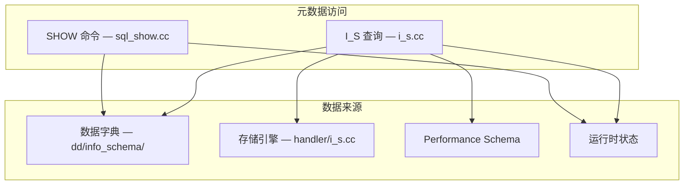
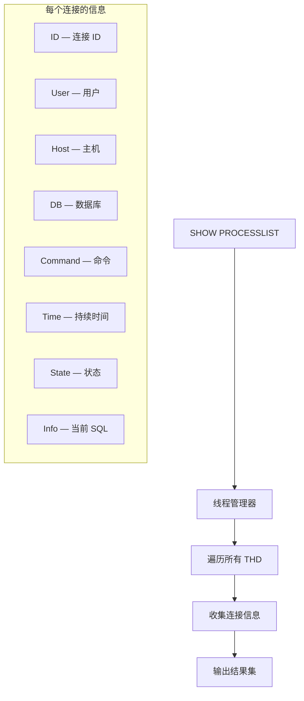

<cite>
**引用文件**
- [sql/sql_show.cc](file://sql/sql_show.cc)
- [sql/sql_show_status.cc](file://sql/sql_show_status.cc)
- [sql/i_s.cc](file://sql/i_s.cc)
- [storage/innobase/handler/i_s.cc](file://storage/innobase/handler/i_s.cc)
- [sql/dd/info_schema/](file://sql/dd/info_schema/)
</cite>

## 目录
1. [INFORMATION_SCHEMA 概述](#information_schema-概述)
2. [SHOW 命令实现](#show-命令实现)
3. [核心 INFORMATION_SCHEMA 表](#核心-information_schema-表)
4. [InnoDB 专用视图](#innodb-专用视图)
5. [数据字典集成](#数据字典集成)
6. [Performance Schema 集成](#performance-schema-集成)

## INFORMATION_SCHEMA 概述

INFORMATION_SCHEMA 是 SQL 标准定义的元数据视图，提供数据库对象信息的只读访问。核心实现在 `sql/sql_show.cc`（~227KB）和 `sql/i_s.cc` 中：



**Sources** · [sql/sql_show.cc](file://sql/sql_show.cc) · [sql/i_s.cc](file://sql/i_s.cc)

## SHOW 命令实现

`sql_show.cc`（~227KB）和 `sql_show_status.cc`（~11KB）实现 SHOW 系列命令：

### 常用 SHOW 命令

| 命令 | 说明 | 数据来源 |
|------|------|---------|
| `SHOW DATABASES` | 列出所有数据库 | 数据字典 |
| `SHOW TABLES` | 列出当前库的表 | 数据字典 |
| `SHOW COLUMNS` | 列出表的列 | 数据字典 |
| `SHOW INDEX` | 列出表的索引 | 数据字典 |
| `SHOW CREATE TABLE` | 显示建表语句 | 数据字典 + 引擎 |
| `SHOW STATUS` | 显示服务器状态变量 | 运行时统计 |
| `SHOW VARIABLES` | 显示系统变量 | sys_vars |
| `SHOW PROCESSLIST` | 显示活跃连接 | 线程管理器 |
| `SHOW ENGINES` | 列出存储引擎 | Handler API |
| `SHOW WARNINGS` | 显示诊断信息 | 诊断区域 |

### SHOW PROCESSLIST 实现



**Sources** · [sql/sql_show.cc](file://sql/sql_show.cc) · [sql/sql_show_status.cc](file://sql/sql_show_status.cc)

## 核心 INFORMATION_SCHEMA 表

### 数据库对象信息

| 视图 | 说明 | 关键列 |
|------|------|--------|
| `SCHEMATA` | 数据库列表 | SCHEMA_NAME, DEFAULT_CHARACTER_SET |
| `TABLES` | 表信息 | TABLE_SCHEMA, ENGINE, TABLE_ROWS, DATA_LENGTH |
| `COLUMNS` | 列信息 | COLUMN_NAME, DATA_TYPE, IS_NULLABLE |
| `STATISTICS` | 索引信息 | INDEX_NAME, COLUMN_NAME, NON_UNIQUE |
| `KEY_COLUMN_USAGE` | 外键信息 | CONSTRAINT_NAME, REFERENCED_TABLE |
| `VIEWS` | 视图定义 | VIEW_DEFINITION, CHECK_OPTION |
| `ROUTINES` | 存储程序 | ROUTINE_NAME, ROUTINE_DEFINITION |
| `TRIGGERS` | 触发器 | TRIGGER_NAME, EVENT_MANIPULATION |
| `EVENTS` | 事件 | EVENT_NAME, EXECUTE_AT, STATUS |

### 查询示例

```sql
-- 查看表大小
SELECT TABLE_NAME, TABLE_ROWS,
       ROUND(DATA_LENGTH / 1024 / 1024, 2) AS 'Data MB',
       ROUND(INDEX_LENGTH / 1024 / 1024, 2) AS 'Index MB'
FROM INFORMATION_SCHEMA.TABLES
WHERE TABLE_SCHEMA = 'mydb'
ORDER BY DATA_LENGTH DESC;

-- 查找没有索引的外键
SELECT tc.TABLE_NAME, kcu.COLUMN_NAME, ccu.TABLE_NAME AS REF_TABLE
FROM INFORMATION_SCHEMA.TABLE_CONSTRAINTS tc
JOIN INFORMATION_SCHEMA.KEY_COLUMN_USAGE kcu
  ON tc.CONSTRAINT_NAME = kcu.CONSTRAINT_NAME
JOIN INFORMATION_SCHEMA.REFERENTIAL_CONSTRAINTS rc
  ON tc.CONSTRAINT_NAME = rc.CONSTRAINT_NAME
JOIN INFORMATION_SCHEMA.TABLE_CONSTRAINTS ccu
  ON rc.UNIQUE_CONSTRAINT_NAME = ccu.CONSTRAINT_NAME
WHERE tc.CONSTRAINT_TYPE = 'FOREIGN KEY';
```

**Sources** · [sql/i_s.cc](file://sql/i_s.cc)

## InnoDB 专用视图

InnoDB 存储引擎在 `storage/innobase/handler/i_s.cc` 中提供专用的 INFORMATION_SCHEMA 视图：

| 视图 | 说明 |
|------|------|
| `INNODB_TABLES` | InnoDB 表定义 |
| `INNODB_COLUMNS` | InnoDB 列信息 |
| `INNODB_INDEXES` | InnoDB 索引信息 |
| `INNODB_TABLESPACES` | 表空间信息 |
| `INNODB_TABLESPACES_ENCRYPTION` | 加密状态 |
| `INNODB_LOCKS` | 锁信息（8.0 已移至 PFS） |
| `INNODB_TRX` | 活跃事务 |
| `INNODB_METRICS` | InnoDB 性能指标 |
| `INNODB_BUFFER_POOL_STATS` | 缓冲池统计 |
| `INNODB_FT_DEFAULT_STOPWORD` | 全文搜索停用词 |
| `INNODB_VIRTUAL` | 虚拟列信息 |

```sql
-- 查看活跃事务
SELECT trx_id, trx_state, trx_started,
       trx_mysql_thread_id, trx_query
FROM INFORMATION_SCHEMA.INNODB_TRX;

-- 缓冲池统计
SELECT * FROM INFORMATION_SCHEMA.INNODB_BUFFER_POOL_STATS;
```

**Sources** · [storage/innobase/handler/i_s.cc](file://storage/innobase/handler/i_s.cc)

## 数据字典集成

`sql/dd/info_schema/` 目录实现 INFORMATION_SCHEMA 视图与事务型数据字典的集成：

### 缓存策略

| 策略 | 说明 |
|------|------|
| **DD 缓存** | 表定义缓存在内存中 |
| **延迟打开** | 仅在查询时打开 DD 对象 |
| **I_S 优化** | 优化 INFORMATION_SCHEMA 查询的执行计划 |

```sql
-- I_S 查询优化
-- MySQL 8.0+ 使用条件推送优化 I_S 查询
SELECT * FROM INFORMATION_SCHEMA.TABLES
WHERE TABLE_SCHEMA = 'mydb'   -- 条件推送到 DD 层
AND TABLE_NAME = 'orders';    -- 避免全表扫描 DD
```

**Sources** · [sql/dd/info_schema/](file://sql/dd/info_schema/)

## Performance Schema 集成

Performance Schema 通过 `performance_schema` 数据库提供运行时性能指标，与 INFORMATION_SCHEMA 互补：

### 关键区别

| 特性 | INFORMATION_SCHEMA | Performance Schema |
|------|--------------------|--------------------|
| 数据类型 | 静态元数据 | 动态运行时数据 |
| 更新频率 | 对象创建/修改时 | 持续更新 |
| 性能影响 | 查询时产生 I/O | 通过插桩持续收集 |
| 标准 | SQL 标准 | MySQL 专有 |
| 控制 | 始终可用 | 可启用/禁用 |

### 联合查询

```sql
-- 结合 I_S 和 PFS 分析慢查询
SELECT t.TABLE_SCHEMA, t.TABLE_NAME,
       ps.COUNT_READ, ps.COUNT_WRITE,
       ps.SUM_TIMER_WAIT / 1000000000 AS 'Total ms'
FROM INFORMATION_SCHEMA.TABLES t
JOIN performance_schema.table_io_waits_summary_by_table ps
  ON t.TABLE_SCHEMA = ps.OBJECT_SCHEMA
  AND t.TABLE_NAME = ps.OBJECT_NAME
WHERE t.TABLE_SCHEMA NOT IN ('mysql', 'performance_schema')
ORDER BY ps.SUM_TIMER_WAIT DESC LIMIT 20;
```

**Sources** · [sql/i_s.cc](file://sql/i_s.cc)
