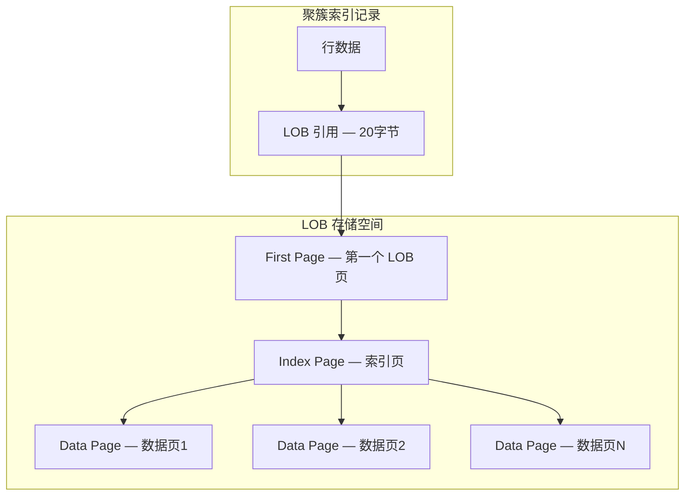
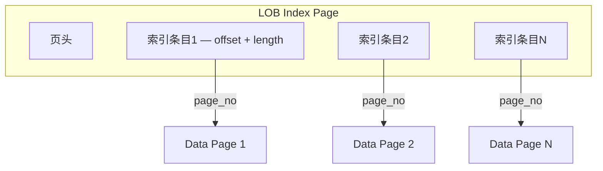
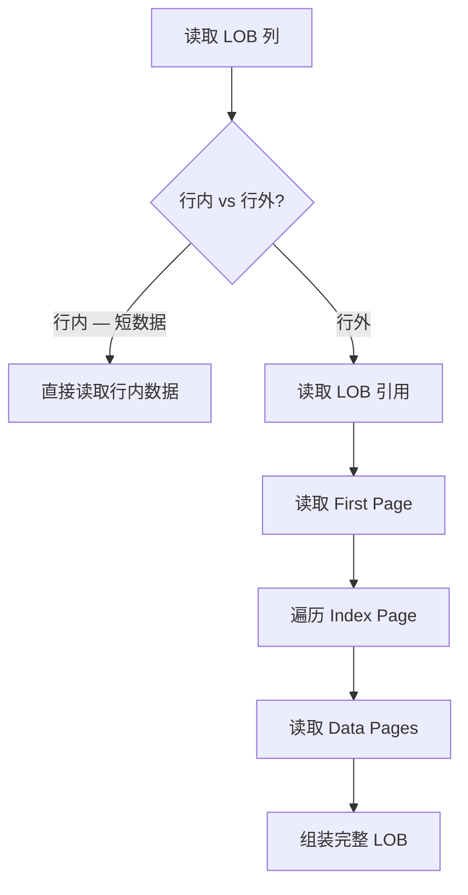
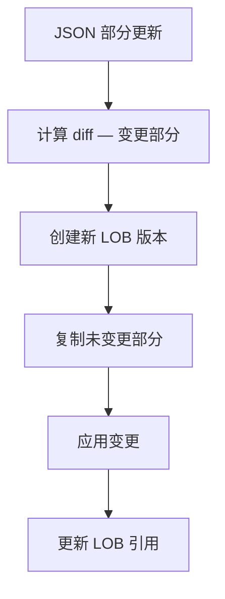
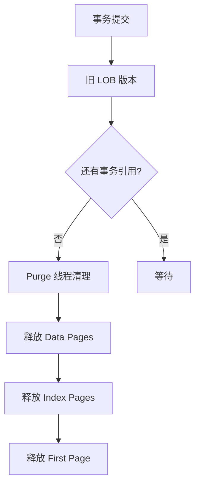

<cite>
**引用文件**
- [storage/innobase/lob/lob0lob.cc](file://storage/innobase/lob/lob0lob.cc)
- [storage/innobase/lob/lob0impl.cc](file://storage/innobase/lob/lob0impl.cc)
- [storage/innobase/lob/lob0update.cc](file://storage/innobase/lob/lob0update.cc)
- [storage/innobase/lob/lob0purge.cc](file://storage/innobase/lob/lob0purge.cc)
- [storage/innobase/lob/lob0first.cc](file://storage/innobase/lob/lob0first.cc)
- [storage/innobase/lob/zlob0first.cc](file://storage/innobase/lob/zlob0first.cc)
</cite>

## 目录
1. [LOB 存储概述](#lob-存储概述)
2. [LOB 内部架构](#lob-内部架构)
3. [LOB 页面类型](#lob-页面类型)
4. [LOB 读取](#lob-读取)
5. [LOB 更新](#lob-更新)
6. [LOB Purge](#lob-purge)
7. [压缩 LOB](#压缩-lob)

## LOB 存储概述

InnoDB LOB（Large Object）子系统位于 `storage/innobase/lob/`，包含 17 个文件，总计约 245KB。当 TEXT、BLOB、VARCHAR 等列的数据超过行内存储限制时，InnoDB 使用 LOB 子系统在行外存储大对象：

| 文件 | 大小 | 说明 |
|------|------|------|
| `lob0lob.cc` | ~43KB | LOB 核心 — 通用 LOB 操作 |
| `lob0impl.cc` | ~40KB | LOB 实现 — 具体页操作 |
| `lob0update.cc` | ~24KB | LOB 更新 — 部分更新优化 |
| `lob0purge.cc` | ~21KB | LOB Purge — 清理旧版本 |
| `lob0first.cc` | ~15KB | 首次页操作 |

**Sources** · [storage/innobase/lob/](file://storage/innobase/lob/)

## LOB 内部架构

### 行外存储触发条件

| 行格式 | 行内存储 | 行外存储触发 |
|--------|---------|-------------|
| **DYNAMIC**（默认） | 40字节引用 | 数据 > 页大小/2 时移至行外 |
| **COMPACT** | 768字节前缀 | 数据 > 页大小/2 时移至行外 |
| **COMPRESSED** | 40字节引用 | 压缩后仍超限时移至行外 |

### LOB 结构



### LOB 引用

行内存储的 20 字节 LOB 引用包含：

| 字段 | 大小 | 说明 |
|------|------|------|
| `space_id` | 4B | 表空间 ID |
| `page_no` | 4B | 第一个 LOB 页号 |
| `length` | 4B | LOB 数据总长度 |
| `lob_version` | 4B | LOB 版本号 |
| `flags` | 4B | 标志位 |

**Sources** · [storage/innobase/lob/lob0lob.cc](file://storage/innobase/lob/lob0lob.cc)

## LOB 页面类型

| 页面类型 | 说明 |
|----------|------|
| `FIL_PAGE_TYPE_LOB_FIRST` | LOB 首页 — 包含 LOB 头信息和可能的数据 |
| `FIL_PAGE_TYPE_LOB_INDEX` | LOB 索引页 — 指向数据页 |
| `FIL_PAGE_TYPE_LOB_DATA` | LOB 数据页 — 实际数据块 |
| `FIL_PAGE_TYPE_ZLOB_FIRST` | 压缩 LOB 首页 |
| `FIL_PAGE_TYPE_ZLOB_INDEX` | 压缩 LOB 索引页 |
| `FIL_PAGE_TYPE_ZLOB_DATA` | 压缩 LOB 数据页 |

### LOB 索引页结构



**Sources** · [storage/innobase/lob/lob0impl.cc](file://storage/innobase/lob/lob0impl.cc)

## LOB 读取

### 读取流程



### 部分读取优化

```sql
-- MySQL 8.0 支持部分 LOB 读取
-- 优化器可以只读取需要的 LOB 部分
SELECT SUBSTRING(long_text, 1, 100) FROM articles;
-- InnoDB 只读取前 100 字节，不需要加载整个 LOB
```

**Sources** · [storage/innobase/lob/lob0first.cc](file://storage/innobase/lob/lob0first.cc)

## LOB 更新

`lob0update.cc`（~24KB）实现 LOB 的部分更新：

### JSON 部分更新

MySQL 8.0 支持对 LOB 列的 JSON 部分更新，避免整个 LOB 的复制：



```sql
-- JSON 部分更新（内部优化）
UPDATE articles SET metadata = JSON_SET(metadata, '$.views', 100)
WHERE id = 1;
-- 只更新 metadata LOB 中 $.views 部分
```

**Sources** · [storage/innobase/lob/lob0update.cc](file://storage/innobase/lob/lob0update.cc)

## LOB Purge

`lob0purge.cc`（~21KB）处理 LOB 的清理：

### Purge 流程



**Sources** · [storage/innobase/lob/lob0purge.cc](file://storage/innobase/lob/lob0purge.cc)

## 压缩 LOB

`zlob*.cc` 文件实现压缩表中的 LOB 存储：

| 文件 | 说明 |
|------|------|
| `zlob0first.cc` | 压缩 LOB 首页操作 |
| `zlob0index.cc` | 压缩 LOB 索引页 |
| `zlob0ins.cc` | 压缩 LOB 插入 |
| `zlob0read.cc` | 压缩 LOB 读取（解压） |
| `zlob0update.cc` | 压缩 LOB 更新 |

### 压缩 vs 非压缩

| 特性 | 非压缩 LOB | 压缩 LOB |
|------|-----------|---------|
| 页类型 | FIL_PAGE_TYPE_LOB_* | FIL_PAGE_TYPE_ZLOB_* |
| 存储效率 | 100% | ~50%（zlib） |
| 读取性能 | 高 | 需要解压 |
| 适用场景 | 一般数据 | KEY_BLOCK_SIZE 表 |

**Sources** · [storage/innobase/lob/zlob0first.cc](file://storage/innobase/lob/zlob0first.cc)
