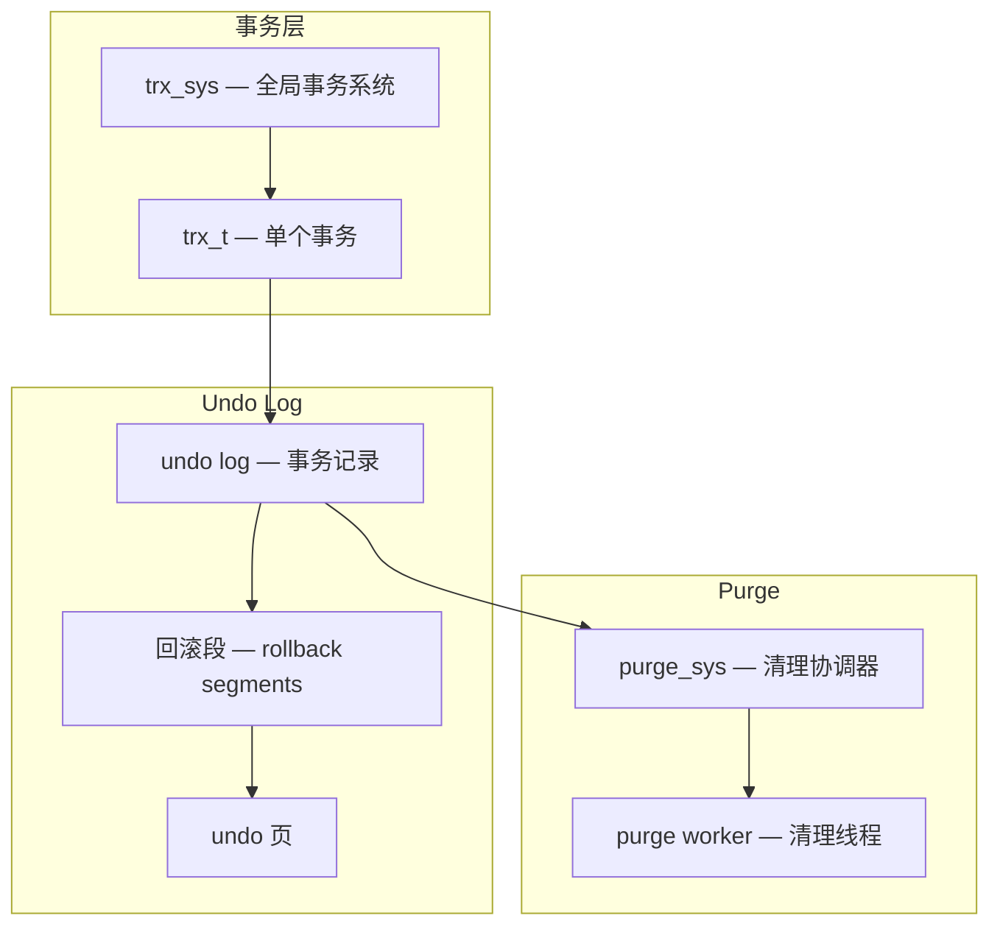
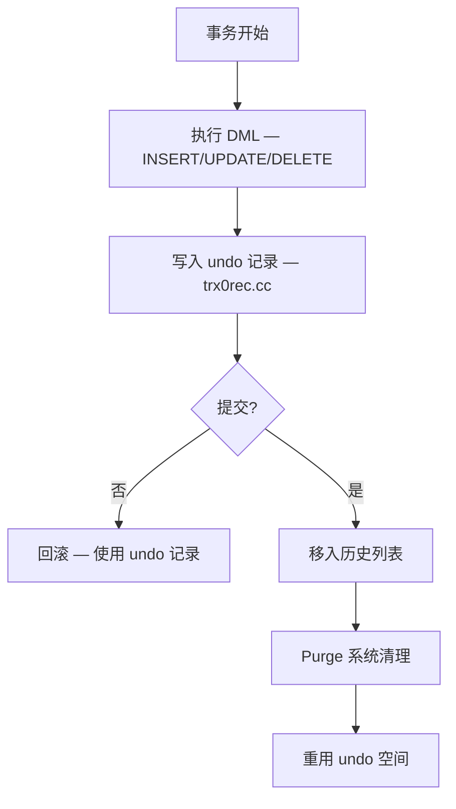
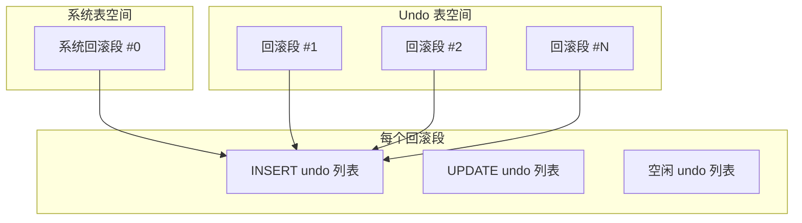
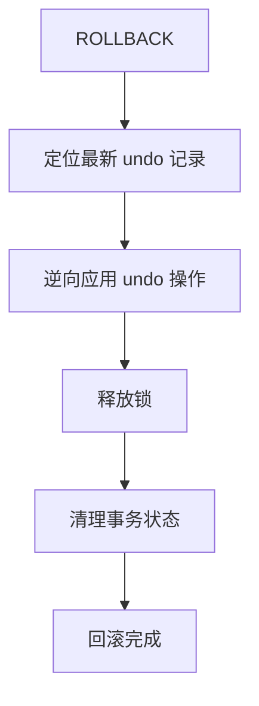
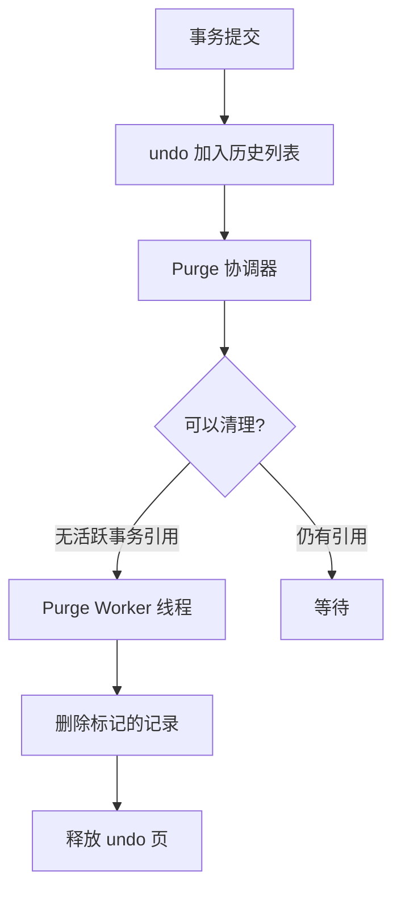

<cite>
**引用文件**
- [storage/innobase/trx/trx0trx.cc](file://storage/innobase/trx/trx0trx.cc)
- [storage/innobase/trx/trx0rec.cc](file://storage/innobase/trx/trx0rec.cc)
- [storage/innobase/trx/trx0purge.cc](file://storage/innobase/trx/trx0purge.cc)
- [storage/innobase/trx/trx0roll.cc](file://storage/innobase/trx/trx0roll.cc)
- [storage/innobase/trx/trx0rseg.cc](file://storage/innobase/trx/trx0rseg.cc)
- [storage/innobase/trx/trx0undo.cc](file://storage/innobase/trx/trx0undo.cc)
- [storage/innobase/trx/trx0sys.cc](file://storage/innobase/trx/trx0sys.cc)
</cite>

## 目录
1. [InnoDB 事务概述](#innodb-事务概述)
2. [事务系统架构](#事务系统架构)
3. [Undo Log — 事务回滚](#undo-log--事务回滚)
4. [回滚段（Rollback Segment）](#回滚段rollback-segment)
5. [事务回滚](#事务回滚)
6. [Purge 系统](#purge-系统)
7. [事务隔离级别](#事务隔离级别)
8. [MVCC 实现](#mvcc-实现)

## InnoDB 事务概述

InnoDB 事务子系统位于 `storage/innobase/trx/`，包含 8 个核心文件，总计约 480KB：

| 文件 | 大小 | 说明 |
|------|------|------|
| `trx0trx.cc` | ~117KB | 事务核心 — 创建、提交、状态管理 |
| `trx0rec.cc` | ~89KB | 事务记录 — undo log 记录写入 |
| `trx0purge.cc` | ~81KB | Purge 系统 — 清理旧版本 |
| `trx0undo.cc` | ~71KB | Undo 页管理 — 分配和释放 |
| `trx0roll.cc` | ~37KB | 事务回滚 — 回滚操作实现 |
| `trx0rseg.cc` | ~34KB | 回滚段 — 段分配和管理 |
| `trx0i_s.cc` | ~33KB | INFORMATION_SCHEMA 视图 |
| `trx0sys.cc` | ~26KB | 事务系统初始化和管理 |

**Sources** · [storage/innobase/trx/](file://storage/innobase/trx/)

## 事务系统架构



### 核心数据结构

| 结构 | 说明 |
|------|------|
| `trx_sys` | 全局事务系统 — 管理所有活跃事务 |
| `trx_t` | 单个事务实例 — 包含锁、undo、MVCC 信息 |
| `trx_undo_t` | Undo 日志 — INSERT undo 和 UPDATE undo |
| `trx_rseg_t` | 回滚段 — 管理一组 undo 页 |

**Sources** · [storage/innobase/trx/trx0sys.cc](file://storage/innobase/trx/trx0sys.cc) · [storage/innobase/trx/trx0trx.cc](file://storage/innobase/trx/trx0trx.cc)

## Undo Log — 事务回滚

`trx0rec.cc`（~89KB）实现 undo log 记录的写入：

### Undo Log 类型

| 类型 | 说明 | 用途 |
|------|------|------|
| **INSERT Undo** | 插入撤销记录 | 回滚 INSERT |
| **UPDATE Undo** | 更新撤销记录 | 回滚 UPDATE/DELETE + MVCC |

### Undo 记录生命周期



### Undo 日志大小限制

```sql
-- 控制 undo log 表空间
SHOW VARIABLES LIKE 'innodb_undo_tablespaces';
SHOW VARIABLES LIKE 'innodb_undo_log_truncate';
SHOW VARIABLES LIKE 'innodb_max_undo_log_size';  -- 默认 1GB
```

**Sources** · [storage/innobase/trx/trx0rec.cc](file://storage/innobase/trx/trx0rec.cc)

## 回滚段（Rollback Segment）

`trx0rseg.cc`（~34KB）和 `trx0undo.cc`（~71KB）管理回滚段：

### 回滚段架构



### 回滚段配置

| 参数 | 默认值 | 说明 |
|------|--------|------|
| `innodb_rollback_segments` | 128 | 回滚段数量 |
| `innodb_undo_tablespaces` | 2 | undo 表空间数量 |
| `innodb_undo_log_encrypt` | OFF | undo 日志加密 |

**Sources** · [storage/innobase/trx/trx0rseg.cc](file://storage/innobase/trx/trx0rseg.cc) · [storage/innobase/trx/trx0undo.cc](file://storage/innobase/trx/trx0undo.cc)

## 事务回滚

`trx0roll.cc`（~37KB）实现事务回滚操作：

### 回滚类型

| 类型 | 说明 |
|------|------|
| **完全回滚** | ROLLBACK — 回滚整个事务 |
| **部分回滚** | ROLLBACK TO SAVEPOINT — 回滚到保存点 |
| **崩溃恢复回滚** | 服务器重启时回滚未提交事务 |

### 回滚过程



```sql
-- 保存点和部分回滚
BEGIN;
INSERT INTO orders VALUES (1, 'A');
SAVEPOINT sp1;
INSERT INTO orders VALUES (2, 'B');
ROLLBACK TO SAVEPOINT sp1;  -- 仅回滚第2条INSERT
-- 此时第1条INSERT仍然有效
COMMIT;
```

**Sources** · [storage/innobase/trx/trx0roll.cc](file://storage/innobase/trx/trx0roll.cc)

## Purge 系统

`trx0purge.cc`（~81KB）负责清理已提交事务的旧版本数据：

### Purge 流程



### Purge 配置

| 参数 | 默认值 | 说明 |
|------|--------|------|
| `innodb_purge_threads` | 4 | Purge 线程数 |
| `innodb_purge_batch_size` | 300 | 每批清理的 undo 页数 |
| `innodb_purge_rseg_truncate_frequency` | 128 | 回滚段截断频率 |

### Purge 滞后问题

```sql
-- 查看 Purge 滞后
SHOW ENGINE INNODB STATUS;
-- 关注 "History list length" — 未清理的 undo 事务数

-- 监控
SELECT * FROM INFORMATION_SCHEMA.INNODB_METRICS
WHERE NAME LIKE 'trx%purge%';
```

**Sources** · [storage/innobase/trx/trx0purge.cc](file://storage/innobase/trx/trx0purge.cc)

## 事务隔离级别

| 隔离级别 | 脏读 | 不可重复读 | 幻读 | InnoDB 默认 |
|----------|:----:|:---------:|:----:|:-----------:|
| `READ UNCOMMITTED` | ✓ | ✓ | ✓ | |
| `READ COMMITTED` | ✗ | ✓ | ✓ | |
| `REPEATABLE READ` | ✗ | ✗ | ✗（Gap Lock） | ✓ |
| `SERIALIZABLE` | ✗ | ✗ | ✗ | |

```sql
-- 设置隔离级别
SET SESSION TRANSACTION ISOLATION LEVEL READ COMMITTED;
SET GLOBAL TRANSACTION ISOLATION LEVEL REPEATABLE READ;

-- 查看当前隔离级别
SELECT @@transaction_isolation;
```

**Sources** · [storage/innobase/trx/trx0trx.cc](file://storage/innobase/trx/trx0trx.cc)

## MVCC 实现

InnoDB 通过 MVCC（多版本并发控制）实现非锁定一致性读：

### MVCC 机制

```mermaid
graph TB
    subgraph 行记录 — 隐藏列
        TRX_ID[DB_TRX_ID — 创建版本的事务 ID]
        ROLL_PTR[DB_ROLL_PTR — 指向 undo 记录的指针]
        DATA[实际数据]
    end

    TX_READ[读事务 — ReadView]
    TX_READ --> CHECK_VERSION{版本可见?}
    CHECK_VERSION --> |TRX_ID < min_trx_id| VISIBLE[可见 — 旧版本]
    CHECK_VERSION --> |TRX_ID > max_trx_id| INVISIBLE[不可见 — 新版本]
    CHECK_VERSION --> |在活跃列表中| UNDO_CHAIN[沿 undo 链查找可见版本]
```

### ReadView

ReadView 在 REPEATABLE READ 下事务开始时创建一次，在 READ COMMITTED 下每次 SELECT 时创建：

| 字段 | 说明 |
|------|------|
| `m_ids` | 创建 ReadView 时活跃的事务 ID 列表 |
| `m_low_limit_id` | 最小活跃事务 ID |
| `m_up_limit_id` | 最大活跃事务 ID + 1 |
| `m_creator_trx_id` | 创建者的事务 ID |

**Sources** · [storage/innobase/trx/trx0trx.cc](file://storage/innobase/trx/trx0trx.cc) · [storage/innobase/trx/trx0rec.cc](file://storage/innobase/trx/trx0rec.cc)
