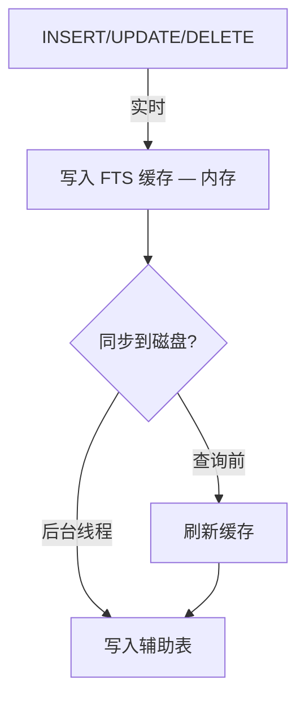
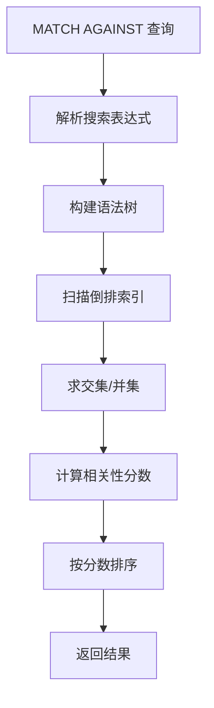

<cite>
**引用文件**
- [storage/innobase/fts/fts0fts.cc](file://storage/innobase/fts/fts0fts.cc)
- [storage/innobase/fts/fts0que.cc](file://storage/innobase/fts/fts0que.cc)
- [storage/innobase/fts/fts0opt.cc](file://storage/innobase/fts/fts0opt.cc)
- [storage/innobase/fts/fts0blex.cc](file://storage/innobase/fts/fts0blex.cc)
- [storage/innobase/fts/fts0pars.cc](file://storage/innobase/fts/fts0pars.cc)
- [storage/innobase/fts/fts0ast.cc](file://storage/innobase/fts/fts0ast.cc)
- [storage/innobase/fts/fts0config.cc](file://storage/innobase/fts/fts0config.cc)
</cite>

## 目录
1. [全文搜索概述](#全文搜索概述)
2. [FTS 内部架构](#fts-内部架构)
3. [索引构建](#索引构建)
4. [查询处理](#查询处理)
5. [优化器集成](#优化器集成)
6. [配置与调优](#配置与调优)

## 全文搜索概述

InnoDB 全文搜索（FTS）子系统位于 `storage/innobase/fts/`，包含 14 个文件，总计约 650KB：

| 文件 | 大小 | 说明 |
|------|------|------|
| `fts0fts.cc` | ~186KB | FTS 核心 — 索引管理、辅助表 |
| `fts0que.cc` | ~130KB | FTS 查询 — 全文搜索查询执行 |
| `fts0opt.cc` | ~87KB | FTS 优化 — 查询优化和排序 |
| `fts0blex.cc` | ~64KB | 布尔模式词法分析器（Flex 生成） |
| `fts0tlex.cc` | ~64KB | 自然语言模式词法分析器 |
| `fts0pars.cc` | ~58KB | 查询解析器（Bison 生成） |
| `fts0ast.cc` | ~21KB | 抽象语法树 |
| `fts0config.cc` | ~13KB | FTS 配置和辅助表 |

**Sources** · [storage/innobase/fts/](file://storage/innobase/fts/)

## FTS 内部架构

```mermaid
graph TB
    subgraph 查询层
        NATURAL[自然语言查询]
        BOOLEAN[布尔查询 — +word -word "phrase"]
        WILDCARD[通配符 — word*]
    end

    subgraph 解析层
        LEX[词法分析 — fts0blex/fts0tlex]
        PARS[解析器 — fts0pars]
        AST[语法树 — fts0ast]
    end

    subgraph 索引层
        AUX_TABLES[辅助表 — FTS_DOC_ID, INDEX, COMMON]
        INVERTED[倒排索引]
        CACHE[FTS 缓存]
    end

    NATURAL --> LEX
    BOOLEAN --> LEX
    WILDCARD --> LEX
    LEX --> PARS
    PARS --> AST
    AST --> INVERTED
    INVERTED --> AUX_TABLES
    INVERTED --> CACHE
```

### FTS 辅助表

每个 FULLTEXT 索引创建一组内部辅助表：

| 辅助表 | 说明 |
|--------|------|
| `FTS_<id>_INDEX` | 倒排索引 — 词 → 文档 ID 列表 |
| `FTS_<id>_COMMON` | 停用词表 |
| `FTS_<id>_DELETED` | 已删除文档标记 |
| `FTS_<id>_BEING_DELETED` | 正在删除的文档 |
| `FTS_<id>_CONFIG` | FTS 配置（同步点、状态） |
| `FTS_<id>_DOC_ID` | 文档 ID 映射 |

**Sources** · [storage/innobase/fts/fts0fts.cc](file://storage/innobase/fts/fts0fts.cc) · [storage/innobase/fts/fts0config.cc](file://storage/innobase/fts/fts0config.cc)

## 索引构建

### 索引更新模式



### 分词（Tokenization）

| 模式 | 说明 |
|------|------|
| **默认分词** | 按空白和标点分词 |
| **ngram** | N-gram 分词（CJK 语言） |
| **MeCab** | 日文形态素分析 |

```sql
-- 创建全文索引
CREATE TABLE articles (
    id INT AUTO_INCREMENT PRIMARY KEY,
    title VARCHAR(200),
    body TEXT,
    FULLTEXT INDEX ft_title_body (title, body)
) ENGINE=InnoDB;

-- 使用 ngram 分词（中文支持）
CREATE TABLE cn_articles (
    id INT PRIMARY KEY,
    content TEXT,
    FULLTEXT INDEX ft_content (content) WITH PARSER ngram
);

-- ngram token 大小
SET GLOBAL ngram_token_size = 2;  -- 默认2，最大10
```

**Sources** · [storage/innobase/fts/fts0fts.cc](file://storage/innobase/fts/fts0fts.cc)

## 查询处理

### 查询模式

| 模式 | 说明 | 语法 |
|------|------|------|
| **自然语言** | 默认 — 按相关性排序 | `MATCH ... AGAINST ('text')` |
| **布尔** | 支持操作符 | `MATCH ... AGAINST ('+word -word' IN BOOLEAN MODE)` |
| **查询扩展** | 自动扩展搜索词 | `MATCH ... AGAINST ('text' WITH QUERY EXPANSION)` |

### 布尔模式操作符

| 操作符 | 说明 | 示例 |
|--------|------|------|
| `+` | 必须包含 | `+MySQL` |
| `-` | 必须排除 | `-Oracle` |
| `>` | 提高权重 | `+MySQL >performance` |
| `<` | 降低权重 | `+MySQL <myisam` |
| `*` | 通配符 | `MySQL*` |
| `"..."` | 精确短语 | `"MySQL database"` |
| `~` | 否定权重 | `+MySQL ~myisam` |
| `()` | 子表达式 | `(+MySQL -Oracle)` |

### 查询流程



### 相关性评分

```sql
-- 自然语言模式（TF-IDF 变体）
SELECT id, title,
       MATCH(title, body) AGAINST('MySQL performance') AS score
FROM articles
WHERE MATCH(title, body) AGAINST('MySQL performance')
ORDER BY score DESC;

-- 布尔模式
SELECT id, title
FROM articles
WHERE MATCH(title, body) AGAINST('+MySQL -Oracle +performance' IN BOOLEAN MODE);
```

**Sources** · [storage/innobase/fts/fts0que.cc](file://storage/innobase/fts/fts0que.cc) · [storage/innobase/fts/fts0ast.cc](file://storage/innobase/fts/fts0ast.cc)

## 优化器集成

`fts0opt.cc`（~87KB）处理 FTS 查询的优化：

### 优化策略

| 策略 | 说明 |
|------|------|
| **倒排索引查找** | 直接从索引获取文档列表 |
| **相关性过滤** | 提前过滤低分文档 |
| **排序优化** | 利用索引排序减少文件排序 |
| **并行搜索** | 多个词的并行索引扫描 |

### FTS 与 LIKE 的性能对比

| 特性 | FULLTEXT | LIKE '%text%' |
|------|----------|---------------|
| 索引 | 倒排索引 | 全表扫描 |
| 时间复杂度 | O(log N) | O(N × L) |
| 相关性排序 | ✓ | ✗ |
| 布尔搜索 | ✓ | ✗ |
| 中文支持 | ngram 分词 | 直接匹配 |

**Sources** · [storage/innobase/fts/fts0opt.cc](file://storage/innobase/fts/fts0opt.cc)

## 配置与调优

### 关键参数

| 参数 | 默认值 | 说明 |
|------|--------|------|
| `innodb_ft_min_token_size` | 3 | 最小词长度 |
| `innodb_ft_max_token_size` | 84 | 最大词长度 |
| `innodb_ft_num_word_optimize` | 2000 | 每次优化的词数 |
| `innodb_ft_result_cache_limit` | 2000000 | 结果缓存大小限制 |
| `innodb_ft_enable_stopword` | ON | 启用停用词过滤 |
| `innodb_ft_server_stopword_table` | | 自定义停用词表 |
| `innodb_ft_enable_diag_cache` | OFF | 诊断缓存 |

### FTS 诊断

```sql
-- 查看 FTS 辅助表
SELECT TABLE_NAME FROM INFORMATION_SCHEMA.TABLES
WHERE TABLE_NAME LIKE 'FTS%';

-- 优化 FTS 索引
OPTIMIZE TABLE articles;  -- 触发 FTS 同步和清理

-- 查看 FTS 配置
SELECT * FROM INFORMATION_SCHEMA.INNODB_FT_CONFIG;

-- 查看被删除的文档
SELECT * FROM INFORMATION_SCHEMA.INNODB_FT_DELETED;

-- 查看索引缓存
SELECT * FROM INFORMATION_SCHEMA.INNODB_FT_INDEX_CACHE LIMIT 10;
```

**Sources** · [storage/innobase/fts/fts0config.cc](file://storage/innobase/fts/fts0config.cc) · [storage/innobase/fts/fts0fts.cc](file://storage/innobase/fts/fts0fts.cc)
