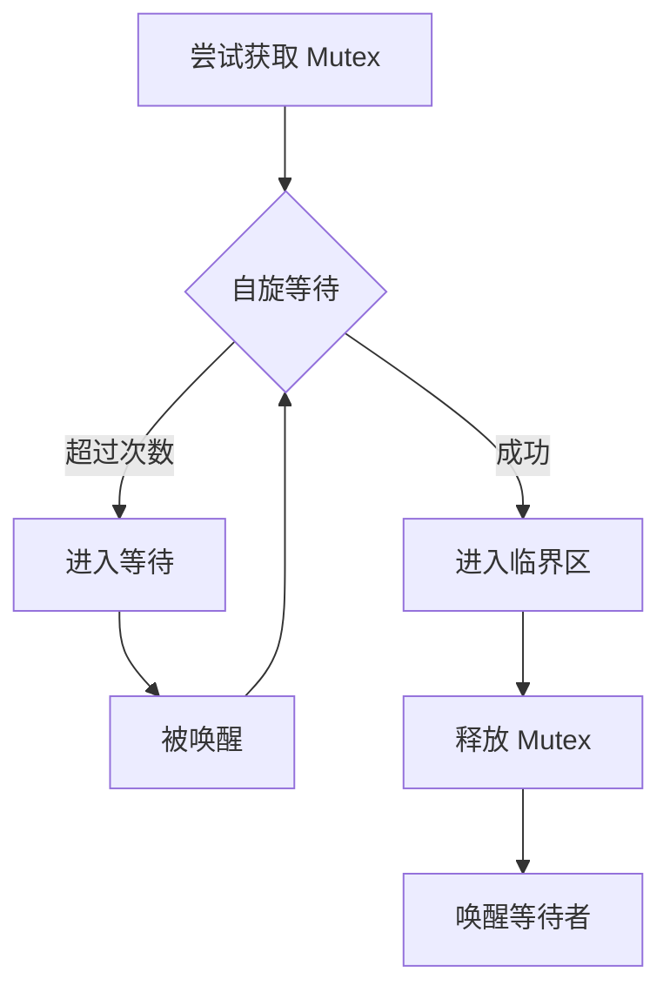
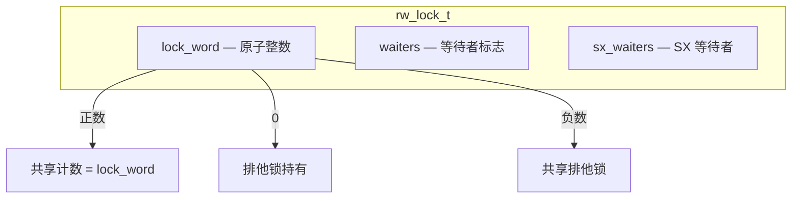
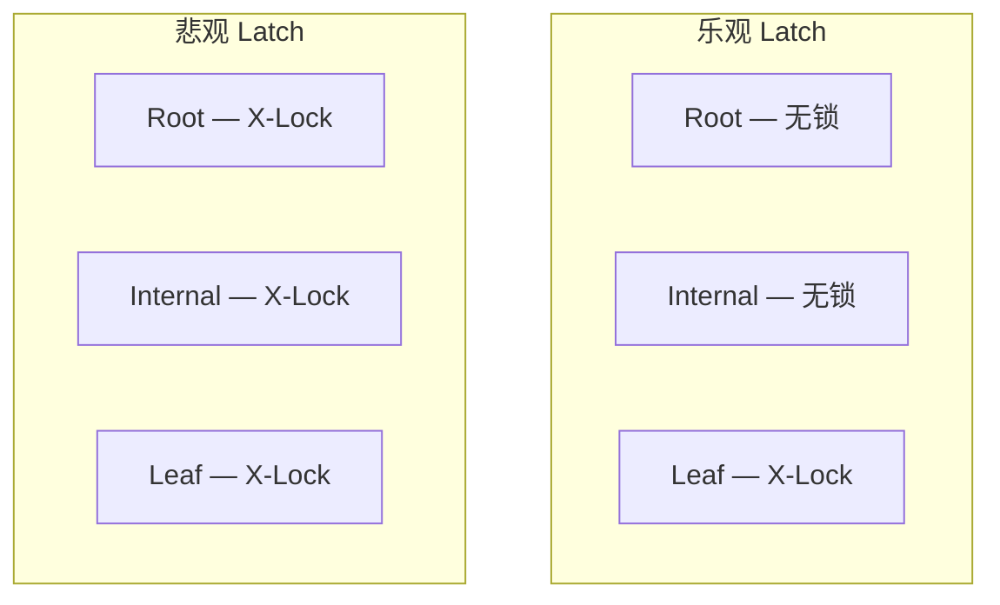
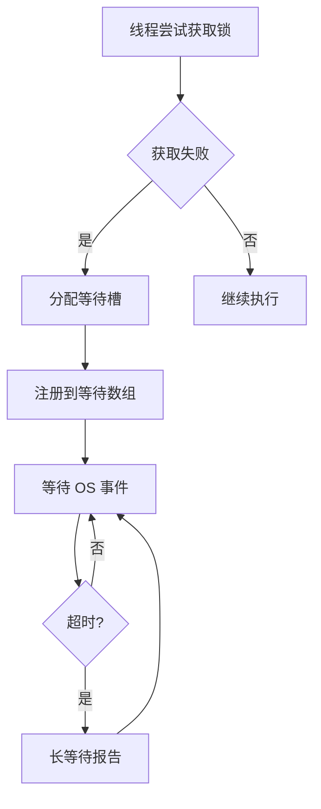
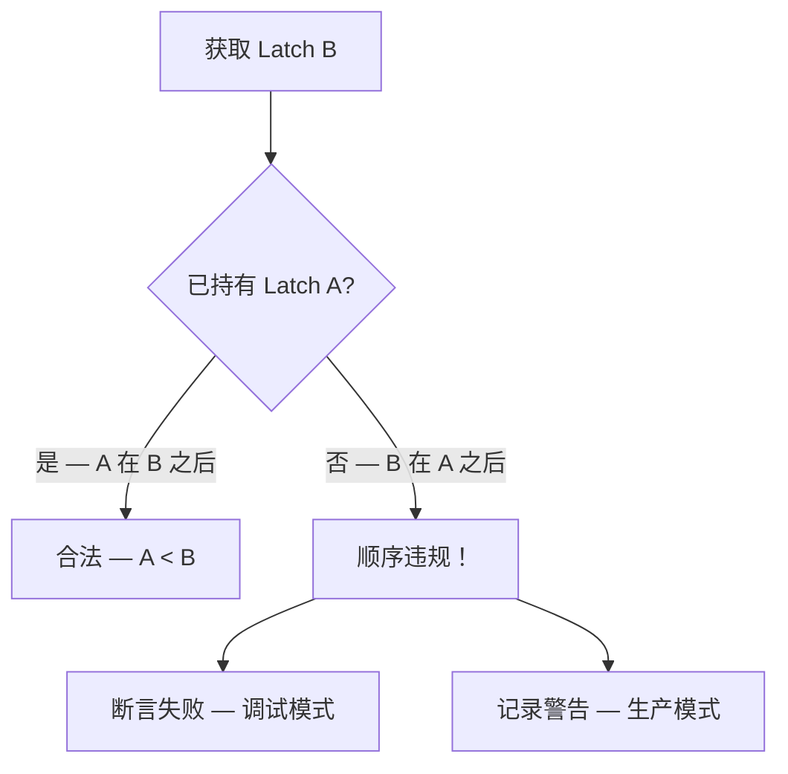

<cite>
**引用文件**
- [storage/innobase/sync/sync0arr.cc](file://storage/innobase/sync/sync0arr.cc)
- [storage/innobase/sync/sync0rw.cc](file://storage/innobase/sync/sync0rw.cc)
- [storage/innobase/sync/sync0sync.cc](file://storage/innobase/sync/sync0sync.cc)
- [storage/innobase/sync/sync0debug.cc](file://storage/innobase/sync/sync0debug.cc)
- [storage/innobase/include/sync0types.h](file://storage/innobase/include/sync0types.h)
</cite>

## 目录
1. [同步系统概述](#同步系统概述)
2. [Mutex — 互斥锁](#mutex--互斥锁)
3. [读写锁 — rw_lock](#读写锁--rw_lock)
4. [等待数组 — sync_arr](#等待数组--sync_arr)
5. [同步调试](#同步调试)
6. [Latching 顺序](#latching-顺序)

## 同步系统概述

InnoDB 同步子系统位于 `storage/innobase/sync/`，包含 4 个实现文件，总计约 132KB：

| 文件 | 大小 | 说明 |
|------|------|------|
| `sync0debug.cc` | ~58KB | 同步调试 — 死锁检测和顺序验证 |
| `sync0rw.cc` | ~33KB | 读写锁实现 |
| `sync0arr.cc` | ~31KB | 同步等待数组 |
| `sync0sync.cc` | ~10KB | 基础同步操作 |

**Sources** · [storage/innobase/sync/](file://storage/innobase/sync/)

## Mutex — 互斥锁

InnoDB 自定义 mutex 实现，针对不同场景使用不同策略：

### Mutex 类型

| 类型 | 说明 | 使用场景 |
|------|------|---------|
| `TTASMutex` | Test-And-Test-And-Set | 通用低竞争 mutex |
| `TTASFutexMutex` | TTAS + Futex | Linux 下高效等待 |
| `SpinLockMutex` | 纯自旋锁 | 极短时间临界区 |
| `OSMutex` | 操作系统 mutex | 需要阻塞等待 |
| `AlignedMutex` | 缓存行对齐 | 避免 false sharing |

### Mutex 性能特征



### 关键 Mutex

| Mutex 名称 | 保护对象 |
|-----------|---------|
| `log_sys->mutex` | 重做日志缓冲区 |
| `buf_pool->mutex` | 缓冲池 |
| `dict_sys->mutex` | 数据字典 |
| `trx_sys->mutex` | 事务系统 |
| `fil_system->mutex` | 文件管理 |

**Sources** · [storage/innobase/sync/sync0sync.cc](file://storage/innobase/sync/sync0sync.cc)

## 读写锁 — rw_lock

`sync0rw.cc`（~33KB）实现 InnoDB 的读写锁：

### rw_lock 语义

| 模式 | 说明 | 兼容性 |
|------|------|--------|
| **S-Lock**（共享锁） | 读操作 | 与其他 S-Lock 兼容 |
| **X-Lock**（排他锁） | 写操作 | 独占 |
| **SX-Lock**（共享排他） | 特殊 — 允许并发 S-Lock | 与 S-Lock 兼容，不与 X/SX 兼容 |

### rw_lock 结构



### B-Tree Latch 策略

| 策略 | 说明 | 适用操作 |
|------|------|---------|
| **乐观** | 只锁目标叶节点 | 点查询、单行更新 |
| **悲观** | 从根到叶全路径锁 | 分裂/合并操作 |
| **Savepoint** | 持有部分路径，释放上层 | 遍历操作 |



**Sources** · [storage/innobase/sync/sync0rw.cc](file://storage/innobase/sync/sync0rw.cc)

## 等待数组 — sync_arr

`sync0arr.cc`（~31KB）实现 InnoDB 的同步等待机制：

### 等待槽

每个等待的线程对应一个等待槽（wait slot）：

| 字段 | 说明 |
|------|------|
| `lock` | 等待的锁对象 |
| `lock_type` | 锁类型 — MUTEX/RW_LOCK |
| `request_type` | 请求类型 — S/X/SX |
| `signal_event` | OS 事件 — 用于唤醒 |
| `wait_time` | 已等待时间 |

### 等待流程



### 长等待检测

| 参数 | 默认值 | 说明 |
|------|--------|------|
| `innodb_sync_spin_loops` | 30 | 自旋循环次数 |
| `innodb_spin_wait_delay` | 6 | 自旋延迟（微秒） |
| 长等待阈值 | 60 秒 | 超时后打印警告 |

**Sources** · [storage/innobase/sync/sync0arr.cc](file://storage/innobase/sync/sync0arr.cc)

## 同步调试

`sync0debug.cc`（~58KB）实现同步调试和验证功能：

### 功能

| 功能 | 说明 |
|------|------|
| **Latching 顺序检查** | 验证锁获取顺序是否合法 |
| **死锁检测** | 构建等待图，检测环路 |
| **Latch 泄漏检测** | 确保所有锁在事务结束时释放 |
| **性能统计** | 记录每个 mutex/rw_lock 的竞争统计 |

### 性能监控

```sql
-- 查看 InnoDB mutex 等待
SELECT * FROM performance_schema.events_waits_summary_global_by_event_name
WHERE EVENT_NAME LIKE 'wait/synch/mutex/innodb/%'
ORDER BY COUNT_STAR DESC;

-- 查看 InnoDB rw_lock 等待
SELECT * FROM performance_schema.events_waits_summary_global_by_event_name
WHERE EVENT_NAME LIKE 'wait/synch/rwlock/innodb/%'
ORDER BY COUNT_STAR DESC;

-- InnoDB 状态中的锁信息
SHOW ENGINE INNODB STATUS\G
```

**Sources** · [storage/innobase/sync/sync0debug.cc](file://storage/innobase/sync/sync0debug.cc)

## Latching 顺序

InnoDB 定义全局 Latch 顺序表，防止死锁：

### 顺序规则

| 顺序 | Latch A | Latch B | 规则 |
|------|---------|---------|------|
| 1 | `dict_sys->mutex` | `dict_table->mutex` | 必须先 A 后 B |
| 2 | `log_sys->mutex` | `buf_pool->mutex` | 必须先 A 后 B |
| 3 | `trx_sys->mutex` | `lock_sys->mutex` | 必须先 A 后 B |

### 违规处理



**Sources** · [storage/innobase/sync/sync0debug.cc](file://storage/innobase/sync/sync0debug.cc) · [storage/innobase/include/sync0types.h](file://storage/innobase/include/sync0types.h)
