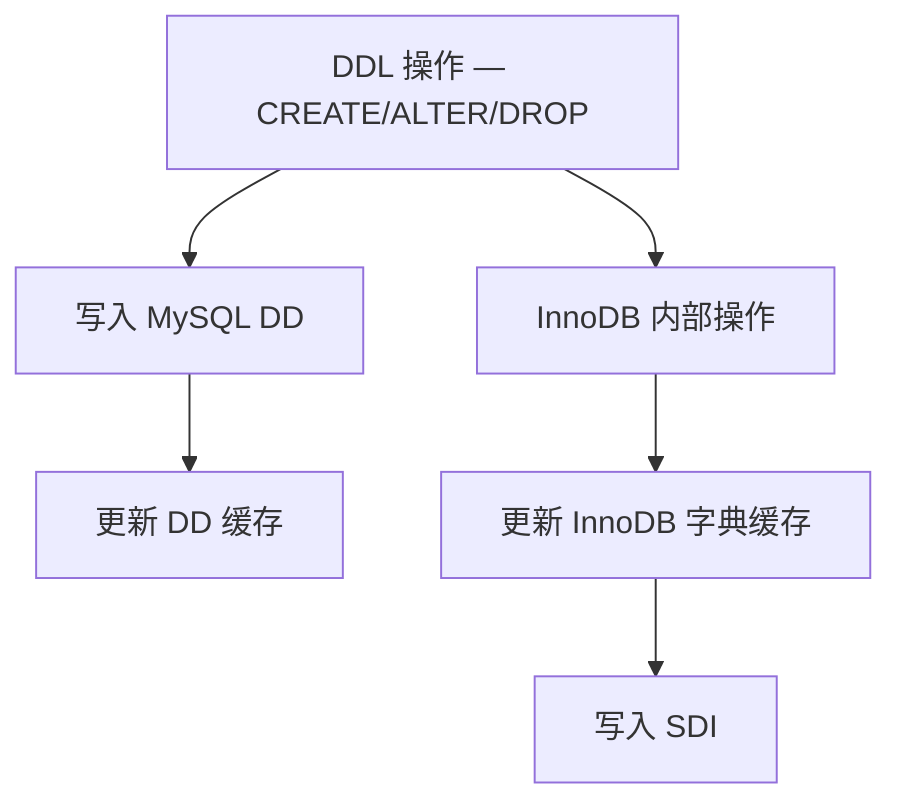
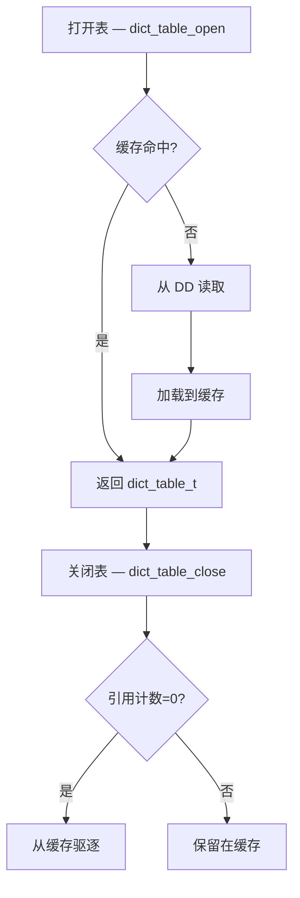
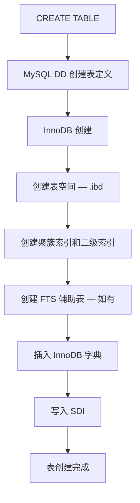
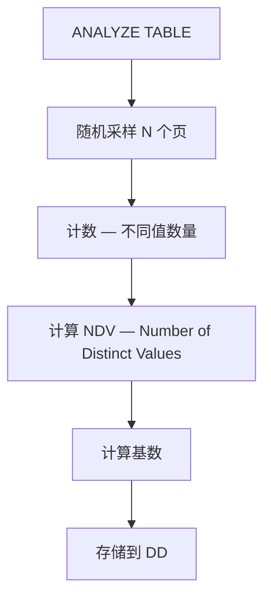

<cite>
**引用文件**
- [storage/innobase/dict/dict0dd.cc](file://storage/innobase/dict/dict0dd.cc)
- [storage/innobase/dict/dict0dict.cc](file://storage/innobase/dict/dict0dict.cc)
- [storage/innobase/dict/dict0stats.cc](file://storage/innobase/dict/dict0stats.cc)
- [storage/innobase/dict/dict0crea.cc](file://storage/innobase/dict/dict0crea.cc)
- [storage/innobase/dict/dict0mem.cc](file://storage/innobase/dict/dict0mem.cc)
- [storage/innobase/dict/dict0stats_bg.cc](file://storage/innobase/dict/dict0stats_bg.cc)
- [storage/innobase/dict/dict0sdi.cc](file://storage/innobase/dict/dict0sdi.cc)
</cite>

## 目录
1. [InnoDB 数据字典概述](#innodb-数据字典概述)
2. [数据字典架构](#数据字典架构)
3. [DD 集成 — dict0dd.cc](#dd-集成--dict0ddcc)
4. [内部字典 — dict0dict.cc](#内部字典--dict0dictcc)
5. [表创建](#表创建)
6. [统计信息](#统计信息)
7. [SDI — 序列化字典信息](#sdi--序列化字典信息)

## InnoDB 数据字典概述

InnoDB 数据字典子系统位于 `storage/innobase/dict/`，管理 InnoDB 内部的所有元数据：

| 文件 | 大小 | 说明 |
|------|------|------|
| `dict0dd.cc` | ~251KB | DD 集成 — InnoDB 与 MySQL 数据字典交互 |
| `dict0dict.cc` | ~193KB | 内部字典 — 表/索引/列的内存缓存 |
| `dict0stats.cc` | ~142KB | 统计信息 — 收集和维护表统计 |
| `dict0mem.cc` | ~29KB | 内存管理 — 字典对象的内存分配 |
| `dict0crea.cc` | ~24KB | 表创建 — CREATE TABLE 底层实现 |
| `dict0sdi.cc` | ~18KB | SDI — 序列化字典信息 |
| `dict0stats_bg.cc` | ~13KB | 后台统计 — 自动统计更新 |

**Sources** · [storage/innobase/dict/](file://storage/innobase/dict/)

## 数据字典架构

```mermaid
graph TB
    subgraph MySQL 数据字典 — DD
        DD_TABLES[mysql.tables]
        DD_COLUMNS[mysql.columns]
        DD_INDEXES[mysql.indexes]
    end

    subgraph InnoDB 内部字典
        DICT_CACHE[字典缓存 — dict_cache]
        DICT_TABLE[dict_table_t — 内存中的表定义]
        DICT_INDEX[dict_index_t — 内存中的索引定义]
    end

    subgraph 持久化
        SYSTEM_TABLES[系统表 — SYS_TABLES, SYS_INDEXES]
        SDI[SDI 数据 — .ibd 文件内]
    end

    DD_TABLES --> DICT_CACHE
    DICT_CACHE --> DICT_TABLE
    DICT_TABLE --> DICT_INDEX
    DICT_CACHE --> SYSTEM_TABLES
    DICT_TABLE --> SDI
```

**Sources** · [storage/innobase/dict/dict0dd.cc](file://storage/innobase/dict/dict0dd.cc)

## DD 集成 — dict0dd.cc

`dict0dd.cc`（~251KB）是 InnoDB 与 MySQL 8.0 事务型数据字典之间的桥梁：

### 交互流程



### 主要功能

| 功能 | 说明 |
|------|------|
| **DD 读取** | 从 MySQL DD 读取表定义到 InnoDB 缓存 |
| **DD 写入** | 将 InnoDB 元数据变更同步到 DD |
| **缓存管理** | 维护 InnoDB 内部的字典对象缓存 |
| **SDI 管理** | 在 .ibd 文件中存储序列化字典 |
| **外键管理** | 管理 InnoDB 层的外键约束 |

**Sources** · [storage/innobase/dict/dict0dd.cc](file://storage/innobase/dict/dict0dd.cc)

## 内部字典 — dict0dict.cc

`dict0dict.cc`（~193KB）管理 InnoDB 内部的表和索引定义缓存：

### 核心数据结构

| 结构 | 说明 |
|------|------|
| `dict_table_t` | 表定义 — 包含列、索引、统计信息 |
| `dict_index_t` | 索引定义 — B-Tree 结构、列映射 |
| `dict_col_t` | 列定义 — 数据类型、长度、约束 |
| `dict_field_t` | 索引字段 — 索引中列的顺序和前缀长度 |
| `dict_foreign_t` | 外键定义 — 引用关系 |

### 字典缓存操作



**Sources** · [storage/innobase/dict/dict0dict.cc](file://storage/innobase/dict/dict0dict.cc)

## 表创建

`dict0crea.cc`（~24KB）处理 InnoDB 层的表创建：

### 创建流程



**Sources** · [storage/innobase/dict/dict0crea.cc](file://storage/innobase/dict/dict0crea.cc)

## 统计信息

`dict0stats.cc`（~142KB）和 `dict0stats_bg.cc`（~13KB）管理 InnoDB 的统计信息：

### 统计类型

| 类型 | 说明 | 触发方式 |
|------|------|---------|
| **持久统计** | 存储在 DD 中 | `ANALYZE TABLE` 或自动更新 |
| **瞬态统计** | 仅内存 | 首次访问时估算 |
| **采样统计** | 基于页采样 | `innodb_stats_persistent` |

### 统计收集过程



### 关键统计指标

| 指标 | 说明 | 用途 |
|------|------|------|
| `n_rows` | 估计行数 | JOIN 顺序优化 |
| `clustered_index_size` | 聚簇索引页数 | 扫描代价估算 |
| `sum_of_other_index_sizes` | 二级索引总页数 | 索引选择 |
| `cardinality` | 索引列的不同值数 | 索引选择优化 |

### 统计配置

```sql
-- 持久统计
SET GLOBAL innodb_stats_persistent = ON;
SET GLOBAL innodb_stats_persistent_sample_pages = 20;

-- 瞬态统计
SET GLOBAL innodb_stats_auto_recalc = ON;
SET GLOBAL innodb_stats_transient_sample_pages = 8;

-- 手动更新统计
ANALYZE TABLE orders;

-- 查看统计
SELECT * FROM INFORMATION_SCHEMA.STATISTICS
WHERE TABLE_NAME = 'orders';
```

**Sources** · [storage/innobase/dict/dict0stats.cc](file://storage/innobase/dict/dict0stats.cc) · [storage/innobase/dict/dict0stats_bg.cc](file://storage/innobase/dict/dict0stats_bg.cc)

## SDI — 序列化字典信息

`dict0sdi.cc`（~18KB）管理 SDI（Serialized Dictionary Information）：

### SDI 用途

SDI 是嵌入在每个 `.ibd` 文件中的 JSON 格式元数据，用于：

| 用途 | 说明 |
|------|------|
| **表空间导入** | IMPORT TABLESPACE 时验证表结构 |
| **灾难恢复** | 从 .ibd 文件恢复表定义 |
| **一致性检查** | 验证 .ibd 与 DD 的元数据一致性 |

```bash
# 查看 SDI 数据
ibd2sdi /var/lib/mysql/mydb/orders.ibd

# 输出示例（JSON）
# {
#   "dd_object_type": "Table",
#   "name": "orders",
#   "columns": [...],
#   "indexes": [...]
# }
```

**Sources** · [storage/innobase/dict/dict0sdi.cc](file://storage/innobase/dict/dict0sdi.cc)
