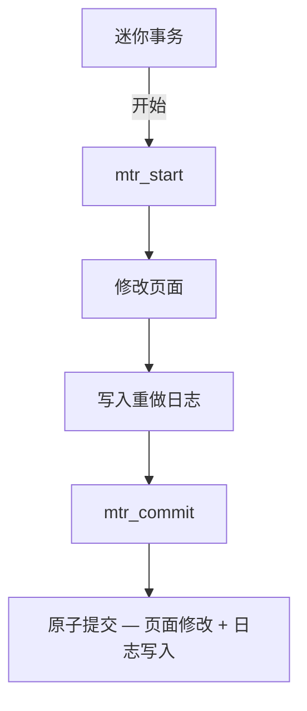

<cite>
**引用文件**
- [storage/innobase/](file://storage/innobase/)
- [storage/innobase/innodb.cmake](file://storage/innobase/innodb.cmake)
- [storage/innobase/btr/](file://storage/innobase/btr/)
- [storage/innobase/buf/](file://storage/innobase/buf/)
- [storage/innobase/log/](file://storage/innobase/log/)
- [storage/innobase/lock/](file://storage/innobase/lock/)
- [storage/innobase/trx/](file://storage/innobase/trx/)
- [storage/innobase/mtr/](file://storage/innobase/mtr/)
</cite>

## 目录
1. [InnoDB 概述](#innodb-概述)
2. [子系统全景](#子系统全景)
3. [B-tree 与索引](#b-tree-与索引)
4. [缓冲池](#缓冲池)
5. [重做日志与崩溃恢复](#重做日志与崩溃恢复)
6. [锁管理器](#锁管理器)
7. [事务管理与 MVCC](#事务管理与-mvcc)
8. [迷你事务](#迷你事务)
9. [高级特性](#高级特性)
10. [后台线程](#后台线程)

## InnoDB 概述

InnoDB（`storage/innobase/`）是 MySQL 的默认事务型存储引擎，也是整个 MySQL 代码库中最庞大、最复杂的子系统。它提供 ACID 事务、MVCC、行级锁、外键约束、崩溃恢复、全文搜索、空间数据等完整功能。

InnoDB 拥有 **36+ 个子目录**，每个子目录负责一个独立的关注点：

```mermaid
graph TB
    INNODB[InnoDB 引擎]
    INNODB --> BTR[btr/ — B-tree]
    INNODB --> BUF[buf/ — 缓冲池]
    INNODB --> LOG[log/ — 重做日志]
    INNODB --> LOCK[lock/ — 锁管理]
    INNODB --> TRX[trx/ — 事务管理]
    INNODB --> DICT[dict/ — 数据字典]
    INNODB --> FIL[fil/ — 文件管理]
    INNODB --> FSP[fsp/ — 表空间]
    INNODB --> ROW[row/ — 行操作]
    INNODB --> REM[rem/ — 记录格式]
    INNODB --> PAGE[page/ — 页操作]
    INNODB --> IBUF[ibuf/ — 变更缓冲]
    INNODB --> FTS[fts/ — 全文搜索]
    INNODB --> SRV[srv/ — 服务生命周期]
    INNODB --> SYNC[sync/ — 同步原语]
    INNODB --> MTR[mtr/ — 迷你事务]
    INNODB --> LOB[lob/ — 大对象]
    INNODB --> DDL[ddl/ — DDL 操作]
    INNODB --> GIS[gis/ — 空间索引]
    INNODB --> HA[ha/ — Handler 接口]
```

**Sources** · [storage/innobase/](file://storage/innobase/)

## 子系统全景

| 子系统 | 目录 | 职责 |
|--------|------|------|
| **B-tree** | `btr/` | 索引操作：搜索、插入、删除、页分裂/合并 |
| **缓冲池** | `buf/` | LRU 页面缓存、自适应哈希索引、变更缓冲集成 |
| **重做日志** | `log/` | WAL 预写日志、循环缓冲区、检查点、崩溃恢复 |
| **锁管理器** | `lock/` | 行级锁、间隙锁、Next-Key 锁、死锁检测 |
| **事务管理器** | `trx/` | 提交、回滚、MVCC Read View 管理 |
| **数据字典** | `dict/` | 表/索引元数据的内存缓存 |
| **文件管理器** | `fil/` | 表空间文件 I/O 和管理 |
| **表空间管理** | `fsp/` | 区段和段的分配管理 |
| **行操作** | `row/` | 行级增删改查 |
| **记录格式** | `rem/` | 物理行表示和字段访问 |
| **页操作** | `page/` | 页初始化、修改、验证 |
| **变更缓冲** | `ibuf/` | 缓存非唯一二级索引修改 |
| **全文搜索** | `fts/` | 倒排索引和全文查询 |
| **服务生命周期** | `srv/` | 启动、关闭、后台线程管理 |
| **同步原语** | `sync/` | 互斥锁、读写锁、条件变量（PSI 插桩） |
| **迷你事务** | `mtr/` | 原子页修改，配合重做日志 |
| **大对象** | `lob/` | BLOB/TEXT 列的页外存储 |
| **DDL** | `ddl/` | Instant DDL、批量加载、在线 DDL |
| **空间索引** | `gis/` | R-tree 空间索引支持 |
| **Handler 接口** | `ha/` | `ha_innodb` 类桥接到 MySQL Handler API |
| **克隆** | `clone/` | 物理数据克隆 |
| **归档** | `arch/` | 重做日志归档 |
| **内存管理** | `mem/` | InnoDB 自有堆分配器 |
| **机器相关** | `mach/` | 字节序处理 |
| **OS 抽象** | `os/` | 文件 I/O、线程、定时器 |
| **工具库** | `ut/` | 通用工具函数 |

**Sources** · [storage/innobase/](file://storage/innobase/)

## B-tree 与索引

### 聚簇索引

InnoDB 使用聚簇索引（Clustered Index）组织表数据：
- 表数据按主键排序存储在 B-tree 的叶子页中
- 主键查找只需一次 B-tree 遍历
- 范围扫描按主键顺序物理连续

### 二级索引

二级索引（Secondary Index）的叶子页存储主键值而非行数据：
- 二级索引查找需要两次 B-tree 遍历（先找到主键，再回表）
- 覆盖索引（Covering Index）可以避免回表

### B-tree 操作

| 操作 | 说明 |
|------|------|
| **搜索** | 从根页开始逐层下探到叶子页 |
| **插入** | 定位叶子页，插入记录；页满时执行页分裂 |
| **删除** | 标记删除或物理删除；页空时执行页合并 |
| **页分裂** | 将满页的记录分为两页，更新父页索引 |
| **页合并** | 将相邻的低填充率页合并，释放空间 |

### 自适应哈希索引

InnoDB 自动为频繁访问的等值查询创建哈希索引：
- 基于缓冲池中页的访问模式自动构建
- 将 O(log N) 的 B-tree 查找优化为 O(1) 的哈希查找
- 无需手动配置，完全自动管理

**Sources** · [storage/innobase/btr/](file://storage/innobase/btr/)

## 缓冲池

缓冲池（`buf/`）是 InnoDB 最重要的性能组件，在内存中缓存数据和索引页。

### LRU 算法

InnoDB 使用改进的 LRU 算法，将页面分为两个区域：

| 区域 | 比例 | 说明 |
|------|------|------|
| **Young** | 5/8 | 频繁访问的页面，淘汰优先级低 |
| **Old** | 3/8 | 新读取的页面，需再次访问才能进入 Young 区 |

这种设计防止全表扫描等一次性操作污染整个缓冲池。

### 缓冲池关键参数

| 参数 | 默认值 | 说明 |
|------|--------|------|
| `innodb_buffer_pool_size` | 128MB | 缓冲池总大小（建议设为物理内存的 70-80%） |
| `innodb_buffer_pool_instances` | 8 | 缓冲池实例数（减少并发争用） |
| `innodb_old_blocks_pct` | 37 | Old 区域占比（37% ≈ 3/8） |
| `innodb_old_blocks_time` | 1000 | 新页进入 Old 后需等待多久才能晋升到 Young（毫秒） |

**Sources** · [storage/innobase/buf/](file://storage/innobase/buf/)

## 重做日志与崩溃恢复

### 预写日志（WAL）

InnoDB 的重做日志遵循 WAL（Write-Ahead Logging）原则：
- 数据修改先写入重做日志缓冲区
- 日志缓冲区定期刷写到磁盘
- 数据页在内存中修改，由后台线程异步刷盘
- 崩溃后通过重做日志恢复未刷盘的数据页

### 循环缓冲区

| 概念 | 说明 |
|------|------|
| **LSN（Log Sequence Number）** | 单调递增的日志字节偏移量 |
| **写入 LSN** | 已写入日志文件的最新位置 |
| **刷盘 LSN** | 已 fsync 到磁盘的最新位置 |
| **检查点 LSN** | 所有脏页已刷盘的最早日志位置 |

### 崩溃恢复流程

1. 读取重做日志的最后一个检查点
2. 从检查点开始扫描日志
3. 将已提交但未刷盘的数据页修改重新应用
4. 回滚未提交的事务
5. 恢复完成后服务器可以接受连接

**Sources** · [storage/innobase/log/](file://storage/innobase/log/)

## 锁管理器

InnoDB 的锁管理器（`lock/`）实现细粒度的行级并发控制。

### 锁类型

| 锁类型 | 说明 |
|--------|------|
| **记录锁（Record Lock）** | 锁定索引上的单行记录 |
| **间隙锁（Gap Lock）** | 锁定索引记录之间的间隙，防止幻读 |
| **Next-Key Lock** | 记录锁 + 间隙锁的组合（InnoDB 默认锁模式） |
| **插入意向锁（Insert Intention）** | 特殊的间隙锁，允许不同事务向同一间隙插入不同行 |
| **意向锁（Intention Lock）** | 表级锁，标识事务打算对表中的行加行级锁 |

### 死锁检测

- InnoDB 自动检测死锁（通过构建等待图并检测环）
- 检测到死锁时，回滚持有最少排他锁的事务
- `innodb_deadlock_detect` 参数可开关死锁检测
- 高并发场景下可改用 `innodb_lock_wait_timeout` 超时机制

**Sources** · [storage/innobase/lock/](file://storage/innobase/lock/)

## 事务管理与 MVCC

### 事务隔离级别

| 隔离级别 | 说明 | 实现方式 |
|---------|------|---------|
| **READ UNCOMMITTED** | 可读取未提交数据 | 无 Read View |
| **READ COMMITTED** | 只能读取已提交数据 | 每次 SELECT 创建新 Read View |
| **REPEATABLE READ**（默认） | 同一事务内多次读取一致 | 事务首次 SELECT 创建 Read View |
| **SERIALIZABLE** | 完全串行化 | Next-Key Lock + Read View |

### MVCC 实现

InnoDB 通过 Undo Log 实现 MVCC：
- 每行数据包含隐藏的事务 ID 和回滚指针
- 更新操作将旧版本写入 Undo Log
- Read View 决定哪些版本对当前事务可见
- Purge 线程异步清理不再需要的旧版本

**Sources** · [storage/innobase/trx/](file://storage/innobase/trx/)

## 迷你事务

迷你事务（`mtr/`）是 InnoDB 内部的原子性页修改单元：

- 每个迷你事务可以修改一个或多个页面
- 修改和对应的重做日志条目作为一个原子单元提交
- 保证页面修改和日志写入的一致性
- 多个迷你事务组成一个用户事务

**Sources** · [storage/innobase/mtr/](file://storage/innobase/mtr/)

## 高级特性

### Instant DDL

`ddl/` 子系统支持在线 DDL 操作：
- **Instant ADD COLUMN** — 瞬间添加列，无需重建表
- **Instant SET DEFAULT** — 瞬间修改默认值
- **Online CREATE INDEX** — 在线创建索引（允许并发 DML）

### 全文搜索

`fts/` 子系统实现全文索引：
- 倒排索引结构
- 支持自然语言和布尔模式查询
- 支持中文分词（ngram 分词器）

### 大对象存储

`lob/` 子系统管理 BLOB/TEXT 列的页外存储：
- 大字段存储在溢出页中
- 主记录中保留 20 字节的指针
- 支持部分更新（Partial Update）

### 空间索引

`gis/` 子系统支持 R-tree 空间索引：
- 用于空间数据的范围查询和最近邻查询
- 支持 GIS 数据类型（POINT、LINESTRING、POLYGON 等）

**Sources** · [storage/innobase/ddl/](file://storage/innobase/ddl/) · [storage/innobase/fts/](file://storage/innobase/fts/) · [storage/innobase/lob/](file://storage/innobase/lob/) · [storage/innobase/gis/](file://storage/innobase/gis/)

## 后台线程

InnoDB 维护多个后台线程处理异步任务：

| 线程 | 说明 |
|------|------|
| **Page Cleaner** | 将缓冲池中的脏页刷写到磁盘 |
| **Purge Coordinator/Worker** | 清理不再需要的 Undo Log 和旧版本 |
| **Change Buffer Merge** | 将变更缓冲中的修改合并到磁盘上的二级索引 |
| **Log Writer/Flusher** | 重做日志的写入和刷盘 |
| **Checkpoint** | 推进检查点，回收重做日志空间 |
| **Read Ahead** | 预读取（线性预读和随机预读） |
| **Master Thread** | 协调各种后台活动 |

### 关键配置参数

| 参数 | 说明 |
|------|------|
| `innodb_io_capacity` | 后台 I/O 操作的每秒 IOPS 上限 |
| `innodb_io_capacity_max` | 最大 IOPS（紧急情况） |
| `innodb_flush_method` | 刷盘方式（O_DIRECT 推荐） |
| `innodb_page_cleaners` | Page Cleaner 线程数 |
| `innodb_purge_threads` | Purge 线程数 |
| `innodb_read_io_threads` | 读 I/O 线程数 |
| `innodb_write_io_threads` | 写 I/O 线程数 |
