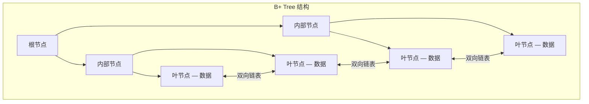
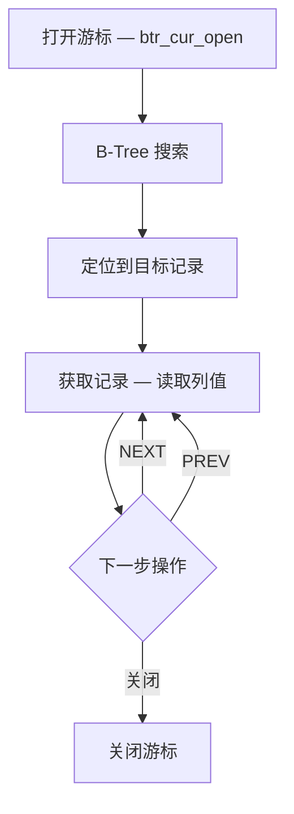
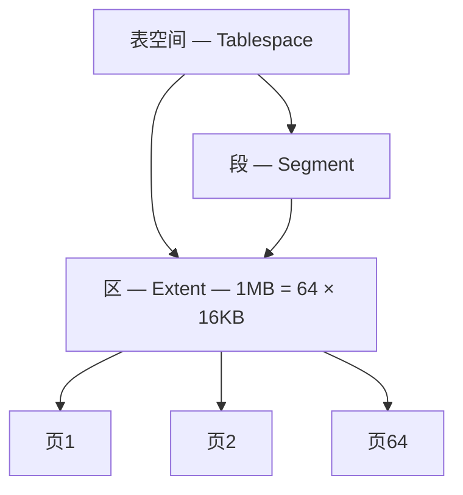
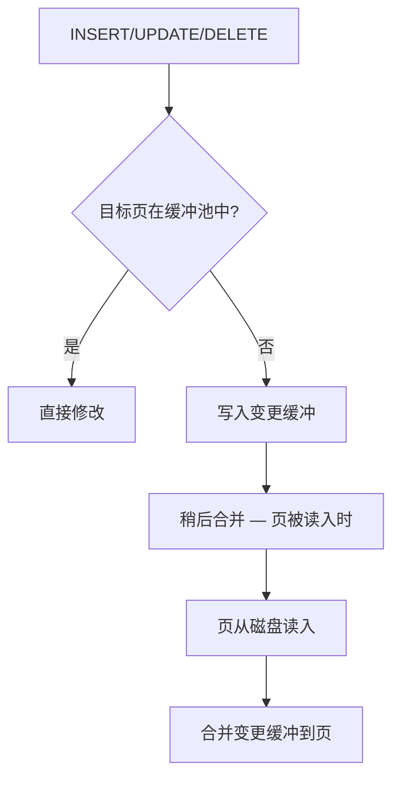
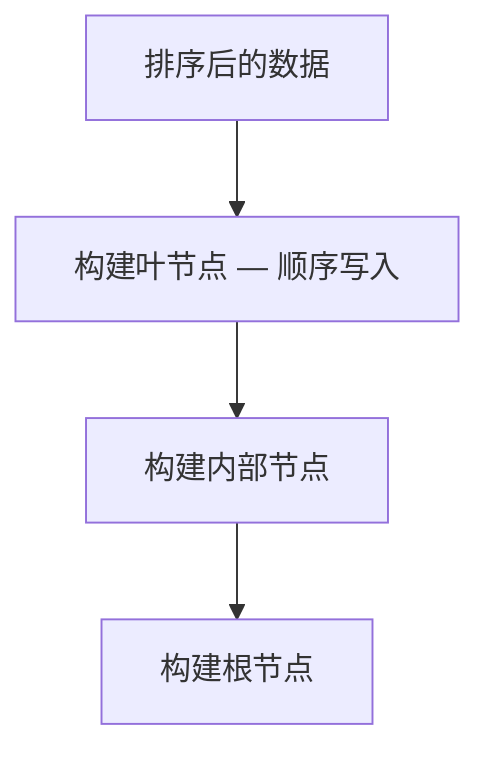

<cite>
**引用文件**
- [storage/innobase/btr/btr0btr.cc](file://storage/innobase/btr/btr0btr.cc)
- [storage/innobase/btr/btr0cur.cc](file://storage/innobase/btr/btr0cur.cc)
- [storage/innobase/btr/btr0sea.cc](file://storage/innobase/btr/btr0sea.cc)
- [storage/innobase/btr/btr0load.cc](file://storage/innobase/btr/btr0load.cc)
- [storage/innobase/page/page0page.cc](file://storage/innobase/page/page0page.cc)
- [storage/innobase/page/page0cur.cc](file://storage/innobase/page/page0cur.cc)
- [storage/innobase/page/page0zip.cc](file://storage/innobase/page/page0zip.cc)
- [storage/innobase/fsp/fsp0fsp.cc](file://storage/innobase/fsp/fsp0fsp.cc)
- [storage/innobase/ibuf/ibuf0ibuf.cc](file://storage/innobase/ibuf/ibuf0ibuf.cc)
</cite>

## 目录
1. [InnoDB 索引结构概述](#innodb-索引结构概述)
2. [B+ Tree 实现](#b-tree-实现)
3. [B-Tree 游标](#b-tree-游标)
4. [自适应搜索（AHI）](#自适应搜索ahi)
5. [页面管理](#页面管理)
6. [文件空间管理（FSP）](#文件空间管理fsp)
7. [变更缓冲（Change Buffer）](#变更缓冲change-buffer)
8. [批量加载](#批量加载)

## InnoDB 索引结构概述

InnoDB 的索引和页面子系统分布在多个目录中：

| 目录 | 总大小 | 说明 |
|------|--------|------|
| `storage/innobase/btr/` | ~600KB | B-Tree 索引操作 |
| `storage/innobase/page/` | ~310KB | 页面格式和操作 |
| `storage/innobase/fsp/` | ~233KB | 文件空间管理 |
| `storage/innobase/ibuf/` | ~147KB | 变更缓冲 |

```mermaid
graph TB
    subgraph B-Tree 层 — btr/
        BTR[btr0btr.cc — B-Tree 操作]
        CUR[btr0cur.cc — B-Tree 游标]
        SEA[btr0sea.cc — 自适应搜索]
        LOAD[btr0load.cc — 批量加载]
    end

    subgraph 页面层 — page/
        PAGE[page0page.cc — 页面操作]
        PCUR[page0cur.cc — 页面游标]
        ZIP[page0zip.cc — 压缩页]
    end

    subgraph 空间层 — fsp/
        FSP[fsp0fsp.cc — 空间管理]
        FILE[fsp0file.cc — 文件 I/O]
        SYSSPACE[fsp0sysspace.cc — 系统表空间]
    end

    BTR --> PAGE
    CUR --> PCUR
    PAGE --> FSP
```

**Sources** · [storage/innobase/btr/](file://storage/innobase/btr/) · [storage/innobase/page/](file://storage/innobase/page/)

## B+ Tree 实现

`btr0btr.cc`（~161KB）实现 InnoDB 的 B+ Tree 索引结构：

### B+ Tree 节点结构



### 索引类型

| 索引类型 | 说明 | 存储内容 |
|----------|------|---------|
| **聚簇索引** | 主键索引 | 完整行数据 |
| **二级索引** | 非主键索引 | 索引列 + 主键值 |
| **全文索引** | FULLTEXT | 倒排索引（FTS） |
| **空间索引** | SPATIAL | R-Tree（GIS） |

### B-Tree 操作

| 操作 | 说明 |
|------|------|
| **搜索** | 从根到叶的二分查找 |
| **插入** | 定位叶节点，必要时分裂 |
| **删除** | 标记删除 + Purge 清理 |
| **分裂** | 页满时从中间分裂 |
| **合并** | 页利用率低于 50% 时合并 |

**Sources** · [storage/innobase/btr/btr0btr.cc](file://storage/innobase/btr/btr0btr.cc)

## B-Tree 游标

`btr0cur.cc`（~190KB）实现 B-Tree 游标，用于在索引中定位和遍历记录：

### 游标操作



### 游标定位策略

| 策略 | 函数 | 说明 |
|------|------|------|
| 精确匹配 | `btr_cur_search_to_nth_level()` | 定位到精确键值 |
| 范围扫描 | `btr_cur_pessimistic_insert()` | 为插入预留空间 |
| 乐观插入 | `btr_cur_optimistic_insert()` | 尝试不分裂直接插入 |
| 悲观插入 | `btr_cur_pessimistic_insert()` | 可能需要分裂 |

**Sources** · [storage/innobase/btr/btr0cur.cc](file://storage/innobase/btr/btr0cur.cc)

## 自适应搜索（AHI）

`btr0sea.cc`（~70KB）实现自适应哈希索引（Adaptive Hash Index）：

### AHI 原理

```mermaid
graph TB
    QUERY[查询 WHERE pk = value]
    QUERY --> AHI{AHI 命中?}
    AHI --> |是| DIRECT[直接访问 — O(1)]
    AHI --> |否| BTREE[B-Tree 搜索 — O(log N)]
    BTREE --> MONITOR[监控访问模式]
    MONITOR --> BUILD{频繁访问?}
    BUILD --> |是| CREATE[创建哈希条目]
    BUILD --> |否| SKIP[跳过]
```

### AHI 配置

```sql
-- 启用/禁用 AHI
SET GLOBAL innodb_adaptive_hash_index = ON;

-- AHI 分区数
SET GLOBAL innodb_adaptive_hash_index_parts = 8;

-- 查看 AHI 统计
SELECT * FROM INFORMATION_SCHEMA.INNODB_METRICS
WHERE NAME LIKE 'adaptive%';
```

**Sources** · [storage/innobase/btr/btr0sea.cc](file://storage/innobase/btr/btr0sea.cc)

## 页面管理

`page0page.cc`（~84KB）和 `page0cur.cc`（~81KB）管理 InnoDB 数据页：

### 页面类型

| 类型 | 大小 | 说明 |
|------|------|------|
| **FIL_PAGE_INDEX** | 16KB | B-Tree 索引页 |
| **FIL_PAGE_TYPE_FSP_HDR** | 16KB | 文件空间头 |
| **FIL_PAGE_IBUF_FREE_LIST** | 16KB | 变更缓冲空闲列表 |
| **FIL_PAGE_TYPE_XDES** | 16KB | 区描述页 |
| **FIL_PAGE_UNDO_LOG** | 16KB | Undo 日志页 |
| **FIL_PAGE_INODE** | 16KB | 索引节点页 |
| **FIL_PAGE_TYPE_BLOB** | 16KB | BLOB 数据页 |
| **FIL_PAGE_SDI** | 16KB | 序列化数据字典 |

### 索引页内部结构

```mermaid
graph TB
    subgraph 索引页 — 16KB
        HEADER[页头 — 38B]
        PDIRECTORY[PDirectory — 记录槽]
        RECORDS[记录区 — 实际数据]
        FREESPACE[空闲空间]
        FREETAIL[Free List 尾部]
    end

    HEADER --> |next_page| NEXT[下一兄弟页]
    HEADER --> |prev_page| PREV[上一兄弟页]
```

### 压缩页

`page0zip.cc`（~92KB）实现页压缩，支持 KEY_BLOCK_SIZE 选项：

```sql
-- 创建压缩表
CREATE TABLE compressed_t (
    id INT PRIMARY KEY, data TEXT
) ENGINE=InnoDB KEY_BLOCK_SIZE=8;  -- 8KB 页
```

**Sources** · [storage/innobase/page/page0page.cc](file://storage/innobase/page/page0page.cc) · [storage/innobase/page/page0zip.cc](file://storage/innobase/page/page0zip.cc)

## 文件空间管理（FSP）

`fsp0fsp.cc`（~173KB）管理 InnoDB 表空间的物理存储：

### 表空间层次



### 空间分配策略

| 策略 | 说明 |
|------|------|
| **FSP 空闲列表** | 维护可用页和区的链表 |
| **碎片段** | 小对象使用碎片段（每页分配） |
| **完整段** | 大对象使用完整段（整区分配） |
| **自动扩展** | 表空间按需自动增长 |

**Sources** · [storage/innobase/fsp/fsp0fsp.cc](file://storage/innobase/fsp/fsp0fsp.cc)

## 变更缓冲（Change Buffer）

`ibuf0ibuf.cc`（~147KB）实现变更缓冲，延迟对二级索引的随机 I/O：

### 变更缓冲原理



### 配置

```sql
-- 变更缓冲模式
SET GLOBAL innodb_change_buffering = 'all';  -- all/inserts/deletes/changes/purges/none

-- 变更缓冲大小（占缓冲池百分比）
SET GLOBAL innodb_change_buffer_max_size = 25;

-- 查看统计
SELECT * FROM INFORMATION_SCHEMA.INNODB_METRICS
WHERE NAME LIKE 'ibuf%';
```

**Sources** · [storage/innobase/ibuf/ibuf0ibuf.cc](file://storage/innobase/ibuf/ibuf0ibuf.cc)

## 批量加载

`btr0load.cc`（~39KB）实现 B-Tree 批量加载，用于 `LOAD DATA` 和在线 DDL 的排序阶段：

### 批量插入优化



```sql
-- 使用批量加载
ALTER TABLE t ADD INDEX idx_col (col);
-- InnoDB 自动排序数据后批量构建 B-Tree
-- 比逐条插入快数倍
```

**Sources** · [storage/innobase/btr/btr0load.cc](file://storage/innobase/btr/btr0load.cc)
