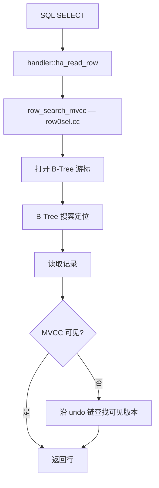
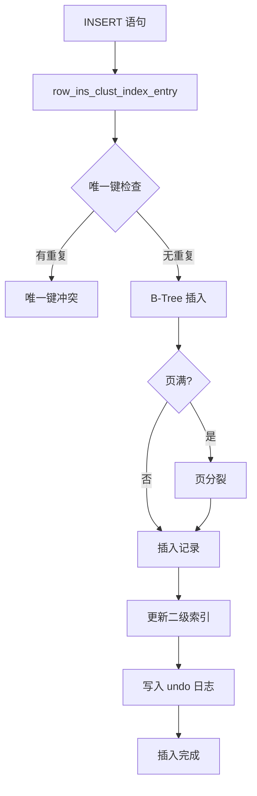
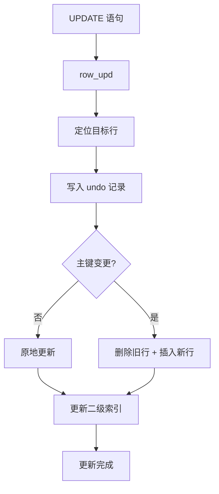
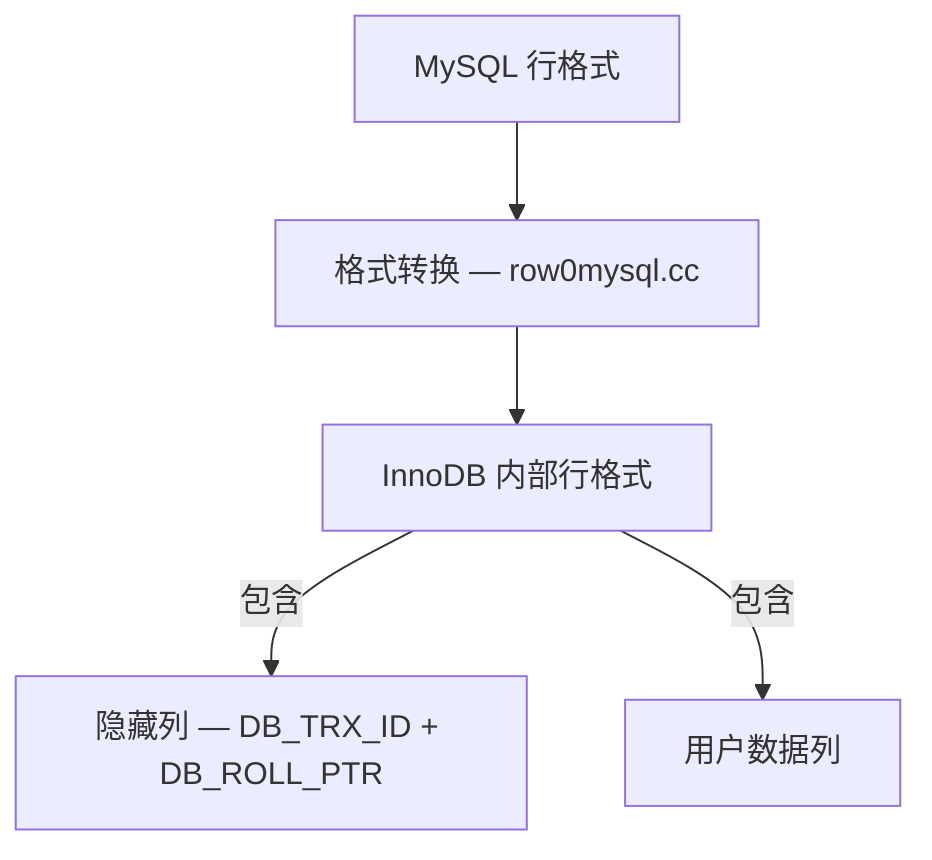
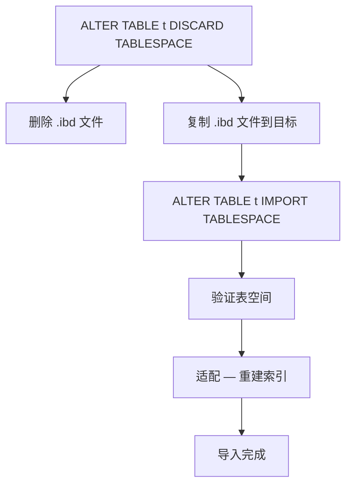
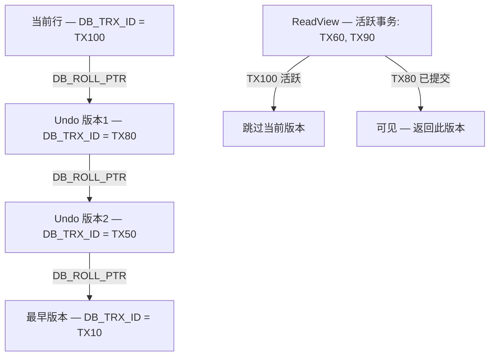
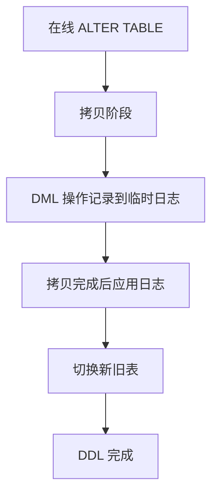

<cite>
**引用文件**
- [storage/innobase/row/row0sel.cc](file://storage/innobase/row/row0sel.cc)
- [storage/innobase/row/row0ins.cc](file://storage/innobase/row/row0ins.cc)
- [storage/innobase/row/row0upd.cc](file://storage/innobase/row/row0upd.cc)
- [storage/innobase/row/row0mysql.cc](file://storage/innobase/row/row0mysql.cc)
- [storage/innobase/row/row0import.cc](file://storage/innobase/row/row0import.cc)
- [storage/innobase/row/row0row.cc](file://storage/innobase/row/row0row.cc)
- [storage/innobase/row/row0vers.cc](file://storage/innobase/row/row0vers.cc)
- [storage/innobase/row/row0log.cc](file://storage/innobase/row/row0log.cc)
</cite>

## 目录
1. [行操作概述](#行操作概述)
2. [行查询（SELECT）](#行查询select)
3. [行插入（INSERT）](#行插入insert)
4. [行更新（UPDATE/DELETE）](#行更新updatedelete)
5. [MySQL 接口层](#mysql-接口层)
6. [表导入导出](#表导入导出)
7. [MVCC 版本链](#mvcc-版本链)
8. [在线 DDL 日志](#在线-ddl-日志)

## 行操作概述

InnoDB 行操作子系统位于 `storage/innobase/row/`，包含 17 个文件，总计约 1.1MB：

| 文件 | 大小 | 说明 |
|------|------|------|
| `row0sel.cc` | ~214KB | SELECT — 行查询（最大的行操作文件） |
| `row0import.cc` | ~154KB | 表空间导入/导出 |
| `row0mysql.cc` | ~147KB | MySQL-InnoDB 接口层 |
| `row0log.cc` | ~127KB | 在线 DDL 临时日志 |
| `row0ins.cc` | ~120KB | INSERT — 行插入 |
| `row0upd.cc` | ~109KB | UPDATE — 行更新 |
| `row0vers.cc` | ~56KB | MVCC 版本链遍历 |
| `row0row.cc` | ~44KB | 行通用操作 |

**Sources** · [storage/innobase/row/](file://storage/innobase/row/)

## 行查询（SELECT）

`row0sel.cc`（~214KB）是 InnoDB 中最大的行操作文件，实现行数据的检索：

### 查询流程



### 查询模式

| 模式 | 说明 |
|------|------|
| **一致性非锁定读** | 默认 — 使用 MVCC 快照 |
| **锁定读** | `SELECT ... FOR UPDATE` — 排他锁 |
| **共享锁读** | `SELECT ... LOCK IN SHARE MODE` — 共享锁 |
| **SKIP LOCKED** | 跳过被锁的行 |
| **NOWAIT** | 不等待锁 — 立即报错 |

### row_search_mvcc() 关键步骤

| 步骤 | 说明 |
|------|------|
| 1. 打开 B-Tree 游标 | 定位到聚簇索引 |
| 2. 搜索记录 | 从根到叶节点 |
| 3. MVCC 检查 | 检查 DB_TRX_ID 和 ReadView |
| 4. 版本链遍历 | 沿 DB_ROLL_PTR 查找可见版本 |
| 5. 二级索引回表 | 二级索引 → 聚簇索引 |
| 6. 返回行 | 转换为 MySQL 行格式 |

**Sources** · [storage/innobase/row/row0sel.cc](file://storage/innobase/row/row0sel.cc)

## 行插入（INSERT）

`row0ins.cc`（~120KB）实现行插入操作：

### 插入流程



### 插入优化

| 优化 | 说明 |
|------|------|
| **顺序插入** | AUTO_INCREMENT 主键保证顺序插入 |
| **批量插入** | `LOAD DATA` 使用批量 B-Tree 加载 |
| **唯一检查** | 延迟唯一检查 — 批量验证 |
| **外键检查** | 按需触发外键验证 |

**Sources** · [storage/innobase/row/row0ins.cc](file://storage/innobase/row/row0ins.cc)

## 行更新（UPDATE/DELETE）

`row0upd.cc`（~109KB）实现行更新和删除操作：

### 更新流程



### DELETE 实现

DELETE 在 InnoDB 中是标记删除：


**Sources** · [storage/innobase/row/row0upd.cc](file://storage/innobase/row/row0upd.cc)

## MySQL 接口层

`row0mysql.cc`（~147KB）是 InnoDB 与 MySQL SQL 层之间的桥梁：

### 关键接口函数

| 函数 | 说明 |
|------|------|
| `row_mysql_insert_row()` | MySQL INSERT → InnoDB 插入 |
| `row_mysql_update_row()` | MySQL UPDATE → InnoDB 更新 |
| `row_mysql_delete_row()` | MySQL DELETE → InnoDB 删除 |
| `row_search_for_mysql()` | MySQL SELECT → InnoDB 搜索 |
| `row_create_table_for_mysql()` | MySQL CREATE TABLE → InnoDB 建表 |
| `row_drop_table_for_mysql()` | MySQL DROP TABLE → InnoDB 删表 |
| `row_rename_table_for_mysql()` | MySQL RENAME TABLE → InnoDB 重命名 |

### 行格式转换



**Sources** · [storage/innobase/row/row0mysql.cc](file://storage/innobase/row/row0mysql.cc)

## 表导入导出

`row0import.cc`（~154KB）实现表空间的导入/导出功能：

### DISCARD/IMPORT 流程



```sql
-- 表空间导出/导入
ALTER TABLE orders DISCARD TABLESPACE;
-- 复制 orders.ibd 到目标服务器
ALTER TABLE orders IMPORT TABLESPACE;
```

**Sources** · [storage/innobase/row/row0import.cc](file://storage/innobase/row/row0import.cc)

## MVCC 版本链

`row0vers.cc`（~56KB）实现 MVCC 版本链的遍历：

### 版本链遍历



**Sources** · [storage/innobase/row/row0vers.cc](file://storage/innobase/row/row0vers.cc)

## 在线 DDL 日志

`row0log.cc`（~127KB）实现在线 DDL 期间的并发 DML 日志：

### 在线 DDL 并发



```sql
-- 在线 DDL — 不阻塞 DML
ALTER TABLE orders ADD INDEX idx_date (order_date),
                   ALGORITHM=INPLACE, LOCK=NONE;
```

**Sources** · [storage/innobase/row/row0log.cc](file://storage/innobase/row/row0log.cc)
