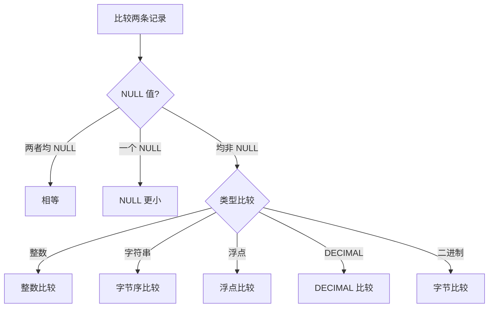
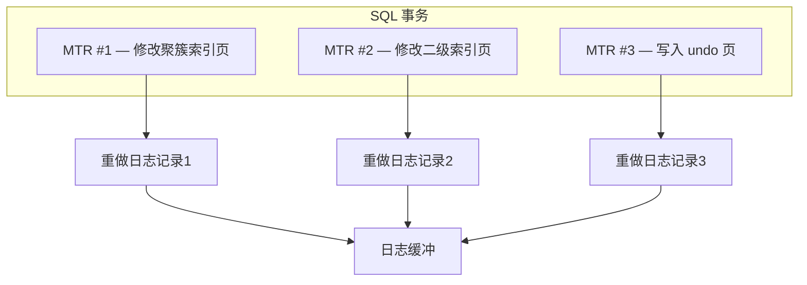
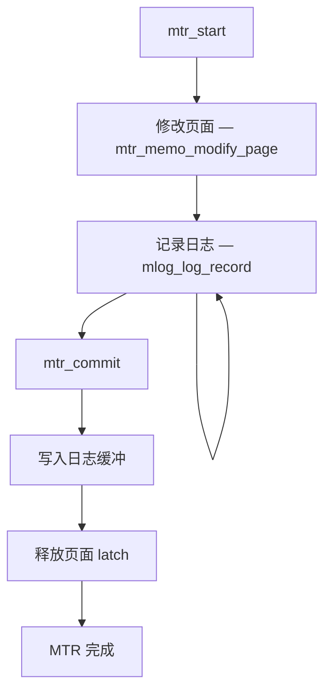

<cite>
**引用文件**
- [storage/innobase/rem/rem0rec.cc](file://storage/innobase/rem/rem0rec.cc)
- [storage/innobase/rem/rec.cc](file://storage/innobase/rem/rec.cc)
- [storage/innobase/rem/rem0cmp.cc](file://storage/innobase/rem/rem0cmp.cc)
- [storage/innobase/mtr/mtr0mtr.cc](file://storage/innobase/mtr/mtr0mtr.cc)
- [storage/innobase/mtr/mtr0log.cc](file://storage/innobase/mtr/mtr0log.cc)
</cite>

## 目录
1. [记录格式概述](#记录格式概述)
2. [行格式](#行格式)
3. [记录比较](#记录比较)
4. [Mini-Transaction (MTR)](#mini-transaction-mtr)
5. [MTR 日志记录](#mtr-日志记录)

## 记录格式概述

InnoDB 记录格式子系统分布在两个目录中：

| 目录 | 文件 | 说明 |
|------|------|------|
| `storage/innobase/rem/` | 5 文件 ~120KB | 记录格式、比较、转换 |
| `storage/innobase/mtr/` | 2 文件 ~75KB | Mini-Transaction 实现 |

**Sources** · [storage/innobase/rem/](file://storage/innobase/rem/) · [storage/innobase/mtr/](file://storage/innobase/mtr/)

## 行格式

`rem0rec.cc`（~60KB）实现 InnoDB 记录的物理格式：

### COMPACT 行格式（默认）

```mermaid
graph TB
    subgraph InnoDB 记录 — COMPACT 格式
        NULL_BITMAP[NULL 位图 — 可变长度]
        VARIABLE_LEN[变长字段长度列表]
        HIDDEN[隐藏列 — 7B]
        DATA[数据列]
    end

    subgraph 隐藏列
        TRX_ID[DB_TRX_ID — 6B 事务ID]
        ROLL_PTR[DB_ROLL_PTR — 7B 回滚指针]
        ROW_ID[DB_ROW_ID — 6B 行ID — 无PK时]
    end
```

### 行格式对比

| 格式 | NULL 存储 | 变长字段 | 行外数据 | 适用 |
|------|----------|---------|---------|------|
| **COMPACT** | NULL 位图 | 1-2B 长度 | 20B 引用 | 默认 |
| **DYNAMIC** | NULL 位图 | 1-2B 长度 | 20B 引用 | 行外存储优化 |
| **COMPRESSED** | NULL 位图 | 1-2B 长度 | 20B 引用 | KEY_BLOCK_SIZE |
| **REDUNDANT** | 旧格式（6B 头） | 固定偏移 | 20B 引用 | 兼容 |

### NULL 位图

每个可为 NULL 的列对应一个位，按列顺序排列：

```sql
CREATE TABLE t (
    id INT NOT NULL,        -- 无 NULL 位
    name VARCHAR(100),      -- 位 0
    age INT,                -- 位 1
    email VARCHAR(200)      -- 位 2
);
-- NULL 位图: 3 位 = 1 字节
-- name=NULL → 位 0 = 1
-- age=25    → 位 1 = 0
-- email=NULL → 位 2 = 1
-- NULL 位图 = 0b101 = 5
```

### 变长字段长度

| 字段最大长度 | 长度编码 |
|-------------|---------|
| ≤ 127 字节 | 1 字节 |
| ≤ 16383 字节 | 2 字节（高位为标志） |
| > 16383 字节 | 行外存储 |

**Sources** · [storage/innobase/rem/rem0rec.cc](file://storage/innobase/rem/rem0rec.cc)

## 记录比较

`rem0cmp.cc`（~35KB）实现 InnoDB 记录之间的比较：

### 比较规则



### 索引排序

| 索引类型 | 排序方式 |
|----------|---------|
| 聚簇索引 | 主键升序 |
| 二级索引 | 索引列 + 主键（tie-breaker） |
| 全文索引 | 倒排索引（FTS_DOC_ID） |
| 空间索引 | R-Tree（MBR） |

**Sources** · [storage/innobase/rem/rem0cmp.cc](file://storage/innobase/rem/rem0cmp.cc)

## Mini-Transaction (MTR)

`mtr0mtr.cc`（~37KB）实现 InnoDB 的 Mini-Transaction — 最小的原子修改单元：

### MTR 概念

MTR 是 InnoDB 中最小的原子操作单元。一个 SQL 事务可能包含多个 MTR，每个 MTR 修改一组页面：



### MTR 操作

| 操作 | 说明 |
|------|------|
| `mtr_start()` | 开始 MTR |
| `mtr_commit()` | 提交 MTR — 写入日志缓冲 |
| `mtr_memo_modify_page()` | 修改页面（记录到 MTR） |
| `mtr_log_ibuf()` | 记录变更缓冲操作 |

### MTR 与锁

| 锁类型 | 范围 | 说明 |
|--------|------|------|
| **页面 latch** | 单个页面 | MTR 期间持有页面 latch |
| **树 latch** | B-Tree 路径 | 从根到叶的搜索路径 |
| **乐观/悲观** | 操作模式 | 乐观：不持有路径锁；悲观：持有 |

**Sources** · [storage/innobase/mtr/mtr0mtr.cc](file://storage/innobase/mtr/mtr0mtr.cc)

## MTR 日志记录

`mtr0log.cc`（~38KB）实现 MTR 的重做日志记录：

### 日志记录类型

| 类型 | 说明 |
|------|------|
| `MLOG_INSERT_REC` | 插入记录 |
| `MLOG_UPD_CLUST_REC` | 更新聚簇索引记录 |
| `MLOG_UPD_SEC_REC` | 更新二级索引记录 |
| `MLOG_UPD_DEL_REC` | 标记删除记录 |
| `MLOG_PAGE_CREATE` | 创建新页 |
| `MLOG_PAGE_DELETE` | 删除页 |
| `MLOG_FILE_CREATE` | 创建文件 |
| `MLOG_FILE_DELETE` | 删除文件 |
| `MLOG_FILE_RENAME` | 重命名文件 |

### MTR 提交流程



### WAL 原则

InnoDB 遵循 Write-Ahead Logging（WAL）原则：

| 原则 | 说明 |
|------|------|
| **先写日志** | 日志必须在脏页刷盘之前持久化 |
| **LSN 单调递增** | 每个 MTR 的 LSN 都大于前一个 |
| **页面 LSN** | 数据页记录最后修改的 LSN |

**Sources** · [storage/innobase/mtr/mtr0log.cc](file://storage/innobase/mtr/mtr0log.cc)
