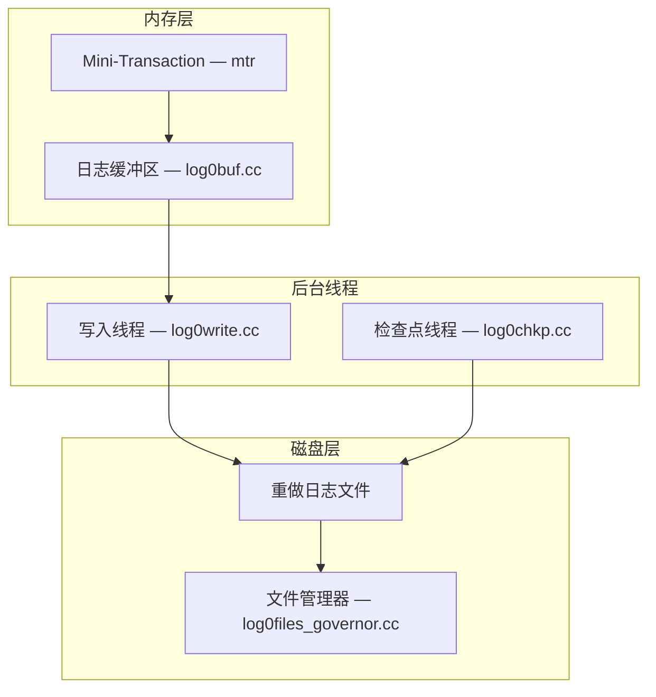
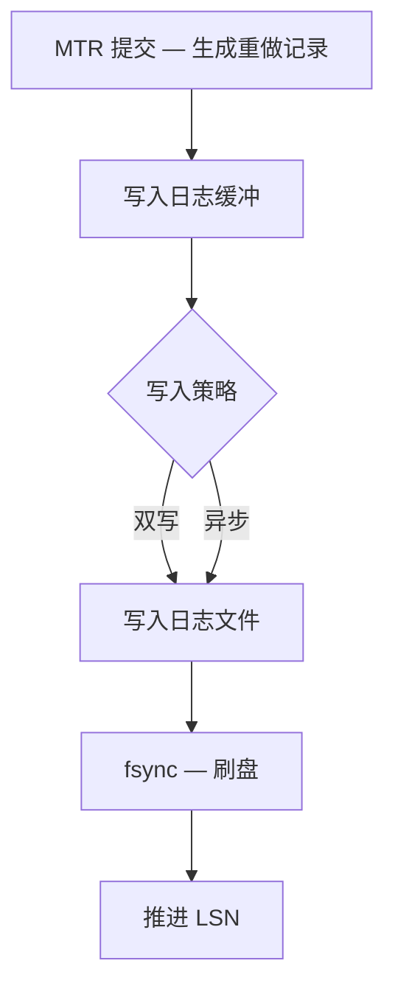
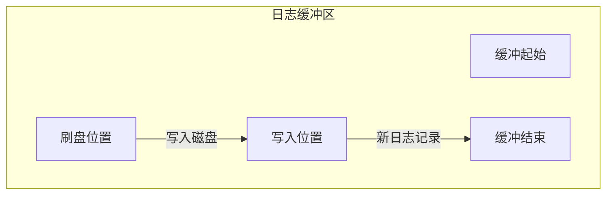
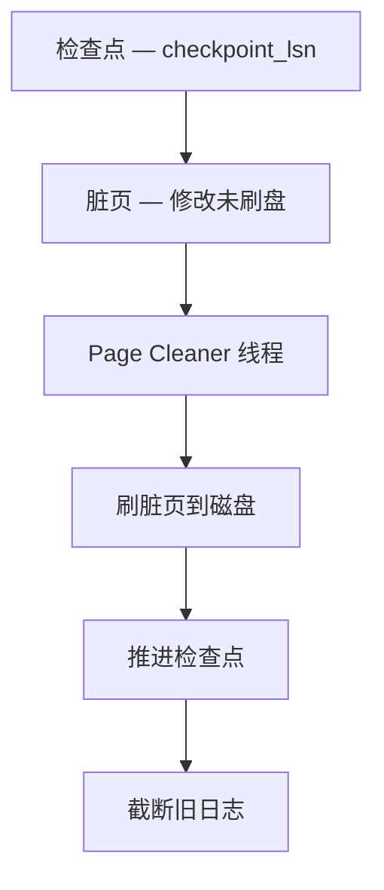
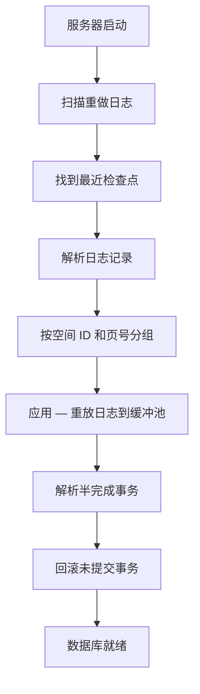
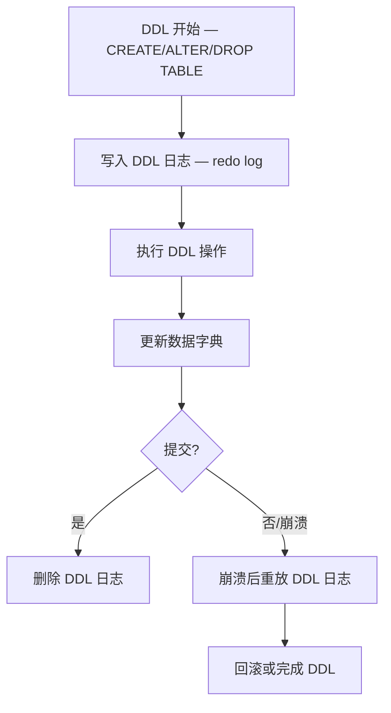

<cite>
**引用文件**
- [storage/innobase/log/log0log.cc](file://storage/innobase/log/log0log.cc)
- [storage/innobase/log/log0write.cc](file://storage/innobase/log/log0write.cc)
- [storage/innobase/log/log0recv.cc](file://storage/innobase/log/log0recv.cc)
- [storage/innobase/log/log0buf.cc](file://storage/innobase/log/log0buf.cc)
- [storage/innobase/log/log0chkp.cc](file://storage/innobase/log/log0chkp.cc)
- [storage/innobase/log/log0ddl.cc](file://storage/innobase/log/log0ddl.cc)
- [storage/innobase/log/log0files_governor.cc](file://storage/innobase/log/log0files_governor.cc)
- [storage/innobase/log/log0meb.cc](file://storage/innobase/log/log0meb.cc)
</cite>

## 目录
1. [重做日志概述](#重做日志概述)
2. [日志系统架构](#日志系统架构)
3. [日志写入流程](#日志写入流程)
4. [日志缓冲](#日志缓冲)
5. [检查点（Checkpoint）](#检查点checkpoint)
6. [崩溃恢复](#崩溃恢复)
7. [DDL 日志](#ddl-日志)
8. [可加密二进制日志（MEB）](#可加密二进制日志meb)

## 重做日志概述

InnoDB 重做日志子系统位于 `storage/innobase/log/`，包含 17 个文件，总计约 720KB：

| 文件 | 大小 | 说明 |
|------|------|------|
| `log0recv.cc` | ~130KB | 崩溃恢复 — 重放日志 |
| `log0write.cc` | ~100KB | 日志写入 — 写盘和刷盘 |
| `log0meb.cc` | ~84KB | MEB — MySQL Enterprise Backup 集成 |
| `log0files_governor.cc` | ~73KB | 日志文件管理器 |
| `log0log.cc` | ~66KB | 日志核心 — 初始化和配置 |
| `log0ddl.cc` | ~60KB | DDL 日志 — 原子 DDL 支持 |
| `log0buf.cc` | ~48KB | 日志缓冲 — 内存缓冲区 |
| `log0chkp.cc` | ~41KB | 检查点 — 推进检查点 |

**Sources** · [storage/innobase/log/](file://storage/innobase/log/)

## 日志系统架构



### 核心组件

| 组件 | 说明 |
|------|------|
| **Mini-Transaction (MTR)** | 最小事务单元 — 一组对页面的修改 |
| **日志缓冲** | 内存中的日志缓冲区 |
| **写入线程** | 将缓冲写入磁盘 |
| **检查点线程** | 推进 LSN 检查点 |
| **文件管理器** | 管理日志文件的创建、删除和大小 |

**Sources** · [storage/innobase/log/log0log.cc](file://storage/innobase/log/log0log.cc)

## 日志写入流程

### 写入流水线



### LSN — 日志序列号

LSN（Log Sequence Number）是 InnoDB 中最重要的概念之一：

| 术语 | 说明 |
|------|------|
| **LSN** | 全局单调递增的字节偏移量 |
| **log_sys->lsn** | 当前日志写入位置 |
| **checkpoint_lsn** | 最新检查点位置 |
| **page_lsn** | 数据页最后修改的 LSN |

### 写入策略

| 策略 | 说明 | 持久性 |
|------|------|--------|
| `innodb_flush_log_at_trx_commit = 1` | 每次提交 fsync | 最高（默认） |
| `innodb_flush_log_at_trx_commit = 2` | 每次提交 write，每秒 fsync | 中 |
| `innodb_flush_log_at_trx_commit = 0` | 每秒 write + fsync | 低（高性能） |

**Sources** · [storage/innobase/log/log0write.cc](file://storage/innobase/log/log0write.cc)

## 日志缓冲

`log0buf.cc`（~48KB）管理内存中的日志缓冲区：

### 缓冲结构



### 配置

```sql
-- 日志缓冲大小（MySQL 8.0.30+ 动态调整）
SET GLOBAL innodb_log_buffer_size = 16777216;  -- 16MB

-- 查看缓冲统计
SELECT * FROM INFORMATION_SCHEMA.INNODB_METRICS
WHERE NAME LIKE 'log%';
```

**Sources** · [storage/innobase/log/log0buf.cc](file://storage/innobase/log/log0buf.cc)

## 检查点（Checkpoint）

`log0chkp.cc`（~41KB）管理检查点推进：

### 检查点原理



### 检查点类型

| 类型 | 说明 |
|------|------|
| **Sharp Checkpoint** | 服务器关闭时刷新所有脏页 |
| **Fuzzy Checkpoint** | 正常运行时逐步推进 |
| **Async Flushing** | 异步刷脏页 |
| **Sync Flushing** | 同步刷脏页（日志空间不足时） |

### 日志空间管理

```sql
-- 重做日志容量配置（MySQL 8.0.30+）
SET GLOBAL innodb_redo_log_capacity = 104857600;  -- 100MB

-- 查看重做日志状态
SHOW STATUS LIKE 'Innodb_redo_log%';
```

**Sources** · [storage/innobase/log/log0chkp.cc](file://storage/innobase/log/log0chkp.cc)

## 崩溃恢复

`log0recv.cc`（~130KB）实现 InnoDB 的崩溃恢复机制：

### 恢复流程



### 恢复类型

| 类型 | 说明 |
|------|------|
| **自动恢复** | 默认行为 — 启动时自动重放 |
| **强制恢复** | `innodb_force_recovery` — 跳过部分恢复 |
| **表空间导入** | 仅恢复特定表空间 |

```sql
-- 强制恢复级别（仅用于故障恢复，不用于生产）
-- 1: 跳过损坏页
-- 2: 跳过后台线程
-- 3: 跳过事务回滚
-- 4: 跳过统计计算
-- 5: 跳过 undo 日志查看
-- 6: 跳过重做日志前滚
SET GLOBAL innodb_force_recovery = 1;
```

**Sources** · [storage/innobase/log/log0recv.cc](file://storage/innobase/log/log0recv.cc)

## DDL 日志

`log0ddl.cc`（~60KB）实现原子 DDL 的日志支持：

### 原子 DDL 流程



**Sources** · [storage/innobase/log/log0ddl.cc](file://storage/innobase/log/log0ddl.cc)

## 可加密二进制日志（MEB）

`log0meb.cc`（~84KB）实现 MySQL Enterprise Backup 集成的可加密日志：

| 功能 | 说明 |
|------|------|
| **日志加密** | 使用密钥环加密重做日志 |
| **MEB 集成** | 支持 MySQL Enterprise Backup 热备份 |
| **增量备份** | 基于 LSN 的增量备份 |

```sql
-- 启用重做日志加密
SET GLOBAL innodb_redo_log_encrypt = ON;

-- 查看加密状态
SELECT * FROM performance_schema.keyring_component_status;
```

**Sources** · [storage/innobase/log/log0meb.cc](file://storage/innobase/log/log0meb.cc)
