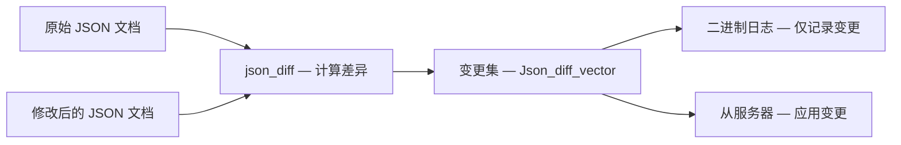
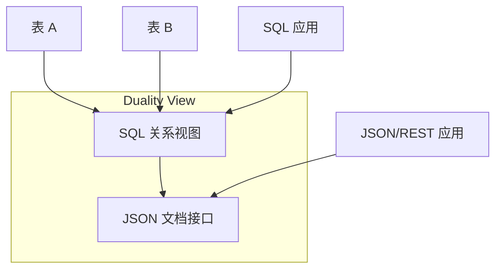

<cite>
**引用文件**
- [sql-common/json_dom.cc](file://sql-common/json_dom.cc)
- [sql-common/json_binary.cc](file://sql-common/json_binary.cc)
- [sql-common/json_path.cc](file://sql-common/json_path.cc)
- [sql-common/json_diff.cc](file://sql-common/json_diff.cc)
- [sql-common/json_schema.cc](file://sql-common/json_schema.cc)
- [sql/json_duality_view/](file://sql/json_duality_view/)
</cite>

## 目录
1. [JSON 子系统概述](#json-子系统概述)
2. [JSON 数据模型（DOM）](#json-数据模型dom)
3. [二进制 JSON 格式](#二进制-json-格式)
4. [JSON 路径表达式](#json-路径表达式)
5. [JSON 部分更新](#json-部分更新)
6. [JSON Schema 验证](#json-schema-验证)
7. [JSON 对偶视图（Duality Views）](#json-对偶视图duality-views)
8. [JSON 函数](#json-函数)

## JSON 子系统概述

MySQL 提供了完整的 JSON 数据支持，核心实现位于 `sql-common/` 目录中（服务器和客户端共享），并在 `sql/json_duality_view/` 中引入了创新的 JSON Relational Duality View 功能。JSON 子系统使 MySQL 能够同时作为关系型数据库和文档存储使用。

```mermaid
graph TB
    subgraph 共享 JSON 核心 — sql-common/
        DOM[json_dom.cc — DOM 模型]
        BINARY[json_binary.cc — 二进制格式]
        PATH[json_path.cc — 路径表达式]
        DIFF[json_diff.cc — 差异计算]
        SCHEMA[json_schema.cc — Schema 验证]
        HASH[json_hash.cc — 哈希]
    end

    subgraph 服务器端扩展 — sql/
        DV[json_duality_view/ — 对偶视图]
        ITEM_JSON[item_json*.cc — JSON 函数]
    end

    DOM --> BINARY
    DOM --> PATH
    DOM --> DIFF
    DV --> DOM
    ITEM_JSON --> DOM
```

**Sources** · [sql-common/](file://sql-common/) · [sql/json_duality_view/](file://sql/json_duality_view/)

## JSON 数据模型（DOM）

`json_dom.cc`（~133KB）实现了 JSON 文档对象模型（Document Object Model）：

### 核心类型

| 类型 | 说明 |
|------|------|
| `Json_scalar` | 标量值基类（字符串、数字、布尔、null） |
| `Json_string` | JSON 字符串 |
| `Json_int` / `Json_uint` | JSON 整数 |
| `Json_decimal` | JSON 高精度小数 |
| `Json_double` | JSON 浮点数 |
| `Json_boolean` | JSON 布尔值 |
| `Json_null` | JSON null |
| `Json_array` | JSON 数组 |
| `Json_object` | JSON 对象（键值对集合） |

### 内存管理

- JSON DOM 使用 `MEM_ROOT` 分配器管理内存
- 与查询生命周期绑定，查询结束后自动释放
- 深拷贝和浅拷贝支持，优化性能

**Sources** · [sql-common/json_dom.cc](file://sql-common/json_dom.cc)

## 二进制 JSON 格式

`json_binary.cc`（~76KB）实现了 MySQL 特有的二进制 JSON 存储格式：

### 设计目标

- 快速随机访问 JSON 元素（无需解析整个文档）
- 紧凑的二进制表示（比文本 JSON 更小的存储空间）
- 高效的序列化/反序列化

### 格式结构

```
+----------------+------------------+
| 类型标识 (1B)  | 元素数量          |
+----------------+------------------+
| 键偏移数组     | 值偏移数组        |
+----------------+------------------+
| 键数据         | 值数据            |
+----------------+------------------+
```

### 值类型编码

| 编码 | 类型 |
|------|------|
| 0x00 | 小整数（int16） |
| 0x01 | 大整数（int32） |
| 0x02 | 大整数（int64） |
| 0x03 | 双精度浮点 |
| 0x04 | 字符串 |
| 0x05 | 嵌套对象（内联） |
| 0x06 | 嵌套数组（内联） |
| 0x0F | 布尔 true |
| 0x10 | 布尔 false |
| 0x11 | null |

**Sources** · [sql-common/json_binary.cc](file://sql-common/json_binary.cc)

## JSON 路径表达式

`json_path.cc`（~24KB）实现 JSON 路径表达式，遵循 RFC 6901 标准：

### 路径语法

| 语法 | 说明 | 示例 |
|------|------|------|
| `$` | 根元素 | `$` |
| `.key` | 对象成员访问 | `$.name` |
| `[N]` | 数组索引访问 | `$.items[0]` |
| `[*]` | 数组通配 | `$.items[*]` |
| `.*` | 对象通配 | `$.*` |
| `**` | 递归下降 | `$**.name` |

```sql
-- JSON 路径查询
SELECT JSON_EXTRACT('{"name":"MySQL","tags":["db","sql"]}', '$.name');
-- 结果: "MySQL"

SELECT JSON_EXTRACT('{"name":"MySQL","tags":["db","sql"]}', '$.tags[0]');
-- 结果: "db"
```

**Sources** · [sql-common/json_path.cc](file://sql-common/json_path.cc)

## JSON 部分更新

`json_diff.cc`（~20KB）实现 JSON 差异计算，支持部分更新（Partial Update）：

### 工作原理

传统 JSON 更新需要重写整个文档。部分更新仅修改变更的部分：



### 变更类型

| 类型 | 说明 |
|------|------|
| **Replace** | 替换指定路径的值 |
| **Insert** | 在指定路径插入新值 |
| **Remove** | 删除指定路径的值 |

部分更新的优势：
- 减少二进制日志大小
- 减少复制带宽消耗
- 减少 InnoDB 页面修改量
- 提升 JSON 列更新的性能

**Sources** · [sql-common/json_diff.cc](file://sql-common/json_diff.cc)

## JSON Schema 验证

`json_schema.cc`（~12KB）实现 JSON Schema 标准的验证功能：

```sql
-- 定义 JSON Schema
SET @schema = '{
  "type": "object",
  "properties": {
    "name": {"type": "string", "minLength": 1},
    "age": {"type": "integer", "minimum": 0, "maximum": 150}
  },
  "required": ["name"]
}';

-- 验证 JSON 文档是否符合 Schema
SELECT JSON_SCHEMA_VALID(@schema, '{"name":"Alice","age":30}');
-- 结果: 1 (有效)

-- 获取验证错误报告
SELECT JSON_SCHEMA_VALIDATION_REPORT(@schema, '{"age":-5}');
-- 结果: 包含错误详情的 JSON
```

**Sources** · [sql-common/json_schema.cc](file://sql-common/json_schema.cc)

## JSON 对偶视图（Duality Views）

`sql/json_duality_view/` 是 MySQL 9.x 引入的创新功能，实现了关系数据和 JSON 文档之间的双向映射：

### 核心概念

JSON Relational Duality View 是一个数据库对象，同时提供：
- **关系视图** — 像普通表一样使用 SQL 访问
- **JSON 文档视图** — 像文档集合一样使用 JSON API 访问



### 目录结构

| 文件 | 说明 |
|------|------|
| `content_tree.cc` / `.h` | 内容树 — 定义视图到 JSON 的映射结构 |
| `ddl.cc` / `.h` | DDL 操作 — CREATE/ALTER/DROP DUALITY VIEW |
| `dml.cc` / `.h` | DML 操作 — 通过 JSON 接口进行增删改 |
| `i_s.cc` / `.h` | INFORMATION_SCHEMA 视图集成 |
| `option_usage.cc` / `.h` | 选项使用管理 |
| `utils.cc` / `.h` | 工具函数 |

### 使用示例

```sql
-- 创建对偶视图
CREATE JSON RELATIONAL DUALITY VIEW student_dv AS
  student @insert @update @delete {
    _id: student_id,
    name: name,
    grades: course_enrollment @insert @update @delete [{
      course: course_id,
      grade: grade
    }]
  };

-- SQL 方式访问
SELECT * FROM student_dv;

-- JSON 方式访问（通过 MySQL Shell 或 X Protocol）
-- db.student_dv.find({_id: 1})
```

**Sources** · [sql/json_duality_view/](file://sql/json_duality_view/)

## JSON 函数

MySQL 提供丰富的 JSON 操作函数：

### 创建与查询

| 函数 | 说明 |
|------|------|
| `JSON_OBJECT()` | 创建 JSON 对象 |
| `JSON_ARRAY()` | 创建 JSON 数组 |
| `JSON_EXTRACT()` / `->` / `->>` | 提取 JSON 值 |
| `JSON_CONTAINS()` | 检查是否包含指定值 |
| `JSON_CONTAINS_PATH()` | 检查是否包含指定路径 |
| `JSON_KEYS()` | 获取对象的所有键 |
| `JSON_SEARCH()` | 搜索指定值的路径 |

### 修改

| 函数 | 说明 |
|------|------|
| `JSON_SET()` | 设置值（插入或替换） |
| `JSON_INSERT()` | 仅插入 |
| `JSON_REPLACE()` | 仅替换 |
| `JSON_REMOVE()` | 删除元素 |
| `JSON_ARRAY_APPEND()` | 追加到数组 |
| `JSON_ARRAY_INSERT()` | 插入到数组 |
| `JSON_MERGE_PATCH()` | RFC 7396 合并 |
| `JSON_MERGE_PRESERVE()` | 保留式合并 |

### 工具函数

| 函数 | 说明 |
|------|------|
| `JSON_TYPE()` | 获取值类型 |
| `JSON_LENGTH()` | 获取元素数量 |
| `JSON_DEPTH()` | 获取嵌套深度 |
| `JSON_VALID()` | 验证 JSON 格式 |
| `JSON_PRETTY()` | 格式化输出 |
| `JSON_TABLE()` | 将 JSON 转换为关系表 |
