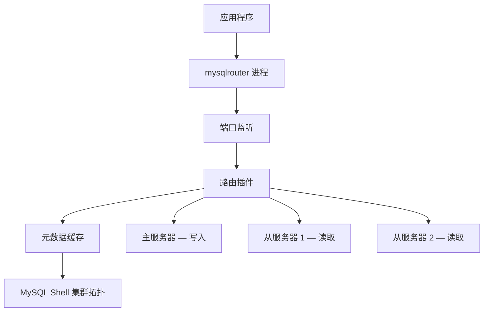
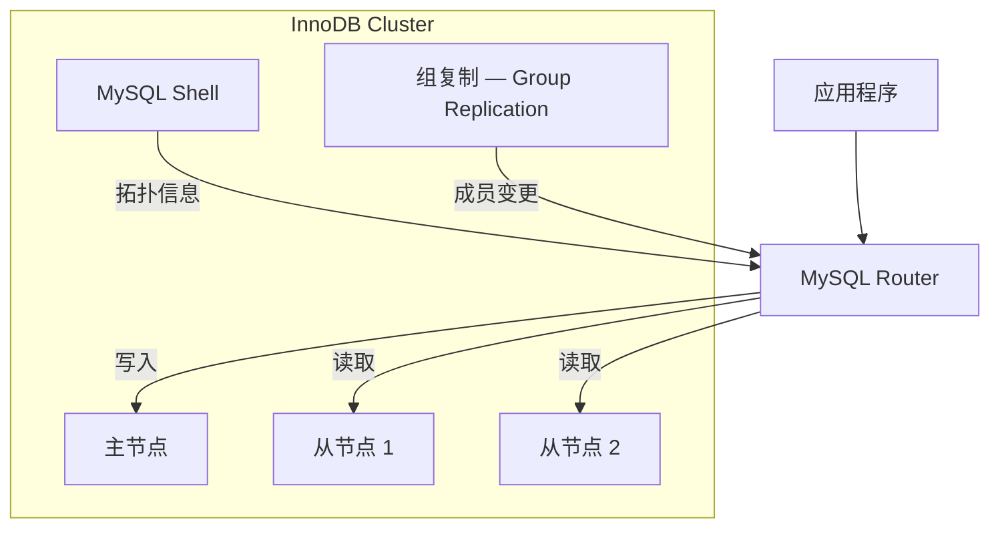

<cite>
**引用文件**
- [router/](file://router/)
- [router/src/](file://router/src/)
- [router/CMakeLists.txt](file://router/CMakeLists.txt)
- [router/src/plugins/](file://router/src/plugins/)
</cite>

## 目录
1. [MySQL Router 概述](#mysql-router-概述)
2. [架构设计](#架构设计)
3. [核心插件](#核心插件)
4. [高可用集成](#高可用集成)
5. [配置方式](#配置方式)
6. [构建与部署](#构建与部署)

## MySQL Router 概述

MySQL Router 是一个轻量级中间件，提供应用程序与 MySQL 服务器之间的透明路由。它支持读写分离（将写入路由到主服务器，读取路由到从服务器）、连接池化、与 InnoDB Cluster / InnoDB ReplicaSet 的自动故障转移，以及 TLS 透传。

Router 包含在 MySQL Server 源代码树中（`router/` 目录），拥有独立的构建系统、测试基础设施和文档。它作为独立进程（`mysqlrouter`）运行，在高可用部署中至关重要——配合 MySQL Shell 的 InnoDB Cluster 使用时，可以根据集群拓扑变化自动调整路由策略。

**Sources** · [router/](file://router/)

## 架构设计

MySQL Router 运行为独立进程，读取配置文件、加载插件、监听配置的端口并将客户端连接路由到后端 MySQL 服务器。



### 源码目录结构

```
router/
├── src/                        # 核心路由实现
│   ├── main loop               # 主循环、插件加载、配置解析
│   └── plugins/                # 插件实现
│       ├── routing/            # 核心路由插件 — TCP 连接路由和读写分离
│       ├── metadata_cache/     # 元数据缓存 — MySQL Shell 集群拓扑
│       ├── rest_router/        # REST API — 运行时配置管理
│       ├── connection_sharing/ # 连接共享和池化
│       └── io/                 # I/O 组件 — 异步网络
├── ext/                        # Router 特定的第三方依赖
├── tests/                      # Router 特定的单元和集成测试
├── cmake/                      # Router 特定的 CMake 模块
└── doc/                        # Router 文档
```

**Sources** · [router/src/](file://router/src/)

## 核心插件

MySQL Router 采用插件化架构，主要插件包括：

### 路由插件（routing）

核心插件，负责 TCP 连接路由：
- **读写分离**：将 `SELECT` 查询路由到从服务器，将写操作路由到主服务器
- **连接管理**：维护到后端服务器的连接池
- **故障转移**：检测后端服务器故障并自动调整路由
- **TLS 透传**：支持端到端加密连接

### 元数据缓存插件（metadata_cache）

从 MySQL Shell 集群拓扑缓存元数据：
- 定期从集群获取拓扑信息
- 缓存主从服务器的地址和状态
- 拓扑变更时自动更新路由表

### REST API 插件（rest_router）

提供 RESTful API 接口，用于运行时配置管理：
- 查看当前路由配置
- 动态修改路由规则
- 监控连接状态

### 连接共享插件（connection_sharing）

连接池化和共享：
- 复用后端连接，减少连接创建开销
- 多客户端共享少量后端连接
- 异步 I/O 实现高并发连接处理

**Sources** · [router/src/plugins/](file://router/src/plugins/)

## 高可用集成

MySQL Router 与 MySQL 高可用方案深度集成：



### InnoDB Cluster 集成

- Router 自动发现 InnoDB Cluster 的拓扑结构
- 主节点故障时，自动将写入路由到新的主节点
- 从节点变化时，自动更新读取路由列表
- 支持单主和多主模式

### InnoDB ReplicaSet 集成

- 支持异步复制拓扑
- 自动检测主从关系变化
- 透明的故障转移处理

## 配置方式

MySQL Router 使用 INI 风格的配置文件（`mysqlrouter.conf`）：

```ini
[DEFAULT]
logging_folder = /var/log/mysqlrouter
runtime_folder = /var/run/mysqlrouter
config_folder = /etc/mysqlrouter

[logger]
level = INFO

[routing:primary]
bind_address = 0.0.0.0
bind_port = 6446
destinations = metadata-cache://cluster/default?role=PRIMARY
routing_strategy = first-available

[routing:secondary]
bind_address = 0.0.0.0
bind_port = 6447
destinations = metadata-cache://cluster/default?role=SECONDARY
routing_strategy = round-robin-with-fallback
```

### 常用配置参数

| 参数 | 说明 |
|------|------|
| `bind_address` | 监听地址 |
| `bind_port` | 监听端口 |
| `destinations` | 目标服务器列表或元数据缓存 URI |
| `routing_strategy` | 路由策略（first-available、round-robin 等） |
| `mode` | 协议模式（read-write、read-only） |
| `max_connect_errors` | 最大连接错误数 |

**Sources** · [router/](file://router/)

## 构建与部署

### 构建

MySQL Router 与 MySQL Server 从同一源代码树构建：

```bash
# 包含 Router 的构建（默认启用）
cmake -B build -DWITH_ROUTER=ON .
cmake --build build

# 不包含 Router 的构建
cmake -B build -DWITH_ROUTER=OFF .
```

Router 拥有独立的 CMake 配置（`router/CMakeLists.txt`），构建产出为 `mysqlrouter` 可执行文件。

### 技术特征

- 异步 I/O 实现高并发连接处理
- INI 风格配置文件（`mysqlrouter.conf`）
- 与 MySQL Shell 的 InnoDB Cluster 自动拓扑感知
- 独立的 CMake 构建配置

### 部署模式

| 模式 | 说明 |
|------|------|
| 独立部署 | Router 作为独立中间件运行在应用和数据库之间 |
| InnoDB Cluster | 配合 MySQL Shell 和 Group Replication 的高可用方案 |
| 容器化部署 | Docker/Kubernetes 环境中的容器化 Router |

**Sources** · [router/CMakeLists.txt](file://router/CMakeLists.txt)
