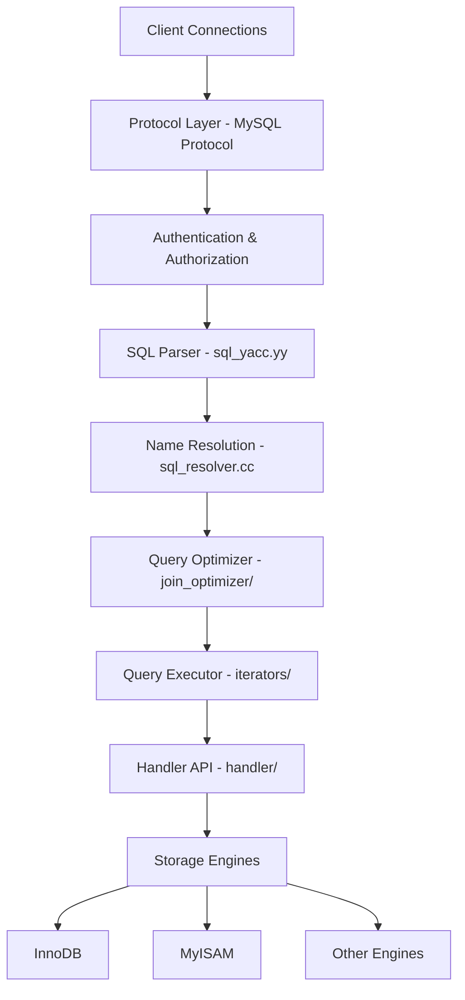
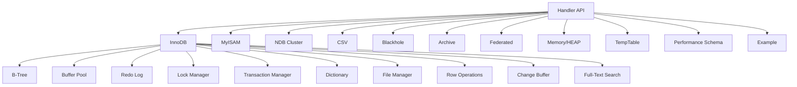

<cite>
**Referenced Files**
- [CMakeLists.txt](file://CMakeLists.txt)
- [MYSQL_VERSION](file://MYSQL_VERSION)
- [README](file://README)
- [sql/mysqld.cc](file://sql/mysqld.cc)
- [sql/sql_parse.cc](file://sql/sql_parse.cc)
</cite>

## Table of Contents
1. [Introduction](#introduction)
2. [Project Structure](#project-structure)
3. [Core Architecture Layers](#core-architecture-layers)
4. [Key Subsystems](#key-subsystems)
5. [Storage Engine Architecture](#storage-engine-architecture)
6. [Build System](#build-system)
7. [Dependencies](#dependencies)

## Introduction

MySQL Server 9.6.0 (Innovation release) is the world's most popular open-source relational database server. Developed by Oracle and its affiliates, it provides a robust, high-performance SQL database engine supporting ACID transactions, replication, partitioning, and a pluggable storage engine architecture.

The server process (`mysqld`) implements the MySQL client/server protocol and handles SQL query parsing, optimization, execution, and result delivery. It supports multiple concurrent connections, each managed by a dedicated thread, with comprehensive authentication, authorization, and auditing capabilities.

**Sources** · [README](file://README) · [MYSQL_VERSION](file://MYSQL_VERSION)

## Project Structure

```mermaid
graph TB
    ROOT[mysql-server]
    ROOT --> SQL[sql/ - SQL Layer]
    ROOT --> STORAGE[storage/ - Storage Engines]
    ROOT --> CLIENT[client/ - Client Programs]
    ROOT --> LIBMYSQL[libmysql/ - Client Library]
    ROOT --> MYSYS[mysys/ - System Abstraction]
    ROOT --> STRINGS[strings/ - Character Sets]
    ROOT --> VIO[vio/ - Virtual I/O]
    ROOT --> PLUGIN[plugin/ - Plugins]
    ROOT --> COMPONENTS[components/ - Components]
    ROOT --> ROUTER[router/ - MySQL Router]
    ROOT --> INCLUDE[include/ - Public Headers]
    ROOT --> EXTRA[extra/ - Third-party Libs]
    ROOT --> TEST[mysql-test/ - Test Suite]

    SQL --> SQL_AUTH[auth/ - Authentication]
    SQL --> SQL_BINLOG[binlog/ - Binary Log]
    SQL --> SQL_DD[dd/ - Data Dictionary]
    SQL --> SQL_ITERATORS[iterators/ - Row Iterators]
    SQL --> SQL_OPTIMIZER[join_optimizer/ - Query Optimizer]
    SQL --> SQL_CONN[conn_handler/ - Connection Handling]
    SQL --> SQL_GIS[gis/ - Spatial/GIS]
    SQL --> SQL_PARTITIONING[partitioning/ - Partitioning]

    STORAGE --> INNODB[innobase/ - InnoDB]
    STORAGE --> MYISAM[myisam/ - MyISAM]
    STORAGE --> NDB[ndb/ - NDB Cluster]
    STORAGE --> TEMPTABLE[temptable/ - Temp Tables]
    STORAGE --> PERFSCHEMA[perfschema/ - Performance Schema]
```

**Sources** · [CMakeLists.txt:1-150](file://CMakeLists.txt#L1-L150)

## Core Architecture Layers

The MySQL server follows a layered architecture:

1. **Connection Layer** (`sql/conn_handler/`): Accepts client connections via TCP/IP sockets, named pipes, shared memory, or Unix domain sockets. Uses a per-thread connection model (`Per_thread_connection_handler`) with thread caching.

2. **Protocol Layer**: Implements the MySQL client/server protocol for query exchange, result set delivery, and prepared statement handling.

3. **Authentication Layer** (`sql/auth/`): Handles user authentication (SHA-256, caching_sha2_password, LDAP, Kerberos, FIDO2/WebAuthn, multi-factor authentication), ACL management, roles, and privilege checking.

4. **SQL Parser** (`sql/sql_yacc.yy`): A Bison-generated LALR(1) parser that converts SQL text into internal AST (Abstract Syntax Tree) representations.

5. **Name Resolution** (`sql/sql_resolver.cc`): Resolves table/column references, performs semantic analysis, and validates SQL against the data dictionary.

6. **Query Optimizer** (`sql/join_optimizer/`): The cost-based optimizer that determines optimal join order, access methods, and execution plans. Includes the hypergraph join optimizer, range optimizer, and various cost model components.

7. **Query Executor** (`sql/iterators/`): Volcano-model iterator executor that processes rows through a tree of iterators (scan, join, sort, aggregate, window, etc.).

8. **Handler API**: The storage engine abstraction interface that allows pluggable storage engines to implement table operations.

**Sources** · [sql/mysqld.cc:80-200](file://sql/mysqld.cc#L80-L200) · [sql/sql_parse.cc:1-100](file://sql/sql_parse.cc#L1-L100) · [sql/conn_handler/connection_handler_impl.h:1-80](file://sql/conn_handler/connection_handler_impl.h#L1-L80)

## Key Subsystems

### Data Dictionary (DD)
The transactional data dictionary (`sql/dd/`) stores metadata about database objects (tables, columns, indexes, views, routines, triggers, events) in internal InnoDB tables, replacing the legacy FRM/MYI/MYD file-based metadata.

### Binary Log & Replication
The binary log subsystem (`sql/binlog/`, `libbinlogevents/`) records all data-changing operations for replication and point-in-time recovery. Supports group commit for performance and integrates with the replication framework.

### Server Component Architecture
The component infrastructure (`components/`, `sql/server_component/`) provides a modern, modular approach to extending server functionality. Components communicate through well-defined service interfaces, replacing the older plugin API for many features. Key component categories include logging, keyrings, connection control, and telemetry.

### Performance Schema (PFS)
The Performance Schema (`storage/perfschema/`, `include/pfs_*.h`) instruments the server with wait events, stage events, statement events, memory usage, and metadata locks for runtime monitoring and diagnostics.

### Plugin System
The plugin architecture (`plugin/`) supports server-side extensions including:
- **Authentication plugins**: caching_sha2_password, auth_socket, LDAP, Kerberos
- **Group Replication**: Multi-primary and single-primary cluster replication
- **Clone Plugin**: Physical data copy for provisioning and replication setup
- **Audit Plugins**: Event auditing and compliance logging
- **Semisync Replication**: Semi-synchronous replication for improved durability
- **X Plugin**: Document store access via X Protocol

### Client Programs
The client tools (`client/`) include:
- `mysql` — Interactive SQL shell
- `mysqldump` — Logical backup utility
- `mysqladmin` — Server administration
- `mysqlbinlog` — Binary log utility
- `mysqlimport` — Bulk data import
- `mysqlshow` — Database/table information
- `mysqlslap` — Load simulation and benchmarking
- `mysql_config_editor` — Login path management
- `mysql_secure_installation` — Security hardening

**Sources** · [sql/dd/dd.h](file://sql/dd/dd.h) · [sql/binlog/](file://sql/binlog/) · [components/](file://components/) · [plugin/](file://plugin/) · [client/](file://client/)

## Storage Engine Architecture

MySQL supports a pluggable storage engine architecture. The primary engines include:

- **InnoDB** (`storage/innobase/`): The default transactional storage engine with MVCC, row-level locking, foreign keys, crash recovery, and clustered indexes. Internally organized into subsystems: B-tree (`btr/`), buffer pool (`buf/`), redo log (`log/`), lock manager (`lock/`), transaction manager (`trx/`), data dictionary (`dict/`), file manager (`fil/`), and row operations (`row/`).

- **MyISAM** (`storage/myisam/`): Non-transactional engine optimized for read-heavy workloads with full-text indexing and table-level locking.

- **NDB** (`storage/ndb/`): Distributed, shared-nothing cluster storage engine for MySQL Cluster.

- **TempTable** (`storage/temptable/`): Optimized engine for internal temporary tables.

- **Memory/HEAP** (`storage/heap/`): In-memory, non-persistent tables.

- **Performance Schema** (`storage/perfschema/`): Instrumentation engine for server monitoring.

**Sources** · [storage/innobase/CMakeLists.txt](file://storage/innobase/CMakeLists.txt) · [storage/](file://storage/)

## Build System

The project uses **CMake** (minimum version 3.17.5) as the build system, configured through the root [CMakeLists.txt](file://CMakeLists.txt).

Key build configuration options:
- `-DWITH_DEBUG=ON/OFF` — Enable debug builds with dbug/safemutex
- `-DCMAKE_BUILD_TYPE=Debug|Release|RelWithDebInfo` — Build type selection
- `-DMAX_INDEXES=<N>` — Maximum indexes per table (default 64)

Platform requirements:
- **Linux**: CMake ≥ 3.17.5, GCC or Clang
- **macOS**: CMake ≥ 3.19, Xcode support
- **Windows**: Windows 10+ / Server 2016+, Visual Studio 2019+, CMake ≥ 3.17.5

**Sources** · [CMakeLists.txt:1-150](file://CMakeLists.txt#L1-L150)

## Dependencies

Third-party libraries are bundled in the `extra/` directory:

| Library | Purpose |
|---------|---------|
| **Boost** | C++ utilities, geometry, program_options |
| **Abseil** | Google C++ common libraries |
| **Protobuf** | Protocol buffers for serialization |
| **RapidJSON** | JSON parsing and generation |
| **ICU** | Unicode and internationalization |
| **LZ4 / Zstd** | Compression algorithms |
| **zlib** | General-purpose compression |
| **curl** | HTTP client for cloud integration |
| **OpenSSL** (external) | TLS/SSL and cryptography |
| **libfido2 / libcbor** | FIDO2/WebAuthn authentication |
| **googletest** | Unit testing framework |
| **libedit** | Command-line editing |
| **xxhash** | Fast hashing algorithm |
| **gperftools** | Performance profiling (tcmalloc) |

**Sources** · [extra/](file://extra/)
