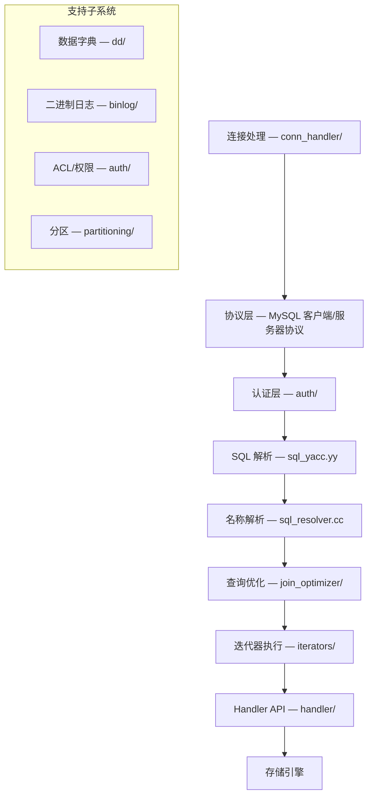
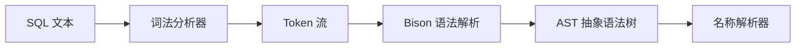
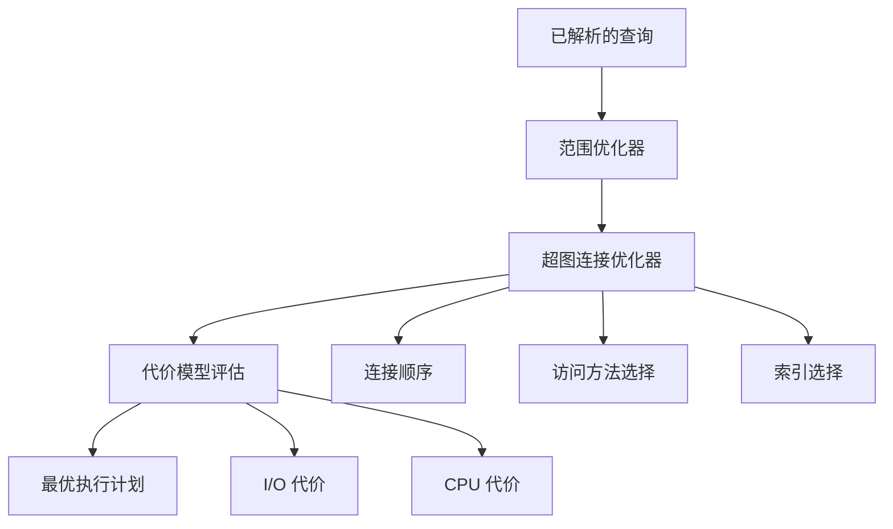
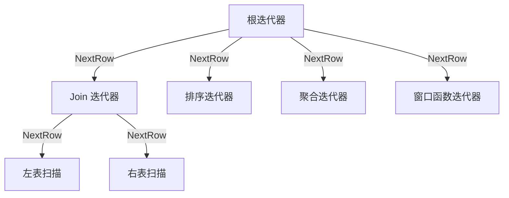
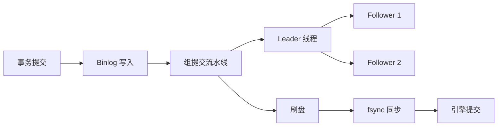

<cite>
**引用文件**
- [sql/mysqld.cc](file://sql/mysqld.cc)
- [sql/sql_parse.cc](file://sql/sql_parse.cc)
- [sql/sql_yacc.yy](file://sql/sql_yacc.yy)
- [sql/sql_resolver.cc](file://sql/sql_resolver.cc)
- [sql/handler.h](file://sql/handler.h)
- [sql/conn_handler/connection_handler_impl.h](file://sql/conn_handler/connection_handler_impl.h)
- [sql/join_optimizer/](file://sql/join_optimizer/)
- [sql/iterators/](file://sql/iterators/)
- [sql/dd/](file://sql/dd/)
- [sql/binlog/](file://sql/binlog/)
- [sql/auth/](file://sql/auth/)
</cite>

## 目录
1. [SQL 层概述](#sql-层概述)
2. [处理流水线架构](#处理流水线架构)
3. [连接管理](#连接管理)
4. [SQL 解析器](#sql-解析器)
5. [名称解析与语义分析](#名称解析与语义分析)
6. [查询优化器](#查询优化器)
7. [查询执行器（迭代器模型）](#查询执行器迭代器模型)
8. [数据字典](#数据字典)
9. [二进制日志](#二进制日志)
10. [认证与授权](#认证与授权)
11. [共享代码层](#共享代码层)
12. [编码规范](#编码规范)

## SQL 层概述

SQL 层（`sql/` 目录）是 MySQL Server 的核心，实现了完整的 SQL 查询生命周期。它负责连接管理、SQL 解析（通过 Bison 生成的解析器 `sql_yacc.yy`）、语义分析与名称解析（`sql_resolver.cc`）、基于代价的查询优化（`join_optimizer/`）、以及通过 Volcano 模型迭代器树逐行执行（`iterators/`）。

此外，SQL 层还管理：
- 数据字典（`dd/`）
- 二进制日志（`binlog/`）
- 认证与授权（`auth/`）
- 分区（`partitioning/`）
- 复制支持
- 存储程序（存储过程、函数、触发器、事件）
- 视图
- 服务器组件基础设施

关键入口文件：
- `mysqld.cc` — 服务器守护进程主函数
- `sql_parse.cc` — 命令分发
- `sql_select.cc` — SELECT 执行

**Sources** · [sql/mysqld.cc:1-200](file://sql/mysqld.cc#L1-L200) · [sql/sql_parse.cc:1-100](file://sql/sql_parse.cc#L1-L100)

## 处理流水线架构

SQL 层遵循分层处理流水线架构，一条 SQL 查询的完整处理路径：

各层详细说明：

### 1. 连接处理
`conn_handler/` 目录实现连接生命周期管理。采用每线程一连接模型（`Per_thread_connection_handler`），支持线程缓存以减少创建开销。`Connection_handler_manager` 编排连接的创建、调度和销毁。支持的传输方式：
- TCP/IP 套接字
- 命名管道（Windows）
- 共享内存（Windows）
- Unix 域套接字（Linux/macOS）

### 2. 协议层
实现 MySQL 客户端/服务器协议，处理查询交互、结果集传输、预处理语句和批量操作。协议代码与客户端库共享（位于 `sql-common/`），确保服务器端和客户端的一致性。

### 3. 认证层
`auth/` 目录处理身份验证和权限管理，支持多种认证方式：
- `caching_sha2_password`（默认）
- SHA-256 密码认证
- LDAP 认证
- Kerberos 认证
- FIDO2/WebAuthn 设备认证
- 多因子认证（MFA）
- ACL 表存储在数据字典中
- 基于角色的访问控制（RBAC），支持部分撤销

**Sources** · [sql/conn_handler/connection_handler_impl.h:1-80](file://sql/conn_handler/connection_handler_impl.h#L1-L80)

## SQL 解析器

SQL 解析器（`sql/sql_yacc.yy`，约 600KB）是一个 Bison 生成的 LALR(1) 解析器：

- **词法分析**：将 SQL 文本分解为 Token（关键字、标识符、字面量、运算符）
- **语法分析**：Bison 根据 LALR(1) 语法规则构建 AST
- **AST 节点类型**：PT_* 前缀的解析树类型（Parse Tree）
- **输出**：结构化的 AST 传递给名称解析器进行后续处理

**Sources** · [sql/sql_yacc.yy](file://sql/sql_yacc.yy)

## 名称解析与语义分析

名称解析器（`sql/sql_resolver.cc`，约 356KB）负责：

1. **表引用解析**：将 SQL 中的表名映射到数据字典中的表定义
2. **列引用解析**：解析列名并绑定到对应的表定义
3. **语义验证**：检查类型兼容性、函数参数、聚合函数使用等
4. **常量传播**：在编译期计算常量表达式
5. **谓词下推**：将过滤条件下推到尽可能低的执行层

**Sources** · [sql/sql_resolver.cc](file://sql/sql_resolver.cc)

## 查询优化器

查询优化器（`sql/join_optimizer/`）是一个基于代价的优化器：

### 核心组件

| 组件 | 文件 | 大小 | 说明 |
|------|------|------|------|
| 连接优化器 | `join_optimizer.cc` | ~424KB | 主优化器逻辑 |
| 超图构建 | `make_join_hypergraph.cc` | ~170KB | 构建超图连接模型 |
| 代价模型 | `cost_model.cc` | ~77KB | I/O 和 CPU 代价计算 |
| 范围优化器 | `range_optimizer/` | — | 索引范围扫描优化 |

### 优化策略

- **超图连接优化器**：使用超图模型探索所有可能的连接顺序，选择代价最低的方案
- **范围优化器**：识别可利用索引的等值和范围条件
- **Interesting Order 跟踪**：追踪排序属性，避免不必要的排序操作
- **访问路径生成**：为每个表选择最优的访问方法（全表扫描、索引扫描、ref 访问等）

**Sources** · [sql/join_optimizer/](file://sql/join_optimizer/)

## 查询执行器（迭代器模型）

查询执行器（`sql/iterators/`）采用 Volcano 模型的拉取式执行：

### 迭代器类型

| 类型 | 说明 |
|------|------|
| 表扫描迭代器 | 全表顺序扫描 |
| Ref 访问迭代器 | 基于索引的等值查找 |
| 哈希连接迭代器 | Hash Join 实现 |
| BKA 迭代器 | Block Nested Loop / Batch Key Access |
| 排序迭代器 | 文件排序（filesort） |
| 聚合迭代器 | GROUP BY 聚合计算 |
| 窗口迭代器 | 窗口函数计算 |
| DML 迭代器 | INSERT/UPDATE/DELETE 操作 |

执行流程：迭代器树从根到叶逐层调用 `ReadRow()` 方法，每次调用返回一行数据，直到数据耗尽。

**Sources** · [sql/iterators/](file://sql/iterators/)

## 数据字典

事务型数据字典（`sql/dd/`）是 MySQL 8.0+ 引入的核心基础设施：

- **存储方式**：使用内部 InnoDB 表存储元数据，取代了传统的 FRM/MYI/MYD 文件
- **事务性**：DDL 操作具有原子性，可以回滚
- **缓存**：`dd/cache/` 提供元数据缓存，减少磁盘 I/O
- **类型定义**：`dd/types/` 定义数据库对象类型（Table、Column、Index、View、Routine、Trigger、Event）
- **信息模式**：`dd/info_schema/` 和 `dd/performance_schema/` 提供 INFORMATION_SCHEMA 和 PERFORMANCE_SCHEMA 视图

**Sources** · [sql/dd/](file://sql/dd/)

## 二进制日志

二进制日志子系统（`sql/binlog/`）记录所有数据变更操作：

关键特性：
- **组提交（Group Commit）**：Leader/Follower 模型，将多个事务的 binlog 写入合并为一次刷盘操作
- **事件格式**：由 `libbinlogevents/` 库定义，确保服务器和工具间的格式一致性
- **复制集成**：binlog 事件流传输到从服务器进行复制
- **时间点恢复**：通过 `mysqlbinlog` 工具回放 binlog 事件

**Sources** · [sql/binlog/](file://sql/binlog/) · [libbinlogevents/](file://libbinlogevents/)

## 认证与授权

认证与授权系统（`sql/auth/`）提供完整的安全基础设施：

### 认证插件

| 插件 | 说明 |
|------|------|
| `caching_sha2_password` | 默认认证插件，SHA-256 哈希 + 缓存 |
| `sha256_password` | SHA-256 密码认证 |
| `auth_socket` | Unix 套接字对等认证 |
| `authentication_ldap_sasl` | LDAP SASL 认证 |
| `authentication_ldap_simple` | LDAP 简单绑定认证 |
| `authentication_kerberos` | Kerberos/GSSAPI 认证 |
| `authentication_fido` | FIDO2/WebAuthn 设备认证 |
| `authentication_openid_connect` | OpenID Connect 认证 |

### 授权模型

- ACL（访问控制列表）存储在数据字典的系统表中
- 支持全局、数据库、表、列级别的权限
- 角色（Role）支持，可批量授权
- 部分撤销（Partial Revokes）功能
- 多因子认证（最多 3 个因素）

**Sources** · [sql/auth/](file://sql/auth/)

## 共享代码层

`sql-common/` 目录包含服务器（`mysqld`）和客户端库（`libmysqlclient`）共享的代码，避免客户端/服务器协议两侧的代码重复：

| 模块 | 文件 | 说明 |
|------|------|------|
| 客户端协议 | `client.cc`（~347KB） | 客户端侧协议实现 |
| 网络服务 | `net_serv.cc`（~79KB） | 网络传输层 |
| JSON 子系统 | `json_dom.cc`、`json_binary.cc`、`json_path.cc` | 核心 JSON 数据模型 |
| 客户端认证 | `client_authentication.cc` | 客户端认证实现 |
| 十进制运算 | `my_decimal.cc` | DECIMAL 类型操作 |
| 参数绑定 | `bind_params.cc` | 预处理语句参数绑定 |

**Sources** · [sql-common/](file://sql-common/)

## 编码规范

SQL 层遵循严格的编码规范：

- 新代码遵循 Google C++ 风格，成员变量使用 `m_` 前缀（非静态）或 `s_` 前缀（静态）
- 类名使用 PascalCase（如 `Per_thread_connection_handler`）；遗留代码使用 `My_class` 风格
- 函数名使用 snake_case（如 `dispatch_command`、`mysql_execute_command`）
- Doxygen 注释使用 `/** ... */` 语法配合 `@` 命令
- clang-format 强制统一代码格式
- `DBUG_ENTER/DBUG_RETURN` 宏用于所有主要函数的调试跟踪
- 错误报告使用 `LogErr` 宏和 `my_error()` 函数，配合 `ER_*` 错误码
- `THD`（Thread Handler Descriptor）是核心的每连接上下文对象，贯穿整个查询执行路径
- `MEM_ROOT` 用于查询作用域的内存分配；避免在查询处理中使用原始的 new/delete
- 热路径同步优先使用无锁数据结构和原子操作

**Sources** · [sql/mysqld.cc:80-200](file://sql/mysqld.cc#L80-L200)
