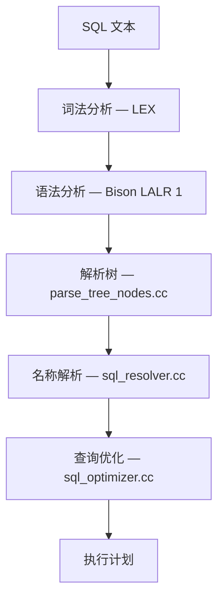
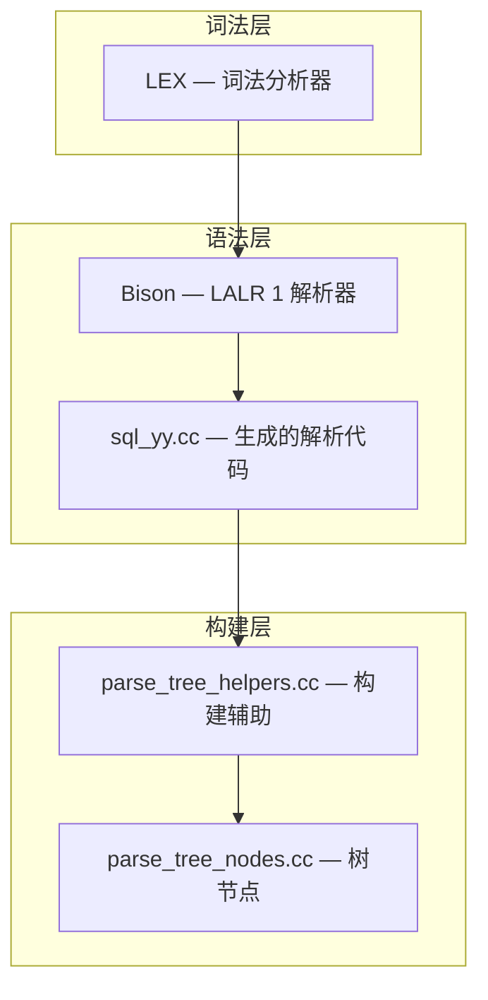
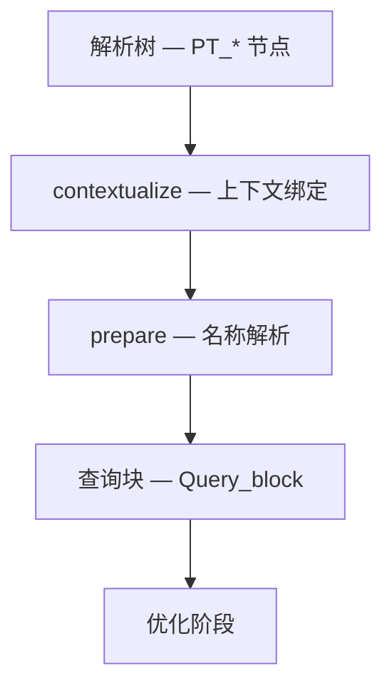
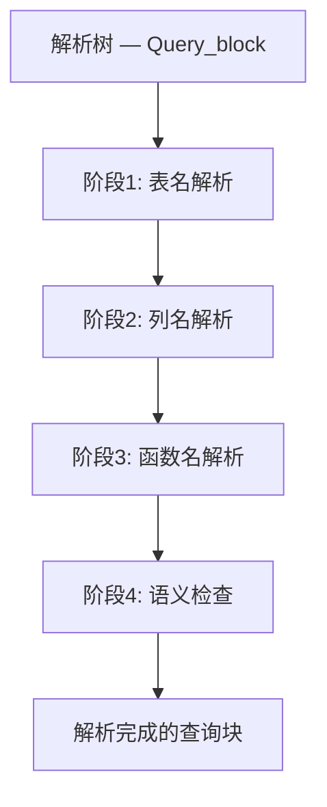
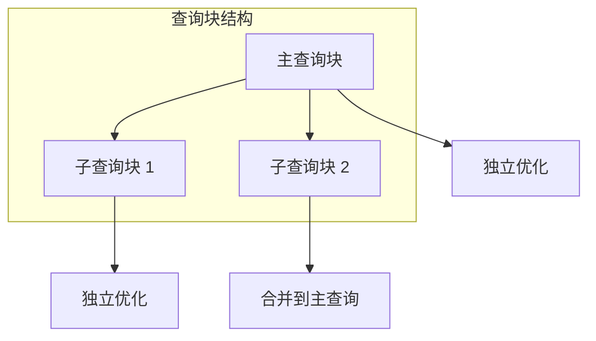

<cite>
**引用文件**
- [sql/sql_parse.cc](file://sql/sql_parse.cc)
- [sql/sql_resolver.cc](file://sql/sql_resolver.cc)
- [sql/sql_optimizer.cc](file://sql/sql_optimizer.cc)
- [sql/parse_tree_nodes.cc](file://sql/parse_tree_nodes.cc)
- [sql/parse_tree_helpers.cc](file://sql/parse_tree_helpers.cc)
- [sql/item.cc](file://sql/item.cc)
- [sql/table.cc](file://sql/table.cc)
</cite>

## 目录
1. [SQL 处理流水线](#sql-处理流水线)
2. [词法分析](#词法分析)
3. [语法分析（Bison 解析器）](#语法分析bison-解析器)
4. [解析树构建](#解析树构建)
5. [名称解析](#名称解析)
6. [查询重写与优化准备](#查询重写与优化准备)

## SQL 处理流水线

从接收 SQL 文本到生成执行计划，查询经历多个阶段。三个核心文件构成了这条流水线的主体：

| 文件 | 大小 | 职责 |
|------|------|------|
| `sql_parse.cc` | ~276KB | SQL 解析入口 — 词法分析、语法分析、分发 |
| `sql_resolver.cc` | ~347KB | 名称解析 — 符号引用绑定、语义分析 |
| `sql_optimizer.cc` | ~455KB | 查询优化 — 逻辑转换、连接优化、代价评估 |



**Sources** · [sql/sql_parse.cc](file://sql/sql_parse.cc)

## 词法分析

MySQL 的词法分析器（`sql_lex.cc`）将 SQL 文本转换为令牌（Token）序列：

### 令牌类型

| 类型 | 示例 |
|------|------|
| **关键字** | `SELECT`, `FROM`, `WHERE`, `JOIN` |
| **标识符** | 表名、列名（可被反引号包围） |
| **字面量** | 字符串 `'hello'`、数字 `42`、二进制 `0xFF` |
| **运算符** | `=`, `<`, `>`, `+`, `-`, `AND`, `OR` |
| **标点** | `(`, `)`, `,`, `;` |

### 特殊处理

- **反引号标识符** — 允许使用保留字作为标识符：`` `SELECT` ``
- **用户变量** — `@var_name` 以 `@` 前缀
- **系统变量** — `@@global.var_name` 以 `@@` 前缀
- **注释** — `--` 和 `/* */` 以及 `#`
- **字符集前缀** — `_utf8mb4'字符串'`

**Sources** · [sql/sql_lex.cc](file://sql/sql_lex.cc)

## 语法分析（Bison 解析器）

MySQL 使用 GNU Bison 生成的 LALR(1) 解析器。语法定义在 `.y` 文件中，生成的解析器代码位于 `sql_yy.cc`：

### 解析器架构



### 语义动作

Bison 规则中的语义动作（Action）在匹配到对应语法结构时执行：

```
// 简化的 Bison 规则示例
select_stmt:
    SELECT select_list FROM table_ref optional_where
    {
        // 语义动作：构建 SELECT 解析树节点
        $$ = NEW_PTN PT_select($2, $4, $5);
    }
;
```

### 语法扩展

Bison 解析器支持丰富的 MySQL 语法扩展：
- `LIMIT` / `OFFSET` 子句
- `ON DUPLICATE KEY UPDATE`
- `REPLACE INTO`
- `LOAD DATA INFILE`
- `SHOW` / `DESCRIBE` / `EXPLAIN` 语句

**Sources** · [sql/sql_parse.cc](file://sql/sql_parse.cc) · [sql/parse_tree_helpers.cc](file://sql/parse_tree_helpers.cc)

## 解析树构建

解析树（Parse Tree）是语法分析的直接产物，`parse_tree_nodes.cc` 定义了节点类型：

### 核心节点类型

| 节点类型 | 对应 SQL 结构 |
|---------|--------------|
| `PT_select` | SELECT 语句 |
| `PT_insert` | INSERT 语句 |
| `PT_update` | UPDATE 语句 |
| `PT_delete` | DELETE 语句 |
| `PT_table_factor` | 表引用 |
| `PT_join_table` | JOIN 表达式 |
| `PT_expr` | 表达式 |
| `PT_function_call` | 函数调用 |
| `PT_window` | 窗口规范 |
| `PT_with_clause` | WITH / CTE |

### 解析树到查询块的转换



**Sources** · [sql/parse_tree_nodes.cc](file://sql/parse_tree_nodes.cc)

## 名称解析

`sql_resolver.cc`（~347KB）是 MySQL 中最复杂的组件之一，负责将 SQL 中的符号引用绑定到具体的数据库对象：

### 名称解析阶段



### 表名解析

- 检查 FROM 子句中的表引用
- 查询数据字典获取表定义
- 创建 `TABLE_LIST` 对象
- 处理别名和派生表

### 列名解析

- 遍历 SELECT / WHERE / GROUP BY / HAVING / ORDER BY 中的列引用
- 在已解析的表列表中查找匹配列
- 处理歧义引用（多表中同名列）
- 绑定 `Item_field` 到 `Field` 对象

### 语义检查

| 检查项 | 说明 |
|--------|------|
| 类型兼容性 | 运算符两侧的类型 |
| GROUP BY 一致性 | SELECT 列必须在 GROUP BY 中 |
| ONLY_FULL_GROUP_BY | 严格模式下的分组检查 |
| 函数参数 | 参数数量和类型 |
| 子查询引用 | 外部引用的有效性 |

**Sources** · [sql/sql_resolver.cc](file://sql/sql_resolver.cc)

## 查询重写与优化准备

`sql_optimizer.cc`（~455KB）在名称解析之后进行查询优化：

### 优化阶段

| 阶段 | 说明 |
|------|------|
| **逻辑优化** | 常量折叠、谓词下推、子查询展开、外连接消除 |
| **物理优化** | 连接顺序选择、访问路径选择、索引选择 |
| **代价评估** | 对每个候选计划计算 I/O 和 CPU 代价 |
| **计划生成** | 选择代价最低的执行计划 |

### 关键转换

```sql
-- 子查询展开为 JOIN（优化器自动完成）
-- 原始查询
SELECT * FROM orders WHERE customer_id IN
  (SELECT id FROM customers WHERE region = '北京');

-- 优化后（等价转换）
SELECT o.* FROM orders o
JOIN customers c ON o.customer_id = c.id
WHERE c.region = '北京';
```

### 查询块（Query Block）

查询块是优化器处理的基本单位：

| 类型 | 说明 |
|------|------|
| 主查询块 | 顶层 SELECT |
| 子查询块 | 嵌套在 WHERE/FROM 中的子查询 |
| 联合查询块 | UNION 的各个分支 |
| CTE 引用块 | WITH 子句中的 CTE 定义 |



**Sources** · [sql/sql_optimizer.cc](file://sql/sql_optimizer.cc)
