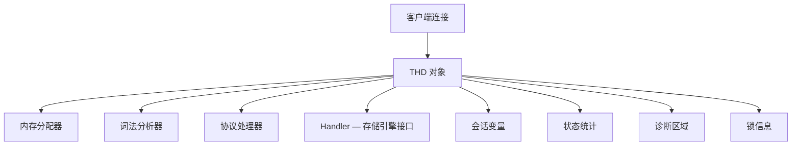
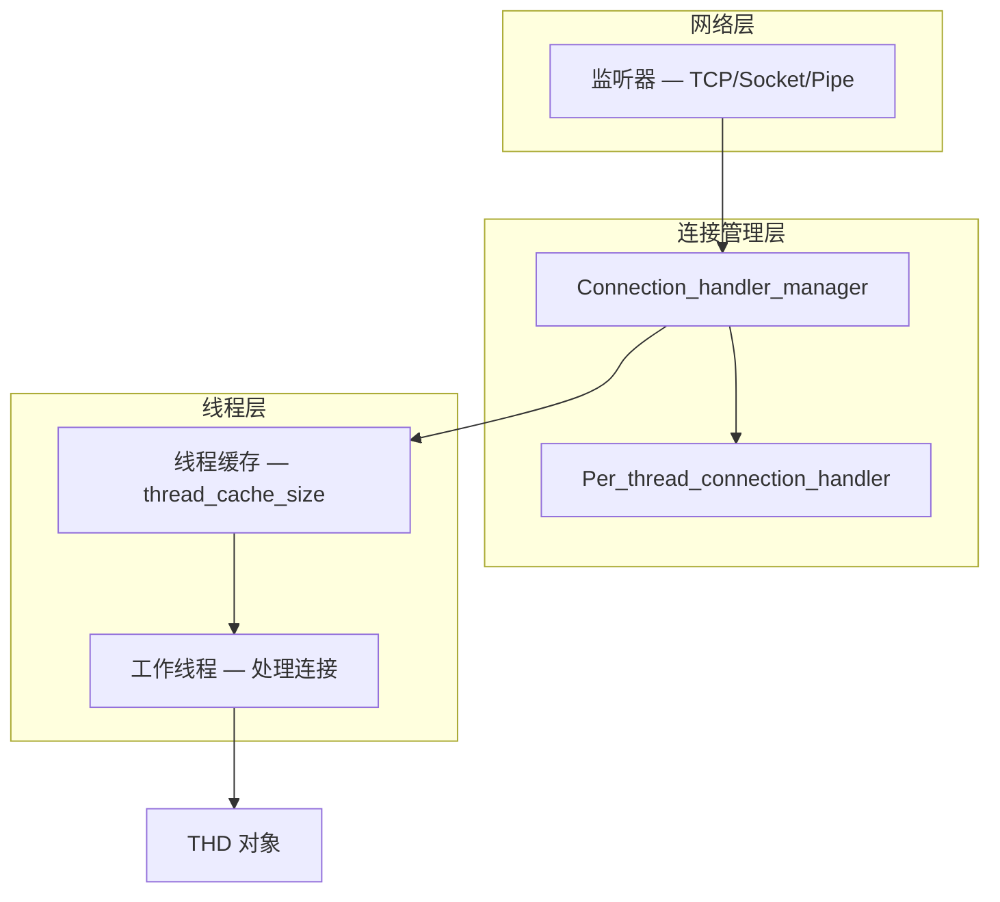
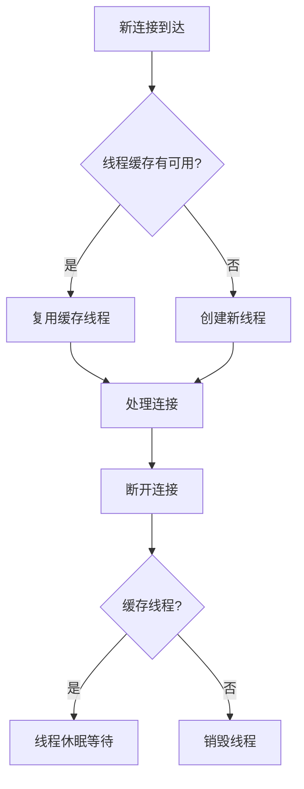
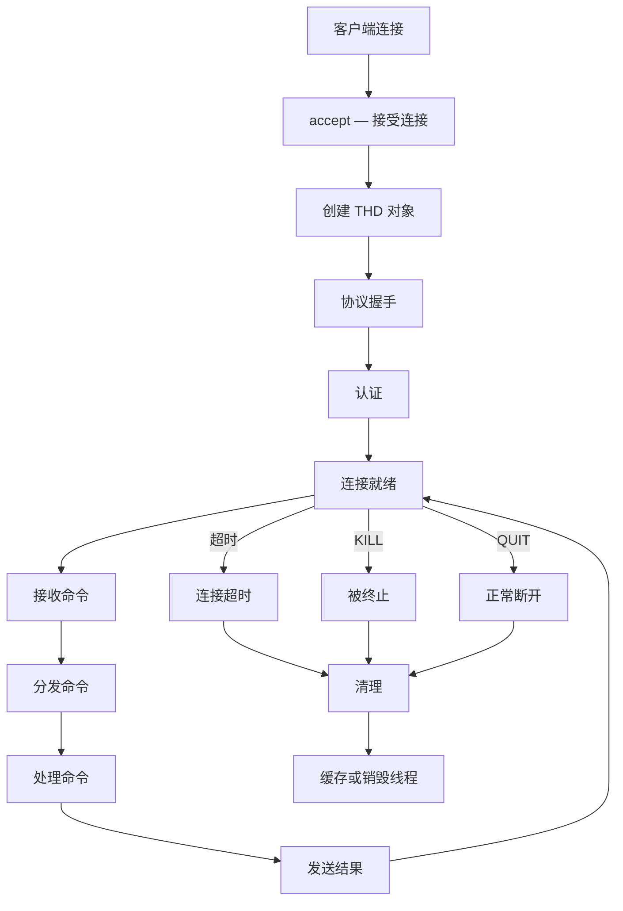
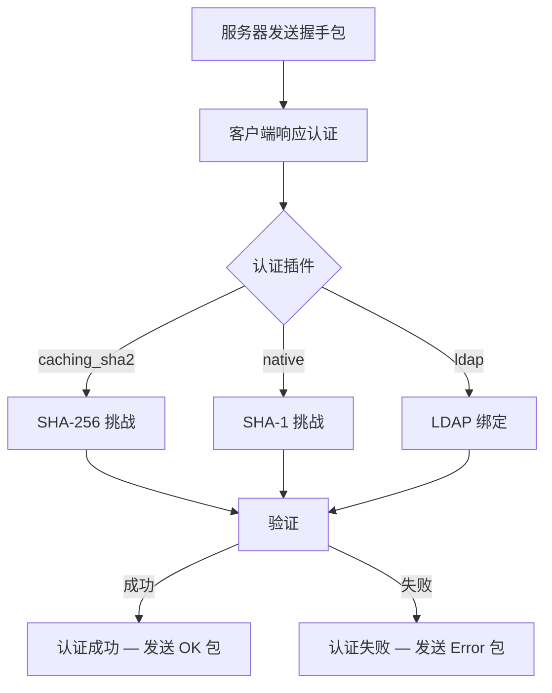

<cite>
**引用文件**
- [sql/sql_class.cc](file://sql/sql_class.cc)
- [sql/mysqld_thd_manager.cc](file://sql/mysqld_thd_manager.cc)
- [sql/conn_handler/connection_handler_manager.cc](file://sql/conn_handler/connection_handler_manager.cc)
- [sql/conn_handler/connection_handler_per_thread.cc](file://sql/conn_handler/connection_handler_per_thread.cc)
- [sql/conn_handler/socket_connection.cc](file://sql/conn_handler/socket_connection.cc)
</cite>

## 目录
1. [THD 概述](#thd-概述)
2. [THD 类结构](#thd-类结构)
3. [连接管理器](#连接管理器)
4. [连接处理模型](#连接处理模型)
5. [连接生命周期](#连接生命周期)
6. [连接监控与管理](#连接监控与管理)

## THD 概述

THD（Thread Handler Data）是 MySQL 中最核心的类之一，定义在 `sql/sql_class.cc`（~129KB）中。每个客户端连接对应一个 THD 对象，贯穿连接的整个生命周期：



**Sources** · [sql/sql_class.cc](file://sql/sql_class.cc)

## THD 类结构

### 核心成员

| 成员 | 类型 | 说明 |
|------|------|------|
| `m_mem_root` | `MEM_ROOT` | 会话内存分配器 |
| `m_protocol` | `Protocol*` | 通信协议（Classic/Binary） |
| `lex` | `LEX*` | 词法分析器状态 |
| `variables` | `st_mysql_var` | 会话系统变量 |
| `status_var` | `STATUS_VAR` | 会话状态变量 |
| `diagnostics_area` | `Diagnostics_area` | 错误和警告信息 |
| `ha_data[]` | `Ha_trx_info[]` | 存储引擎事务信息 |
| `query()` | `const char*` | 当前查询文本 |
| `thread_id()` | `ulong` | 连接 ID |
| `security_context()` | `Security_context*` | 权限上下文 |

### THD 关键字段

| 字段 | 说明 |
|------|------|
| `killed` | 连接终止标志（KILL 命令） |
| `in_lock_tables` | 是否在 LOCK TABLES 模式 |
| `transaction` | 事务状态 |
| `open_tables` | 当前打开的表列表 |
| `warning_list` | 警告和错误列表 |
| `user_time` | 查询执行时间 |
| `start_utime` | 命令开始时间 |

**Sources** · [sql/sql_class.cc](file://sql/sql_class.cc)

## 连接管理器

`mysqld_thd_manager.cc` 和 `conn_handler/connection_handler_manager.cc` 管理服务器端的连接：

### 连接管理层次



### 连接限制

| 参数 | 默认值 | 说明 |
|------|--------|------|
| `max_connections` | 151 | 最大同时连接数 |
| `max_user_connections` | 0 | 单用户最大连接数（0=无限） |
| `max_connect_errors` | 100 | 连续失败后阻止主机 |
| `thread_cache_size` | 9 | 缓存的断开线程数 |
| `wait_timeout` | 28800 | 空闲连接超时（秒） |
| `interactive_timeout` | 28800 | 交互式连接超时 |
| `net_read_timeout` | 30 | 网络读超时 |
| `net_write_timeout` | 60 | 网络写超时 |

**Sources** · [sql/mysqld_thd_manager.cc](file://sql/mysqld_thd_manager.cc) · [sql/conn_handler/connection_handler_manager.cc](file://sql/conn_handler/connection_handler_manager.cc)

## 连接处理模型

### 每线程模型（默认）

`connection_handler_per_thread.cc`（~15KB）实现 MySQL 默认的连接处理模型：



### 线程池模型

MySQL 企业版支持线程池（Thread Pool），通过插件实现：

| 特性 | 每线程模型 | 线程池模型 |
|------|-----------|-----------|
| 线程数 | = 连接数 | 固定数量（CPU 核心） |
| 上下文切换 | 多 | 少 |
| 内存 | 每连接 ~2MB | 共享 |
| 适用场景 | 低并发 | 高并发 |

**Sources** · [sql/conn_handler/connection_handler_per_thread.cc](file://sql/conn_handler/connection_handler_per_thread.cc)

## 连接生命周期

### 完整生命周期



### 认证阶段



**Sources** · [sql/conn_handler/socket_connection.cc](file://sql/conn_handler/socket_connection.cc)

## 连接监控与管理

### 查看连接

```sql
-- 查看所有连接
SHOW PROCESSLIST;
SHOW FULL PROCESSLIST;

-- 通过 Performance Schema 查看
SELECT * FROM performance_schema.threads
WHERE TYPE = 'FOREGROUND';

-- 查看连接统计
SELECT * FROM performance_schema.host_cache;

-- 查看连接错误
SELECT * FROM performance_schema.host_cache
WHERE COUNT_HOST_BLOCKED_ERRORS > 0;
```

### 管理连接

```sql
-- 终止连接
KILL CONNECTION 12345;       -- 断开连接
KILL QUERY 12345;            -- 终止当前查询

-- 查看连接变量
SHOW STATUS LIKE 'Threads_%';
SHOW STATUS LIKE 'Connections';
SHOW STATUS LIKE 'Aborted_%';
SHOW STATUS LIKE 'Max_used_connections';
```

### 连接指标

| 指标 | 说明 |
|------|------|
| `Threads_connected` | 当前连接数 |
| `Threads_running` | 当前活跃查询数 |
| `Threads_cached` | 缓存线程数 |
| `Threads_created` | 历史创建线程总数 |
| `Connections` | 历史连接总次数 |
| `Aborted_connects` | 失败连接数 |
| `Aborted_clients` | 客户端异常断开数 |
| `Max_used_connections` | 历史最大连接数 |

**Sources** · [sql/sql_class.cc](file://sql/sql_class.cc) · [sql/mysqld_thd_manager.cc](file://sql/mysqld_thd_manager.cc)
