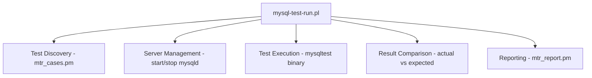

<cite>
**Referenced Files**
- [mysql-test/mysql-test-run.pl](file://mysql-test/mysql-test-run.pl)
- [mysql-test/lib/mtr_cases.pm](file://mysql-test/lib/mtr_cases.pm)
- [mysql-test/README](file://mysql-test/README)
- [unittest/CMakeLists.txt](file://unittest/CMakeLists.txt)
- [unittest/gunit/](file://unittest/gunit/)
</cite>

## Table of Contents
1. [Testing Overview](#testing-overview)
2. [MTR Framework](#mtr-framework)
3. [Test Organization](#test-organization)
4. [Writing Tests](#writing-tests)
5. [Unit Testing](#unit-testing)
6. [Sanitizer Integration](#sanitizer-integration)
7. [Debugging with MTR](#debugging-with-mtr)

## Testing Overview

MySQL Server uses a two-tier testing strategy:

1. **MTR (MySQL Test Runner)** — Integration/regression testing framework that starts real server instances and runs SQL test scripts against them
2. **Google Test (gtest)** — C++ unit tests for individual classes and functions, located in `unittest/gunit/`

MTR is the primary test infrastructure with thousands of test cases covering SQL semantics, replication, storage engines, security, and more. Unit tests complement MTR by testing internal C++ components in isolation.

**Sources** · [mysql-test/README](file://mysql-test/README)

## MTR Framework

MTR (`mysql-test-run.pl`, ~295KB Perl script) is the central test orchestrator:



**Key components:**
- **mysql-test-run.pl**: Main runner — handles parallelism, server lifecycle, test scheduling
- **lib/mtr_cases.pm** (~63KB): Test case discovery, filtering, and dependency resolution
- **lib/mtr_report.pm** (~30KB): Result formatting (pass/fail/skip output)
- **lib/mtr_process.pl**: Server process start/stop/crash detection
- **mysql-stress-test.pl** (~37KB): Concurrent stress testing with random test selection

The `mysqltest` binary (built from `client/mysqltest.cc`, ~389KB) is a specialized MySQL client that understands test commands beyond SQL: variable assignment, conditional execution, error expectation, file I/O, and synchronization.

**Sources** · [mysql-test/mysql-test-run.pl:1-50](file://mysql-test/mysql-test-run.pl#L1-L50) · [mysql-test/lib/mtr_cases.pm:1-30](file://mysql-test/lib/mtr_cases.pm#L1-L30)

## Test Organization

Tests are organized into suites, each targeting a specific feature area:

```
mysql-test/
├── t/          # Default suite test scripts (.test files)
├── r/          # Default suite expected results (.result files)
├── include/    # Shared include files (.inc)
├── suite/      # Feature-specific test suites
│   ├── innodb/        # InnoDB engine tests
│   ├── binlog/        # Binary log tests
│   ├── replication/   # Replication tests
│   ├── group_replication/  # Group replication tests
│   ├── clone/         # Clone plugin tests
│   ├── encryption/    # Data encryption tests
│   ├── gis/           # Spatial/GIS tests
│   ├── collations/    # Character set/collation tests
│   ├── parts/         # Partitioning tests
│   ├── optimizer_trace/  # Optimizer trace tests
│   └── ...            # 60+ more suites
├── std_data/   # Standard test data (certs, sample files)
└── collections/  # Batch test collection definitions
```

Each suite directory contains:
- `t/` — Test scripts
- `r/` — Expected result files
- `include/` — Suite-specific include files
- `suite.cfg` — Optional suite configuration (server options, requirements)

**Sources** · [mysql-test/suite/](file://mysql-test/suite/)

## Writing Tests

A basic MTR test file (`t/example.test`):

```sql
--source include/have_innodb.inc

CREATE TABLE t1 (id INT PRIMARY KEY, name VARCHAR(100)) ENGINE=InnoDB;
INSERT INTO t1 VALUES (1, 'hello'), (2, 'world');
SELECT * FROM t1 ORDER BY id;
DROP TABLE t1;
```

The corresponding result file (`r/example.result`) contains the expected output:

```
CREATE TABLE t1 (id INT PRIMARY KEY, name VARCHAR(100)) ENGINE=InnoDB;
INSERT INTO t1 VALUES (1, 'hello'), (2, 'world');
SELECT * FROM t1 ORDER BY id;
id	name
1	hello
2	world
DROP TABLE t1;
```

**Common test commands:**
- `--source include/have_*.inc` — Skip test if feature not available
- `--error ER_*` — Expect a specific error on the next statement
- `--let $var = value` — Set a test variable
- `--if (condition)` — Conditional execution
- `--disable_query_log` / `--enable_query_log` — Control logging
- `--sorted_result` — Sort result set before comparison
- `--replace_result` — Replace variable output with placeholders

**Option files:**
- `t/test_name.opt` — Extra server options for a specific test
- `t/test_name-master.opt` — Server options for the master in replication tests
- `t/test_name.cnf` — Server configuration overrides

**Sources** · [mysql-test/t/](file://mysql-test/t/) · [mysql-test/include/](file://mysql-test/include/)

## Unit Testing

Unit tests live in `unittest/` and use Google Test (gtest):

```
unittest/
├── gunit/           # Main unit test directory
│   ├── innodb/      # InnoDB-specific unit tests
│   ├── binlogevents/  # Binary log event tests
│   ├── changestreams/ # Change stream tests
│   ├── components/  # Component unit tests
│   ├── group_replication/  # GR unit tests
│   ├── temptable/   # TempTable engine tests
│   ├── locks/       # Locking tests
│   ├── memory/      # Memory allocator tests
│   └── *-t.cc       # Individual test files
├── mytap/           # TAP (Test Anything Protocol) tests
└── examples/        # Example unit tests
```

Unit test files follow the naming convention `*-t.cc` (e.g., `json_dom-t.cc`, `sql_parser-t.cc`). They are built as separate executables that link against the relevant MySQL libraries and can be run independently of MTR.

**Sources** · [unittest/gunit/](file://unittest/gunit/) · [unittest/CMakeLists.txt](file://unittest/CMakeLists.txt)

## Sanitizer Integration

MySQL's test infrastructure integrates with multiple sanitizers for detecting memory and threading issues:

| Sanitizer | Build Flag | Suppression File | Purpose |
|-----------|-----------|-----------------|---------|
| Valgrind | (runtime) | `valgrind.supp` (~49KB) | Memory errors, leaks |
| AddressSanitizer (ASan) | `-DWITH_ASAN=ON` | `asan.supp` | Buffer overflows, use-after-free |
| LeakSanitizer (LSan) | (with ASan) | `lsan.supp` | Memory leaks |
| ThreadSanitizer (TSan) | `-DWITH_TSAN=ON` | `tsan.supp` | Data races |
| UndefinedBehavior (UBSan) | `-DWITH_UBSAN=ON` | — | Undefined behavior |

MTR automatically detects sanitizer builds and applies the appropriate suppression files.

**Sources** · [mysql-test/valgrind.supp](file://mysql-test/valgrind.supp) · [mysql-test/asan.supp](file://mysql-test/asan.supp)

## Debugging with MTR

MTR supports attaching debuggers to the test server:

```bash
# GDB — stops at breakpoints, allows stepping
cd mysql-test && ./mtr --gdb innodb.test_name

# DDD — graphical debugger frontend
cd mysql-test && ./mtr --ddd innodb.test_name

# Manual debugging — start server with --manual-gdb
cd mysql-test && ./mtr --manual-gdb innodb.test_name
```

Good breakpoint targets for debugging (from `sql/mysqld.cc`):
- `my_message_sql` — Server error reporting
- `dispatch_command` — Command dispatch entry point
- `mysql_execute_command` — SQL command execution

**Sources** · [sql/mysqld.cc:80-88](file://sql/mysqld.cc#L80-L88)
