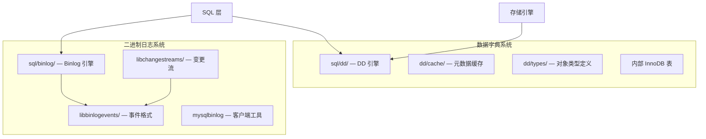
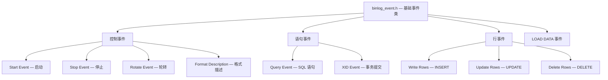
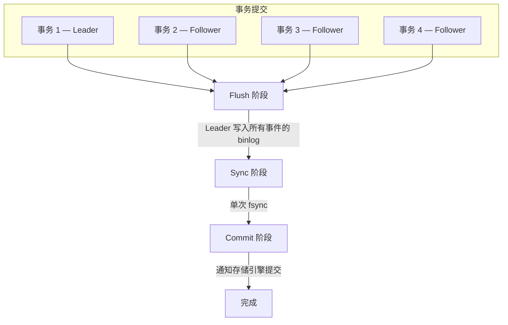
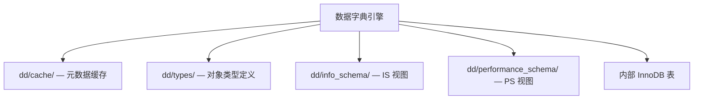

<cite>
**引用文件**
- [sql/binlog/](file://sql/binlog/)
- [sql/dd/](file://sql/dd/)
- [libbinlogevents/](file://libbinlogevents/)
- [libchangestreams/](file://libchangestreams/)
</cite>

## 目录
1. [概述](#概述)
2. [二进制日志系统](#二进制日志系统)
3. [Binlog 事件格式](#binlog-事件格式)
4. [组提交机制](#组提交机制)
5. [事务型数据字典](#事务型数据字典)
6. [数据字典缓存](#数据字典缓存)
7. [INFORMATION_SCHEMA 集成](#information_schema-集成)

## 概述

二进制日志和数据字典是 MySQL Server 的两个关键持久化子系统，分别负责数据变更记录和元数据管理：



**Sources** · [sql/binlog/](file://sql/binlog/) · [sql/dd/](file://sql/dd/)

## 二进制日志系统

### 用途

二进制日志（binlog）记录所有数据变更操作，服务于三个核心场景：

| 场景 | 说明 |
|------|------|
| **复制** | 主服务器的 binlog 传输到从服务器进行数据同步 |
| **时间点恢复** | 通过回放 binlog 恢复到指定时间点 |
| **审计** | 记录所有数据变更的完整历史 |

### Binlog 文件格式

| 格式 | 说明 | 适用场景 |
|------|------|---------|
| **ROW** | 记录行级变更（默认） | 精确复制，推荐格式 |
| **STATEMENT** | 记录 SQL 语句 | 带宽节省，但有不确定性风险 |
| **MIXED** | 自动切换 ROW/STATEMENT | 折中方案 |

### Binlog 文件管理

```
数据目录/
├── binlog.000001      # binlog 文件（编号递增）
├── binlog.000002
├── binlog.000003
├── binlog.index       # binlog 文件索引
└── binlog.XXXXXX      # 当前活跃 binlog
```

关键管理命令：
```sql
-- 查看 binlog 列表
SHOW BINARY LOGS;

-- 查看当前 binlog 状态
SHOW MASTER STATUS;

-- 切换到新 binlog 文件
FLUSH BINARY LOGS;

-- 清理旧 binlog
PURGE BINARY LOGS BEFORE '2024-01-01';

-- 启用/查看 binlog 加密
SET GLOBAL binlog_encryption = ON;
```

**Sources** · [sql/binlog/](file://sql/binlog/)

## Binlog 事件格式

`libbinlogevents/` 定义了 binlog 事件的二进制格式，是一个以头文件为主的库，确保服务器（写入端）和工具（读取端）之间的格式一致性。

### 事件类型层次



### 核心头文件

| 文件 | 说明 |
|------|------|
| `binlog_event.h` | 基础事件类，定义公共头部格式 |
| `control_events.h` | 控制事件（启动/停止/轮转/格式描述） |
| `statement_events.h` | 语句事件（Query/Log Event） |
| `rows_event.h` | 行事件（Write/Update/Delete Rows） |
| `load_data_events.h` | LOAD DATA 操作事件 |
| `event_reader.h` | 事件反序列化读取器 |
| `byteorder.h` | 字节序处理 |
| `table_id.h` | 表标识管理 |
| `trx_boundary_parser.h` | 事务边界检测 |

### 压缩支持

`compression/` 子目录支持压缩的 binlog 事件：
- **zstd** 压缩 — 高压缩比
- **zlib** 压缩 — 通用压缩

### 编解码器

`codecs/` 子目录提供事件载荷的二进制编解码：
- 序列化：内存中的事件对象 → 二进制字节流（写入 binlog 文件）
- 反序列化：二进制字节流 → 内存中的事件对象（读取和回放）

**Sources** · [libbinlogevents/](file://libbinlogevents/)

## 组提交机制

组提交是 MySQL 提升写入性能的关键机制，将多个并发事务的 binlog 写入合并为一次刷盘操作。

### Leader/Follower 模型



### 三阶段详解

| 阶段 | 操作 | 说明 |
|------|------|------|
| **Flush** | Leader 将组内所有事务的 binlog 事件写入文件 | 写入内核缓冲区，但未持久化 |
| **Sync** | Leader 执行 `fsync()` 将文件持久化 | 这是最耗时的阶段，合并操作显著减少 fsync 次数 |
| **Commit** | 通知存储引擎提交所有组内事务 | InnoDB 引擎提交，释放锁 |

### 性能影响

组提交的性能收益随并发度增长而增大：
- **低并发**（1-2 事务/组）：收益有限
- **中并发**（5-10 事务/组）：显著减少 fsync 调用
- **高并发**（50+ 事务/组）：性能提升数倍

相关配置参数：
```sql
-- 控制 flush 和 sync 之间的等待时间
SET GLOBAL binlog_group_commit_sync_delay = 100000;  -- 微秒

-- 控制一组中的最大事务数
SET GLOBAL binlog_group_commit_sync_no_delay_count = 10;
```

**Sources** · [sql/binlog/](file://sql/binlog/)

## 事务型数据字典

`sql/dd/` 实现 MySQL 的事务型数据字典（Data Dictionary），是 MySQL 8.0+ 最重要的架构改进之一。

### 从文件到事务的演进

| 版本 | 元数据存储方式 | 问题 |
|------|-------------|------|
| MySQL 5.7 及之前 | FRM/MYD/MYI 文件 | 非原子性 DDL、文件损坏风险 |
| MySQL 8.0+ | InnoDB 内部表 | 原子性 DDL、崩溃安全 |

### DD 架构



### 管理的数据库对象

| 对象类型 | 说明 |
|---------|------|
| **Schema** | 数据库/模式 |
| **Table** | 表定义（列、索引、约束、分区） |
| **View** | 视图定义 |
| **Routine** | 存储过程和函数 |
| **Trigger** | 触发器 |
| **Event** | 事件调度器事件 |
| **Tablespace** | 表空间 |
| **Collation** | 排序规则 |
| **Character Set** | 字符集 |

### DD 内部表

数据字典使用 InnoDB 内部表存储元数据，这些表以 `mysql.` 前缀命名但对用户隐藏：

```
mysql.tables          -- 表定义
mysql.columns         -- 列定义
mysql.indexes         -- 索引定义
mysql.schemata        -- 数据库定义
mysql.routines        -- 存储过程/函数
mysql.triggers        -- 触发器
mysql.events          -- 事件
mysql.tablespaces     -- 表空间
...
```

### 原子性 DDL

事务型数据字典使得 DDL 操作具有原子性：

```sql
-- 原子操作：要么完全成功，要么完全回滚
RENAME TABLE t1 TO t2, t3 TO t4;

-- DROP 操作可以安全回滚
-- （不再出现 "表已删除但 FRM 文件残留" 的问题）
```

**Sources** · [sql/dd/](file://sql/dd/)

## 数据字典缓存

`dd/cache/` 实现元数据缓存，减少对磁盘的访问：

### 缓存层次

| 层 | 说明 |
|-----|------|
| **共享缓存** | 多连接共享的全局元数据缓存 |
| **未提交对象** | 当前事务中创建/修改但未提交的对象 |
| **本地缓存** | 每个连接/线程的本地缓存 |

### 缓存一致性

- 元数据修改时自动使缓存失效
- DDL 操作使用排他锁保证一致性
- 多连接通过 MDL（Metadata Locking）协议协调

## INFORMATION_SCHEMA 集成

`dd/info_schema/` 将数据字典的内容映射到 INFORMATION_SCHEMA 视图：

| IS 视图 | DD 来源 | 说明 |
|---------|---------|------|
| `TABLES` | `mysql.tables` | 表信息 |
| `COLUMNS` | `mysql.columns` | 列信息 |
| `INDEXES` / `STATISTICS` | `mysql.indexes` | 索引信息 |
| `SCHEMATA` | `mysql.schemata` | 数据库信息 |
| `ROUTINES` | `mysql.routines` | 存储过程/函数 |
| `TRIGGERS` | `mysql.triggers` | 触发器 |
| `EVENTS` | `mysql.events` | 事件 |
| `VIEWS` | `mysql.views` | 视图 |

查询 INFORMATION_SCHEMA 时，MySQL 从 DD 缓存或 DD 表中获取数据，而非直接读取存储引擎。

**Sources** · [sql/dd/](file://sql/dd/)
