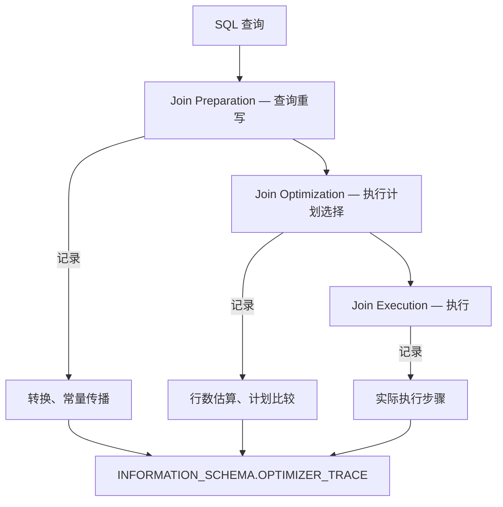
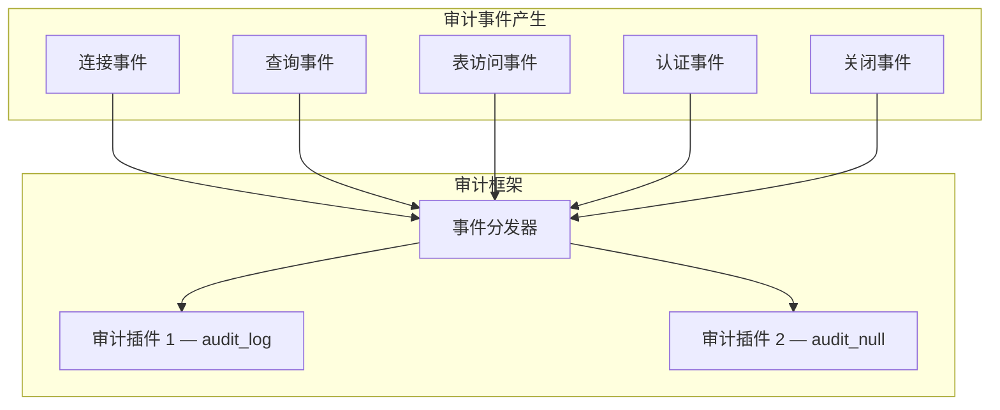
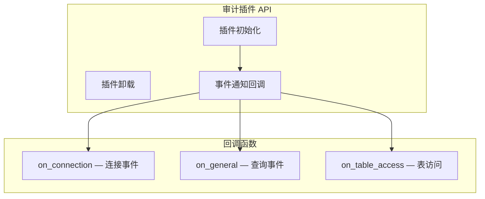

<cite>
**引用文件**
- [sql/opt_trace.cc](file://sql/opt_trace.cc)
- [sql/opt_trace.h](file://sql/opt_trace.h)
- [sql/opt_trace2server.cc](file://sql/opt_trace2server.cc)
- [sql/sql_audit.cc](file://sql/sql_audit.cc)
- [sql/sql_audit.h](file://sql/sql_audit.h)
- [plugin/audit_null/](file://plugin/audit_null/)
</cite>

## 目录
1. [优化器追踪](#优化器追踪)
2. [优化器追踪 API](#优化器追踪-api)
3. [审计日志框架](#审计日志框架)
4. [审计事件类型](#审计事件类型)
5. [审计插件开发](#审计插件开发)

## 优化器追踪

优化器追踪（Optimizer Trace）是 MySQL 提供的诊断工具，记录查询优化器的完整决策过程：

| 文件 | 大小 | 说明 |
|------|------|------|
| `opt_trace.h` | ~42KB | 追踪 API 定义 |
| `opt_trace.cc` | ~41KB | 追踪核心实现 |
| `opt_trace2server.cc` | ~23KB | 追踪数据导出到 INFORMATION_SCHEMA |

**Sources** · [sql/opt_trace.h](file://sql/opt_trace.h) · [sql/opt_trace.cc](file://sql/opt_trace.cc)

### 启用追踪

```sql
-- 启用优化器追踪
SET optimizer_trace = "enabled=on";

-- 执行查询
SELECT * FROM orders WHERE customer_id = 42 AND status = 'pending';

-- 查看追踪结果
SELECT * FROM INFORMATION_SCHEMA.OPTIMIZER_TRACE\G
```

### 追踪输出结构

```json
{
  "steps": [
    {
      "join_preparation": {
        "select#": 1,
        "steps": [
          { "transformations_to_nested_joins": { ... } },
          { "condition_on_constant_tables": { ... } }
        ]
      }
    },
    {
      "join_optimization": {
        "select#": 1,
        "steps": [
          { "rows_estimation": { ... } },
          { "considered_execution_plans": [ ... ] },
          { "attaching_conditions_to_tables": { ... } }
        ]
      }
    },
    {
      "join_execution": {
        "select#": 1,
        "steps": []
      }
    }
  ]
}
```

### 追踪阶段



**Sources** · [sql/opt_trace2server.cc](file://sql/opt_trace2server.cc)

## 优化器追踪 API

### 核心 API

| 宏/函数 | 说明 |
|--------|------|
| `OPT_TRACE_START()` | 开始追踪一个阶段 |
| `OPT_TRACE_END()` | 结束追踪 |
| `OPT_TRACE_ADD_TABLE()` | 添加表信息 |
| `OPT_TRACE_PRINT_KEY()` | 打印键信息 |

### 追踪配置

```sql
-- 配置追踪参数
SET optimizer_trace = "enabled=on,one_line=off";

-- 限制追踪结果大小
SET optimizer_trace_max_mem_size = 1048576;  -- 1MB

-- 限制追踪的查询数
SET optimizer_trace_offset = 0;  -- 起始偏移
SET optimizer_trace_limit = 1;   -- 最多追踪 1 个查询

-- 追踪特定功能
SET optimizer_trace_features = '{
    "greedy_search": "on",
    "range_optimizer": "on",
    "dynamic_range": "on",
    "repeated_subselect": "on"
}';
```

**Sources** · [sql/opt_trace.cc](file://sql/opt_trace.cc) · [sql/opt_trace.h](file://sql/opt_trace.h)

## 审计日志框架

`sql_audit.cc`（~46KB）实现 MySQL 的审计日志框架：

### 审计架构



### 审计 vs 通用日志

| 特性 | 审计日志 | 通用日志 |
|------|---------|---------|
| **性能影响** | 可配置过滤 | 全量记录，影响大 |
| **格式** | JSON/XML/CSV | 纯文本 |
| **过滤** | 支持按用户、事件类型 | 无过滤 |
| **安全性** | 不可篡改 | 可编辑 |
| **适用场景** | 合规、安全审计 | 开发调试 |

**Sources** · [sql/sql_audit.cc](file://sql/sql_audit.cc)

## 审计事件类型

### 事件分类

| 类别 | 事件 | 说明 |
|------|------|------|
| **连接** | `MYSQL_AUDIT_CONNECTION_CONNECT` | 用户连接 |
| **连接** | `MYSQL_AUDIT_CONNECTION_DISCONNECT` | 用户断开 |
| **查询** | `MYSQL_AUDIT_GENERAL_LOG` | 通用查询日志 |
| **查询** | `MYSQL_AUDIT_GENERAL_STATUS` | 查询状态 |
| **查询** | `MYSQL_AUDIT_GENERAL_ERROR` | 错误信息 |
| **表访问** | `MYSQL_AUDIT_TABLE_ACCESS_READ` | 表读取 |
| **表访问** | `MYSQL_AUDIT_TABLE_ACCESS_INSERT` | 表插入 |
| **表访问** | `MYSQL_AUDIT_TABLE_ACCESS_UPDATE` | 表更新 |
| **表访问** | `MYSQL_AUDIT_TABLE_ACCESS_DELETE` | 表删除 |
| **认证** | `MYSQL_AUDIT_AUTHENTICATE` | 认证操作 |
| **授权** | `MYSQL_AUDIT_AUTHORIZATION` | 权限检查 |
| **命令** | `MYSQL_AUDIT_COMMAND_START` | 命令开始 |
| **服务器** | `MYSQL_AUDIT_SERVER_STARTUP` | 服务器启动 |
| **服务器** | `MYSQL_AUDIT_SERVER_SHUTDOWN` | 服务器关闭 |

### 审计事件结构

```json
{
  "timestamp": "2024-01-01T10:00:00Z",
  "event_class": "CONNECTION",
  "event_subclass": "CONNECT",
  "connection_id": 42,
  "user": "admin@localhost",
  "priv_user": "root",
  "status": 0,
  "host": "localhost",
  "ip": "127.0.0.1"
}
```

**Sources** · [sql/sql_audit.h](file://sql/sql_audit.h)

## 审计插件开发

### 审计插件接口



### 内置审计插件

| 插件 | 说明 |
|------|------|
| `audit_log` | 商业版审计日志 — 完整审计 |
| `audit_null` | 测试用空审计插件 |
| `audit_api_message_emit` | Component API 审计消息 |

### 审计配置示例

```sql
-- 安装审计插件（商业版）
INSTALL PLUGIN audit_log SONAME 'audit_log.so';

-- 配置审计日志
SET GLOBAL audit_log_policy = 'ALL';         -- 记录所有事件
SET GLOBAL audit_log_format = 'JSON';        -- JSON 格式
SET GLOBAL audit_log_file = '/var/log/audit.log';

-- 按用户过滤
SET GLOBAL audit_log_include_accounts = 'admin@%';
SET GLOBAL audit_log_exclude_accounts = 'monitor@%';
```

**Sources** · [sql/sql_audit.cc](file://sql/sql_audit.cc) · [plugin/audit_null/](file://plugin/audit_null/)
