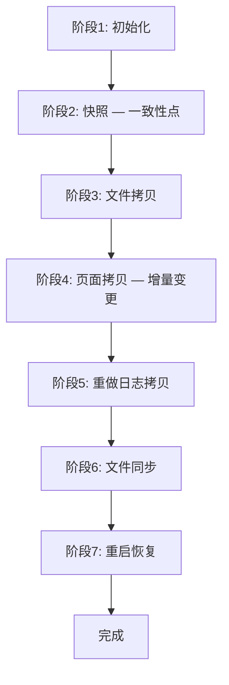
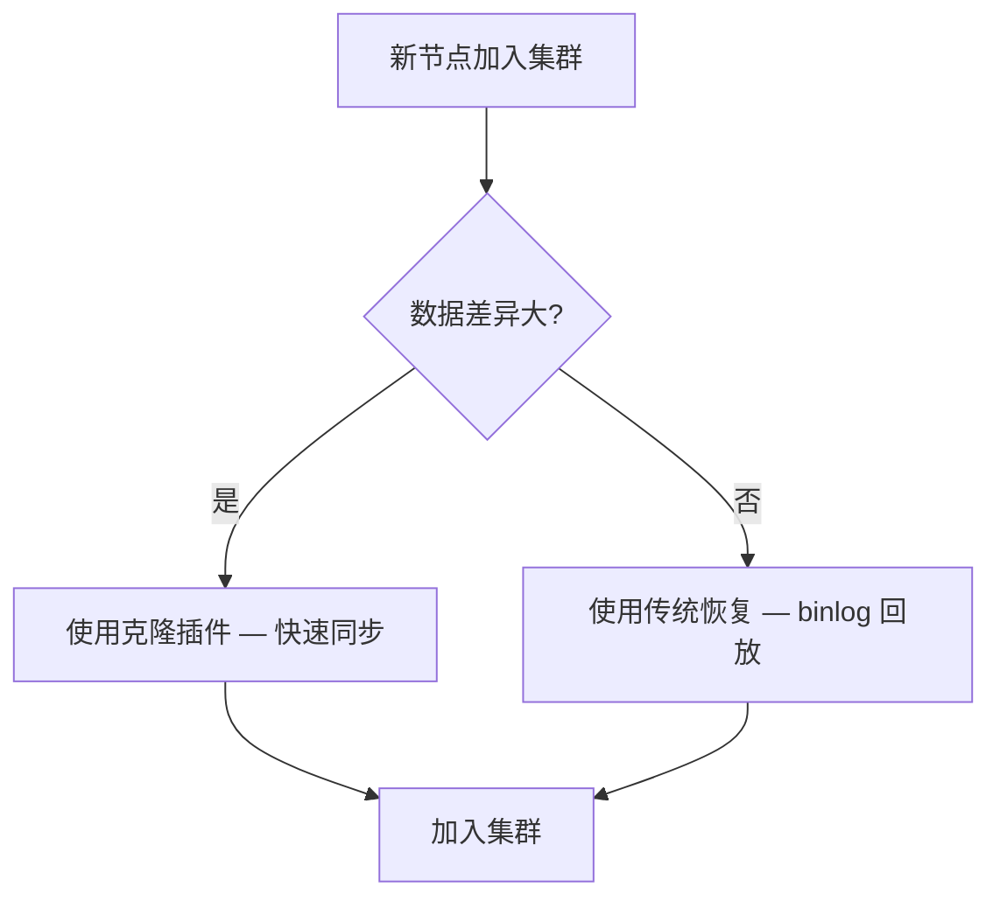

<cite>
**引用文件**
- [plugin/clone/src/clone_plugin.cc](file://plugin/clone/src/clone_plugin.cc)
- [plugin/clone/src/clone_server.cc](file://plugin/clone/src/clone_server.cc)
- [plugin/clone/src/clone_client.cc](file://plugin/clone/src/clone_client.cc)
- [plugin/clone/src/clone_hton.cc](file://plugin/clone/src/clone_hton.cc)
- [plugin/clone/src/clone_local.cc](file://plugin/clone/src/clone_local.cc)
- [plugin/clone/src/clone_os.cc](file://plugin/clone/src/clone_os.cc)
- [plugin/clone/src/clone_status.cc](file://plugin/clone/src/clone_status.cc)
- [plugin/clone/include/](file://plugin/clone/include/)
</cite>

## 目录
1. [克隆插件概述](#克隆插件概述)
2. [架构](#架构)
3. [克隆流程](#克隆流程)
4. [本地克隆](#本地克隆)
5. [远程克隆](#远程克隆)
6. [克隆状态监控](#克隆状态监控)
7. [与复制的集成](#与复制的集成)

## 克隆插件概述

MySQL Clone Plugin 提供物理数据复制功能，将一个 MySQL 实例的数据完整拷贝到另一个实例。实现在 `plugin/clone/` 目录中（7 个源文件，总计约 154KB），是 InnoDB Cluster 和 Group Replication 的关键组件。

```mermaid
graph TB
    subgraph 克隆插件 — plugin/clone/
        PLUGIN[clone_plugin.cc — 插件入口 24KB]
        SERVER[clone_server.cc — 服务器端 19KB]
        CLIENT[clone_client.cc — 客户端 54KB]
        HTON[clone_hton.cc — 引擎接口 9KB]
        LOCAL[clone_local.cc — 本地克隆 12KB]
        OS[clone_os.cc — 操作系统接口 10KB]
        STATUS[clone_status.cc — 状态监控 27KB]
    end

    PLUGIN --> SERVER
    PLUGIN --> CLIENT
    SERVER --> HTON
    CLIENT --> HTON
    CLIENT --> LOCAL
    CLIENT --> OS
    PLUGIN --> STATUS
```

**Sources** · [plugin/clone/](file://plugin/clone/)

## 架构

### 核心组件

| 文件 | 大小 | 说明 |
|------|------|------|
| `clone_plugin.cc` | ~24KB | 插件入口 — 注册、参数、命令分发 |
| `clone_client.cc` | ~54KB | 克隆客户端 — 接收数据、应用到目标 |
| `clone_server.cc` | ~19KB | 克隆服务器 — 导出数据、发送快照 |
| `clone_hton.cc` | ~9KB | 存储引擎接口 — 与 InnoDB 交互 |
| `clone_local.cc` | ~12KB | 本地克隆 — 同主机拷贝 |
| `clone_os.cc` | ~10KB | 操作系统接口 — 文件 I/O |
| `clone_status.cc` | ~27KB | 状态监控 — 进度追踪 |

### 数据流

```mermaid
graph LR
    subgraph 源端 — DONOR
        DONOR_IB[InnoDB 表空间]
        DONOR_CLONE[clone_server.cc]
    end

    subgraph 目标端 — RECIPIENT
        RECIPIENT_CLONE[clone_client.cc]
        RECIPIENT_IB[InnoDB 表空间]
    end

    DONOR_IB --> DONOR_CLONE
    DONOR_CLONE --> |网络传输 / 本地拷贝| RECIPIENT_CLONE
    RECIPIENT_CLONE --> RECIPIENT_IB
```

**Sources** · [plugin/clone/src/](file://plugin/clone/src/)

## 克隆流程

克隆操作分为多个阶段：

### 阶段详解



| 阶段 | 说明 |
|------|------|
| **初始化** | 检查兼容性、获取全局锁 |
| **快照** | 获取一致性快照点（MVCC） |
| **文件拷贝** | 拷贝表空间文件 |
| **页面拷贝** | 应用快照后的页面变更 |
| **重做日志拷贝** | 传输增量重做日志 |
| **文件同步** | 确保数据刷盘 |
| **重启恢复** | 目标端应用重做日志 |

**Sources** · [plugin/clone/src/clone_server.cc](file://plugin/clone/src/clone_server.cc)

## 本地克隆

本地克隆在同一主机上进行数据拷贝：

```sql
-- 安装克隆插件
INSTALL PLUGIN clone SONAME 'mysql_clone.so';

-- 本地克隆到指定目录
CLONE LOCAL DATA DIRECTORY = '/var/lib/mysql_clone';

-- 查看克隆进度
SELECT * FROM performance_schema.clone_progress;
```

本地克隆的特点：
- 不需要网络连接
- 使用直接文件拷贝（更高效）
- 源端和目标端共享磁盘 I/O

**Sources** · [plugin/clone/src/clone_local.cc](file://plugin/clone/src/clone_local.cc)

## 远程克隆

远程克隆通过网络将数据从一个实例传输到另一个实例：

### 设置步骤

```sql
-- === 源端（DONOR）===
-- 安装插件
INSTALL PLUGIN clone SONAME 'mysql_clone.so';

-- 创建克隆用户
CREATE USER 'clone_user'@'%' IDENTIFIED BY 'password';
GRANT BACKUP_ADMIN ON *.* TO 'clone_user';

-- === 目标端（RECIPIENT）===
-- 安装插件
INSTALL PLUGIN clone SONAME 'mysql_clone.so';

-- 创建克隆用户
CREATE USER 'clone_user'@'%' IDENTIFIED BY 'password';
GRANT CLONE_ADMIN ON *.* TO 'clone_user';

-- 添加源端到允许列表
SET GLOBAL clone_valid_donor_list = 'donor_host:3306';

-- 执行远程克隆
CLONE INSTANCE FROM 'clone_user'@'donor_host':3306
IDENTIFIED BY 'password';

-- 目标端自动重启并使用克隆数据
```

### 安全要求

| 要求 | 说明 |
|------|------|
| **加密传输** | 默认要求 TLS 连接 |
| **兼容版本** | 源端和目标端必须是相同的 MySQL 版本 |
| **字符集** | 服务器字符集必须匹配 |
| **插件列表** | 已安装的插件必须兼容 |

```sql
-- 允许不安全的克隆（测试环境）
SET GLOBAL clone = 'FORCE';
```

**Sources** · [plugin/clone/src/clone_client.cc](file://plugin/clone/src/clone_client.cc)

## 克隆状态监控

`clone_status.cc`（~27KB）提供详细的进度监控：

### Performance Schema 表

```sql
-- 克隆进度
SELECT * FROM performance_schema.clone_progress;

-- 输出示例
+----------+-----------+----------+---------+-------+
| ID       | STAGE     | STATE    | THREADS | ESTIMATE |
+----------+-----------+----------+---------+-------+
| 1        | FILE COPY | Executing| 4       | 1073741824 |
+----------+-----------+----------+---------+-------+
```

### 阶段状态

| 状态 | 说明 |
|------|------|
| `Not Started` | 未开始 |
| `Executing` | 执行中 |
| `Completed` | 已完成 |
| `Failed` | 失败 |

### 关键指标

| 指标 | 说明 |
|------|------|
| `BEGIN_TIME` | 阶段开始时间 |
| `END_TIME` | 阶段结束时间 |
| `THREADS` | 使用的线程数 |
| `ESTIMATE` | 预估数据量 |
| `ESTIMATE_UNIT` | 单位（bytes） |

**Sources** · [plugin/clone/src/clone_status.cc](file://plugin/clone/src/clone_status.cc)

## 与复制的集成

克隆插件在 MySQL 复制和高可用架构中扮演关键角色：

### Group Replication 新成员加入



### InnoDB Cluster 自动选择

```sql
-- InnoDB Cluster 自动选择恢复方法
-- cluster.addInstance('new_host:3306')
-- 自动判断使用 clone 还是 incremental recovery
```

### 克隆后的 GTID 同步

克隆操作会自动复制源端的 GTID 集合，目标端克隆后可以直接加入复制拓扑：

```sql
-- 克隆后检查 GTID
SELECT @@GLOBAL.gtid_executed;
-- 应该与源端一致

-- 直接启动复制
CHANGE REPLICATION SOURCE TO SOURCE_HOST = 'primary_host';
START REPLICA;
```

**Sources** · [plugin/clone/src/clone_hton.cc](file://plugin/clone/src/clone_hton.cc)
