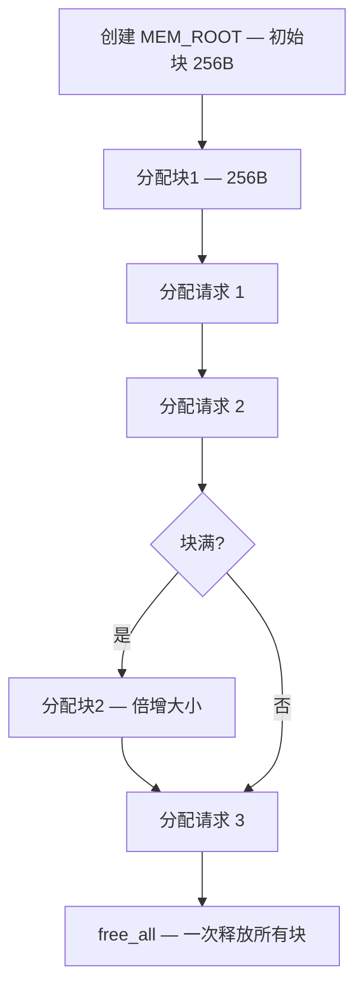

<cite>
**引用文件**
- [mysys/my_alloc.cc](file://mysys/my_alloc.cc)
- [mysys/my_malloc.cc](file://mysys/my_malloc.cc)
- [sql/mem_root.cc](file://sql/mem_root.cc)
- [storage/innobase/buf/buf0buf.cc](file://storage/innobase/buf/buf0buf.cc)
- [storage/innobase/mem/mem0mem.cc](file://storage/innobase/mem/mem0mem.cc)
- [sql/sql_mem_root.cc](file://sql/sql_mem_root.cc)
</cite>

## 目录
1. [内存管理概述](#内存管理概述)
2. [MEM_ROOT 分配器](#mem_root-分配器)
3. [mysys 内存管理](#mysys-内存管理)
4. [InnoDB 内存管理](#innodb-内存管理)
5. [全局内存区域](#全局内存区域)
6. [每连接内存](#每连接内存)
7. [内存监控](#内存监控)

## 内存管理概述

MySQL 使用多层次的内存管理策略，不同组件使用不同的分配器和管理方式：


**Sources** · [mysys/my_alloc.cc](file://mysys/my_alloc.cc) · [sql/mem_root.cc](file://sql/mem_root.cc)

## MEM_ROOT 分配器

MEM_ROOT 是 MySQL 最常用的内存分配器，实现区域（Arena）分配策略：

### 工作原理



### 特点

| 特性 | 说明 |
|------|------|
| **批量分配** | 一次 malloc 分配大块，后续从块中切分 |
| **批量释放** | `free_all()` 一次释放所有内存 |
| **无碎片** | 避免小块分配导致的碎片 |
| **查询绑定** | 与查询生命周期绑定，查询结束自动释放 |

### 使用场景

| 场景 | 说明 |
|------|------|
| SQL 解析树 | 解析器节点分配 |
| Item 表达式 | 查询中的表达式对象 |
| 结果集缓冲 | 临时结果集存储 |
| 优化器结构 | 查询计划和代价评估 |

```cpp
// MEM_ROOT 使用示例
MEM_ROOT mem_root(PSI_NOT_INSTRUMENTED, 256);
char *buffer = (char *)mem_root.Alloc(100);
// ... 使用 buffer ...
mem_root.Clear();  // 一次释放所有分配
```

**Sources** · [sql/mem_root.cc](file://sql/mem_root.cc) · [mysys/my_alloc.cc](file://mysys/my_alloc.cc)

## mysys 内存管理

`mysys/my_malloc.cc` 提供 MySQL 系统层的内存管理：

### 核心函数

| 函数 | 说明 |
|------|------|
| `my_malloc()` | 带错误检查和 PSI 插桩的 malloc |
| `my_free()` | 释放 my_malloc 分配的内存 |
| `my_realloc()` | 带插桩的 realloc |
| `my_strdup()` | 字符串复制 |
| `my_multi_malloc()` | 一次分配多个缓冲区 |

### PSI 内存插桩

mysys 内存分配与 Performance Schema 集成，提供细粒度的内存使用监控：

```sql
-- 查看各组件内存使用
SELECT * FROM performance_schema.memory_summary_global_by_event_name
WHERE CURRENT_COUNT_USED > 0
ORDER BY CURRENT_NUMBER_OF_BYTES_USED DESC;

-- 查看线程内存使用
SELECT * FROM performance_schema.memory_summary_by_thread_by_event_name
WHERE THREAD_ID = (SELECT THREAD_ID FROM performance_schema.threads
                    WHERE PROCESSLIST_ID = CONNECTION_ID());
```

**Sources** · [mysys/my_malloc.cc](file://mysys/my_malloc.cc)

## InnoDB 内存管理

InnoDB 有自己独立的内存管理系统：

### 缓冲池（Buffer Pool）

`buf0buf.cc` 管理 InnoDB 缓冲池 — MySQL 中最大的内存消费者：


| 参数 | 默认值 | 说明 |
|------|--------|------|
| `innodb_buffer_pool_size` | 128MB | 缓冲池总大小 |
| `innodb_buffer_pool_instances` | 1 | 缓冲池实例数 |
| `innodb_old_blocks_pct` | 37 | Old 区域占比（3/8） |
| `innodb_old_blocks_time` | 1000 | Young→Old 过渡时间（ms） |

### InnoDB 堆分配器

`mem0mem.cc` 实现 InnoDB 内部的堆内存分配：

| 特性 | 说明 |
|------|------|
| **堆块** | 按需分配固定大小的块 |
| **栈式释放** | LIFO 释放顺序 |
| **事务绑定** | 与迷你事务生命周期绑定 |
| **无碎片** | 内部无碎片设计 |

**Sources** · [storage/innobase/buf/buf0buf.cc](file://storage/innobase/buf/buf0buf.cc) · [storage/innobase/mem/mem0mem.cc](file://storage/innobase/mem/mem0mem.cc)

## 全局内存区域

| 区域 | 参数 | 说明 |
|------|------|------|
| InnoDB 缓冲池 | `innodb_buffer_pool_size` | 最重要的全局内存（建议物理内存的 70-80%） |
| MyISAM 键缓存 | `key_buffer_size` | MyISAM 索引缓存 |
| InnoDB 日志缓冲 | `innodb_log_buffer_size` | 重做日志写入缓冲 |
| 表定义缓存 | `table_definition_cache` | 缓存的 .frm 定义 |
| 表打开缓存 | `table_open_cache` | 缓存的打开表 |
| 线程缓存 | `thread_cache_size` | 缓存的断开线程 |
| 主机缓存 | `host_cache_size` | DNS 和主机信息缓存 |

## 每连接内存

每个客户端连接分配的内存：

| 区域 | 参数 | 默认值 | 说明 |
|------|------|--------|------|
| 排序缓冲 | `sort_buffer_size` | 256KB | ORDER BY 排序 |
| 连接缓冲 | `join_buffer_size` | 256KB | 非索引连接 |
| 读缓冲 | `read_buffer_size` | 128KB | 顺序扫描 |
| 随机读缓冲 | `read_rnd_buffer_size` | 256KB | 排序后读取 |
| 临时表 | `tmp_table_size` | 16MB | 内存临时表上限 |
| 线程栈 | `thread_stack` | 256KB | 线程栈大小 |
| 网络缓冲 | `net_buffer_length` | 16KB | 网络包缓冲 |

### 内存估算公式

```
总内存 ≈ 全局内存 + max_connections × 每连接内存

示例（OLTP 工作负载）：
  innodb_buffer_pool_size = 8GB
  max_connections = 300
  每连接 ≈ 2MB（sort + join + read buffers）
  总内存 ≈ 8GB + 300 × 2MB = 8.6GB
```

**Sources** · [sql/sql_mem_root.cc](file://sql/sql_mem_root.cc)

## 内存监控

### Performance Schema 内存监控

```sql
-- 全局内存使用 TOP 10
SELECT EVENT_NAME,
       CURRENT_COUNT_USED,
       ROUND(CURRENT_NUMBER_OF_BYTES_USED / 1024 / 1024, 2) AS 'MB'
FROM performance_schema.memory_summary_global_by_event_name
ORDER BY CURRENT_NUMBER_OF_BYTES_USED DESC
LIMIT 10;

-- InnoDB 缓冲池状态
SHOW STATUS LIKE 'Innodb_buffer_pool_%';
```

### 内存泄漏检测

| 工具 | 说明 |
|------|------|
| **Valgrind** | `--tool=massif` 堆分析 |
| **ASan** | AddressSanitizer 内存错误检测 |
| **jemalloc** | 替换 malloc 提供统计 |
| **TCMalloc** | Google 的高性能分配器 |

```bash
# 使用 ASan 构建
cmake .. -DWITH_ASAN=ON

# 使用 Valgrind 测试
valgrind --leak-check=full --tool=massif mysqld
```

**Sources** · [mysys/my_malloc.cc](file://mysys/my_malloc.cc) · [sql/mem_root.cc](file://sql/mem_root.cc)
