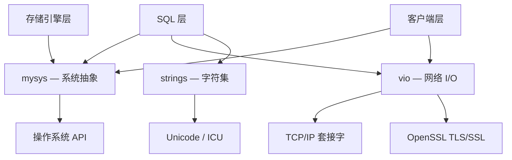
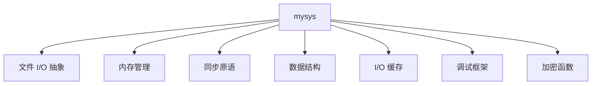
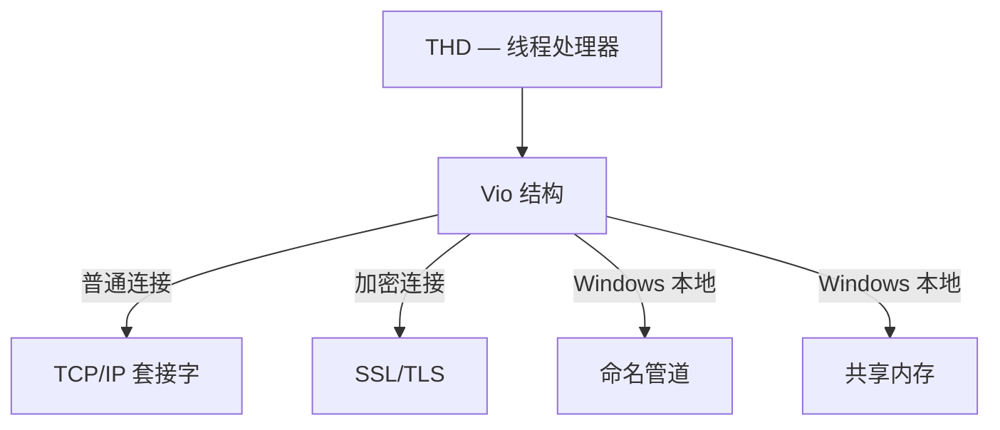
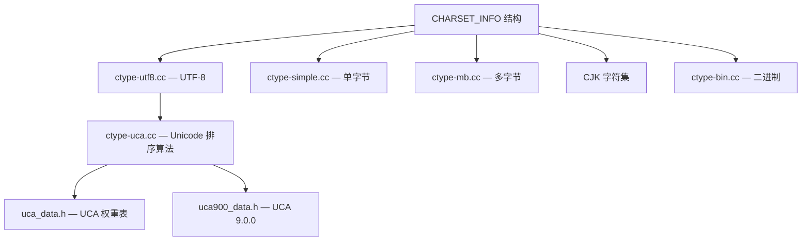
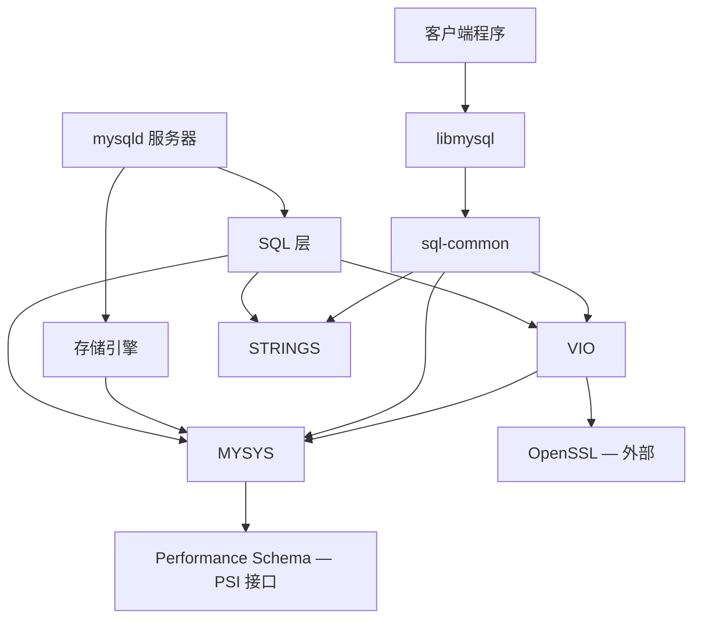

<cite>
**引用文件**
- [mysys/](file://mysys/)
- [vio/](file://vio/)
- [strings/](file://strings/)
- [include/mysql/](file://include/mysql/)
</cite>

## 目录
1. [基础设施层概述](#基础设施层概述)
2. [mysys — 系统抽象层](#mysys--系统抽象层)
3. [vio — 虚拟 I/O 层](#vio--虚拟-io-层)
4. [strings — 字符集与字符串](#strings--字符集与字符串)
5. [模块间依赖关系](#模块间依赖关系)

## 基础设施层概述

MySQL Server 的底层基础设施由三个核心库组成，为上层的 SQL 处理和存储引擎提供跨平台抽象：



这三个库是整个 MySQL 代码库最底层的依赖，几乎所有上层模块都直接或间接使用它们。

## mysys — 系统抽象层

`mysys/`（MySQL System Library）提供跨平台的系统级操作抽象，屏蔽 Linux、macOS 和 Windows 之间的 API 差异。

### 核心功能模块



#### 1. 文件 I/O 抽象

| 函数 | 说明 |
|------|------|
| `my_open()` / `my_close()` | 打开/关闭文件 |
| `my_read()` / `my_write()` | 读写文件 |
| `my_pread()` / `my_pwrite()` | 指定位置读写 |
| `my_dir()` | 目录操作 |

Windows 平台通过 `my_winfile.cc` 提供特定实现，POSIX 平台使用标准系统调用。

#### 2. 内存管理

| 组件 | 说明 |
|------|------|
| `my_malloc()` / `my_free()` | 带 PSI 监控的堆分配器 |
| `my_alloc.cc`（MEM_ROOT） | 内存池分配器 — 查询作用域内的主要内存管理方式 |
| `mulalloc` | 批量内存分配 |

`MEM_ROOT` 是 MySQL 中最重要的内存管理模式：
- 为每次查询分配独立的内存池
- 查询结束后一次性释放所有内存
- 避免逐对象释放的开销
- 防止查询处理中的内存泄漏

#### 3. 同步原语

| 组件 | 说明 |
|------|------|
| `thr_mutex.cc` | 互斥锁 — 封装原生 OS 互斥锁 + PSI 监控 |
| `thr_rwlock.cc` | 读写锁 — 多读单写锁 |
| `thr_cond.cc` | 条件变量 — 线程同步 |

#### 4. 无锁数据结构

| 组件 | 说明 |
|------|------|
| `lf_hash.cc` | 无锁哈希表 |
| `lf_alloc-pin.cc` | 无锁内存分配器 |
| `lf_dynarray.cc` | 无锁动态数组 |
| `tree.cc` | 平衡树 |
| `list.cc` | 链表 |

#### 5. I/O 缓存与键缓存

| 组件 | 说明 |
|------|------|
| `mf_iocache.cc` / `mf_iocache2.cc` | 带缓存的缓冲 I/O 流 |
| `mf_keycache.cc`（~143KB） | MyISAM 键块缓存实现 |

#### 6. 调试框架

`dbug.cc`（~63KB）实现 DBUG 跟踪/调试宏系统：

```cpp
// DBUG 宏使用示例
DBUG_ENTER("function_name");   // 函数入口跟踪
DBUG_PRINT("info", ("value=%d", val));  // 调试打印
DBUG_RETURN(result);           // 函数返回跟踪
```

仅在 Debug 构建中生效，Release 构建中这些宏被编译为空操作。

#### 7. 加密函数

| 函数 | 说明 |
|------|------|
| `my_aes_openssl.cc` | AES 加密（基于 OpenSSL） |
| `my_sha2.cc` | SHA-2 哈希 |
| `crypt_genhash_impl.cc` | 密码哈希生成 |
| `base64_encode.cc` | Base64 编码/解码 |

**Sources** · [mysys/](file://mysys/)

## vio — 虚拟 I/O 层

`vio/`（Virtual Input/Output）是一个小型、聚焦的模块（约 12 个源文件），将多种网络传输抽象为统一的 `Vio` 结构。

### 传输类型

| 文件 | 传输方式 | 平台 |
|------|---------|------|
| `viosocket.cc` | TCP/IP 套接字 — IPv4/IPv6 连接、接受、读写、关闭 | 全平台 |
| `viossl.cc` | SSL/TLS 加密传输 — 封装 OpenSSL SSL_read/SSL_write | 全平台 |
| `viosslfactories.cc` | SSL 上下文管理 — 证书加载、密码套件配置、SSL_CTX | 全平台 |
| `viopipe.cc` | Windows 命名管道 | Windows |
| `vioshm.cc` | Windows 共享内存 | Windows |
| `vio.cc` | Vio 生命周期 — 创建、初始化、销毁、传输切换 | 全平台 |

### Vio 连接模型



### 传输升级

Vio 结构在连接时分配并附加到 `THD`（线程处理器），在整个会话期间存在。传输类型在连接时确定，并可以在运行时升级（例如，从普通套接字升级到 SSL）。


**Sources** · [vio/](file://vio/)

## strings — 字符集与字符串

`strings/` 模块实现 MySQL 的字符集和排序规则系统，支持 60+ 种字符集和数百种排序规则。

### 架构设计



### 核心组件

| 组件 | 文件 | 大小 | 说明 |
|------|------|------|------|
| 字符类型框架 | `ctype.cc` | — | 核心框架 — 通过 CHARSET_INFO 函数指针分发到各字符集处理器 |
| UTF-8 | `ctype-utf8.cc` | ~447KB | UTF-8 编解码和排序规则 |
| UCA 基础 | `ctype-uca.cc` | ~487KB | Unicode 排序算法基础实现 |
| UCA 数据 | `uca_data.h` | ~1.2MB | 预计算的 UCA 权重表 |
| UCA 9.0.0 | `uca900_data.h` | ~7.4MB | Unicode 9.0.0 排序权重表 |
| 单字节集 | `ctype-simple.cc` | — | Latin1、ASCII、Binary 等单字节字符集 |
| 二进制排序 | `ctype-bin.cc` | — | 字节序排序 |
| 多字节公共 | `ctype-mb.cc` | — | 多字节字符集公共例程 |
| 浮点转换 | `dtoa.cc` | ~71KB | Double-to-ASCII 转换（Steele & White 算法） |
| 排序注册 | `collations_internal.cc` | ~30KB | 排序规则注册和查找 |
| 整数转换 | `my_strtoll10.cc` | — | 快速整数到字符串转换 |

### CJK 字符集支持

| 文件 | 字符集 | 语言/地区 |
|------|--------|---------|
| `ctype-big5.cc` | Big5 | 繁体中文 |
| `ctype-gb2312.cc` | GB2312 | 简体中文 |
| `ctype-gbk.cc` | GBK | 简体中文（扩展） |
| `ctype-gb18030.cc` | GB18030 | 中文（国家标准） |
| `ctype-sjis.cc` | Shift-JIS | 日语 |
| `ctype-eucjpms.cc` | EUC-JP-MS | 日语 |
| `ctype-ujis.cc` | EUC-JP | 日语 |
| `ctype-euc_kr.cc` | EUC-KR | 韩语 |
| `ctype-cp932.cc` | CP932 | 日语（Windows） |

### CHARSET_INFO 结构

`CHARSET_INFO` 是每个字符集的核心结构，定义了字符集属性和处理函数指针：
- 字符集名称和编号
- 最大/最小字符字节数
- 排序规则函数（比较、哈希）
- 字符类型函数（大写、小写、数字等判断）
- 编码转换函数

**Sources** · [strings/](file://strings/)

## 模块间依赖关系



依赖层次（从底到顶）：
1. **mysys** — 最底层，所有模块都依赖
2. **strings** — 依赖 mysys，提供字符集支持
3. **vio** — 依赖 mysys 和 OpenSSL，提供网络传输
4. **sql-common** — 依赖 mysys/vio/strings，共享协议代码
5. **libmysql** — 依赖 sql-common/vio/mysys，客户端库
6. **SQL 层** — 依赖所有基础设施模块
