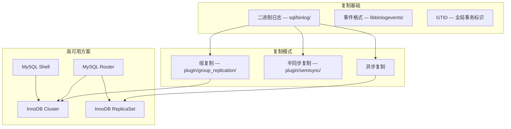
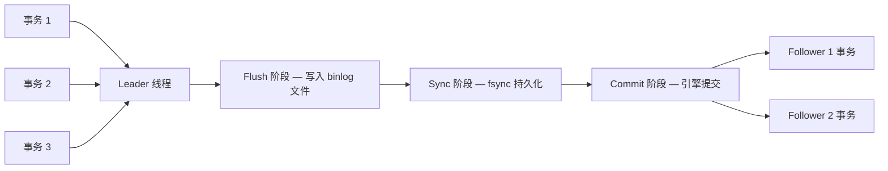
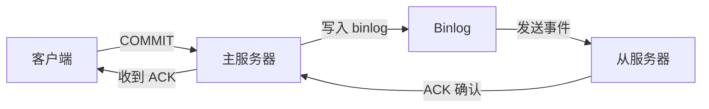
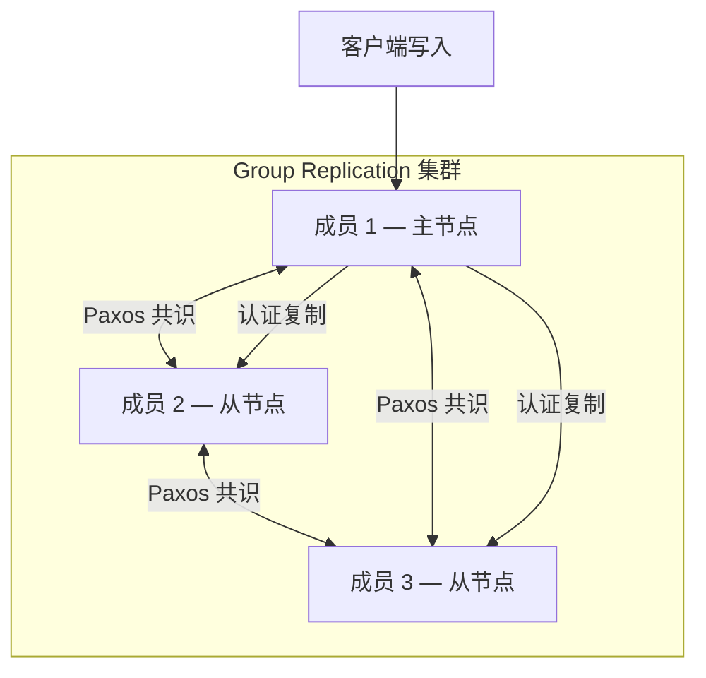
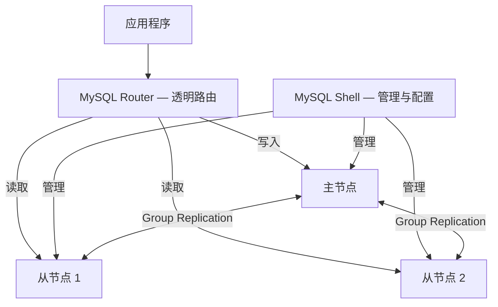

<cite>
**引用文件**
- [sql/binlog/](file://sql/binlog/)
- [libbinlogevents/](file://libbinlogevents/)
- [plugin/group_replication/](file://plugin/group_replication/)
- [plugin/semisync/](file://plugin/semisync/)
- [plugin/clone/](file://plugin/clone/)
- [libchangestreams/](file://libchangestreams/)
- [router/](file://router/)
</cite>

## 目录
1. [复制体系概述](#复制体系概述)
2. [二进制日志与复制基础](#二进制日志与复制基础)
3. [异步与半同步复制](#异步与半同步复制)
4. [组复制（Group Replication）](#组复制group-replication)
5. [InnoDB Cluster 高可用方案](#innodb-cluster-高可用方案)
6. [克隆插件](#克隆插件)
7. [变更流（Change Streams）](#变更流change-streams)
8. [GTID 全局事务标识符](#gtid-全局事务标识符)

## 复制体系概述

MySQL Server 提供了多层次的数据复制和高可用方案，从基础的异步复制到完整的 InnoDB Cluster 集群解决方案：



**Sources** · [sql/binlog/](file://sql/binlog/) · [plugin/group_replication/](file://plugin/group_replication/)

## 二进制日志与复制基础

二进制日志是 MySQL 复制的基础，记录所有数据变更操作。

### 组提交流水线



组提交（Group Commit）采用 Leader/Follower 模型，将多个事务的 binlog 写入合并为一次刷盘操作，显著提升写入性能。三个阶段：

| 阶段 | 说明 |
|------|------|
| **Flush** | Leader 将所有 Follower 事务的 binlog 事件写入 binlog 文件 |
| **Sync** | 执行 fsync 将 binlog 文件持久化到磁盘 |
| **Commit** | 通知存储引擎提交所有组内事务 |

### 二进制日志事件格式

`libbinlogevents/` 库定义了 binlog 事件格式，是一个以头文件为主的库：

| 头文件 | 事件类型 |
|--------|---------|
| `control_events.h` | 控制事件（启动/停止/轮转/格式描述） |
| `statement_events.h` | 语句事件（Query/Log Event） |
| `rows_event.h` | 行事件（Write/Update/Delete Rows） |
| `load_data_events.h` | LOAD DATA 事件 |
| `binlog_event.h` | 基础事件类 |
| `event_reader.h` | 事件反序列化 |

支持的特性：
- **压缩**：zstd/zlib 压缩的 binlog 事件（`compression/`）
- **编解码**：事件载荷的二进制编解码（`codecs/`）
- **事务边界检测**：用于 binlog 流传输（`trx_boundary_parser.h`）

**Sources** · [sql/binlog/](file://sql/binlog/) · [libbinlogevents/](file://libbinlogevents/)

## 异步与半同步复制

### 异步复制（默认）

MySQL 默认的复制模式：
- 主服务器在事务提交后立即返回客户端成功
- Binlog 事件异步传输到从服务器
- 从服务器的 I/O 线程读取主服务器 binlog 并写入 relay log
- 从服务器的 SQL 线程回放 relay log

### 半同步复制

`plugin/semisync/` 实现半同步复制，提高数据持久性：



工作原理：
- 主服务器在事务提交后等待至少一个从服务器确认收到 binlog 事件
- 从服务器将事件写入 relay log 后返回 ACK
- 主服务器收到 ACK 后才向客户端返回成功
- 如果超时未收到 ACK，自动降级为异步复制

**Sources** · [plugin/semisync/](file://plugin/semisync/)

## 组复制（Group Replication）

`plugin/group_replication/` 是 MySQL 内置的多主/单主复制方案：

### 架构



### 核心特性

| 特性 | 说明 |
|------|------|
| **单主模式** | 一个可写主节点 + 多个只读从节点（默认） |
| **多主模式** | 所有节点均可写入，冲突检测保证一致性 |
| **认证复制** | 事务在提交前经过冲突认证检查 |
| **自动成员管理** | 节点自动加入/离开集群 |
| **自动故障恢复** | 新成员通过捐赠者自动同步数据 |
| **Paxos 共识** | 用于组成员管理和视图协调 |

### 关键子系统

组复制插件是一个大型子系统，拥有自己的：
- **认证逻辑**：冲突检测和事务认证
- **流水线**：事务传播和应用管道
- **恢复机制**：新成员的数据同步
- **Paxos 实现**：用于分布式共识

**Sources** · [plugin/group_replication/](file://plugin/group_replication/)

## InnoDB Cluster 高可用方案

InnoDB Cluster 是 MySQL 官方的完整高可用解决方案，由三个组件组成：



### 组件职责

| 组件 | 职责 |
|------|------|
| **Group Replication** | 数据复制和集群成员管理 |
| **MySQL Router** | 应用层透明路由，读写分离，自动故障转移 |
| **MySQL Shell** | 集群配置、监控、管理和故障排除 |

### 故障转移流程

1. 主节点故障被集群检测到
2. Group Replication 通过 Paxos 共识选举新主节点
3. MySQL Router 的元数据缓存自动更新拓扑
4. 新的写入请求被路由到新主节点
5. 整个过程对应用程序透明

### InnoDB ReplicaSet

InnoDB ReplicaSet 是基于异步复制的轻量级高可用方案：
- 使用传统异步复制而非 Group Replication
- 通过 MySQL Shell 统一管理
- 支持手动和自动故障转移
- 适合不需要 Group Replication 开销的场景

**Sources** · [router/](file://router/) · [plugin/group_replication/](file://plugin/group_replication/)

## 克隆插件

`plugin/clone/` 提供物理数据克隆能力：

| 功能 | 说明 |
|------|------|
| **本地克隆** | 在同一服务器上克隆数据目录 |
| **远程克隆** | 从远程服务器克隆数据到本地 |
| **用途** | 快速配置新的复制从节点、数据同步 |

克隆插件直接复制物理数据文件（而非逻辑导出），速度远快于 `mysqldump`，特别适合大数据量的初始数据同步。

```sql
-- 远程克隆
CLONE INSTANCE FROM 'user'@'remote_host':3306
IDENTIFIED BY 'password';

-- 本地克隆
CLONE LOCAL DATA DIRECTORY = '/backup/clone_data';
```

**Sources** · [plugin/clone/](file://plugin/clone/)

## 变更流（Change Streams）

`libchangestreams/` 库提供变更流基础设施：

- 允许客户端订阅 MySQL 服务器的 binlog 事件流
- 提供变更数据捕获（CDC）能力
- 支持实时数据同步到外部系统
- 客户端库位于 `libchangestreams/src/`

变更流是构建实时数据管道的基础设施，常用于：
- 数据仓库实时同步
- 搜索引擎索引更新
- 缓存失效通知
- 审计日志

**Sources** · [libchangestreams/](file://libchangestreams/)

## GTID 全局事务标识符

GTID（Global Transaction Identifier）为每个事务分配全局唯一标识符：

### 格式

```
GTID = server_uuid:transaction_number
示例: 3E11FA47-71CA-11E1-9E33-C80AA9429562:23
```

### GTID 集合

`libbinlogevents/include/gtids/` 实现 GTID 集合管理：
- `uuid.h` — UUID 类型定义
- GTID Set — 管理已执行事务的集合
- 支持区间表示（如 `uuid:1-5:10-20`）

### GTID 复制优势

| 特性 | 说明 |
|------|------|
| **简化故障转移** | 从服务器精确知道已执行到哪个事务 |
| **一致性保证** | 全局唯一标识避免事务重复或遗漏 |
| **简化配置** | 无需手动指定 binlog 文件和位置 |
| **便于诊断** | 可精确追踪事务在集群中的传播路径 |
