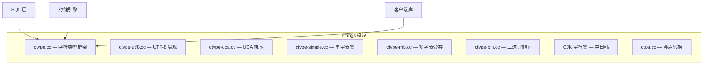
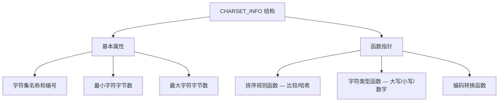

<cite>
**引用文件**
- [strings/](file://strings/)
- [strings/ctype.cc](file://strings/ctype.cc)
- [strings/ctype-utf8.cc](file://strings/ctype-utf8.cc)
- [strings/ctype-uca.cc](file://strings/ctype-uca.cc)
- [strings/uca_data.h](file://strings/uca_data.h)
- [strings/uca900_data.h](file://strings/uca900_data.h)
- [strings/dtoa.cc](file://strings/dtoa.cc)
</cite>

## 目录
1. [字符集系统概述](#字符集系统概述)
2. [CHARSET_INFO 架构](#charset_info-架构)
3. [Unicode 排序算法（UCA）](#unicode-排序算法uca)
4. [CJK 字符集支持](#cjk-字符集支持)
5. [UTF-8 实现](#utf-8-实现)
6. [排序规则（Collation）](#排序规则collation)
7. [数值与字符串转换](#数值与字符串转换)
8. [配置与使用](#配置与使用)

## 字符集系统概述

MySQL 的字符集和排序规则系统实现在 `strings/` 模块中，提供 60+ 种字符集和数百种排序规则的支持。该系统负责字符编码/解码、字符串比较、大小写转换和数值/字符串转换，是整个 MySQL 服务器的基础基础设施。



**Sources** · [strings/](file://strings/)

## CHARSET_INFO 架构

`CHARSET_INFO` 是每个字符集的核心结构，定义了字符集属性和处理函数指针：



`ctype.cc` 是核心字符类型框架，通过 `CHARSET_INFO` 函数指针分发到各字符集的具体处理器。这种设计使得字符集操作可以针对不同编码进行优化。

**Sources** · [strings/ctype.cc](file://strings/ctype.cc)

## Unicode 排序算法（UCA）

UCA（Unicode Collation Algorithm）是 MySQL 实现 Unicode 标准排序的核心：

### 核心文件

| 文件 | 大小 | 说明 |
|------|------|------|
| `ctype-uca.cc` | ~487KB | UCA 基础实现 — Unicode 排序算法的核心逻辑 |
| `uca_data.h` | ~1.2MB | 预计算的 UCA 权重表（UCA 4.0.0/5.2.0） |
| `uca900_data.h` | ~7.4MB | Unicode 9.0.0 排序权重表 |

### UCA 版本

| UCA 版本 | 对应的 Unicode 版本 | 排序规则前缀 |
|---------|-------------------|-------------|
| UCA 4.0.0 | Unicode 4.0 | `utf8mb4_unicode_ci` |
| UCA 5.2.0 | Unicode 5.2 | `utf8mb4_unicode_520_ci` |
| UCA 9.0.0 | Unicode 9.0 | `utf8mb4_0900_ai_ci`（MySQL 8.0+ 默认） |

### 排序权重

每个 Unicode 码点都有三级排序权重：
1. **一级权重（Primary）** — 基本字符差异（如 a vs b）
2. **二级权重（Secondary）** — 变音符号差异（如 a vs á）
3. **三级权重（Tertiary）** — 大小写差异（如 a vs A）

**Sources** · [strings/ctype-uca.cc](file://strings/ctype-uca.cc) · [strings/uca_data.h](file://strings/uca_data.h) · [strings/uca900_data.h](file://strings/uca900_data.h)

## CJK 字符集支持

MySQL 为中日韩语言提供完整的字符集支持：

| 源文件 | 字符集 | 语言 | 编码方式 | 最大字节数 |
|--------|--------|------|---------|----------|
| `ctype-gb2312.cc` | GB2312 | 简体中文 | 双字节 | 2 |
| `ctype-gbk.cc` | GBK | 简体中文（扩展） | 双字节 | 2 |
| `ctype-gb18030.cc` | GB18030 | 中文（国家标准） | 1/2/4 字节 | 4 |
| `ctype-big5.cc` | Big5 | 繁体中文 | 双字节 | 2 |
| `ctype-sjis.cc` | Shift-JIS | 日语 | 1/2 字节 | 2 |
| `ctype-eucjpms.cc` | EUC-JP-MS | 日语（Microsoft 扩展） | 1/2/3 字节 | 3 |
| `ctype-ujis.cc` | EUC-JP | 日语 | 1/2/3 字节 | 3 |
| `ctype-cp932.cc` | CP932 | 日语（Windows） | 1/2 字节 | 2 |
| `ctype-euc_kr.cc` | EUC-KR | 韩语 | 双字节 | 2 |

### CJK 特殊处理

- **全角/半角字符** — 需要特殊的大小写折叠处理
- **字符宽度** — 东亚字符通常为双宽度
- **排序规则** — 需要符合各语言的排序习惯
- **字符集转换** — 支持与 UTF-8 之间的互转

**Sources** · [strings/](file://strings/)

## UTF-8 实现

`ctype-utf8.cc`（~447KB）是 UTF-8 字符集的核心实现：

### MySQL 的 UTF-8 变体

| 字符集名 | 最大字节数 | 说明 |
|---------|----------|------|
| `utf8` / `utf8mb3` | 3 | 历史遗留，不支持 4 字节字符（如 emoji） |
| `utf8mb4` | 4 | **推荐**，完整 UTF-8 支持（MySQL 8.0+ 默认） |

### 关键功能

| 功能 | 说明 |
|------|------|
| 编解码 | UTF-8 字节序列与 Unicode 码点的互转 |
| 字符类型 | 判断字符属性（字母、数字、空白等） |
| 大小写转换 | Unicode 大小写映射 |
| 字符串比较 | 基于 UCA 权重的多语言排序 |
| 前缀比较 | LIKE 操作符的优化实现 |

**Sources** · [strings/ctype-utf8.cc](file://strings/ctype-utf8.cc)

## 排序规则（Collation）

排序规则定义了字符串比较和排序的行为。MySQL 支持多种后缀的排序规则：

| 后缀 | 说明 | 示例 |
|------|------|------|
| `_ci` | 大小写不敏感（Case Insensitive） | `utf8mb4_general_ci` |
| `_cs` | 大小写敏感（Case Sensitive） | `utf8mb4_general_cs` |
| `_bin` | 二进制比较（字节序） | `utf8mb4_bin` |
| `_ai` | 口音不敏感（Accent Insensitive） | `utf8mb4_0900_ai_ci` |
| `_as` | 口音敏感（Accent Sensitive） | `utf8mb4_0900_as_cs` |
| `_ks` | 假名敏感（Kana Sensitive） | `utf8mb4_ja_0900_as_cs_ks` |
| `_nb` | 无填充（No Padding） | `utf8mb4_0900_bin` |

### 常用排序规则

| 排序规则 | UCA 版本 | 说明 |
|---------|---------|------|
| `utf8mb4_0900_ai_ci` | 9.0.0 | MySQL 8.0+ 默认，口音不敏感 |
| `utf8mb4_general_ci` | — | 简单排序，性能好但精度低 |
| `utf8mb4_unicode_ci` | 4.0.0 | UCA 4.0，精度较高 |
| `utf8mb4_unicode_520_ci` | 5.2.0 | UCA 5.2，更高精度 |
| `utf8mb4_bin` | — | 二进制比较 |
| `utf8mb4_zh_0900_as_cs` | 9.0.0 | 中文拼音排序 |
| `utf8mb4_ja_0900_as_cs` | 9.0.0 | 日语排序 |
| `utf8mb4_ja_0900_as_cs_ks` | 9.0.0 | 日语假名敏感排序 |

排序规则注册和查找由 `collations_internal.cc`（~30KB）管理。

**Sources** · [strings/collations_internal.cc](file://strings/collations_internal.cc)

## 数值与字符串转换

| 文件 | 说明 |
|------|------|
| `dtoa.cc`（~71KB） | Double-to-ASCII 转换（Steele & White 算法） |
| `my_strtoll10.cc` | 快速整数到字符串转换 |

`dtoa.cc` 实现了精确的浮点数到字符串转换，确保浮点数的十进制表示不丢失精度。这是 MySQL 中 `FLOAT`/`DOUBLE` 类型显示和存储的基础。

**Sources** · [strings/dtoa.cc](file://strings/dtoa.cc)

## 配置与使用

### 服务器端配置

```ini
[mysqld]
# 服务器默认字符集
character-set-server = utf8mb4
# 服务器默认排序规则
collation-server = utf8mb4_0900_ai_ci
```

### 运行时查看

```sql
-- 查看所有可用字符集
SHOW CHARACTER SET;

-- 查看所有排序规则
SHOW COLLATION LIKE 'utf8mb4%';

-- 查看当前字符集设置
SHOW VARIABLES LIKE 'character_set%';
SHOW VARIABLES LIKE 'collation%';

-- 修改连接字符集
SET NAMES utf8mb4;

-- 修改表的字符集
ALTER TABLE t1 CONVERT TO CHARACTER SET utf8mb4 COLLATE utf8mb4_0900_ai_ci;
```

### 客户端连接

```bash
# 指定字符集连接
mysql --default-character-set=utf8mb4 -h host -u user -p
```
