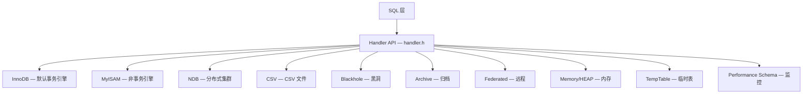

<cite>
**引用文件**
- [storage/](file://storage/)
- [storage/innobase/](file://storage/innobase/)
- [sql/handler.h](file://sql/handler.h)
- [storage/innobase/innodb.cmake](file://storage/innobase/innodb.cmake)
- [storage/myisam/](file://storage/myisam/)
- [storage/ndb/](file://storage/ndb/)
- [storage/temptable/](file://storage/temptable/)
- [storage/perfschema/](file://storage/perfschema/)
</cite>

## 目录
1. [存储引擎概述](#存储引擎概述)
2. [Handler API 架构](#handler-api-架构)
3. [InnoDB 存储引擎](#innodb-存储引擎)
4. [MyISAM 存储引擎](#myisam-存储引擎)
5. [NDB 集群存储引擎](#ndb-集群存储引擎)
6. [其他存储引擎](#其他存储引擎)
7. [引擎选择与构建配置](#引擎选择与构建配置)

## 存储引擎概述

MySQL 采用可插拔的存储引擎架构，允许在同一数据库中混合使用不同的存储引擎。每个引擎在 `storage/` 目录下有独立的实现目录，通过统一的 Handler API（`sql/handler.h`）与 SQL 层交互。



### 引擎分类

| 类别 | 引擎 | 说明 |
|------|------|------|
| **事务型** | InnoDB、NDB | 支持 ACID 事务、崩溃恢复 |
| **非事务型** | MyISAM、CSV、Archive、Blackhole | 无事务支持，适合特定场景 |
| **特殊用途** | Memory (HEAP)、TempTable、Performance Schema | 内存表、临时表、性能监控 |
| **远程访问** | Federated | 访问远程 MySQL 服务器 |
| **模板** | Example | 引擎开发参考模板 |

**Sources** · [storage/](file://storage/)

## Handler API 架构

Handler API 是 SQL 层与存储引擎之间的抽象接口，定义在 `sql/handler.h` 中。每个存储引擎实现 `ha_<engine>` 类，继承自基类 `handler`。

### 核心接口方法

| 方法 | 说明 |
|------|------|
| `handler::open()` | 打开表 |
| `handler::close()` | 关闭表 |
| `handler::write_row()` | 插入一行 |
| `handler::update_row()` | 更新一行 |
| `handler::delete_row()` | 删除一行 |
| `handler::read_row()` | 顺序读取一行 |
| `handler::index_read()` | 通过索引读取 |
| `handler::index_next()` | 索引顺序下一行 |
| `handler::index_prev()` | 索引顺序上一行 |
| `handler::rnd_init()` | 初始化全表扫描 |
| `handler::rnd_next()` | 全表扫描下一行 |
| `handler::create()` | 创建表 |
| `handler::delete_table()` | 删除表 |
| `handler::truncate()` | 截断表 |

### 引擎注册

引擎通过 `mysql_declare_plugin` 宏注册，类型为 `MYSQL_STORAGE_ENGINE_PLUGIN`。服务器通过 `TABLE::file`（一个 handler 指针）分发操作到对应引擎。

### 引擎目录结构

每个引擎目录是自包含的，包含：
- `CMakeLists.txt` — 构建配置
- `ha_<engine>.cc` — Handler 接口实现
- 引擎特定的内部代码

**Sources** · [sql/handler.h](file://sql/handler.h) · [storage/myisam/](file://storage/myisam/)

## InnoDB 存储引擎

InnoDB（`storage/innobase/`）是 MySQL 的默认事务型存储引擎，提供最完整的事务支持和并发控制能力。

### 核心特性

- **ACID 事务**：完整的提交、回滚、崩溃恢复
- **MVCC（多版本并发控制）**：读不阻塞写，写不阻塞读
- **行级锁定**：细粒度的锁管理，最大化并发
- **外键约束**：引用完整性保证
- **聚簇索引**：基于主键的 B-tree 组织表数据
- **崩溃恢复**：通过重做日志（redo log）实现自动恢复

### 子系统架构


### 子系统详细说明

| 子系统 | 目录 | 说明 |
|--------|------|------|
| **B-tree** | `btr/` | 索引操作：搜索、插入、删除、页分裂/合并 |
| **缓冲池** | `buf/` | LRU 页面缓存，采用年轻/年老页面分离策略，集成自适应哈希索引和变更缓冲 |
| **重做日志** | `log/` | 预写式日志（WAL），循环缓冲区 + 检查点 LSN 跟踪，支持崩溃恢复 |
| **锁管理器** | `lock/` | 行级锁、间隙锁、Next-Key 锁、死锁检测 |
| **事务管理器** | `trx/` | 提交、回滚、MVCC Read View 管理 |
| **数据字典** | `dict/` | 表/索引元数据的内存缓存 |
| **文件管理器** | `fil/` | 表空间文件 I/O 和管理 |
| **表空间管理** | `fsp/` | 区段（extent）和段（segment）分配 |
| **行操作** | `row/` | 行级别的增删改查 |
| **记录格式** | `rem/` | 物理行表示和字段访问 |
| **页操作** | `page/` | 页初始化、修改、验证 |
| **变更缓冲** | `ibuf/` | 缓存非唯一二级索引的修改，减少随机 I/O |
| **全文搜索** | `fts/` | 倒排索引和全文查询处理 |
| **服务生命周期** | `srv/` | 启动、关闭、后台线程（purge、page cleaner 等） |
| **同步原语** | `sync/` | 互斥锁、读写锁、条件变量，带 PSI 监控 |
| **迷你事务** | `mtr/` | 原子性页修改，配合重做日志 |
| **Handler 接口** | `ha/` | `ha_innodb` 类，桥接 InnoDB 与 MySQL Handler API |
| **克隆** | `clone/` | 物理数据克隆，用于复制配置 |
| **DDL** | `ddl/` | Instant DDL、批量加载 |

### 技术特征

- InnoDB 使用自己的内存分配层（`mem/` 模块），基于堆分配器
- 迷你事务（`mtr/`）提供原子、持久的页修改，配合重做日志
- 缓冲池使用改进的 LRU 算法，分离年轻/年老页面
- 同步原语通过 Performance Schema（PSI_*）宏进行监控
- InnoDB 有自己的线程池，用于后台任务（page cleaner、purge coordinator 等）
- 重做日志使用循环缓冲区，跟踪检查点 LSN

**Sources** · [storage/innobase/](file://storage/innobase/) · [storage/innobase/innodb.cmake](file://storage/innobase/innodb.cmake)

## MyISAM 存储引擎

MyISAM（`storage/myisam/`）是 MySQL 的传统非事务型存储引擎：

| 特性 | 说明 |
|------|------|
| 事务支持 | 不支持 |
| 锁定粒度 | 表级锁 |
| 全文索引 | 支持 |
| 空间索引 | 支持（R-tree） |
| 崩溃恢复 | 有限（需 myisamchk 修复） |
| 适用场景 | 读密集、数据仓库、全文搜索 |

MyISAM 使用三个文件存储每张表：
- `.MYD` — 数据文件
- `.MYI` — 索引文件
- `.frm` — 表定义文件（由数据字典管理）

**Sources** · [storage/myisam/](file://storage/myisam/)

## NDB 集群存储引擎

NDB（`storage/ndb/`）是 MySQL Cluster 的分布式存储引擎：

| 特性 | 说明 |
|------|------|
| 架构 | 无共享（shared-nothing）分布式集群 |
| 事务支持 | 完整 ACID |
| 数据分布 | 自动分片和复制 |
| 高可用 | 自动故障转移 |
| 一致性 | 同步复制，强一致性 |

NDB 引擎连接独立的 NDB Cluster 基础设施（数据节点、管理节点、SQL 节点），通过 NDB API 与集群通信。

**Sources** · [storage/ndb/](file://storage/ndb/)

## 其他存储引擎

### TempTable（临时表引擎）

`storage/temptable/` — 为内部临时表优化的引擎，用于处理 `ORDER BY`、`GROUP BY`、`DISTINCT`、`UNION` 等操作产生的中间结果。优先使用内存，溢出时自动转储到磁盘。

### Memory / HEAP（内存引擎）

`storage/heap/` — 数据完全存储在内存中的非持久化引擎。服务器重启后数据丢失。适合临时数据存储和快速查找表。使用表级锁和哈希索引。

### CSV

`storage/csv/` — 将数据存储为逗号分隔的文本文件。每张表对应一个 `.csv` 文件，可以用电子表格工具直接编辑。不支持索引。

### Archive

`storage/archive/` — 为大量数据归档设计的引擎。支持 INSERT 和 SELECT，不支持 UPDATE/DELETE。使用 zlib 压缩，适合历史数据存档。

### Blackhole

`storage/blackhole/` — 黑洞引擎，接受数据但不存储。所有写入被丢弃，SELECT 返回空。用于复制中继和性能测试。

### Federated

`storage/federated/` — 远程访问引擎，将本地表映射到远程 MySQL 服务器的表。本地不存储数据，所有操作转发到远程服务器。

### Performance Schema

`storage/perfschema/` — 性能监控引擎，提供服务器运行时指标的采集和查询接口。支持等待事件、阶段事件、语句事件、内存使用、元数据锁等维度的监控。

**Sources** · [storage/temptable/](file://storage/temptable/) · [storage/heap/](file://storage/heap/) · [storage/perfschema/](file://storage/perfschema/)

## 引擎选择与构建配置

### CMake 构建选项

通过 CMake 选项控制哪些引擎被编译：

| CMake 选项 | 默认值 | 说明 |
|-----------|--------|------|
| `WITH_INNOBASE_STORAGE_ENGINE` | ON | 包含 InnoDB |
| `WITH_MYISAM_STORAGE_ENGINE` | ON | 包含 MyISAM |
| `WITH_NDB` | OFF | 包含 NDB Cluster |
| `WITH_PARTITIONING_STORAGE_ENGINE` | ON | 包含分区支持 |
| `WITH_PERFSCHEMA_STORAGE_ENGINE` | ON | 包含 Performance Schema |

### 运行时引擎管理

```sql
-- 查看可用引擎
SHOW ENGINES;

-- 创建表时指定引擎
CREATE TABLE t1 (...) ENGINE=InnoDB;

-- 更改表的存储引擎
ALTER TABLE t1 ENGINE=MyISAM;

-- 动态加载引擎插件
INSTALL PLUGIN myengine SONAME 'ha_myengine.so';
```

### 引擎选择指南

| 场景 | 推荐引擎 | 原因 |
|------|---------|------|
| 通用 OLTP 应用 | InnoDB | 事务、行锁、MVCC、崩溃恢复 |
| 数据仓库/分析 | InnoDB 或 MyISAM | InnoDB 支持事务；MyISAM 读性能好 |
| 集群/高可用 | NDB | 自动分片和故障转移 |
| 数据归档 | Archive | 高压缩比，只追加 |
| 临时数据 | Memory | 最快的内存访问 |
| 复制中继 | Blackhole | 零存储开销 |
| 远程数据访问 | Federated | 透明远程查询 |
