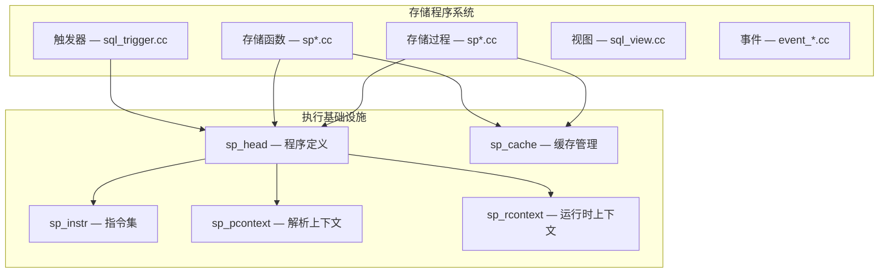
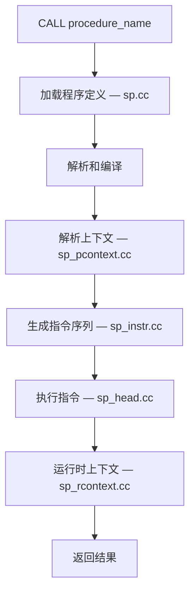
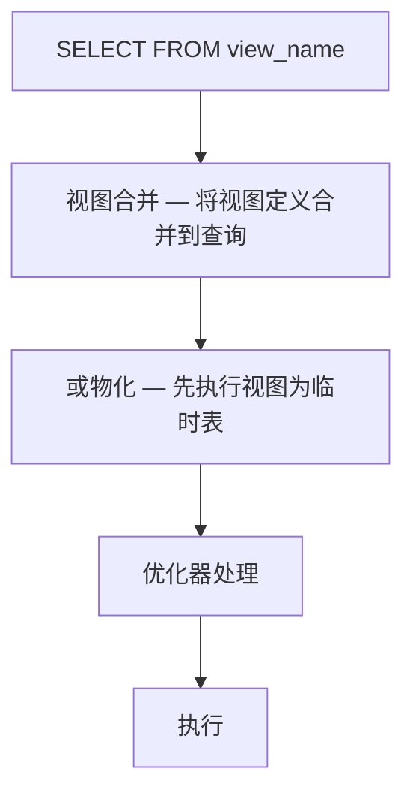
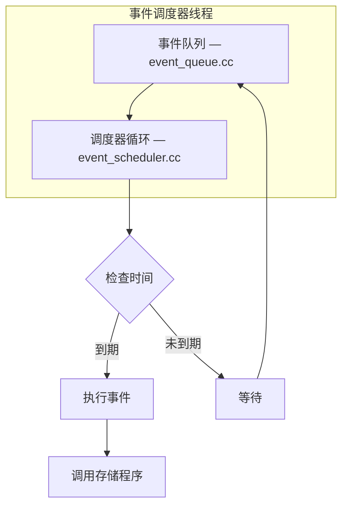

<cite>
**引用文件**
- [sql/sp.cc](file://sql/sp.cc)
- [sql/sp_head.cc](file://sql/sp_head.cc)
- [sql/sp_instr.cc](file://sql/sp_instr.cc)
- [sql/sp_pcontext.cc](file://sql/sp_pcontext.cc)
- [sql/sp_rcontext.cc](file://sql/sp_rcontext.cc)
- [sql/sp_cache.cc](file://sql/sp_cache.cc)
- [sql/sql_trigger.cc](file://sql/sql_trigger.cc)
- [sql/sql_view.cc](file://sql/sql_view.cc)
- [sql/event_*.cc](file://sql/)
</cite>

## 目录
1. [存储程序概述](#存储程序概述)
2. [存储过程与函数](#存储过程与函数)
3. [触发器](#触发器)
4. [视图](#视图)
5. [事件调度器](#事件调度器)
6. [用户定义函数（UDF）](#用户定义函数udf)

## 存储程序概述

MySQL 的存储程序系统包括存储过程、函数、触发器、视图和事件调度器。这些功能使业务逻辑可以在服务器端执行，减少网络开销并提高性能。



**Sources** · [sql/sp.cc](file://sql/sp.cc) · [sql/sp_head.cc](file://sql/sp_head.cc)

## 存储过程与函数

### 核心组件

| 文件 | 大小 | 说明 |
|------|------|------|
| `sp.cc` | ~107KB | 存储程序管理 — 加载、创建、删除 |
| `sp_head.cc` | ~134KB | 程序定义和执行引擎 |
| `sp_instr.cc` | ~64KB | 指令实现 — 程序内部的指令集 |
| `sp_instr_inline.cc` | ~57KB | 内联指令优化 |
| `sp_pcontext.cc` | ~14KB | 解析上下文 — 编译时的作用域和变量管理 |
| `sp_rcontext.cc` | ~18KB | 运行时上下文 — 执行时的变量和游标管理 |
| `sp_cache.cc` | ~7KB | 缓存管理 — 已编译程序的缓存 |

### 执行模型



### 指令集

存储程序被编译为一系列指令（`sp_instr`）：

| 指令类型 | 说明 |
|---------|------|
| `sp_instr_stmt` | SQL 语句执行 |
| `sp_instr_freturn` | 函数返回 |
| `sp_instr_set` | 变量赋值 |
| `sp_instr_jump` | 无条件跳转 |
| `sp_instr_jump_if` | 条件跳转 |
| `sp_instr_cursor_open` | 打开游标 |
| `sp_instr_cursor_fetch` | 获取游标行 |
| `sp_instr_cursor_close` | 关闭游标 |
| `sp_instr_handler` | 条件处理器（CONTINUE/EXIT/UNDO） |

### 缓存机制

```sql
-- 存储过程定义缓存在字典中
-- 首次调用时加载并编译到内存缓存

-- 手动清除缓存
FLUSH PROCEDURE CACHE;

-- 查看已缓存的程序
SHOW PROCEDURE STATUS;
```

**Sources** · [sql/sp_head.cc](file://sql/sp_head.cc) · [sql/sp_instr.cc](file://sql/sp_instr.cc)

## 触发器

`sql_trigger.cc`（~20KB）实现触发器功能：

### 触发时机

| 时机 | 事件 | 说明 |
|------|------|------|
| `BEFORE INSERT` | 插入前 | 可修改插入值 |
| `AFTER INSERT` | 插入后 | 执行附加操作 |
| `BEFORE UPDATE` | 更新前 | 可修改更新值 |
| `AFTER UPDATE` | 更新后 | 执行附加操作 |
| `BEFORE DELETE` | 删除前 | 可取消删除 |
| `AFTER DELETE` | 删除后 | 执行附加操作 |

### 执行集成


触发器与存储过程共享相同的执行基础设施（`sp_head`、`sp_instr`、`sp_rcontext`）。

```sql
-- 创建触发器示例
CREATE TRIGGER before_order_insert
BEFORE INSERT ON orders
FOR EACH ROW
BEGIN
  IF NEW.quantity <= 0 THEN
    SIGNAL SQLSTATE '45000'
      SET MESSAGE_TEXT = 'Quantity must be positive';
  END IF;
END;
```

**Sources** · [sql/sql_trigger.cc](file://sql/sql_trigger.cc)

## 视图

`sql_view.cc`（~75KB）实现视图功能：

### 视图类型

| 类型 | 说明 | 可更新 |
|------|------|--------|
| 简单视图 | 基于单表，无聚合 | 通常可以 |
| 复杂视图 | 多表连接、聚合、子查询 | 通常不可以 |
| 可更新视图 | 满足特定条件的视图 | 是 |
| CHECK OPTION | 强制通过视图的 WHERE 条件 | — |

### 处理流程



视图合并（Merge）是首选策略，将视图定义直接内联到外层查询中，让优化器统一优化。

```sql
-- 创建视图
CREATE OR REPLACE VIEW active_orders AS
SELECT o.*, c.name AS customer_name
FROM orders o
JOIN customers c ON o.customer_id = c.id
WHERE o.status = 'active';

-- 带 CHECK OPTION
CREATE VIEW high_value_orders AS
SELECT * FROM orders WHERE total > 1000
WITH CHECK OPTION;
```

**Sources** · [sql/sql_view.cc](file://sql/sql_view.cc)

## 事件调度器

事件调度器（Event Scheduler）实现定时任务功能：

### 核心文件

| 文件 | 大小 | 说明 |
|------|------|------|
| `event_data_objects.cc` | ~42KB | 事件对象定义 |
| `event_scheduler.cc` | ~29KB | 调度器线程 — 管理事件执行 |
| `event_queue.cc` | ~24KB | 事件队列 — 按时间排序 |
| `event_parse_data.cc` | ~22KB | 事件定义解析 |
| `event_db_repository.cc` | ~13KB | 事件持久化存储 |

### 执行流程



```sql
-- 启用事件调度器
SET GLOBAL event_scheduler = ON;

-- 创建定时事件
CREATE EVENT cleanup_old_logs
ON SCHEDULE EVERY 1 DAY
STARTS '2024-01-01 00:00:00'
DO
  DELETE FROM audit_log WHERE created_at < DATE_SUB(NOW(), INTERVAL 90 DAY);

-- 一次性事件
CREATE EVENT one_time_backup
ON SCHEDULE AT '2024-12-31 23:00:00'
DO CALL backup_database();
```

**Sources** · [sql/event_scheduler.cc](file://sql/event_scheduler.cc) · [sql/event_queue.cc](file://sql/event_queue.cc)

## 用户定义函数（UDF）

用户定义函数允许通过 C/C++ 动态库扩展 MySQL 功能：

### UDF 接口

| 函数 | 说明 |
|------|------|
| `xxx_init()` | 初始化（可选） |
| `xxx()` | 主函数 — 被调用执行 |
| `xxx_deinit()` | 清理（可选） |

### 支持的数据类型

| 类型 | C 类型 |
|------|--------|
| `STRING_RESULT` | `char *` |
| `INT_RESULT` | `long long` |
| `REAL_RESULT` | `double` |
| `DECIMAL_RESULT` | `char *` |

```sql
-- 安装 UDF
CREATE FUNCTION my_func RETURNS STRING
  SONAME 'my_udf.so';

-- 使用
SELECT my_func('hello');

-- 卸载
DROP FUNCTION my_func;
```

**Sources** · [sql/sql_udf.cc](file://sql/sql_udf.cc)
