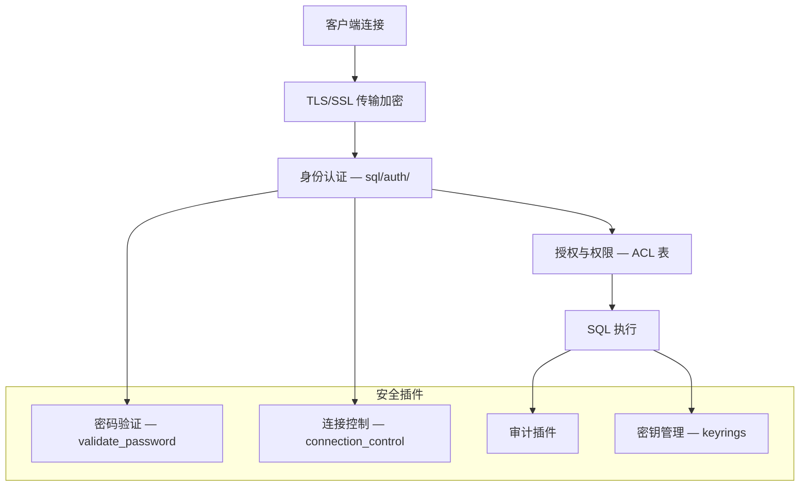
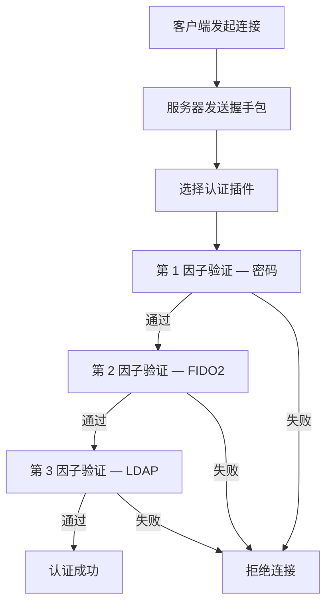

<cite>
**引用文件**
- [sql/auth/](file://sql/auth/)
- [plugin/auth/](file://plugin/auth/)
- [plugin/connection_control/](file://plugin/connection_control/)
- [plugin/password_validation/](file://plugin/password_validation/)
- [components/validate_password/](file://components/validate_password/)
- [components/connection_control/](file://components/connection_control/)
- [components/keyrings/](file://components/keyrings/)
- [vio/viossl.cc](file://vio/viossl.cc)
- [vio/viosslfactories.cc](file://vio/viosslfactories.cc)
</cite>

## 目录
1. [安全架构概述](#安全架构概述)
2. [身份认证](#身份认证)
3. [授权与权限管理](#授权与权限管理)
4. [传输层加密（TLS/SSL）](#传输层加密tlsssl)
5. [数据加密](#数据加密)
6. [密码策略](#密码策略)
7. [连接控制](#连接控制)
8. [审计](#审计)

## 安全架构概述

MySQL Server 提供多层次的安全防护体系：



**Sources** · [sql/auth/](file://sql/auth/)

## 身份认证

MySQL 支持多种身份认证插件，实现在 `sql/auth/`（服务器端）和 `libmysql/`（客户端）中：

### 认证插件列表

| 插件 | 类型 | 安全等级 | 说明 |
|------|------|---------|------|
| `caching_sha2_password` | 密码哈希 | 高 | **默认插件**。SHA-256 哈希 + RSA 密钥对，带认证缓存 |
| `sha256_password` | 密码哈希 | 高 | SHA-256 哈希，无缓存（每次重新验证） |
| `mysql_native_password` | 密码哈希 | 中 | 传统 SHA1 哈希（已弃用，兼容旧客户端） |
| `auth_socket` | 操作系统 | 中 | Unix 套接字对等认证（仅本地） |
| `authentication_ldap_sasl` | 外部 | 高 | LDAP SASL 认证 |
| `authentication_ldap_simple` | 外部 | 高 | LDAP 简单绑定认证 |
| `authentication_kerberos` | 外部 | 高 | Kerberos/GSSAPI 单点登录 |
| `authentication_fido` | 设备 | 最高 | FIDO2/WebAuthn 硬件设备认证 |
| `authentication_openid_connect` | 外部 | 高 | OpenID Connect OAuth 认证 |
| `authentication_win` | 操作系统 | 中 | Windows 原生认证 |
| `authentication_oci_client` | 外部 | 高 | Oracle Cloud Infrastructure 认证 |

### 多因子认证（MFA）

MySQL 支持最多 3 个认证因素的组合：

```sql
-- 创建多因子认证用户
CREATE USER 'admin'@'%' IDENTIFIED BY 'password'         -- 第 1 因子：密码
  AND IDENTIFIED WITH authentication_fido                 -- 第 2 因子：FIDO2 设备
  AND IDENTIFIED WITH authentication_ldap_sasl;           -- 第 3 因子：LDAP

-- 修改现有用户添加 MFA
ALTER USER 'admin'@'%'
  ADD FACTOR IDENTIFIED WITH authentication_fido;
```

### 认证流程



**Sources** · [sql/auth/](file://sql/auth/) · [plugin/auth/](file://plugin/auth/)

## 授权与权限管理

### ACL（访问控制列表）

权限信息存储在数据字典的系统表中：

| 权限级别 | 系统表 | 作用范围 |
|---------|--------|---------|
| 全局权限 | `mysql.global_grants` | 所有数据库 |
| 数据库权限 | `mysql.db` | 指定数据库 |
| 表权限 | `mysql.tables_priv` | 指定表 |
| 列权限 | `mysql.columns_priv` | 指定列 |

### 权限类型

| 权限 | 说明 |
|------|------|
| `SELECT` / `INSERT` / `UPDATE` / `DELETE` | DML 操作 |
| `CREATE` / `ALTER` / `DROP` | DDL 操作 |
| `INDEX` / `REFERENCES` | 索引和外键 |
| `GRANT OPTION` | 授权给其他用户 |
| `SUPER` / `SYSTEM_USER` | 管理权限 |
| `FILE` / `PROCESS` / `RELOAD` | 服务器管理 |
| `REPLICATION SLAVE` / `REPLICATION CLIENT` | 复制权限 |
| `BINLOG_ADMIN` / `BINLOG_ENCRYPTION_ADMIN` | Binlog 管理 |

### 角色（Role）

角色是权限的命名集合，可以批量授予/撤销：

```sql
-- 创建角色
CREATE ROLE 'app_read', 'app_write';

-- 授予权限给角色
GRANT SELECT ON app_db.* TO 'app_read';
GRANT INSERT, UPDATE, DELETE ON app_db.* TO 'app_write';

-- 授予角色给用户
GRANT 'app_read', 'app_write' TO 'developer'@'%';

-- 激活角色
SET DEFAULT ROLE ALL TO 'developer'@'%';

-- 部分撤销（Partial Revokes）
REVOKE INSERT ON *.* FROM 'developer'@'%' EXCEPT app_db.*;
```

**Sources** · [sql/auth/](file://sql/auth/)

## 传输层加密（TLS/SSL）

MySQL 使用 OpenSSL 实现 TLS/SSL 加密，代码在 VIO 层：

### TLS 架构

| 模块 | 文件 | 说明 |
|------|------|------|
| SSL 传输 | `vio/viossl.cc` | 封装 OpenSSL SSL_read/SSL_write |
| SSL 工厂 | `vio/viosslfactories.cc` | SSL 上下文创建、证书加载、密码套件配置 |
| SSL 配置 | `cmake/ssl.cmake` | OpenSSL 检测和配置 |

### 加密连接配置

```sql
-- 服务器端配置
[mysqld]
ssl-ca = ca.pem
ssl-cert = server-cert.pem
ssl-key = server-key.pem
require_secure_transport = ON

-- 客户端连接
mysql --ssl-mode=REQUIRED -h host -u user -p
```

### SSL 模式

| 模式 | 说明 |
|------|------|
| `DISABLED` | 不使用 SSL |
| `PREFERRED` | 优先使用 SSL（默认） |
| `REQUIRED` | 必须使用 SSL |
| `VERIFY_CA` | 验证服务器证书 CA |
| `VERIFY_IDENTITY` | 验证证书 CA 和主机名 |

**Sources** · [vio/viossl.cc](file://vio/viossl.cc) · [vio/viosslfactories.cc](file://vio/viosslfactories.cc)

## 数据加密

### 密钥管理（Keyring）

密钥管理通过插件和组件两种方式实现：

| 实现方式 | 模块 | 后端类型 |
|---------|------|---------|
| 插件 | `plugin/keyring/` | keyring_file、keyring_hashicorp、keyring_okv |
| 组件 | `components/keyrings/` | 基于文件、加密文件的密钥管理 |

### 表空间加密

InnoDB 支持透明数据加密（TDE）：

```sql
-- 创建加密表
CREATE TABLE t1 (id INT PRIMARY KEY, data VARCHAR(100))
ENCRYPTION='Y';

-- 加密密钥管理
ALTER INSTANCE ROTATE INNODB MASTER KEY;
```

加密架构：
- **Master Key** — 由 keyring 管理的主密钥
- **Tablespace Key** — 每个表空间的加密密钥，由 Master Key 加密存储
- **双层密钥架构** — 旋转 Master Key 不需要重新加密数据

**Sources** · [plugin/keyring/](file://plugin/keyring/) · [components/keyrings/](file://components/keyrings/)

## 密码策略

### validate_password 组件/插件

`components/validate_password/` 和 `plugin/password_validation/` 实现密码强度策略：

| 参数 | 说明 |
|------|------|
| `validate_password.policy` | 策略级别：LOW / MEDIUM / STRONG |
| `validate_password.length` | 最小密码长度 |
| `validate_password.mixed_case_count` | 最少大小写字符数 |
| `validate_password.number_count` | 最少数字字符数 |
| `validate_password.special_char_count` | 最少特殊字符数 |
| `validate_password.dictionary_file` | 字典文件（禁止使用的单词） |

**Sources** · [components/validate_password/](file://components/validate_password/) · [plugin/password_validation/](file://plugin/password_validation/)

## 连接控制

`components/connection_control/` 和 `plugin/connection_control/` 防止暴力破解：

| 功能 | 说明 |
|------|------|
| **失败计数** | 跟踪每个用户的连续认证失败次数 |
| **延迟响应** | 超过阈值后增加认证响应延迟 |
| **最大延迟** | 可配置的最大延迟时间 |
| **白名单** | 可豁免连接控制的账户 |

**Sources** · [plugin/connection_control/](file://plugin/connection_control/)

## 审计

审计插件记录服务器上的所有活动，用于合规和安全监控：

| 插件/组件 | 说明 |
|----------|------|
| `plugin/audit_null/` | 审计插件示例模板 |
| 第三方审计插件 | 企业版审计日志 |

审计事件类型：
- 连接/断开事件
- 查询执行事件
- DDL 变更事件
- 权限变更事件
- 表访问事件
