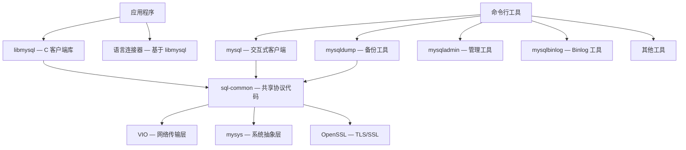

<cite>
**引用文件**
- [client/](file://client/)
- [libmysql/](file://libmysql/)
- [sql-common/](file://sql-common/)
- [libbinlogevents/](file://libbinlogevents/)
- [libchangestreams/](file://libchangestreams/)
</cite>

## 目录
1. [客户端体系概述](#客户端体系概述)
2. [MySQL C 客户端库（libmysql）](#mysql-c-客户端库libmysql)
3. [共享协议代码（sql-common）](#共享协议代码sql-common)
4. [命令行客户端工具](#命令行客户端工具)
5. [管理与运维工具](#管理与运维工具)
6. [客户端编码规范](#客户端编码规范)

## 客户端体系概述

MySQL 的客户端生态由多个层次组成，共享协议代码确保服务器端和客户端的一致性：



**Sources** · [client/](file://client/) · [libmysql/](file://libmysql/)

## MySQL C 客户端库（libmysql）

`libmysql/` 提供 MySQL C 客户端库，是应用程序连接 MySQL 服务器的主要 API。

### 核心架构

| 模块 | 文件 | 说明 |
|------|------|------|
| 核心库 | `libmysql.cc`（~154KB） | 连接管理、查询执行、结果集处理、预处理语句、事务控制 |
| 错误消息 | `errmsg.cc` | 客户端侧错误消息格式化 |
| DNS SRV | `dns_srv.cc` | DNS SRV 记录解析（服务发现） |
| 协议追踪 | `mysql_trace.cc` | 客户端/服务器通信调试 |

### C API 函数

libmysql 导出的 `mysql_*` C API 函数被所有 MySQL 客户端程序和连接器使用：

| 函数 | 说明 |
|------|------|
| `mysql_real_connect()` | 连接到 MySQL 服务器 |
| `mysql_query()` | 执行 SQL 查询 |
| `mysql_store_result()` | 获取完整结果集 |
| `mysql_use_result()` | 逐行获取结果集 |
| `mysql_fetch_row()` | 获取一行数据 |
| `mysql_stmt_prepare()` | 准备预处理语句 |
| `mysql_stmt_execute()` | 执行预处理语句 |
| `mysql_real_escape_string()` | SQL 字符串转义 |
| `mysql_close()` | 关闭连接 |

### 客户端认证插件

libmysql 包含客户端侧的认证插件实现：

| 目录 | 认证方式 |
|------|---------|
| `authentication_native_password/` | mysql_native_password 协议 |
| `authentication_ldap/` | LDAP 认证客户端 |
| `authentication_kerberos/` | Kerberos/GSSAPI 认证 |
| `authentication_openid_connect_client/` | OpenID Connect 支持 |
| `authentication_win/` | Windows 原生认证 |
| `authentication_oci_client/` | Oracle Cloud 认证 |
| `fido_client/` | FIDO2/WebAuthn 认证（使用 libfido2） |

### 依赖关系

libmysql 链接以下库：
- **VIO** — 网络传输层
- **mysys** — 平台抽象层
- **OpenSSL** — TLS/SSL 加密
- **sql-common** — 共享协议代码

**Sources** · [libmysql/](file://libmysql/)

## 共享协议代码（sql-common）

`sql-common/` 包含服务器（`mysqld`）和客户端库（`libmysqlclient`）共享的代码，避免协议两侧的代码重复。

### 核心模块

| 模块 | 文件 | 大小 | 说明 |
|------|------|------|------|
| 客户端协议 | `client.cc` | ~347KB | 客户端侧 MySQL 协议实现 — 包读写、握手、查询分发 |
| 网络服务 | `net_serv.cc` | ~79KB | 网络传输层 — 包级别读写，支持压缩 |
| JSON DOM | `json_dom.cc` | ~133KB | JSON 文档对象模型实现 |
| JSON 二进制 | `json_binary.cc` | ~76KB | MySQL 二进制 JSON 格式（InnoDB 存储使用） |
| JSON 路径 | `json_path.cc` | ~24KB | JSON 路径表达式（RFC 6901） |
| JSON Diff | `json_diff.cc` | ~20KB | JSON 差异计算（部分更新） |
| JSON Schema | `json_schema.cc` | ~12KB | JSON Schema 验证 |
| 客户端认证 | `client_authentication.cc` | ~39KB | 客户端侧认证协议 |
| 客户端插件 | `client_plugin.cc` | ~22KB | 客户端插件加载框架 |
| 十进制运算 | `my_decimal.cc` | ~13KB | DECIMAL 类型算术（服务器/客户端共享） |
| 参数绑定 | `bind_params.cc` | ~18KB | 预处理语句参数绑定 |
| 压缩 | `compression.cc` | — | 协议级压缩（zlib/zstd） |

### JSON 子系统

JSON 子系统是 sql-common 的重要组成部分，提供完整的 JSON 数据模型：
- **DOM 模型**：`json_dom.cc` 实现内存中的 JSON 文档表示
- **二进制格式**：`json_binary.cc` 实现 MySQL 特有的二进制 JSON 存储格式，优化查询性能
- **路径表达式**：支持 RFC 6901 标准的 JSON 路径
- **部分更新**：`json_diff.cc` 支持 JSON 列的增量更新，无需重写整个文档

**Sources** · [sql-common/](file://sql-common/)

## 命令行客户端工具

### mysql — 交互式 SQL 客户端

`client/mysql.cc`（~204KB）是最常用的 MySQL 客户端：

| 功能 | 说明 |
|------|------|
| 交互式查询 | readline/libedit 支持的命令行编辑和历史记录 |
| 批处理模式 | 从文件或标准输入读取 SQL |
| 表格/垂直输出 | `--vertical` 标志切换输出格式 |
| 自动补全 | 表名、列名、关键字补全 |
| 命令历史 | 持久化的命令历史 |

### mysqldump — 逻辑备份工具

`client/mysqldump.cc`（~246KB）提供逻辑备份和导出功能：

| 功能 | 说明 |
|------|------|
| 全库备份 | 导出所有数据库 |
| 单表备份 | 导出指定的表 |
| 结构导出 | 仅导出表结构（DDL） |
| 数据导出 | 仅导出数据（INSERT 语句） |
| 压缩导出 | 配合 gzip 压缩输出 |

## 管理与运维工具

### 工具集一览

| 工具 | 源码大小 | 说明 |
|------|---------|------|
| `mysqladmin` | — | 服务器管理（启动/停止/状态/变量/进程列表） |
| `mysqlbinlog` | — | 二进制日志查看和回放工具 |
| `mysqlimport` | — | 批量数据导入（基于 LOAD DATA INFILE） |
| `mysqlshow` | — | 数据库/表/列信息查询 |
| `mysqlslap` | — | 负载模拟和基准测试 |
| `mysql_config_editor` | — | 登录路径文件管理（安全凭证存储） |
| `mysql_secure_installation` | — | 安全加固向导（删除匿名用户、禁用远程 root 等） |
| `mysqltest` | ~389KB | MTR 测试框架专用客户端 |

### mysqlbinlog 工具

`mysqlbinlog` 是二进制日志的操作工具：

```bash
# 查看 binlog 内容
mysqlbinlog binlog.000001

# 指定时间范围回放
mysqlbinlog --start-datetime="2024-01-01 00:00:00" \
            --stop-datetime="2024-01-02 00:00:00" \
            binlog.000001 | mysql -u root -p

# 远程读取 binlog
mysqlbinlog --read-from-remote-server --host=server \
            --user=root --password binlog.000001
```

**Sources** · [client/](file://client/)

## 客户端编码规范

客户端程序遵循统一的编码规范：

- 所有客户端程序使用 mysys 的 `my_getopt` 选项解析框架，提供一致的 `--option` 处理
- 密码提示使用 `get_tty_password()` 进行安全终端输入（无回显）
- 客户端程序使用 `mysql.h` 中的 `MYSQL_HANDLE` 结构进行所有服务器交互
- 输出格式化支持表格式和垂直格式（`--vertical` 标志），各工具一致
- 错误消息使用客户端侧错误码系统（`CR_*` 代码），与服务器端错误码（`ER_*` 代码）区分
- mysql 客户端使用 readline/libedit 实现的命令历史和补全系统

**Sources** · [client/](file://client/) · [libmysql/](file://libmysql/)
