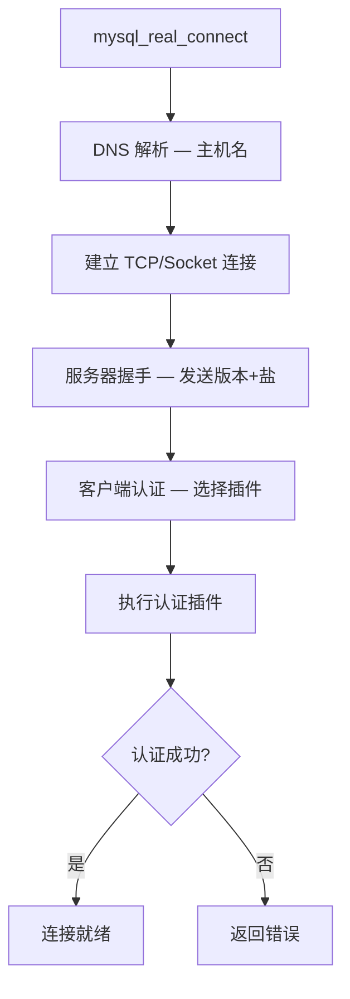
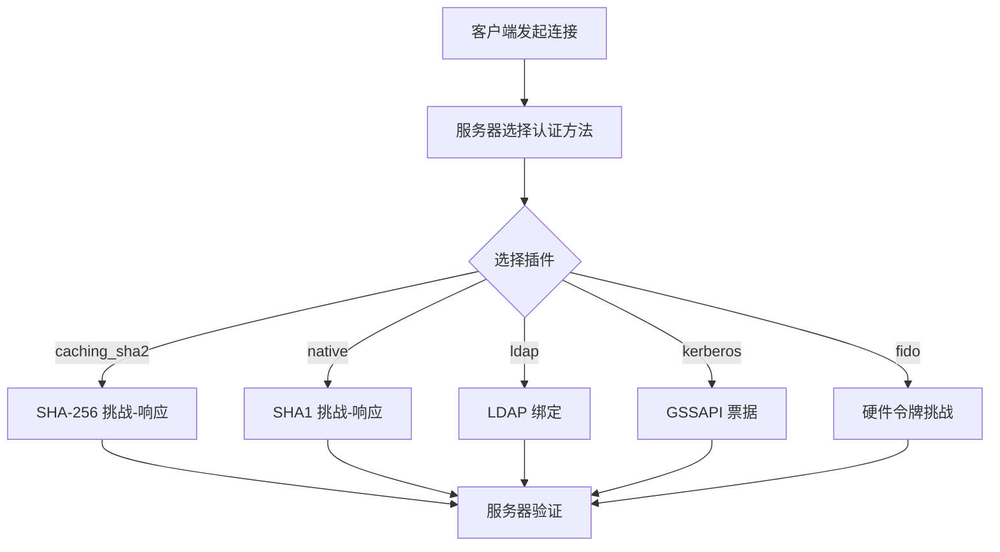

<cite>
**引用文件**
- [libmysql/libmysql.cc](file://libmysql/libmysql.cc)
- [libmysql/dns_srv.cc](file://libmysql/dns_srv.cc)
- [libmysql/mysql_trace.cc](file://libmysql/mysql_trace.cc)
- [libmysql/authentication_native_password/](file://libmysql/authentication_native_password/)
- [libmysql/authentication_ldap/](file://libmysql/authentication_ldap/)
- [libmysql/authentication_kerberos/](file://libmysql/authentication_kerberos/)
- [libmysql/authentication_win/](file://libmysql/authentication_win/)
- [libmysql/fido_client/](file://libmysql/fido_client/)
</cite>

## 目录
1. [客户端库概述](#客户端库概述)
2. [libmysql 核心实现](#libmysql-核心实现)
3. [客户端认证插件](#客户端认证插件)
4. [DNS SRV 支持](#dns-srv-支持)
5. [客户端追踪](#客户端追踪)
6. [连接 API 详解](#连接-api-详解)

## 客户端库概述

MySQL 客户端库 `libmysql/` 提供 C API（libmysqlclient），是所有 MySQL 客户端工具和驱动的基础：

```mermaid
graph TB
    subgraph 客户端库 — libmysql
        API[C API — mysql.h]
        PROTOCOL[协议实现 — libmysql.cc]
        AUTH[认证插件]
        DNS[DNS SRV]
        TRACE[追踪 — mysql_trace.cc]
    end

    subgraph 认证插件
        NATIVE[mysql_native_password]
        CACHING[caching_sha2_password]
        LDAP[authentication_ldap]
        KERBEROS[kerberos]
        WIN[Windows auth]
        FIDO[FIDO2/WebAuthn]
    end

    API --> PROTOCOL
    PROTOCOL --> AUTH
    AUTH --> NATIVE
    AUTH --> CACHING
    AUTH --> LDAP
    AUTH --> KERBEROS
    AUTH --> WIN
    AUTH --> FIDO
    PROTOCOL --> DNS
    PROTOCOL --> TRACE
```

**Sources** · [libmysql/](file://libmysql/)

## libmysql 核心实现

`libmysql.cc`（~150KB）是客户端库的核心文件，实现了 MySQL C API 的所有函数：

### 主要 API 函数

| 函数类别 | 函数 | 说明 |
|----------|------|------|
| **连接** | `mysql_real_connect()` | 建立服务器连接 |
| **连接** | `mysql_close()` | 关闭连接 |
| **查询** | `mysql_query()` | 执行 SQL 查询 |
| **查询** | `mysql_real_query()` | 执行带二进制数据的查询 |
| **结果** | `mysql_store_result()` | 读取全部结果到内存 |
| **结果** | `mysql_use_result()` | 逐行读取结果 |
| **结果** | `mysql_fetch_row()` | 获取下一行 |
| **结果** | `mysql_free_result()` | 释放结果集 |
| **准备** | `mysql_stmt_prepare()` | 准备预处理语句 |
| **准备** | `mysql_stmt_execute()` | 执行预处理语句 |
| **元数据** | `mysql_list_dbs()` | 列出数据库 |
| **元数据** | `mysql_list_tables()` | 列出表 |
| **事务** | `mysql_commit()` | 提交事务 |
| **事务** | `mysql_rollback()` | 回滚事务 |

### 连接流程



### 连接参数

```c
MYSQL *conn = mysql_init(NULL);
mysql_options(conn, MYSQL_OPT_CONNECT_TIMEOUT, &timeout);
mysql_options(conn, MYSQL_OPT_SSL_MODE, &ssl_mode);
mysql_options(conn, MYSQL_OPT_COMPRESSION_ALGORITHMS, "zstd,zlib");
mysql_options(conn, MYSQL_OPT_READ_TIMEOUT, &read_timeout);

mysql_real_connect(conn, "host", "user", "password", "database",
                   3306, NULL, CLIENT_MULTI_STATEMENTS);
```

**Sources** · [libmysql/libmysql.cc](file://libmysql/libmysql.cc)

## 客户端认证插件

MySQL 9.6.0 支持多种客户端认证插件：

### 认证插件列表

| 插件 | 目录 | 说明 |
|------|------|------|
| `mysql_native_password` | `authentication_native_password/` | 传统密码哈希（SHA1） |
| `caching_sha2_password` | `authentication_` | SHA-256 密码（默认） |
| `authentication_ldap_sasl` | `authentication_ldap/` | LDAP SASL 认证 |
| `authentication_ldap_simple` | `authentication_ldap/` | LDAP 简单绑定 |
| `authentication_kerberos` | `authentication_kerberos/` | Kerberos/GSSAPI |
| `authentication_win` | `authentication_win/` | Windows 原生认证 |
| `authentication_oci_client` | `authentication_oci_client/` | Oracle Cloud Infrastructure |
| `authentication_openid_connect` | `authentication_openid_connect_client/` | OpenID Connect |
| `fido_client` | `fido_client/` | FIDO2/WebAuthn 无密码认证 |

### 认证流程



### 默认认证

```sql
-- 查看默认认证插件
SELECT @@authentication_policy;

-- 设置用户认证方式
ALTER USER 'admin'@'%' IDENTIFIED WITH caching_sha2_password BY 'password';

-- FIDO2 注册
ALTER USER 'admin'@'%' IDENTIFIED WITH authentication_fido;
-- 首次连接时使用硬件令牌注册
```

**Sources** · [libmysql/authentication_native_password/](file://libmysql/authentication_native_password/) · [libmysql/fido_client/](file://libmysql/fido_client/)

## DNS SRV 支持

`dns_srv.cc`（~6KB）实现 DNS SRV 记录解析，用于服务发现和负载均衡：

### SRV 记录

```
_mysql._tcp.example.com. IN SRV 10 5 3306 db1.example.com.
_mysql._tcp.example.com. IN SRV 10 5 3306 db2.example.com.
_mysql._tcp.example.com. IN SRV 20 5 3306 db3.example.com.
```

```c
// 使用 DNS SRV 连接
mysql_options(conn, MYSQL_OPT_PROTOCOL, "tcp");
mysql_real_connect(conn, "_mysql._tcp.example.com", "user", "pass",
                   "db", 0, NULL, 0);
// 客户端自动解析 SRV 记录，按优先级和权重连接
```

**Sources** · [libmysql/dns_srv.cc](file://libmysql/dns_srv.cc)

## 客户端追踪

`mysql_trace.cc`（~7KB）提供客户端协议追踪功能：

### 追踪阶段

| 阶段 | 说明 |
|------|------|
| `CONNECT_DONE` | 连接建立完成 |
| `SEND_COMMAND` | 发送命令到服务器 |
| `SEND_PACKET` | 发送网络包 |
| `RECEIVE_PACKET` | 接收网络包 |
| `READ_PACKET` | 读取数据包 |
| `PROTOCOL_PACKET` | 协议层包处理 |
| `AUTH_PLUGIN` | 认证插件交互 |
| `CONNECT_FAILED` | 连接失败 |

```c
// 启用追踪
mysql_options(conn, MYSQL_OPT_TRACE_PLUGIN, &trace_plugin);
```

**Sources** · [libmysql/mysql_trace.cc](file://libmysql/mysql_trace.cc)

## 连接 API 详解

### 多线程安全

| API | 说明 |
|-----|------|
| `mysql_init()` | 必须在每个线程中调用 |
| `mysql_thread_init()` | 初始化线程特定数据 |
| `mysql_thread_end()` | 清理线程特定数据 |
| `mysql_library_init()` | 全局初始化（仅调用一次） |
| `mysql_library_end()` | 全局清理 |

### 连接池模式

```c
// 连接池伪代码
MYSQL_POOL *pool = pool_init(host, user, pass, db, max_connections);
MYSQL *conn = pool_get_connection(pool);
mysql_query(conn, "SELECT ...");
pool_release_connection(pool, conn);
pool_destroy(pool);
```

### 编译链接

```bash
# 编译使用 libmysqlclient 的程序
gcc -o myapp myapp.c $(mysql_config --cflags --libs)

# 或使用 CMake
find_package(MySQL REQUIRED)
target_link_libraries(myapp ${MySQL_LIBRARIES})
```

**Sources** · [libmysql/libmysql.cc](file://libmysql/libmysql.cc)
