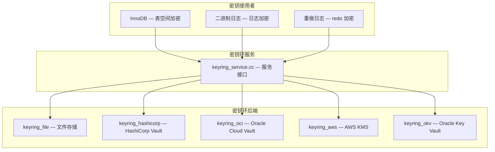
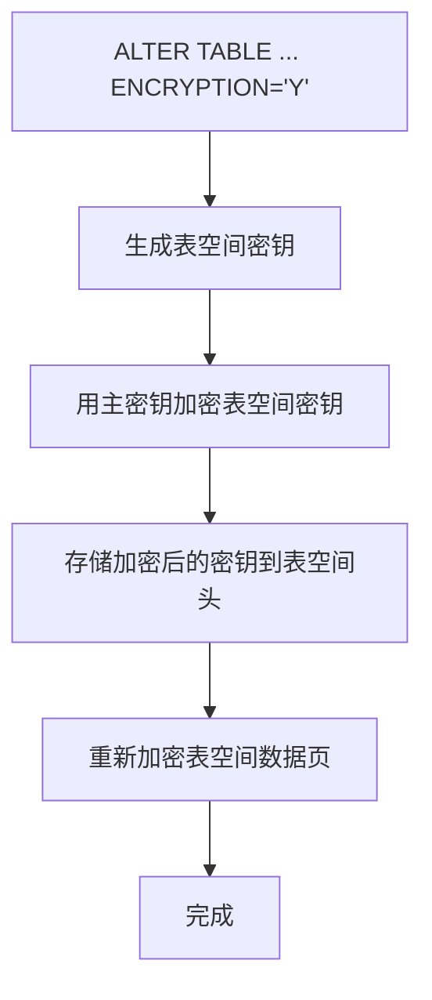
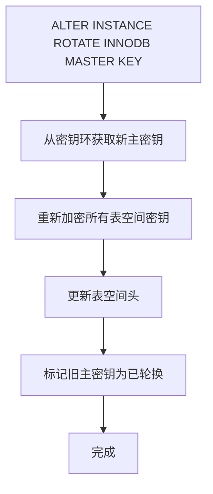

<cite>
**引用文件**
- [sql/keyring_service.cc](file://sql/keyring_service.cc)
- [plugin/keyring/](file://plugin/keyring/)
- [storage/innobase/os/os0file.cc](file://storage/innobase/os/os0file.cc)
- [storage/innobase/fil/fil0crypt.cc](file://storage/innobase/fil/fil0crypt.cc)
- [sql/mysqld.cc](file://sql/mysqld.cc)
</cite>

## 目录
1. [密钥管理概述](#密钥管理概述)
2. [密钥环架构](#密钥环架构)
3. [密钥环组件](#密钥环组件)
4. [透明数据加密（TDE）](#透明数据加密tde)
5. [InnoDB 表空间加密](#innodb-表空间加密)
6. [二进制日志加密](#二进制日志加密)
7. [密钥生命周期管理](#密钥生命周期管理)

## 密钥管理概述

MySQL 的密钥管理系统采用密钥环（Keyring）架构，为服务器提供加密密钥的存储和检索服务。核心接口在 `sql/keyring_service.cc` 中定义：



**Sources** · [sql/keyring_service.cc](file://sql/keyring_service.cc)

## 密钥环架构

### 密钥层次

MySQL 使用两层密钥架构：

```mermaid
graph TB
    subgraph 主密钥 — Master Key
        MASTER[表空间主密钥 — 存储在密钥环中]
    end

    subgraph 表空间密钥 — Tablespace Key
        TS_KEY1[表空间密钥1 — 由主密钥加密]
        TS_KEY2[表空间密钥2 — 由主密钥加密]
    end

    MASTER --> |加密| TS_KEY1
    MASTER --> |加密| TS_KEY2
    TS_KEY1 --> |加密| DATA1[表空间数据]
    TS_KEY2 --> |加密| DATA2[表空间数据]
```

| 层级 | 说明 |
|------|------|
| **主密钥（Master Key）** | 存储在外部密钥环中，受密钥环保护 |
| **表空间密钥（Tablespace Key）** | 存储在表空间头部，由主密钥加密 |
| **数据加密** | 使用表空间密钥进行 AES 加密 |

### 加密算法

| 算法 | 密钥长度 | 使用场景 |
|------|---------|---------|
| AES-128 | 128 位 | 默认表空间加密 |
| AES-192 | 192 位 | 增强加密 |
| AES-256 | 256 位 | 最强加密 |

**Sources** · [plugin/keyring/](file://plugin/keyring/)

## 密钥环组件

MySQL 8.0+ 推荐使用组件架构的密钥环：

### 组件密钥环

| 组件 | 说明 | 适用场景 |
|------|------|---------|
| `component_keyring_file` | 本地文件存储 | 开发/测试环境 |
| `component_keyring_encrypted_file` | 加密文件存储 | 中小规模生产 |
| `component_keyring_hashicorp` | HashiCorp Vault | 云原生/DevSecOps |
| `component_keyring_oci` | Oracle Cloud Vault | OCI 环境 |
| `component_keyring_aws` | AWS KMS | AWS 环境 |
| `component_keyring_okv` | Oracle Key Vault | Oracle 生态 |

### 安装和配置

```sql
-- 安装密钥环组件
INSTALL COMPONENT 'file://component_keyring_file';

-- 查看已安装的组件
SELECT * FROM mysql.component;

-- 创建密钥环配置文件
-- 文件位置: mysqld.my.d/component_keyring_file.cnf
```

```json
{
  "read_local_config": true,
  "path": "/var/lib/mysql-keyring/keyring_file",
  "read_only": false
}
```

**Sources** · [plugin/keyring/](file://plugin/keyring/)

## 透明数据加密（TDE）

TDE（Transparent Data Encryption）对数据文件进行透明加密，应用程序无需修改：

### 加密范围

| 加密目标 | 加密粒度 | 说明 |
|---------|---------|------|
| 表空间 | 整个表空间 | 最常用的加密单元 |
| 通用表空间 | 整个通用表空间 | 多表共享加密 |
| 二进制日志 | 整个日志文件 | binlog 加密 |
| 重做日志 | redo 日志文件 | 崩溃恢复日志加密 |
| undo 日志 | undo 表空间 | 事务回滚数据加密 |

### 未加密的内容

| 内容 | 说明 |
|------|------|
| 临时表 | 不加密 |
| redo/undo（默认） | 需显式启用 |
| 二进制日志事件头 | 元数据不加密 |
| 内存中的缓冲池页 | 仅在磁盘上加密 |

**Sources** · [storage/innobase/fil/fil0crypt.cc](file://storage/innobase/fil/fil0crypt.cc)

## InnoDB 表空间加密

### 启用加密

```sql
-- 创建加密表
CREATE TABLE sensitive_data (
  id INT PRIMARY KEY AUTO_INCREMENT,
  ssn VARCHAR(11),
  credit_card VARCHAR(20)
) ENGINE=InnoDB ENCRYPTION='Y';

-- 加密现有表
ALTER TABLE orders ENCRYPTION='Y';

-- 创建加密通用表空间
CREATE TABLESPACE encrypted_ts
  ADD DATAFILE 'encrypted_ts.ibd'
  ENCRYPTION='Y';

-- 将表移到加密表空间
ALTER TABLE sensitive_data TABLESPACE encrypted_ts;
```

### 加密过程



### 检查加密状态

```sql
-- 查看加密的表空间
SELECT TABLE_SCHEMA, TABLE_NAME, CREATE_OPTIONS
FROM INFORMATION_SCHEMA.TABLES
WHERE CREATE_OPTIONS LIKE '%ENCRYPTION%';

-- 查看加密密钥信息
SELECT * FROM INFORMATION_SCHEMA.INNODB_TABLESPACES_ENCRYPTION;
```

**Sources** · [storage/innobase/fil/fil0crypt.cc](file://storage/innobase/fil/fil0crypt.cc)

## 二进制日志加密

```sql
-- 启用 binlog 加密
SET GLOBAL binlog_encryption = ON;

-- 检查状态
SHOW VARIABLES LIKE 'binlog_encryption';
```

binlog 加密使用独立的密钥，与表空间加密密钥分开管理。

## 密钥生命周期管理

### 主密钥轮换

定期轮换主密钥是安全最佳实践：

```sql
-- 轮换 InnoDB 主密钥
ALTER INSTANCE ROTATE INNODB MASTER KEY;

-- 轮换 binlog 主密钥
ALTER INSTANCE ROTATE BINLOG MASTER KEY;
```

### 轮换过程



**注意**：主密钥轮换不会重新加密数据，仅重新加密表空间密钥。

### 安全注意事项

| 事项 | 说明 |
|------|------|
| **密钥备份** | 密钥环数据丢失 = 数据永久不可读 |
| **权限控制** | 仅 `KEYRING_ADMIN` 权限可管理密钥 |
| **审计** | 密钥操作应记录到审计日志 |
| **密钥隔离** | 生产环境应使用外部 KMS |

```sql
-- 授予密钥管理权限
GRANT KEYRING_ADMIN ON *.* TO 'admin'@'localhost';

-- 查看密钥操作审计
SELECT * FROM performance_schema.events_statements_history
WHERE SQL_TEXT LIKE '%ROTATE%MASTER%KEY%';
```

**Sources** · [sql/keyring_service.cc](file://sql/keyring_service.cc) · [storage/innobase/os/os0file.cc](file://storage/innobase/os/os0file.cc)
