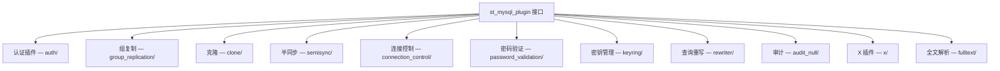

<cite>
**引用文件**
- [plugin/](file://plugin/)
- [components/](file://components/)
- [libservices/](file://libservices/)
- [sql/server_component/](file://sql/server_component/)
- [include/mysql/components/services/](file://include/mysql/components/services/)
</cite>

## 目录
1. [扩展架构概述](#扩展架构概述)
2. [插件系统](#插件系统)
3. [组件架构](#组件架构)
4. [插件服务库（libservices）](#插件服务库libservices)
5. [插件与组件对比](#插件与组件对比)
6. [开发新扩展](#开发新扩展)

## 扩展架构概述

MySQL Server 提供两种扩展机制：**插件系统**（传统）和**组件架构**（现代）。两者共存，组件架构正在逐步替代插件系统的许多功能：

```mermaid
graph TB
    SERVER[MySQL Server — mysqld]

    subgraph 传统扩展 — 插件系统
        PLUGIN_REGISTRY[插件注册表]
        PLUGIN_REGISTRY --> AUTH_PLUGIN[认证插件]
        PLUGIN_REGISTRY --> REPL_PLUGIN[复制插件]
        PLUGIN_REGISTRY --> STORAGE_PLUGIN[存储引擎插件]
        PLUGIN_REGISTRY --> AUDIT_PLUGIN[审计插件]
    end

    subgraph 现代扩展 — 组件架构
        COMPONENT_INFRA[组件基础设施]
        COMPONENT_INFRA --> LOG_COMP[日志组件]
        COMPONENT_INFRA --> KEYRING_COMP[密钥环组件]
        COMPONENT_INFRA --> VALIDATE_COMP[密码验证组件]
        COMPONENT_INFRA --> BACKUP_COMP[备份组件]
    end

    SERVER --> PLUGIN_REGISTRY
    SERVER --> COMPONENT_INFRA
```

**Sources** · [plugin/](file://plugin/) · [components/](file://components/)

## 插件系统

插件系统是 MySQL 传统的扩展机制，每个插件实现 `st_mysql_plugin` 接口并通过 `mysql_declare_plugin` 宏注册。

### 插件类型与实现



### 各插件详细说明

| 插件 | 目录 | 说明 |
|------|------|------|
| **认证插件** | `auth/` | caching_sha2_password、sha256_password、auth_socket、auth_test_plugin |
| **组复制** | `group_replication/` | 多主/单主组复制，含认证、流水线、恢复逻辑的大型子系统 |
| **克隆插件** | `clone/` | 物理数据克隆，用于数据配置和复制初始化 |
| **半同步复制** | `semisync/` | 源服务器等待副本 ACK 后才提交 |
| **连接控制** | `connection_control/` | 暴力破解防护，连接延迟 |
| **密码验证** | `password_validation/` | 密码强度策略执行 |
| **密钥管理** | `keyring/` | keyring_file、keyring_hashicorp、keyring_okv 密钥管理插件 |
| **查询重写** | `rewriter/` | SQL 查询重写规则（含 `rewrite_example/`、`ddl_rewriter/`） |
| **审计插件** | `audit_null/` | 审计插件示例模板 |
| **X 插件** | `x/` | 通过 X Protocol 提供文档存储访问（MySQL Document Store） |
| **全文解析** | `fulltext/` | 自定义全文解析器插件 |
| **测试插件** | `test_plugins/` 等 | MTR 测试专用的测试插件 |

### 插件生命周期


### 插件加载方式

```sql
-- 运行时安装
INSTALL PLUGIN caching_sha2_password SONAME 'auth.so';

-- 启动时加载（my.cnf）
[mysqld]
plugin-load = "semisync_master=semisync_master.so;semisync_slave=semisync_slave.so"

-- 查看已安装插件
SHOW PLUGINS;

-- 卸载
UNINSTALL PLUGIN plugin_name;
```

**Sources** · [plugin/](file://plugin/)

## 组件架构

组件架构是 MySQL 的现代化扩展机制，解决了插件系统的多个局限性。

### 三大支柱

组件架构建立在三个核心概念之上：

```mermaid
graph TB
    subgraph 支柱 1 — 服务定义
        SERVICES[include/mysql/components/services/]
        SERVICES --> SVC_LOG[日志服务接口]
        SERVICES --> SVC_KEY[密钥服务接口]
        SERVICES --> SVC_AUDIT[审计服务接口]
    end

    subgraph 支柱 2 — 组件实现
        COMPONENTS[components/目录/]
        COMPONENTS --> COMP_LOG[logging/ — 日志组件]
        COMPONENTS --> COMP_KEY[keyrings/ — 密钥环组件]
        COMPONENTS --> COMP_PW[validate_password/ — 密码验证]
        COMPONENTS --> COMP_CONN[connection_control/ — 连接控制]
        COMPONENTS --> COMP_PFS[pfs_component/ — 性能模式]
        COMPONENTS --> COMP_BACKUP[mysqlbackup/ — 备份组件]
    end

    subgraph 支柱 3 — 基础设施
        INFRA[运行时基础设施]
        INFRA --> MINCHASSIS[libminchassis/ — 最小引导运行时]
        INFRA --> SERVER_COMP[sql/server_component/ — 服务器侧服务实现]
    end

    SERVICES -.->|实现| COMPONENTS
    COMPONENTS --> INFRA
```

### 组件类别

| 类别 | 目录 | 说明 |
|------|------|------|
| **日志组件** | `logging/` | 日志接收器（JSON、syslogger、基于文件的日志） |
| **密钥环组件** | `keyrings/` | 密钥管理（基于文件、加密文件） |
| **密码验证** | `validate_password/` | 密码策略执行 |
| **连接控制** | `connection_control/` | 暴力破解登录保护 |
| **性能模式** | `pfs_component/` | Performance Schema 监控 |
| **MySQL 备份** | `mysqlbackup/` | MySQL Enterprise Backup 集成 |
| **引用缓存** | `reference_cache/` | 共享引用数据缓存 |
| **示例组件** | `example/` | 开发模板组件 |
| **查询属性** | `query_attributes/` | 查询属性处理 |

### 组件加载方式

```sql
-- 运行时安装
INSTALL COMPONENT 'file://component_validate_password';

-- 启动时加载（my.cnf）
[mysqld]
--component = "mysqlbackup"

-- 查看已加载组件
SELECT * FROM mysql.component;

-- 卸载
UNINSTALL COMPONENT 'file://component_validate_password';
```

### 关键优势

| 特性 | 插件系统 | 组件架构 |
|------|---------|---------|
| 运行时热加载 | 部分支持 | 完全支持 |
| 依赖管理 | 无 | 结构化依赖模型 |
| 服务接口 | C 函数指针表 | 类型安全的服务定义 |
| 组件间通信 | 不支持 | 通过服务接口 |
| 最小引导依赖 | 无 | libminchassis |

**Sources** · [components/](file://components/) · [sql/server_component/](file://sql/server_component/)

## 插件服务库（libservices）

`libservices/` 是插件系统的服务桥接层：

### 设计原理

- 每个 `.c` 文件（约 1.3KB）包含一个服务桩函数，通过函数指针表调用
- 服务在服务器启动时注册，在插件加载时解析
- 使用 C 语言（非 C++）编写，确保与编译为共享库的插件之间的 ABI 稳定性

### 添加新服务的步骤

1. 在 `include/mysql/service_*.h` 中定义服务接口
2. 在 `libservices/` 中添加 `.c` 桩文件
3. 在 `sql/server_component/` 中注册实现

**Sources** · [libservices/](file://libservices/)

## 插件与组件对比

| 维度 | 插件系统 | 组件架构 |
|------|---------|---------|
| **历史** | MySQL 5.x 引入 | MySQL 8.0+ 引入 |
| **接口** | `st_mysql_plugin` 结构 | 服务定义 + 服务实现 |
| **语言** | C/C++ | C++ |
| **加载方式** | `INSTALL PLUGIN` | `INSTALL COMPONENT` |
| **适用场景** | 存储引擎、认证、复制 | 日志、密钥管理、密码策略 |
| **未来方向** | 维护模式 | 推荐方式 |
| **代表插件** | InnoDB、Group Replication | 日志组件、密钥环组件 |

### 迁移趋势

MySQL 正在将部分功能从插件迁移到组件：
- `validate_password`：插件 → 组件
- `connection_control`：插件 → 组件
- 密钥管理：keyring 插件 → keyrings 组件
- 审计：审计插件 → 审计组件

## 开发新扩展

### 插件开发模板

参考 `plugin/audit_null/`（审计插件示例）和 `storage/example/`（存储引擎示例）。

### 组件开发模板

参考 `components/example/`（模板组件），包含：
- 服务定义（在 `include/mysql/components/services/`）
- 组件实现
- CMake 构建配置
- 服务注册

### 构建配置

```cmake
# 插件构建（CMakeLists.txt）
MYSQL_ADD_PLUGIN(my_plugin
  my_plugin.cc
  MODULE_ONLY
  LINK_LIBRARIES mysys)

# 组件构建
MYSQL_ADD_COMPONENT(my_component
  my_component.cc
  LINK_LIBRARIES mysys)
```
