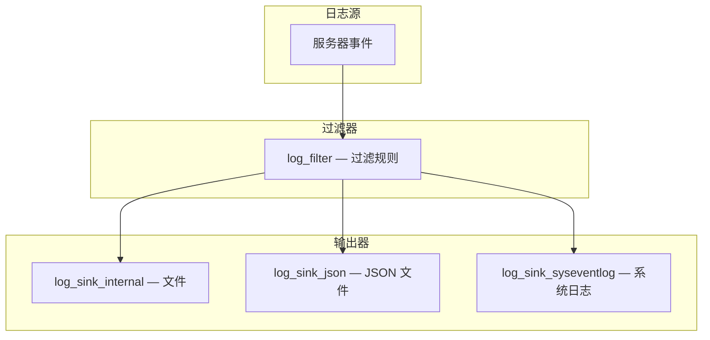

<cite>
**引用文件**
- [sql/log.cc](file://sql/log.cc)
- [sql/log.h](file://sql/log.h)
- [sql/mysqld_error.cc](file://sql/mysqld_error.cc)
- [sql/mysqld_log.h](file://sql/mysqld_log.h)
- [sql/binlog/](file://sql/binlog/)
- [components/library_mysys/](file://components/library_mysys/)
</cite>

## 目录
1. [日志系统概述](#日志系统概述)
2. [错误日志](#错误日志)
3. [通用查询日志](#通用查询日志)
4. [慢查询日志](#慢查询日志)
5. [二进制日志](#二进制日志)
6. [中继日志](#中继日志)
7. [审计日志](#审计日志)
8. [日志组件架构](#日志组件架构)

## 日志系统概述

MySQL 维护多种日志，核心实现在 `sql/log.cc`（~87KB）中。每种日志服务于不同的运维和诊断需求：

| 日志 | 变量 | 默认状态 | 用途 |
|------|------|---------|------|
| 错误日志 | `log_error` | 启用 | 服务器启动/关闭/错误信息 |
| 通用查询日志 | `general_log` | 禁用 | 所有查询记录 |
| 慢查询日志 | `slow_query_log` | 禁用 | 慢查询分析 |
| 二进制日志 | `log_bin` | 可选 | 数据变更和复制 |
| 中继日志 | `relay_log` | 自动 | 从服务器变更缓存 |
| 审计日志 | `audit_log` | 可选 | 安全审计 |

```mermaid
graph TB
    subgraph 日志系统 — sql/log.cc
        ERROR[错误日志]
        GENERAL[通用查询日志]
        SLOW[慢查询日志]
        BINLOG[二进制日志]
        RELAY[中继日志]
        AUDIT[审计日志]
    end

    SERVER[MySQL Server] --> ERROR
    SERVER --> GENERAL
    SERVER --> SLOW
    SERVER --> BINLOG
    SERVER --> RELAY
    SERVER --> AUDIT
```

**Sources** · [sql/log.cc](file://sql/log.cc)

## 错误日志

错误日志记录服务器运行过程中的重要事件：

### 记录内容

| 类别 | 说明 |
|------|------|
| 启动/关闭 | 服务器启动和关闭信息 |
| 错误 | 运行时错误（连接失败、表损坏等） |
| 警告 | 潜在问题（表空间不足等） |
| 通知 | 常规事件（线程启动/退出） |

### 配置

```ini
[mysqld]
log_error = /var/log/mysql/error.log
log_error_verbosity = 2    # 1=errors, 2=warnings, 3=notes
```

```sql
-- 运行时设置
SET GLOBAL log_error_verbosity = 3;

-- 轮转错误日志
FLUSH LOGS;
-- 或
ALTER INSTANCE ROTATE INNODB MASTER KEY;
```

### 错误日志组件

MySQL 8.0+ 支持可插拔的日志组件：

| 组件 | 说明 |
|------|------|
| `log_sink_internal` | 内部日志写入器（默认） |
| `log_sink_json` | JSON 格式日志 |
| `log_sink_syseventlog` | 系统日志（syslog/Windows Event） |

```sql
-- 安装 JSON 日志组件
INSTALL COMPONENT 'file://component_log_sink_json';

-- 激活 JSON 日志
SET GLOBAL log_error_services = 'log_filter_internal; log_sink_internal, log_sink_json';
```

**Sources** · [sql/log.cc](file://sql/log.cc)

## 通用查询日志

记录所有客户端连接和查询：

### 输出格式

| 格式 | 说明 |
|------|------|
| FILE | 写入文件（默认） |
| TABLE | 写入 `mysql.general_log` 表 |

```sql
-- 启用通用查询日志（不推荐生产环境）
SET GLOBAL general_log = ON;
SET GLOBAL log_output = 'FILE';     -- 或 'TABLE' 或 'FILE,TABLE'

-- 查看日志位置
SHOW VARIABLES LIKE 'general_log_file';

-- 查询 TABLE 格式的日志
SELECT * FROM mysql.general_log ORDER BY event_time DESC LIMIT 20;
```

**Sources** · [sql/log.cc](file://sql/log.cc)

## 慢查询日志

记录执行时间超过阈值的查询，是性能调优的关键工具：

### 配置

```sql
-- 启用慢查询日志
SET GLOBAL slow_query_log = ON;
SET GLOBAL long_query_time = 1;            -- 1 秒阈值
SET GLOBAL log_queries_not_using_indexes = ON;  -- 记录未使用索引的查询
SET GLOBAL min_examined_row_limit = 100;   -- 忽略扫描行数少于 100 的查询

-- 日志输出格式
SET GLOBAL log_output = 'FILE';  -- 或 'TABLE'
```

### 日志内容

```
# Time: 2024-01-15T10:30:00.000000Z
# User@Host: root[root] @ localhost []
# Query_time: 2.345678  Lock_time: 0.000100  Rows_sent: 1  Rows_examined: 50000
SET timestamp=1705312200;
SELECT * FROM orders WHERE order_date > '2024-01-01';
```

### 分析工具

```bash
# mysqldumpslow — 汇总分析
mysqldumpslow -s t -t 10 /var/log/mysql/slow.log

# 按平均时间排序，显示前 10 条
mysqldumpslow -s at -t 10 /var/log/mysql/slow.log
```

**Sources** · [sql/log.cc](file://sql/log.cc)

## 二进制日志

二进制日志记录所有数据变更事件，是复制和恢复的基础（详见 `/二进制日志与数据字典`）：

```sql
-- 启用二进制日志
SET GLOBAL log_bin = ON;

-- 日志格式
SET GLOBAL binlog_format = 'ROW';    -- ROW / STATEMENT / MIXED

-- 过期时间
SET GLOBAL binlog_expire_logs_seconds = 604800;  -- 7 天

-- 查看日志列表
SHOW BINARY LOGS;

-- 查看事件
SHOW BINLOG EVENTS IN 'binlog.000001' LIMIT 20;
```

**Sources** · [sql/binlog/](file://sql/binlog/)

## 中继日志

中继日志是二进制日志的从服务器端缓存：


```sql
-- 中继日志配置
SET GLOBAL relay_log = '/var/log/mysql/relay-bin';
SET GLOBAL relay_log_purge = ON;        -- 自动清理已应用的中继日志
SET GLOBAL max_relay_log_size = 1073741824;  -- 1GB 最大大小
```

**Sources** · [sql/log.cc](file://sql/log.cc)

## 审计日志

审计日志用于安全和合规性监控：

### 审计事件类型

| 事件 | 说明 |
|------|------|
| 连接 | 登录成功/失败 |
| 断开 | 连接关闭 |
| 查询 | SQL 语句执行 |
| DDL | 数据定义变更 |
| DML | 数据操作 |
| 权限 | 权限变更 |
| 管理 | 管理操作（FLUSH、SHUTDOWN） |

```sql
-- 审计日志通常通过组件实现
INSTALL COMPONENT 'file://component_audit_api_message_emit';
```

**Sources** · [sql/log.cc](file://sql/log.cc)

## 日志组件架构

MySQL 8.0+ 引入了可插拔的日志组件架构：



### 日志服务配置

```sql
-- 查看当前日志服务
SELECT @@log_error_services;

-- 配置多输出日志
SET GLOBAL log_error_services =
  'log_filter_internal;
   log_sink_internal,
   log_sink_json,
   log_sink_syseventlog';
```

### 日志轮转

```sql
-- 轮转所有日志
FLUSH LOGS;

-- 轮转指定日志
FLUSH BINARY LOGS;
FLUSH ENGINE LOGS;
FLUSH ERROR LOGS;
FLUSH GENERAL LOGS;
FLUSH SLOW LOGS;
```

**Sources** · [sql/log.cc](file://sql/log.cc) · [components/library_mysys/](file://components/library_mysys/)
