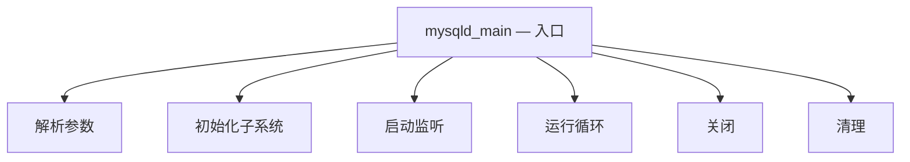
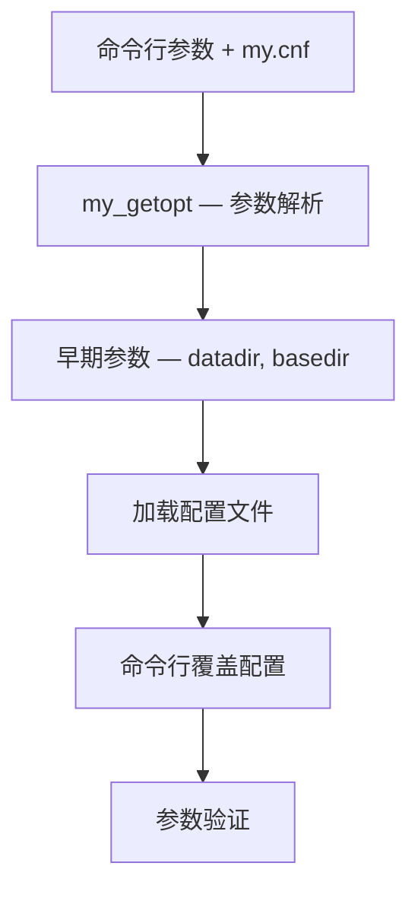
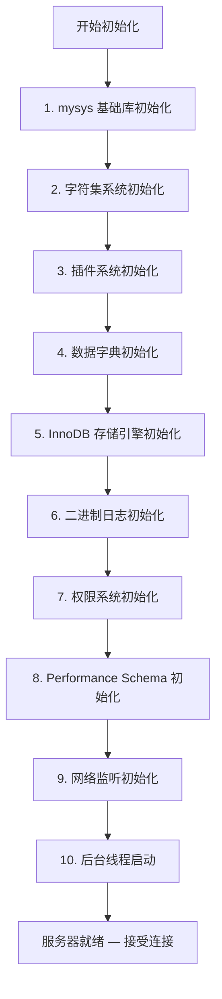
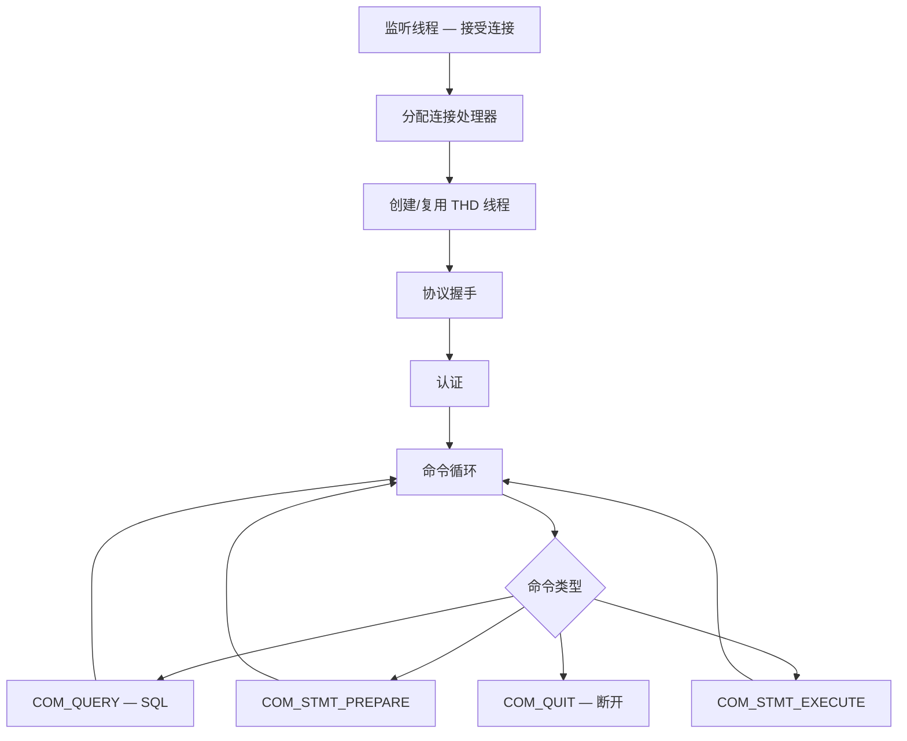
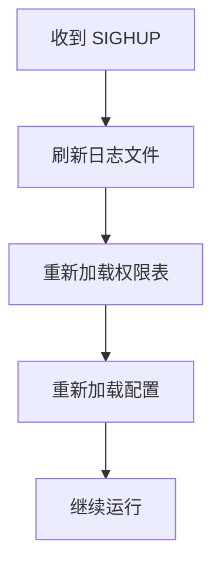
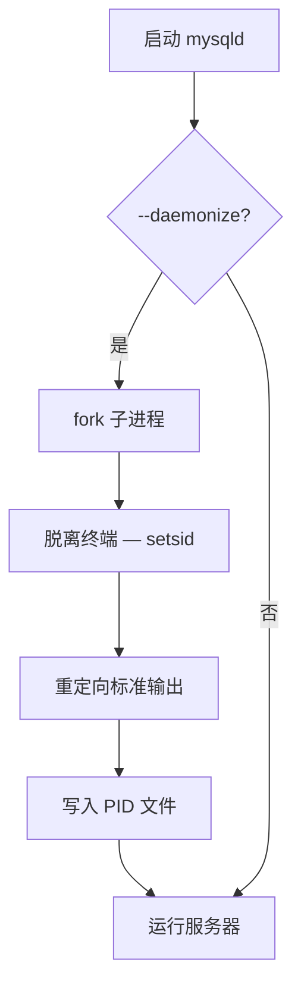

<cite>
**引用文件**
- [sql/mysqld.cc](file://sql/mysqld.cc)
- [sql/mysqld_daemon.cc](file://sql/mysqld_daemon.cc)
- [sql/signal_handler.cc](file://sql/signal_handler.cc)
- [sql/mysqld_thd_manager.cc](file://sql/mysqld_thd_manager.cc)
- [sql/bootstrap.cc](file://sql/bootstrap.cc)
</cite>

## 目录
1. [服务器生命周期概述](#服务器生命周期概述)
2. [启动阶段](#启动阶段)
3. [初始化子系统](#初始化子系统)
4. [运行阶段](#运行阶段)
5. [关闭流程](#关闭流程)
6. [信号处理](#信号处理)
7. [守护进程模式](#守护进程模式)

## 服务器生命周期概述

MySQL 服务器的完整生命周期由 `mysqld.cc`（~567KB，整个项目中最大的文件之一）管理。这个文件包含了服务器的主函数 `mysqld_main()` 以及大量的全局变量定义：



**Sources** · [sql/mysqld.cc](file://sql/mysqld.cc)

## 启动阶段

### 命令行参数解析



### 启动命令

```bash
# 标准启动
mysqld --defaults-file=/etc/my.cnf &

# 初始化数据目录（首次安装）
mysqld --initialize-insecure --datadir=/var/lib/mysql

# 升级模式
mysqld --upgrade=FORCE

# 安全模式（跳过权限和网络）
mysqld --skip-grant-tables --skip-networking
```

**Sources** · [sql/mysqld.cc](file://sql/mysqld.cc)

## 初始化子系统

启动参数解析后，服务器按特定顺序初始化各个子系统：

### 初始化顺序



### 关键初始化步骤

| 步骤 | 说明 |
|------|------|
| **mysys** | 内存管理、文件 I/O、线程基础设施 |
| **字符集** | 加载字符集定义和排序规则 |
| **插件** | 加载和初始化所有已安装插件 |
| **数据字典** | 打开或创建 DD 表空间 |
| **InnoDB** | 缓冲池、重做日志、崩溃恢复 |
| **二进制日志** | 打开或创建 binlog 文件 |
| **ACL** | 加载用户和权限信息 |
| **网络** | 绑定端口和套接字 |
| **后台线程** | InnoDB page cleaner、purge、checkpoint 等 |

**Sources** · [sql/mysqld.cc](file://sql/mysqld.cc)

## 运行阶段

服务器初始化完成后进入运行循环，处理客户端连接和查询：

### 运行循环



### 全局状态

`mysqld.cc` 定义了大量全局变量来维护服务器状态：

| 变量 | 说明 |
|------|------|
| `mysqld_port` | 监听端口 |
| `mysqld_unix_port` | Unix Socket 路径 |
| `connection_count` | 当前连接数 |
| `max_connections` | 最大连接数 |
| `server_running` | 服务器运行标志 |
| `shutdown_requested` | 关闭请求标志 |
| `abort_loop` | 中止标志 |

**Sources** · [sql/mysqld.cc](file://sql/mysqld.cc) · [sql/mysqld_thd_manager.cc](file://sql/mysqld_thd_manager.cc)

## 关闭流程

MySQL 支持多种关闭方式，每种方式有不同的行为：

### 关闭类型

| 方式 | 命令 | 行为 |
|------|------|------|
| **正常关闭** | `mysqladmin shutdown` | 等待所有连接完成后关闭 |
| **快速关闭** | `SHUTDOWN` + SIGNAL | 断开连接后立即关闭 |
| **中止关闭** | `kill -9` | 立即终止（需要崩溃恢复） |

### 正常关闭流程


### 关闭 SQL

```sql
-- 通过 SQL 关闭
SHUTDOWN;

-- 等待关闭完成
-- mysqladmin --wait=30 shutdown
```

**Sources** · [sql/mysqld.cc](file://sql/mysqld.cc)

## 信号处理

`signal_handler.cc`（~15KB）处理操作系统信号：

### 信号映射

| 信号 | 说明 | MySQL 行为 |
|------|------|-----------|
| `SIGTERM` | 终止信号 | 正常关闭 |
| `SIGINT` | 中断信号（Ctrl+C） | 正常关闭 |
| `SIGHUP` | 挂起信号 | 刷新日志和重新加载权限 |
| `SIGSEGV` | 段错误 | 生成崩溃堆栈并退出 |
| `SIGABRT` | 中止信号 | 生成核心转储 |

### SIGHUP 处理



```bash
# 发送 SIGHUP 刷新日志
kill -HUP $(pidof mysqld)
# 等价于: mysqladmin flush-logs
```

**Sources** · [sql/signal_handler.cc](file://sql/signal_handler.cc)

## 守护进程模式

`mysqld_daemon.cc`（~4KB）实现 Unix 守护进程功能：

### 守护进程化



```bash
# 守护进程模式启动
mysqld --daemonize --pid-file=/var/run/mysqld/mysqld.pid

# 检查 PID 文件
cat /var/run/mysqld/mysqld.pid
```

**Sources** · [sql/mysqld_daemon.cc](file://sql/mysqld_daemon.cc)
