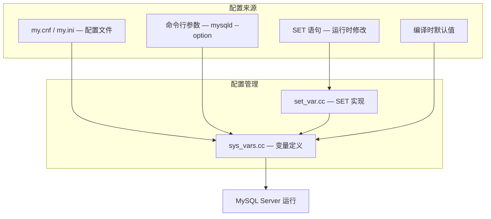

<cite>
**引用文件**
- [sql/sys_vars.cc](file://sql/sys_vars.cc)
- [sql/sys_vars_resource_groups.cc](file://sql/sys_vars_resource_groups.cc)
- [sql/mysqld.cc](file://sql/mysqld.cc)
- [sql/mysqld_thd_manager.cc](file://sql/mysqld_thd_manager.cc)
- [sql/set_var.cc](file://sql/set_var.cc)
- [sql/sql_parse.cc](file://sql/sql_parse.cc)
- [sql/sql_yy.cc](file://sql/sql_yy.cc)
</cite>

## 目录
1. [服务器配置概述](#服务器配置概述)
2. [系统变量体系](#系统变量体系)
3. [服务器启动流程](#服务器启动流程)
4. [连接管理](#连接管理)
5. [线程管理](#线程管理)
6. [日志系统](#日志系统)
7. [内存管理](#内存管理)
8. [资源组](#资源组)
9. [关键配置参数](#关键配置参数)

## 服务器配置概述

MySQL 服务器的配置通过系统变量（system variables）、配置文件（`my.cnf`/`my.ini`）和运行时 SET 语句三种方式管理。核心配置代码集中在 `sql/sys_vars.cc`（~316KB）中，定义了数百个系统变量。



**Sources** · [sql/sys_vars.cc](file://sql/sys_vars.cc) · [sql/set_var.cc](file://sql/set_var.cc)

## 系统变量体系

系统变量按作用域和可见性分为多个类别：

### 作用域分类

| 作用域 | 设置方式 | 示例 |
|--------|---------|------|
| GLOBAL | `SET GLOBAL var = value` | 影响所有连接 |
| SESSION | `SET SESSION var = value` | 仅影响当前连接 |
| PERSIST | `SET PERSIST var = value` | 持久化到 `mysqld-auto.cnf` |
| PERSIST_ONLY | `SET PERSIST_ONLY var = value` | 仅持久化，不改变运行时值 |

### 变量类型

```sql
-- 查看变量
SHOW GLOBAL VARIABLES;
SHOW SESSION VARIABLES LIKE '%buffer_pool%';

-- 设置变量
SET GLOBAL max_connections = 200;
SET SESSION sql_mode = 'STRICT_TRANS_TABLES';
SET PERSIST innodb_buffer_pool_size = 1073741824;

-- 查看变量状态
SELECT @@GLOBAL.max_connections;
SELECT @@SESSION.sql_mode;
```

### 重要变量类别

| 类别 | 变量示例 | 说明 |
|------|---------|------|
| **连接** | `max_connections`, `max_connect_errors` | 连接数和错误限制 |
| **缓冲** | `innodb_buffer_pool_size`, `key_buffer_size` | 内存缓冲区大小 |
| **日志** | `general_log`, `slow_query_log`, `log_error` | 日志控制 |
| **安全** | `sql_mode`, `require_secure_transport` | 安全策略 |
| **复制** | `server_id`, `gtid_mode`, `binlog_format` | 复制配置 |
| **性能** | `thread_cache_size`, `table_open_cache` | 性能调优 |

**Sources** · [sql/sys_vars.cc](file://sql/sys_vars.cc)

## 服务器启动流程

`mysqld.cc` 实现了 MySQL 服务器的启动入口和初始化流程：


### 启动选项

```bash
# 基本启动
mysqld --defaults-file=/etc/my.cnf

# 初始化数据目录
mysqld --initialize-insecure --datadir=/var/lib/mysql

# 安全模式（跳过网络和权限）
mysqld --skip-grant-tables --skip-networking

# 指定端口和套接字
mysqld --port=3307 --socket=/tmp/mysql.sock
```

**Sources** · [sql/mysqld.cc](file://sql/mysqld.cc)

## 连接管理

### 连接生命周期


### 连接相关变量

| 变量 | 默认值 | 说明 |
|------|--------|------|
| `max_connections` | 151 | 最大并发连接数 |
| `max_connect_errors` | 100 | 连续失败后阻止主机 |
| `wait_timeout` | 28800 | 非交互连接超时（秒） |
| `interactive_timeout` | 28800 | 交互连接超时（秒） |
| `connect_timeout` | 10 | 连接握手超时（秒） |
| `net_read_timeout` | 30 | 网络读取超时（秒） |
| `net_write_timeout` | 60 | 网络写入超时（秒） |

```sql
-- 查看连接信息
SHOW STATUS LIKE 'Threads_%';
SHOW PROCESSLIST;

-- 终止连接
KILL connection_id;

-- 刷新连接状态
FLUSH HOSTS;
```

**Sources** · [sql/mysqld_thd_manager.cc](file://sql/mysqld_thd_manager.cc)

## 线程管理

MySQL 使用每连接一线程的模型（可通过线程池插件优化）：

### 线程模型

| 组件 | 说明 |
|------|------|
| **监听线程** | 接受新连接（TCP/IP、Unix Socket、Named Pipe） |
| **用户线程** | 处理客户端请求 |
| **后台线程** | InnoDB、Performance Schema 等 |
| **复制线程** | IO 线程、SQL 线程 |
| **线程缓存** | 缓存已断开的线程，减少创建开销 |

```sql
-- 线程缓存配置
SET GLOBAL thread_cache_size = 64;

-- 查看线程统计
SHOW STATUS LIKE 'Threads_%';
-- Threads_created: 创建的线程总数
-- Threads_cached: 缓存中的线程数
-- Threads_connected: 当前连接数
-- Threads_running: 正在执行的线程数
```

**Sources** · [sql/mysqld.cc](file://sql/mysqld.cc)

## 日志系统

MySQL 维护多种日志：

| 日志 | 变量 | 说明 |
|------|------|------|
| **错误日志** | `log_error` | 服务器错误和警告 |
| **通用查询日志** | `general_log` | 所有查询（不推荐生产环境启用） |
| **慢查询日志** | `slow_query_log` | 超过 `long_query_time` 的查询 |
| **二进制日志** | `log_bin` | 数据变更日志 |
| **中继日志** | `relay_log` | 从服务器接收的变更 |
| **审计日志** | `audit_log` | 安全和合规审计 |

```sql
-- 慢查询日志配置
SET GLOBAL slow_query_log = ON;
SET GLOBAL long_query_time = 1;       -- 1 秒阈值
SET GLOBAL log_queries_not_using_indexes = ON;

-- 错误日志级别
SET GLOBAL log_error_verbosity = 2;   -- 1=errors, 2=warnings, 3=notes

-- 日志轮转
FLUSH LOGS;
```

## 内存管理

MySQL 的内存分配分为全局和每连接两部分：

### 全局内存

| 参数 | 说明 |
|------|------|
| `innodb_buffer_pool_size` | InnoDB 缓冲池（通常设为物理内存的 70-80%） |
| `key_buffer_size` | MyISAM 键缓存 |
| `query_cache_size` | 查询缓存（MySQL 8.0 已移除） |
| `innodb_log_buffer_size` | InnoDB 重做日志缓冲 |

### 每连接内存

| 参数 | 默认值 | 说明 |
|------|--------|------|
| `sort_buffer_size` | 256KB | 排序缓冲 |
| `join_buffer_size` | 256KB | 连接缓冲 |
| `read_buffer_size` | 128KB | 顺序读缓冲 |
| `read_rnd_buffer_size` | 256KB | 随机读缓冲 |
| `tmp_table_size` | 16MB | 内存临时表最大大小 |
| `thread_stack` | 256KB | 线程栈大小 |

### 内存估算

```
总内存 ≈ 全局内存 + (max_connections × 每连接内存)

示例：
  innodb_buffer_pool_size = 8GB
  max_connections = 200
  每连接内存 ≈ 4MB
  总内存 ≈ 8GB + (200 × 4MB) = 8GB + 800MB ≈ 8.8GB
```

## 资源组

`sys_vars_resource_groups.cc` 实现线程资源组管理：

```sql
-- 创建资源组
CREATE RESOURCE GROUP app_group
  TYPE = USER
  VCPU = 0-3
  THREAD_PRIORITY = 5;

-- 将线程分配到资源组
SET RESOURCE GROUP app_group FOR thread_id;
```

**Sources** · [sql/sys_vars_resource_groups.cc](file://sql/sys_vars_resource_groups.cc)

## 关键配置参数

### 生产环境推荐配置

| 参数 | 推荐值 | 说明 |
|------|--------|------|
| `innodb_buffer_pool_size` | 物理内存 70-80% | 最重要的性能参数 |
| `innodb_buffer_pool_instances` | 8（>1GB 时） | 减少缓冲池争用 |
| `innodb_log_file_size` | 1-4GB | 重做日志大小 |
| `innodb_flush_log_at_trx_commit` | 1 | 1=ACID 安全，2=性能 |
| `innodb_flush_method` | `O_DIRECT` | 避免双缓冲 |
| `innodb_io_capacity` | SSD: 2000+ | I/O 吞吐量上限 |
| `max_connections` | 按需设置 | 通常 200-500 |
| `table_open_cache` | 4000+ | 表定义缓存 |
| `thread_cache_size` | 64 | 线程缓存 |
| `innodb_file_per_table` | ON | 每表独立表空间 |

### 配置文件示例

```ini
[mysqld]
# 基础配置
port = 3306
datadir = /var/lib/mysql
socket = /var/run/mysqld/mysqld.sock

# InnoDB 配置
innodb_buffer_pool_size = 8G
innodb_buffer_pool_instances = 8
innodb_log_file_size = 2G
innodb_flush_log_at_trx_commit = 1
innodb_flush_method = O_DIRECT
innodb_io_capacity = 2000
innodb_file_per_table = ON

# 连接配置
max_connections = 300
wait_timeout = 600
interactive_timeout = 600

# 日志配置
slow_query_log = 1
long_query_time = 1
log_queries_not_using_indexes = ON

# 安全配置
sql_mode = STRICT_TRANS_TABLES,NO_ENGINE_SUBSTITUTION
require_secure_transport = ON
```
