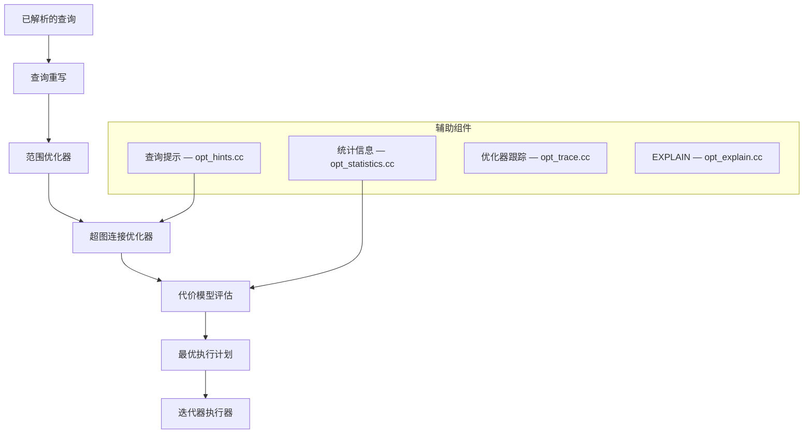
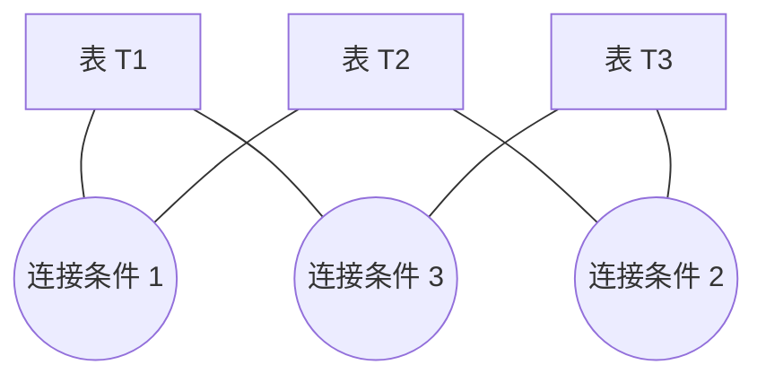

<cite>
**引用文件**
- [sql/join_optimizer/](file://sql/join_optimizer/)
- [sql/opt_costmodel.cc](file://sql/opt_costmodel.cc)
- [sql/opt_costconstants.cc](file://sql/opt_costconstants.cc)
- [sql/opt_costconstantcache.cc](file://sql/opt_costconstantcache.cc)
- [sql/opt_hints.cc](file://sql/opt_hints.cc)
- [sql/opt_explain.cc](file://sql/opt_explain.cc)
- [sql/opt_trace.cc](file://sql/opt_trace.cc)
- [sql/opt_statistics.cc](file://sql/opt_statistics.cc)
- [sql/opt_sum.cc](file://sql/opt_sum.cc)
- [sql/item_*.cc](file://sql/)
</cite>

## 目录
1. [优化器概述](#优化器概述)
2. [超图连接优化器](#超图连接优化器)
3. [范围优化器](#范围优化器)
4. [代价模型](#代价模型)
5. [查询提示（Hints）](#查询提示hints)
6. [EXPLAIN 执行计划](#explain-执行计划)
7. [优化器跟踪](#优化器跟踪)
8. [统计信息](#统计信息)
9. [表达式系统（Item）](#表达式系统item)

## 优化器概述

MySQL 的查询优化器是 SQL 层中最复杂的子系统之一，负责将解析后的查询转换为最优的执行计划。它由多个组件协作完成：



**Sources** · [sql/join_optimizer/](file://sql/join_optimizer/)

## 超图连接优化器

超图连接优化器（Hypergraph Join Optimizer）是 MySQL 8.0.27+ 引入的新一代连接优化器，取代了传统的贪婪搜索算法。

### 核心文件

| 文件 | 大小 | 说明 |
|------|------|------|
| `join_optimizer.cc` | ~424KB | 优化器主逻辑 — 探索连接顺序和访问方法 |
| `make_join_hypergraph.cc` | ~170KB | 构建超图模型 — 将查询表示为超图 |
| `cost_model.cc` | ~77KB | 代价计算 — I/O 和 CPU 代价 |
| `interesting_orders.cc` | — | 有趣排序追踪 — 利用已有排序避免额外排序 |
| `access_path.cc` | — | 访问路径生成 — 全表扫描/索引扫描/ref 等 |

### 超图模型

超图将多表连接查询表示为图论问题：



- **节点** — 查询中的表
- **超边** — 连接条件（可连接多个表）
- **优化目标** — 找到代价最小的连接顺序和访问方法组合

### 探索策略

| 策略 | 说明 |
|------|------|
| **动态规划** | 对小规模连接使用穷举 |
| **贪心搜索** | 对大规模连接使用启发式剪枝 |
| **代价评估** | 对每个候选计划计算 I/O + CPU 代价 |
| **排序追踪** | 追踪已有的排序属性，避免不必要的 filesort |

### 启用方式

```sql
-- 启用超图优化器（MySQL 8.0.27+）
SET optimizer_switch = 'hypergraph_optimizer=on';
```

**Sources** · [sql/join_optimizer/join_optimizer.cc](file://sql/join_optimizer/join_optimizer.cc) · [sql/join_optimizer/make_join_hypergraph.cc](file://sql/join_optimizer/make_join_hypergraph.cc)

## 范围优化器

范围优化器（`sql/join_optimizer/range_optimizer/`）识别可利用索引的等值和范围条件：

### 工作原理

1. 分析 WHERE 条件中与索引相关的谓词
2. 构建范围树（Range Tree）
3. 计算使用范围扫描的代价
4. 如果范围扫描优于全表扫描，生成范围访问路径

### 支持的条件

| 条件类型 | 示例 |
|---------|------|
| 等值 | `WHERE col = value` |
| 范围 | `WHERE col BETWEEN a AND b` |
| IN 列表 | `WHERE col IN (1, 2, 3)` |
| 组合 | `WHERE col1 = a AND col2 > b` |

**Sources** · [sql/join_optimizer/range_optimizer/](file://sql/join_optimizer/range_optimizer/)

## 代价模型

`opt_costmodel.cc`、`opt_costconstants.cc`、`opt_costconstantcache.cc` 实现基于代价的优化决策：

### 代价常量

代价常量存储在 `mysql.server_cost` 和 `mysql.engine_cost` 系统表中：

| 常量 | 默认值 | 说明 |
|------|--------|------|
| `disk_temptable_create_cost` | 20.0 | 创建磁盘临时表的代价 |
| `disk_temptable_row_cost` | 0.5 | 磁盘临时表行操作代价 |
| `key_compare_cost` | 0.05 | 键比较代价 |
| `memory_temptable_create_cost` | 1.0 | 创建内存临时表的代价 |
| `memory_temptable_row_cost` | 0.1 | 内存临时表行操作代价 |
| `row_evaluate_cost` | 0.1 | 行评估代价 |
| `io_block_read_cost` | 1.0 | 块读取 I/O 代价 |
| `memory_block_read_cost` | 0.25 | 内存块读取代价 |

### 代价计算

```sql
-- 查看当前代价常量
SELECT * FROM mysql.server_cost;
SELECT * FROM mysql.engine_cost;

-- 调整代价常量
UPDATE mysql.server_cost
SET cost_value = 0.2
WHERE cost_name = 'row_evaluate_cost';

-- 刷新代价缓存
FLUSH OPTIMIZER_COSTS;
```

**Sources** · [sql/opt_costmodel.cc](file://sql/opt_costmodel.cc) · [sql/opt_costconstants.cc](file://sql/opt_costconstants.cc)

## 查询提示（Hints）

`opt_hints.cc` 实现查询提示，允许用户影响优化器的决策：

### 常用提示

| 提示 | 语法 | 说明 |
|------|------|------|
| `USE INDEX` | `/*+ INDEX(t idx_name) */` | 强制使用指定索引 |
| `IGNORE INDEX` | `/*+ NO_INDEX(t idx_name) */` | 忽略指定索引 |
| `JOIN ORDER` | `/*+ JOIN_ORDER(t1, t2, t3) */` | 指定连接顺序 |
| `JOIN FIXED ORDER` | `/*+ JOIN_FIXED_ORDER(t1, t2) */` | 固定连接顺序 |
| `NO RANGE` | `/*+ NO_RANGE_OPTIMIZATION(t) */` | 禁用范围优化 |
| `SEMI JOIN` | `/*+ SEMIJOIN(@query FIRSTMATCH) */` | 半连接策略 |
| `SUBQUERY` | `/*+ SUBQUERY(@query INTOEXISTS) */` | 子查询策略 |
| `MRR` | `/*+ MRR(t) */` | Multi-Range Read |

```sql
-- 使用查询提示
SELECT /*+ JOIN_ORDER(o, c, p) INDEX(o idx_order_date) */
  o.order_id, c.name, p.product_name
FROM orders o
JOIN customers c ON o.customer_id = c.id
JOIN products p ON o.product_id = p.id
WHERE o.order_date > '2024-01-01';
```

**Sources** · [sql/opt_hints.cc](file://sql/opt_hints.cc)

## EXPLAIN 执行计划

`opt_explain.cc`、`opt_explain_format.cc`、`opt_explain_json.cc`、`opt_explain_traditional.cc` 实现 EXPLAIN 功能：

### 输出格式

```sql
-- 传统格式
EXPLAIN SELECT * FROM orders WHERE order_date > '2024-01-01';

-- JSON 格式（包含代价信息）
EXPLAIN FORMAT=JSON SELECT * FROM orders WHERE order_date > '2024-01-01';

-- 树形格式（MySQL 8.0.16+）
EXPLAIN FORMAT=TREE SELECT * FROM orders WHERE order_date > '2024-01-01';

-- 分析执行（实际执行并统计）
EXPLAIN ANALYZE SELECT * FROM orders WHERE order_date > '2024-01-01';
```

### EXPLAIN 关键字段

| 字段 | 说明 |
|------|------|
| `type` | 访问类型：system > const > eq_ref > ref > range > index > ALL |
| `possible_keys` | 可能使用的索引 |
| `key` | 实际使用的索引 |
| `rows` | 估计扫描行数 |
| `filtered` | 过滤后的行百分比 |
| `Extra` | 额外信息（Using index, Using where, Using filesort 等） |

**Sources** · [sql/opt_explain.cc](file://sql/opt_explain.cc)

## 优化器跟踪

`opt_trace.cc`、`opt_trace2server.cc` 实现优化器跟踪，记录优化器的完整决策过程：

```sql
-- 启用优化器跟踪
SET optimizer_trace = "enabled=on";

-- 执行查询
SELECT * FROM orders WHERE order_date > '2024-01-01';

-- 查看跟踪结果
SELECT * FROM INFORMATION_SCHEMA.OPTIMIZER_TRACE;

-- 关闭跟踪
SET optimizer_trace = "enabled=off";
```

跟踪信息包含：
- 每个候选连接顺序的代价评估
- 范围优化器的决策过程
- 索引选择的理由
- 子查询转换的步骤

**Sources** · [sql/opt_trace.cc](file://sql/opt_trace.cc)

## 统计信息

`opt_statistics.cc` 和 `opt_sum.cc` 管理优化器使用的统计信息：

### 统计信息来源

| 来源 | 说明 |
|------|------|
| 存储引擎 | InnoDB 自动采样统计 |
| `ANALYZE TABLE` | 手动更新统计信息 |
| 直方图 | 用户创建的列值分布直方图 |
| `mysql.column_stats` | 持久化的列统计信息 |

### 直方图

```sql
-- 创建直方图
ANALYZE TABLE orders UPDATE HISTOGRAM ON order_date WITH 100 BUCKETS;

-- 删除直方图
ANALYZE TABLE orders DROP HISTOGRAM ON order_date;

-- 查看直方图信息
SELECT SCHEMA_NAME, TABLE_NAME, COLUMN_NAME,
       JSON_EXTRACT(HISTOGRAM, '$.\"number-of-buckets-specified\"')
FROM INFORMATION_SCHEMA.COLUMN_STATISTICS;
```

直方图帮助优化器更准确地估计选择率，特别是在数据分布不均匀的情况下。

**Sources** · [sql/opt_statistics.cc](file://sql/opt_statistics.cc)

## 表达式系统（Item）

`item_*.cc`（19 个文件）实现了 MySQL 的表达式系统，是查询执行的基础构建块：

| 文件 | 说明 |
|------|------|
| `item.cc` | Item 基类和核心实现 |
| `item_func.cc` | 内置函数实现 |
| `item_sum.cc` | 聚合函数（SUM, COUNT, AVG 等） |
| `item_cmpfunc.cc` | 比较运算符 |
| `item_strfunc.cc` | 字符串函数 |
| `item_timefunc.cc` | 日期时间函数 |
| `item_num.cc` | 数值运算 |
| `item_subselect.cc` | 子查询表达式 |
| `item_windowfunc.cc` | 窗口函数 |
| `item_json_func.cc` | JSON 函数 |
| `item_geofunc.cc` | 空间函数 |

每种 Item 类型都实现了 `val_int()`、`val_real()`、`val_str()`、`val_decimal()` 等方法，支持在不同数据类型间的自动转换。

**Sources** · [sql/item_*.cc](file://sql/)
