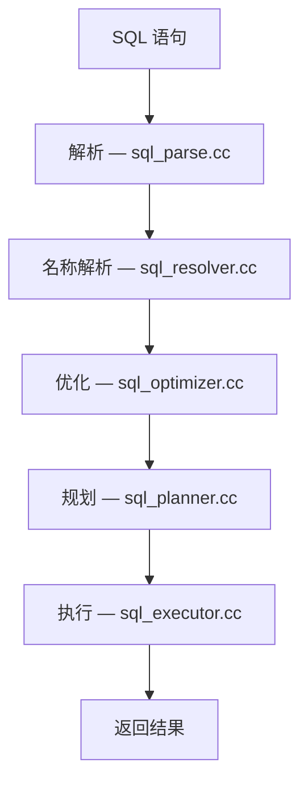
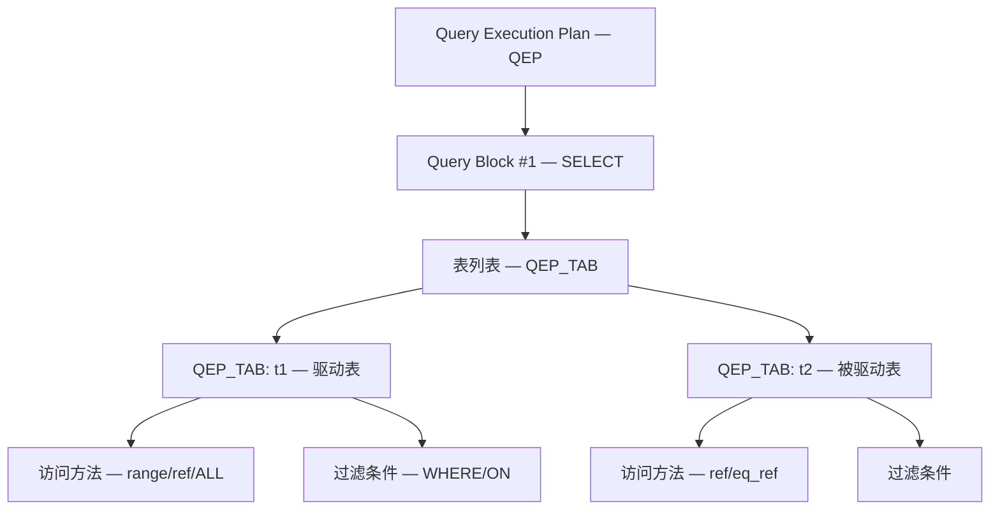
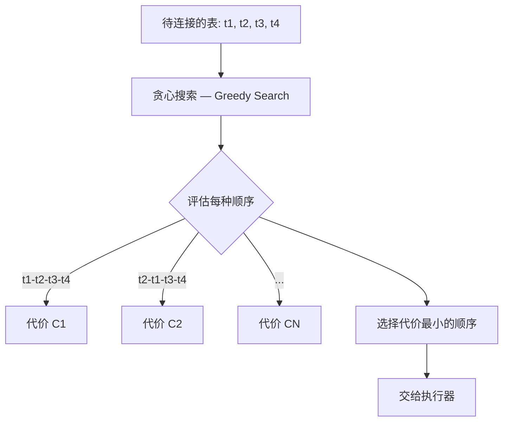
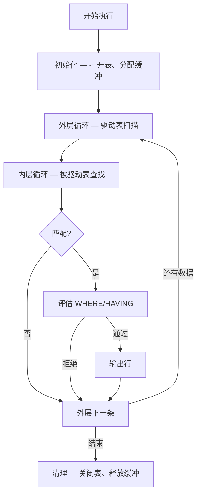
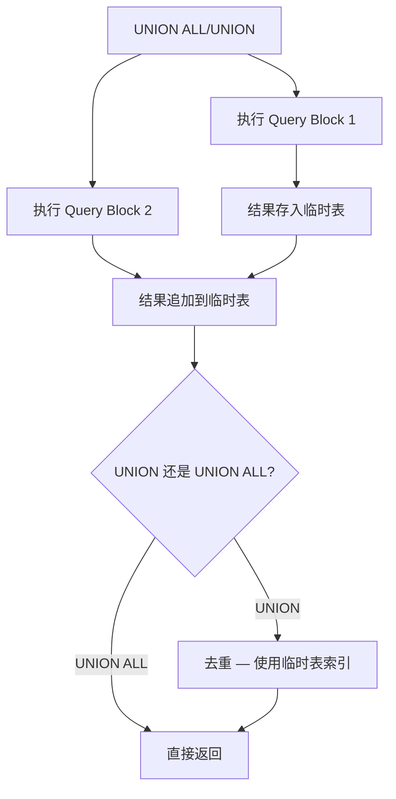
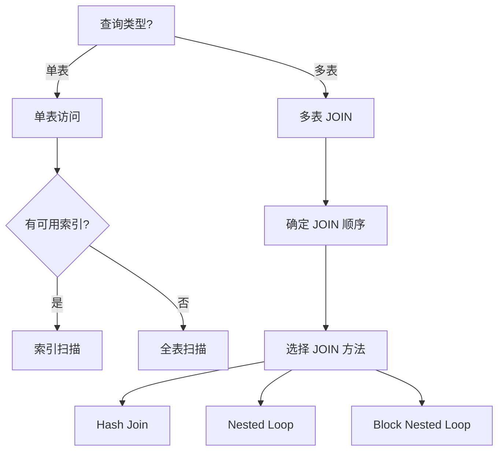

<cite>
**引用文件**
- [sql/sql_executor.cc](file://sql/sql_executor.cc)
- [sql/sql_planner.cc](file://sql/sql_planner.cc)
- [sql/sql_optimizer.cc](file://sql/sql_optimizer.cc)
- [sql/sql_union.cc](file://sql/sql_union.cc)
- [sql/sql_select.cc](file://sql/sql_select.cc)
</cite>

## 目录
1. [查询执行概述](#查询执行概述)
2. [执行计划](#执行计划)
3. [查询规划器（Planner）](#查询规划器planner)
4. [查询执行器（Executor）](#查询执行器executor)
5. [JOIN 执行](#join-执行)
6. [子查询执行](#子查询执行)
7. [UNION 执行](#union-执行)
8. [执行策略选择](#执行策略选择)

## 查询执行概述

MySQL 的查询执行流程分为三个核心阶段，由三个大文件实现：

| 文件 | 大小 | 说明 |
|------|------|------|
| `sql_optimizer.cc` | ~455KB | 查询优化 — 逻辑和物理优化 |
| `sql_planner.cc` | ~195KB | 查询规划 — 评估 JOIN 顺序 |
| `sql_executor.cc` | ~199KB | 查询执行 — 按计划执行查询 |



**Sources** · [sql/sql_executor.cc](file://sql/sql_executor.cc) · [sql/sql_planner.cc](file://sql/sql_planner.cc)

## 执行计划

优化器生成执行计划，执行器按此计划驱动数据读取和处理：

### 执行计划结构



### EXPLAIN 输出

```sql
EXPLAIN SELECT o.order_id, c.name, p.product_name
FROM orders o
JOIN customers c ON o.customer_id = c.id
JOIN products p ON o.product_id = p.id
WHERE o.order_date > '2024-01-01';

-- 输出列说明
-- | id | select_type | table | type  | key       | rows | Extra          |
-- |  1 | SIMPLE      | o     | range | idx_date  |  100 | Using index    |
-- |  1 | SIMPLE      | c     | eq_ref| PRIMARY   |    1 |                |
-- |  1 | SIMPLE      | p     | eq_ref| PRIMARY   |    1 |                |
```

**Sources** · [sql/sql_optimizer.cc](file://sql/sql_optimizer.cc)

## 查询规划器（Planner）

`sql_planner.cc`（~195KB）负责评估和选择最优的 JOIN 顺序：

### JOIN 顺序评估



### 搜索策略

| 策略 | 说明 | 适用场景 |
|------|------|---------|
| **贪心搜索** | 逐步添加最优表，不全局搜索 | 默认策略（表数 > optimizer_search_depth） |
| **穷举搜索** | 遍历所有排列组合 | 小 JOIN（表数 ≤ 6） |

```sql
-- 调整规划器参数
SET optimizer_search_depth = 62;  -- 搜索深度（0=自动）
SET optimizer_prune_level = 1;    -- 启用剪枝（1=启用）
```

**Sources** · [sql/sql_planner.cc](file://sql/sql_planner.cc)

## 查询执行器（Executor）

`sql_executor.cc`（~199KB）按照执行计划驱动数据读取和处理：

### 执行流程



### 关键执行函数

| 函数 | 说明 |
|------|------|
| `JOIN::exec()` | 执行入口 — 协调整个执行过程 |
| `evaluate_join_record()` | 评估单条 JOIN 记录 |
| `make_join_plan()` | 生成 JOIN 执行计划 |
| `join_init_cache_record()` | 初始化 JOIN 缓冲 |

**Sources** · [sql/sql_executor.cc](file://sql/sql_executor.cc)

## JOIN 执行

### 访问方法

| 方法 | 说明 | 效率 |
|------|------|------|
| **const** | 常量表 — 主键等值查询 | 最快 |
| **system** | 系统表 | 很快 |
| **eq_ref** | 精确匹配 — 每次最多1行 | 高效 |
| **ref** | 非唯一索引查找 | 较好 |
| **range** | 索引范围扫描 | 较好 |
| **index** | 全索引扫描 | 一般 |
| **ALL** | 全表扫描 | 最差 |

### JOIN 缓冲

```mermaid
graph TB
    subgraph Block Nested Loop — BNL
        OUTER_BUF[外层缓冲 — 缓存外表数据块]
        OUTER_BUF --> SCAN_INNER[扫描内表]
        SCAN_INNER --> MATCH_BUF[与缓冲中的每条记录匹配]
    end

    subgraph Hash Join
        BUILD[构建阶段 — 内表构建哈希表]
        BUILD --> PROBE[探测阶段 — 外表扫描哈希表]
    end
```

**Sources** · [sql/sql_executor.cc](file://sql/sql_executor.cc) · [sql/sql_planner.cc](file://sql/sql_planner.cc)

## 子查询执行

### 子查询优化策略

| 策略 | 说明 | 条件 |
|------|------|------|
| **物化** | 执行子查询并缓存结果 | 默认策略 |
| **半连接** | 转换为 JOIN + 去重 | 优化器自动选择 |
| **EXISTS 转换** | IN 子查询 → EXISTS | 特定条件 |
| **派生表** | 子查询作为派生表 | FROM 子句中的子查询 |

```sql
-- 物化子查询
SELECT * FROM orders
WHERE customer_id IN (SELECT id FROM customers WHERE country = 'CN');

-- 优化器可能转换为半连接:
SELECT DISTINCT o.* FROM orders o
JOIN customers c ON o.customer_id = c.id
WHERE c.country = 'CN';
```

**Sources** · [sql/sql_optimizer.cc](file://sql/sql_optimizer.cc)

## UNION 执行

`sql_union.cc` 处理 UNION/UNION ALL/INTERSECT/EXCEPT：

### 执行策略



**Sources** · [sql/sql_union.cc](file://sql/sql_union.cc)

## 执行策略选择

### 优化器决策树



### 关键优化器开关

| 开关 | 说明 |
|------|------|
| `hash_join` | 启用 Hash Join（8.0.18+） |
| `derived_merge` | 派生表合并 |
| `semijoin` | 半连接优化 |
| `materialization` | 子查询物化 |
| `firstmatch` | FirstMatch 策略 |
| `loosescan` | 松散扫描 |

```sql
-- 查看当前优化器开关
SELECT @@optimizer_switch;

-- 临时禁用某个优化
SET SESSION optimizer_switch = 'semijoin=off';
```

**Sources** · [sql/sql_optimizer.cc](file://sql/sql_optimizer.cc) · [sql/sql_executor.cc](file://sql/sql_executor.cc)
