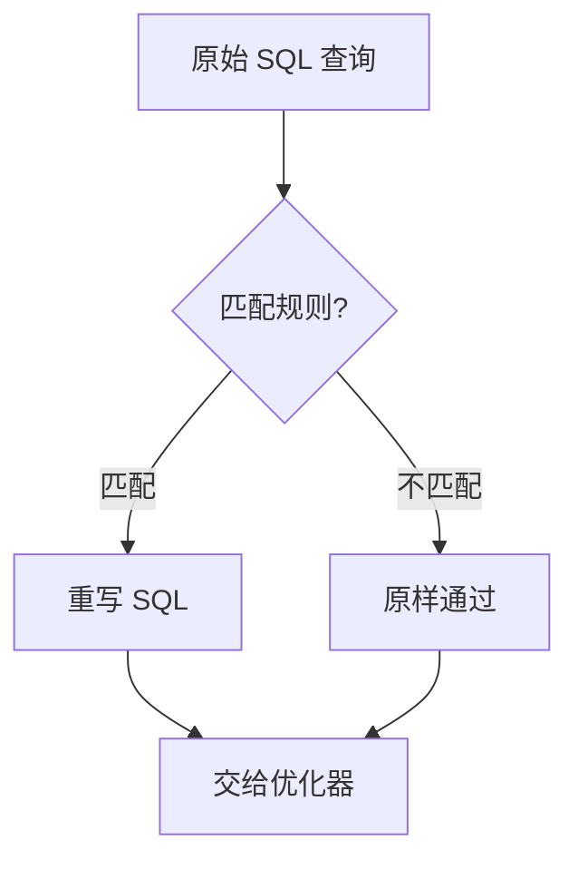
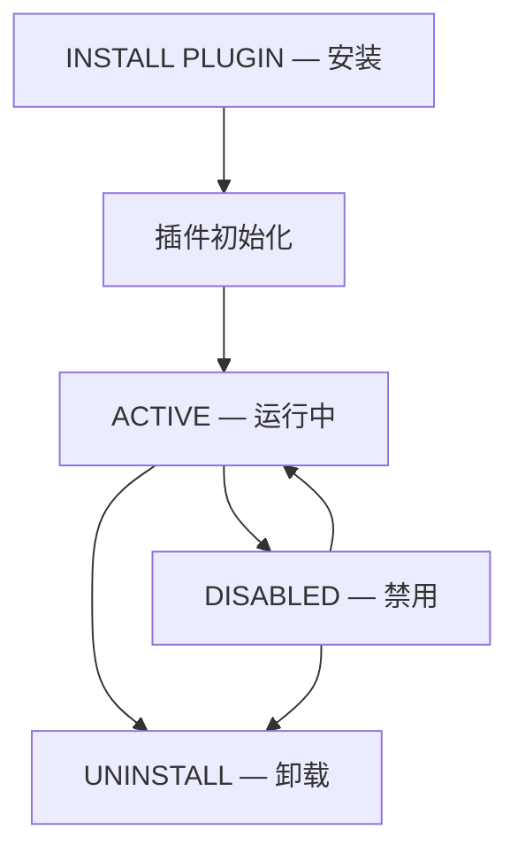

<cite>
**引用文件**
- [plugin/rewriter/rewriter_plugin.cc](file://plugin/rewriter/rewriter_plugin.cc)
- [plugin/rewriter/rewriter.cc](file://plugin/rewriter/rewriter.cc)
- [plugin/rewriter/rule.cc](file://plugin/rewriter/rule.cc)
- [plugin/rewriter/services.cc](file://plugin/rewriter/services.cc)
- [plugin/validate_password/](file://plugin/validate_password/)
- [plugin/clone/](file://plugin/clone/)
- [plugin/component/](file://plugin/component/)
- [sql/locking_service_udf.cc](file://sql/locking_service_udf.cc)
</cite>

## 目录
1. [插件生态概述](#插件生态概述)
2. [查询重写插件（Rewriter）](#查询重写插件rewriter)
3. [密码验证插件](#密码验证插件)
4. [UDF 插件系统](#udf-插件系统)
5. [其他内置插件](#其他内置插件)
6. [插件管理](#插件管理)

## 插件生态概述

MySQL 9.6.0 拥有丰富的插件生态，按功能分类：

| 类别 | 插件 | 说明 |
|------|------|------|
| **查询重写** | Rewriter | SQL 查询自动重写 |
| **安全** | validate_password, audit_log | 密码策略、审计日志 |
| **复制** | Clone, Group Replication | 克隆、组复制 |
| **存储** | InnoDB, MyISAM, NDB | 存储引擎 |
| **认证** | caching_sha2, LDAP, FIDO | 认证方式 |
| **协议** | X Plugin | X Protocol 支持 |
| **组件** | Component 框架 | 新一代插件架构 |

**Sources** · [plugin/](file://plugin/)

## 查询重写插件（Rewriter）

Rewriter 插件（`plugin/rewriter/`）实现 SQL 查询的自动重写：

### 工作原理



### 核心文件

| 文件 | 大小 | 说明 |
|------|------|------|
| `rewriter_plugin.cc` | ~18KB | 插件入口和生命周期 |
| `rewriter.cc` | ~6KB | 重写引擎 |
| `rule.cc` | ~6KB | 规则定义和匹配 |
| `services.cc` | ~6KB | MySQL 服务接口调用 |
| `rewriter_udf.cc` | ~2KB | UDF 注册 |

### 规则定义

规则存储在 `query_rewrite.rewrite_rules` 表中：

```sql
-- 安装 Rewriter 插件
INSTALL PLUGIN Rewriter SONAME 'rewriter.so';

-- 安装 UDF
source /usr/share/mysql/install_rewriter.sql;

-- 添加重写规则
INSERT INTO query_rewrite.rewrite_rules (pattern, replacement)
VALUES (
    'SELECT * FROM t1 WHERE id = ?',
    'SELECT id, name, status FROM t1 WHERE id = ?'
);

-- 刷新规则
SELECT load_rewrite_rules();

-- 查看规则
SELECT * FROM query_rewrite.rewrite_rules;

-- 查看重写历史
SHOW GLOBAL STATUS LIKE 'Rewriter%';
```

### 重写应用场景

| 场景 | 示例 |
|------|------|
| **弃用列替换** | `SELECT *` → 明确列名 |
| **性能优化** | 强制使用特定索引 |
| **兼容性** | 旧语法 → 新语法 |
| **安全** | 注入防御模式重写 |

**Sources** · [plugin/rewriter/rewriter_plugin.cc](file://plugin/rewriter/rewriter_plugin.cc) · [plugin/rewriter/rewriter.cc](file://plugin/rewriter/rewriter.cc)

## 密码验证插件

`validate_password` 插件强制执行密码复杂度策略：

### 密码策略级别

| 级别 | 说明 | 检查项 |
|------|------|--------|
| `LOW` | 最低 | 仅检查长度 |
| `MEDIUM` | 中等 | 长度 + 大写 + 小写 + 数字 + 特殊字符 |
| `STRONG` | 强 | MEDIUM + 字典检查 |

```sql
-- 安装密码验证
INSTALL PLUGIN validate_password SONAME 'validate_password.so';

-- 配置策略
SET GLOBAL validate_password.policy = MEDIUM;
SET GLOBAL validate_password.length = 8;
SET GLOBAL validate_password.mixed_case_count = 1;
SET GLOBAL validate_password.number_count = 1;
SET GLOBAL validate_password.special_char_count = 1;

-- 测试密码强度
SELECT VALIDATE_PASSWORD_STRENGTH('MyP@ss123');
```

**Sources** · [plugin/validate_password/](file://plugin/validate_password/)

## UDF 插件系统

MySQL 支持用户自定义函数（UDF），允许在 SQL 中使用 C/C++ 编写的函数：

### UDF 类型

| 类型 | 返回值 | 示例 |
|------|--------|------|
| **STRING** | 字符串 | 自定义格式化 |
| **INTEGER** | 整数 | 自定义计算 |
| **REAL** | 浮点数 | 自定义数学 |
| **DECIMAL** | 精确数值 | 财务计算 |

### UDF 聚合函数

| 类型 | 说明 |
|------|------|
| **普通 UDF** | 对每行调用一次 |
| **聚合 UDF** | 类似 SUM/AVG — 支持 GROUP BY |

### UDF 示例

```c
// UDF 接口（udf_example.cc）
my_bool myfunc_init(UDF_INIT *initid, UDF_ARGS *args, char *message);
void myfunc_deinit(UDF_INIT *initid);
char *myfunc(UDF_INIT *initid, UDF_ARGS *args, char *result,
             unsigned long *length, my_bool *null_value, my_bool *error);
```

```sql
-- 创建 UDF
CREATE FUNCTION myfunc RETURNS STRING SONAME 'udf_example.so';

-- 使用 UDF
SELECT myfunc(column1) FROM my_table;

-- 删除 UDF
DROP FUNCTION myfunc;
```

### UDF 服务

`udf_service_impl.cc`（~4KB）和 `udf_service_util.cc`（~4KB）提供 UDF 运行时服务：

| 服务 | 说明 |
|------|------|
| **注册服务** | 注册和管理 UDF |
| **元数据服务** | 获取 UDF 参数信息 |
| **内存服务** | UDF 内部分配内存 |

**Sources** · [sql/udf_example.cc](file://sql/udf_example.cc) · [sql/udf_service_impl.cc](file://sql/udf_service_impl.cc)

## 其他内置插件

### 锁定 UDF

`locking_service_udf.cc`（~5KB）提供应用级命名锁：

```sql
-- 获取命名锁
SELECT GET_LOCK('order_processing', 10);

-- 释放锁
SELECT RELEASE_LOCK('order_processing');

-- 批量获取
SELECT GET_LOCK('lock1', 5), GET_LOCK('lock2', 5);
SELECT RELEASE_ALL_LOCKS();
```

### Component 框架

MySQL 8.0+ 引入了 Component 框架作为插件的现代化替代方案：

| 特性 | 传统插件 | Component |
|------|---------|-----------|
| **加载方式** | 服务器启动时 | 运行时动态加载 |
| **接口** | 内部 API | 标准化服务接口 |
| **隔离性** | 低 | 高 |
| **版本兼容** | 紧耦合 | 松耦合 |
| **推荐** | 已废弃 | 推荐使用 |

```sql
-- Component 管理
INSTALL COMPONENT 'file://component_audit_api_message_emit';
UNINSTALL COMPONENT 'file://component_audit_api_message_emit';

-- 查看已安装组件
SELECT * FROM mysql.component;
```

**Sources** · [sql/locking_service_udf.cc](file://sql/locking_service_udf.cc) · [plugin/component/](file://plugin/component/)

## 插件管理

### 插件生命周期



### 管理命令

```sql
-- 查看所有插件
SHOW PLUGINS;

-- 安装插件
INSTALL PLUGIN plugin_name SONAME 'library_name.so';

-- 卸载插件
UNINSTALL PLUGIN plugin_name;

-- 查看插件状态
SELECT PLUGIN_NAME, PLUGIN_STATUS FROM INFORMATION_SCHEMA.PLUGINS;

-- 通过命令行安装
-- mysqld --plugin-load-add=rewriter.so
```

### 插件配置文件

```ini
# my.cnf 中的插件配置
[mysqld]
plugin-load-add = rewriter.so
plugin-load-add = validate_password.so

# 密码验证
validate_password.policy = STRONG
validate_password.length = 12

# 重写插件
rewriter.enabled = ON
```

**Sources** · [plugin/rewriter/rewriter_plugin.cc](file://plugin/rewriter/rewriter_plugin.cc) · [sql/locking_service_udf.cc](file://sql/locking_service_udf.cc)
