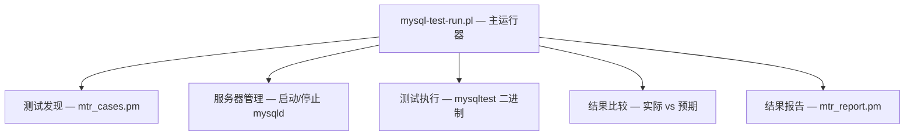

<cite>
**引用文件**
- [mysql-test/mysql-test-run.pl](file://mysql-test/mysql-test-run.pl)
- [mysql-test/lib/mtr_cases.pm](file://mysql-test/lib/mtr_cases.pm)
- [mysql-test/README](file://mysql-test/README)
- [unittest/CMakeLists.txt](file://unittest/CMakeLists.txt)
- [unittest/gunit/](file://unittest/gunit/)
</cite>

## 目录
1. [测试体系概述](#测试体系概述)
2. [MTR 集成测试框架](#mtr-集成测试框架)
3. [测试组织与目录结构](#测试组织与目录结构)
4. [编写 MTR 测试](#编写-mtr-测试)
5. [单元测试（Google Test）](#单元测试google-test)
6. [Sanitizer 集成](#sanitizer-集成)
7. [调试与排错](#调试与排错)
8. [常用测试套件](#常用测试套件)

## 测试体系概述

MySQL Server 采用两层测试策略：

1. **MTR（MySQL Test Runner）** — 集成/回归测试框架，启动真实的服务器实例并运行 SQL 测试脚本
2. **Google Test（gtest）** — C++ 单元测试，位于 `unittest/gunit/`，用于测试独立的类和函数

MTR 是主要的测试基础设施，拥有数千个测试用例，覆盖 SQL 语义、复制、存储引擎、安全等领域。单元测试作为 MTR 的补充，隔离测试内部 C++ 组件。

**Sources** · [mysql-test/README](file://mysql-test/README)

## MTR 集成测试框架

MTR（`mysql-test-run.pl`，约 295KB 的 Perl 脚本）是核心测试编排器：



### 核心组件

| 组件 | 文件 | 说明 |
|------|------|------|
| 主运行器 | `mysql-test-run.pl` | 处理并行度、服务器生命周期、测试调度 |
| 测试发现 | `lib/mtr_cases.pm`（约 63KB） | 测试用例发现、过滤和依赖解析 |
| 结果报告 | `lib/mtr_report.pm`（约 30KB） | 结果格式化（通过/失败/跳过输出） |
| 进程管理 | `lib/mtr_process.pl` | 服务器进程启动/停止/崩溃检测 |
| 压力测试 | `mysql-stress-test.pl`（约 37KB） | 并发压力测试，随机测试选择 |

`mysqltest` 二进制（由 `client/mysqltest.cc` 构建，约 389KB）是一个专门的 MySQL 客户端，除了 SQL 外还支持测试命令：变量赋值、条件执行、错误预期、文件 I/O 和同步操作。

**Sources** · [mysql-test/mysql-test-run.pl:1-50](file://mysql-test/mysql-test-run.pl#L1-L50) · [mysql-test/lib/mtr_cases.pm:1-30](file://mysql-test/lib/mtr_cases.pm#L1-L30)

## 测试组织与目录结构

测试按套件（suite）组织，每个套件针对特定的功能领域：

```
mysql-test/
├── t/            # 默认套件的测试脚本（.test 文件）
├── r/            # 默认套件的预期结果（.result 文件）
├── include/      # 共享包含文件（.inc）
├── suite/        # 功能特定的测试套件
│   ├── innodb/              # InnoDB 引擎测试
│   ├── binlog/              # 二进制日志测试
│   ├── replication/         # 复制测试
│   ├── group_replication/   # 组复制测试
│   ├── clone/               # 克隆插件测试
│   ├── encryption/          # 数据加密测试
│   ├── gis/                 # 空间/GIS 测试
│   ├── collations/          # 字符集/排序规则测试
│   ├── parts/               # 分区测试
│   ├── optimizer_trace/     # 优化器跟踪测试
│   └── ...                  # 60+ 个套件
├── std_data/     # 标准测试数据（证书、样例文件）
└── collections/  # 批量测试集合定义
```

每个套件目录包含：
- `t/` — 测试脚本文件
- `r/` — 预期结果文件
- `include/` — 套件特定的包含文件
- `suite.cfg` — 可选的套件配置（服务器选项、需求声明）

**Sources** · [mysql-test/suite/](file://mysql-test/suite/)

## 编写 MTR 测试

### 基本测试文件

一个基本的 MTR 测试文件（`t/example.test`）：

```sql
--source include/have_innodb.inc

CREATE TABLE t1 (id INT PRIMARY KEY, name VARCHAR(100)) ENGINE=InnoDB;
INSERT INTO t1 VALUES (1, 'hello'), (2, 'world');
SELECT * FROM t1 ORDER BY id;
DROP TABLE t1;
```

对应的结果文件（`r/example.result`）包含预期输出：

```
CREATE TABLE t1 (id INT PRIMARY KEY, name VARCHAR(100)) ENGINE=InnoDB;
INSERT INTO t1 VALUES (1, 'hello'), (2, 'world');
SELECT * FROM t1 ORDER BY id;
id	name
1	hello
2	world
DROP TABLE t1;
```

### 常用测试命令

| 命令 | 说明 |
|------|------|
| `--source include/have_*.inc` | 如功能不可用则跳过测试 |
| `--error ER_*` | 预期下一条语句产生特定错误 |
| `--let $var = value` | 设置测试变量 |
| `--if (condition)` | 条件执行 |
| `--disable_query_log` / `--enable_query_log` | 控制日志记录 |
| `--sorted_result` | 比较前对结果集排序 |
| `--replace_result` | 将可变输出替换为占位符 |
| `--connection name` | 切换到指定连接 |
| `--send` / `--reap` | 异步发送和收取查询 |
| `--sleep N` | 等待 N 秒 |
| `--wait_condition` | 等待条件满足 |

### 配置文件

- `t/test_name.opt` — 特定测试的额外服务器选项
- `t/test_name-master.opt` — 复制测试中主服务器的选项
- `t/test_name.cnf` — 服务器配置覆盖

### 运行测试

```bash
# 运行单个测试
cd mysql-test && ./mtr innodb.test_name

# 运行整个套件
cd mysql-test && ./mtr --suite=innodb

# 并行运行（4 个 worker）
cd mysql-test && ./mtr --parallel=4

# 仅运行失败测试的重试
cd mysql-test && ./mtr --retry=3

# 记录新测试结果（创建/更新 .result 文件）
cd mysql-test && ./mtr --record innodb.test_name
```

**Sources** · [mysql-test/t/](file://mysql-test/t/) · [mysql-test/include/](file://mysql-test/include/)

## 单元测试（Google Test）

单元测试位于 `unittest/` 目录，使用 Google Test 框架：

```
unittest/
├── gunit/                    # 主要单元测试目录
│   ├── innodb/               # InnoDB 特定单元测试
│   ├── binlogevents/         # 二进制日志事件测试
│   ├── changestreams/        # 变更流测试
│   ├── components/           # 组件单元测试
│   ├── group_replication/    # 组复制单元测试
│   ├── temptable/            # TempTable 引擎测试
│   ├── locks/                # 锁相关测试
│   ├── memory/               # 内存分配器测试
│   └── *-t.cc                # 独立测试文件
├── mytap/                    # TAP（Test Anything Protocol）测试
└── examples/                 # 示例单元测试
```

单元测试文件遵循 `*-t.cc` 命名规范（例如 `json_dom-t.cc`、`sql_parser-t.cc`）。它们被编译为独立的可执行文件，链接相关 MySQL 库，可以独立于 MTR 运行。

```bash
# 构建单元测试
cmake --build build --target unittest

# 运行单个单元测试
./build/unittest/gunit/json_dom-t

# 通过 CTest 运行所有单元测试
cd build && ctest -R gunit
```

**Sources** · [unittest/gunit/](file://unittest/gunit/) · [unittest/CMakeLists.txt](file://unittest/CMakeLists.txt)

## Sanitizer 集成

MySQL 的测试基础设施集成了多种 Sanitizer，用于检测内存和线程问题：

| Sanitizer | 构建标志 | 抑制文件 | 检测目标 |
|-----------|---------|---------|---------|
| Valgrind | （运行时） | `valgrind.supp`（约 49KB） | 内存错误、泄漏 |
| AddressSanitizer (ASan) | `-DWITH_ASAN=ON` | `asan.supp` | 缓冲区溢出、释放后使用 |
| LeakSanitizer (LSan) | （随 ASan 启用） | `lsan.supp` | 内存泄漏 |
| ThreadSanitizer (TSan) | `-DWITH_TSAN=ON` | `tsan.supp` | 数据竞争 |
| UndefinedBehavior (UBSan) | `-DWITH_UBSAN=ON` | — | 未定义行为 |

MTR 会自动检测 Sanitizer 构建并应用相应的抑制文件。

**Sources** · [mysql-test/valgrind.supp](file://mysql-test/valgrind.supp) · [mysql-test/asan.supp](file://mysql-test/asan.supp)

## 调试与排错

MTR 支持将调试器附加到测试服务器：

```bash
# GDB — 在断点处停止，允许单步调试
cd mysql-test && ./mtr --gdb innodb.test_name

# DDD — 图形化调试器前端
cd mysql-test && ./mtr --ddd innodb.test_name

# 手动调试 — 使用 --manual-gdb 启动服务器
cd mysql-test && ./mtr --manual-gdb innodb.test_name
```

调试时的推荐断点目标（来自 `sql/mysqld.cc`）：

| 函数 | 说明 |
|------|------|
| `my_message_sql` | 服务器错误报告入口 |
| `dispatch_command` | 命令分发入口点 |
| `mysql_execute_command` | SQL 命令执行 |

**Sources** · [sql/mysqld.cc:80-88](file://sql/mysqld.cc#L80-L88)

## 常用测试套件

MySQL 项目包含 60+ 个测试套件，以下为最常用的套件：

| 套件 | 测试领域 | 说明 |
|------|---------|------|
| （默认） | SQL 基础 | 核心 SQL 语义、DDL、DML |
| `innodb` | InnoDB 引擎 | 事务、锁定、崩溃恢复、性能 |
| `binlog` | 二进制日志 | 事件记录、格式、恢复 |
| `replication` | 主从复制 | 同步、异步、过滤 |
| `group_replication` | 组复制 | 多主/单主模式 |
| `encryption` | 加密 | 表空间加密、密钥管理 |
| `gis` | 空间数据 | 地理信息系统功能 |
| `collations` | 字符集 | 排序规则和字符编码 |
| `parts` | 分区 | 表分区功能 |
| `optimizer_trace` | 优化器 | 查询优化器跟踪 |
| `clone` | 克隆 | 克隆插件功能 |
