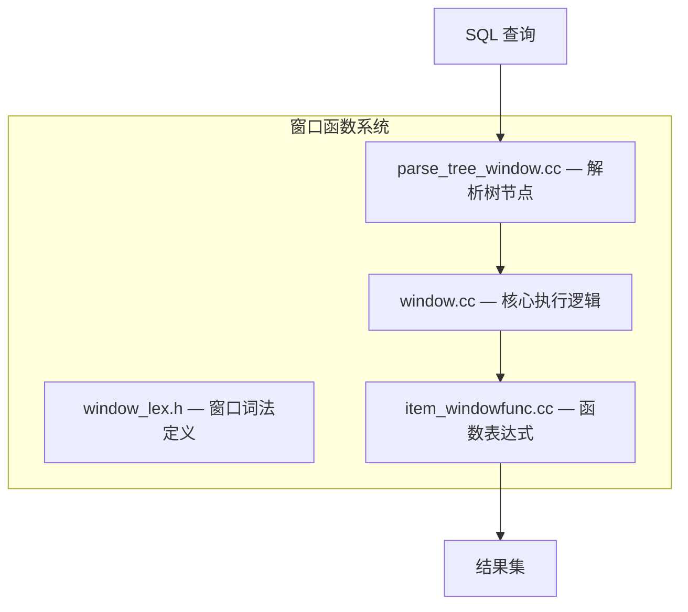
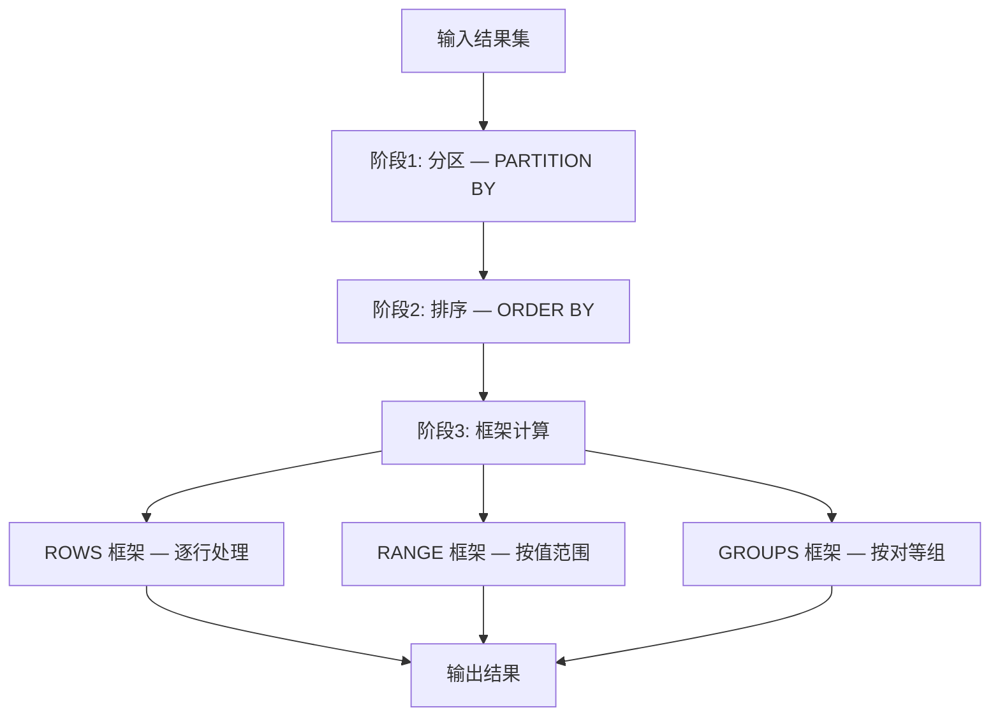
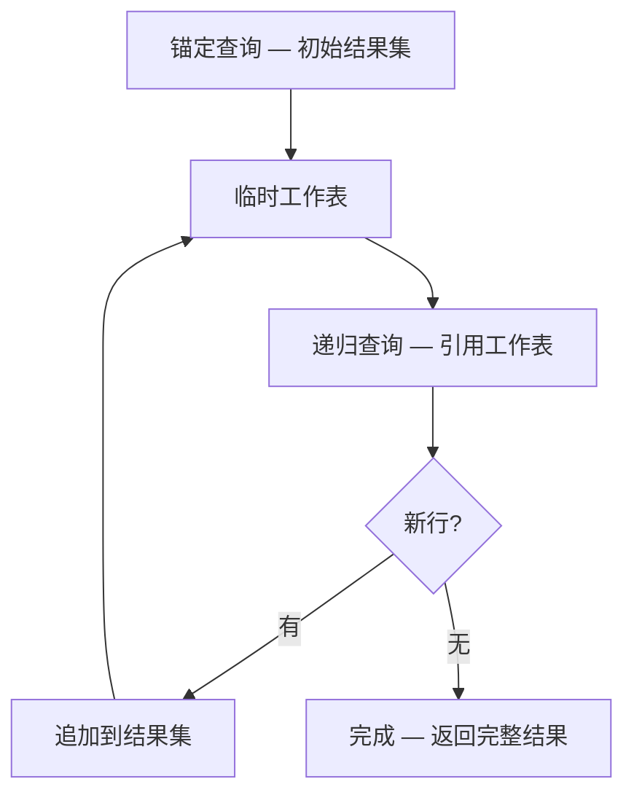

<cite>
**引用文件**
- [sql/window.cc](file://sql/window.cc)
- [sql/window.h](file://sql/window.h)
- [sql/parse_tree_window.cc](file://sql/parse_tree_window.cc)
- [sql/parse_tree_window.h](file://sql/parse_tree_window.h)
- [sql/window_lex.h](file://sql/window_lex.h)
- [sql/item_windowfunc.cc](file://sql/item_windowfunc.cc)
- [sql/sql_resolver.cc](file://sql/sql_resolver.cc)
</cite>

## 目录
1. [窗口函数概述](#窗口函数概述)
2. [窗口函数分类](#窗口函数分类)
3. [窗口规范（Window Spec）](#窗口规范window-spec)
4. [执行模型](#执行模型)
5. [通用表表达式（CTE）](#通用表表达式cte)
6. [递归 CTE](#递归-cte)

## 窗口函数概述

窗口函数在不改变结果集行数的情况下，对一组相关行（窗口框架）进行聚合或排名计算。核心实现在 `window.cc`（~51KB）和 `window.h`（~53KB）中。



**Sources** · [sql/window.cc](file://sql/window.cc) · [sql/window.h](file://sql/window.h)

## 窗口函数分类

### 排名函数

| 函数 | 说明 | 示例 |
|------|------|------|
| `ROW_NUMBER()` | 连续行号 | 1, 2, 3, 4 |
| `RANK()` | 排名（跳号） | 1, 2, 2, 4 |
| `DENSE_RANK()` | 密集排名（不跳号） | 1, 2, 2, 3 |
| `NTILE(N)` | 等分为 N 桶 | 1, 1, 2, 2 |
| `PERCENT_RANK()` | 百分比排名 | 0.0, 0.33, 0.67, 1.0 |
| `CUME_DIST()` | 累积分布 | 0.25, 0.5, 0.75, 1.0 |

```sql
SELECT
  department,
  employee_name,
  salary,
  ROW_NUMBER() OVER (PARTITION BY department ORDER BY salary DESC) AS dept_rank,
  DENSE_RANK() OVER (ORDER BY salary DESC) AS overall_rank
FROM employees;
```

### 值函数

| 函数 | 说明 |
|------|------|
| `LAG(expr, N)` | 前 N 行的值 |
| `LEAD(expr, N)` | 后 N 行的值 |
| `FIRST_VALUE(expr)` | 窗口框架第一行的值 |
| `LAST_VALUE(expr)` | 窗口框架最后一行的值 |
| `NTH_VALUE(expr, N)` | 窗口框架第 N 行的值 |

```sql
SELECT
  order_date,
  revenue,
  LAG(revenue, 1) OVER (ORDER BY order_date) AS prev_day,
  revenue - LAG(revenue, 1) OVER (ORDER BY order_date) AS daily_change
FROM daily_sales;
```

### 聚合函数（窗口模式）

所有标准聚合函数均可作为窗口函数使用：

| 函数 | 说明 |
|------|------|
| `SUM() OVER()` | 累计/滑动求和 |
| `AVG() OVER()` | 累计/滑动平均 |
| `COUNT() OVER()` | 累计/滑动计数 |
| `MIN() OVER()` | 累计/滑动最小值 |
| `MAX() OVER()` | 累计/滑动最大值 |

**Sources** · [sql/item_windowfunc.cc](file://sql/item_windowfunc.cc)

## 窗口规范（Window Spec）

窗口规范定义函数操作的行集合：

### PARTITION BY

将结果集按列值划分为独立的分区（类似于 GROUP BY）：

```sql
-- 按部门分区，部门内按薪资排名
ROW_NUMBER() OVER (PARTITION BY department ORDER BY salary DESC)
```

### ORDER BY

在每个分区内定义行的排序：

```sql
-- 按日期排序，计算累计销售额
SUM(amount) OVER (ORDER BY order_date)
```

### 窗口框架（Frame）

精确定义每行处理的行范围：

| 框架类型 | 说明 |
|---------|------|
| `ROWS` | 基于物理行数的框架 |
| `RANGE` | 基于值范围的框架 |
| `GROUPS` | 基于对等组的框架（MySQL 8.0+） |

| 框架边界 | 说明 |
|---------|------|
| `UNBOUNDED PRECEDING` | 分区起始 |
| `N PRECEDING` | 当前行前 N 行 |
| `CURRENT ROW` | 当前行 |
| `N FOLLOWING` | 当前行后 N 行 |
| `UNBOUNDED FOLLOWING` | 分区末尾 |

```sql
-- 移动平均：前2行 + 当前行 + 后2行
AVG(revenue) OVER (
  ORDER BY order_date
  ROWS BETWEEN 2 PRECEDING AND 2 FOLLOWING
)

-- 累计求和：从分区起始到当前行
SUM(amount) OVER (
  ORDER BY order_date
  ROWS BETWEEN UNBOUNDED PRECEDING AND CURRENT ROW
)
```

### 命名窗口

```sql
SELECT
  department,
  employee_name,
  salary,
  RANK() OVER w AS rank_in_dept,
  SUM(salary) OVER w AS dept_total
FROM employees
WINDOW w AS (PARTITION BY department ORDER BY salary DESC);
```

**Sources** · [sql/parse_tree_window.cc](file://sql/parse_tree_window.cc) · [sql/window_lex.h](file://sql/window_lex.h)

## 执行模型

窗口函数的执行分为三个阶段：



### 排序策略

| 策略 | 条件 | 说明 |
|------|------|------|
| **共享排序** | 相同 PARTITION BY + ORDER BY | 多个窗口函数共享一次排序 |
| **独立排序** | 不同的窗口规范 | 每个窗口独立排序 |
| **无排序** | 无 ORDER BY 或已有排序 | 跳过排序步骤 |

**Sources** · [sql/window.cc](file://sql/window.cc)

## 通用表表达式（CTE）

CTE（Common Table Expression）通过 `WITH` 子句定义临时命名的结果集，在 `sql_resolver.cc`（~347KB）中处理：

### 非递归 CTE

```sql
-- 简单 CTE
WITH regional_sales AS (
  SELECT region, SUM(amount) AS total
  FROM sales
  GROUP BY region
)
SELECT region, total
FROM regional_sales
WHERE total > 100000;
```

### 多个 CTE 链

```sql
WITH
  top_regions AS (
    SELECT region FROM sales GROUP BY region HAVING SUM(amount) > 100000
  ),
  region_orders AS (
    SELECT o.*, s.region
    FROM orders o JOIN top_regions s ON o.region = s.region
  )
SELECT region, COUNT(*) AS order_count
FROM region_orders
GROUP BY region;
```

### CTE 物化策略

| 策略 | 说明 |
|------|------|
| **物化（Materialize）** | 执行 CTE 并存储为临时结果集（默认） |
| **内联（Inline/Merge）** | 将 CTE 展开到主查询中，由优化器统一优化 |

```sql
-- 强制物化
WITH cte AS MATERIALIZED (SELECT ...) SELECT ... FROM cte;

-- 强制内联
WITH cte AS NOT MATERIALIZED (SELECT ...) SELECT ... FROM cte;
```

**Sources** · [sql/sql_resolver.cc](file://sql/sql_resolver.cc)

## 递归 CTE

递归 CTE 允许查询引用自身结果，实现树形遍历和递归计算：

### 语法结构

```sql
WITH RECURSIVE cte_name AS (
  -- 锚定部分（非递归）
  SELECT ... FROM ...
  UNION [ALL]
  -- 递归部分（引用自身）
  SELECT ... FROM ... JOIN cte_name ON ...
)
SELECT * FROM cte_name;
```

### 典型应用

```sql
-- 组织架构树
WITH RECURSIVE org_tree AS (
  -- 锚定：顶层管理者
  SELECT id, name, manager_id, 0 AS level
  FROM employees WHERE manager_id IS NULL

  UNION ALL

  -- 递归：下属员工
  SELECT e.id, e.name, e.manager_id, o.level + 1
  FROM employees e
  JOIN org_tree o ON e.manager_id = o.id
)
SELECT * FROM org_tree ORDER BY level, name;

-- 序列生成
WITH RECURSIVE numbers AS (
  SELECT 1 AS n
  UNION ALL
  SELECT n + 1 FROM numbers WHERE n < 100
)
SELECT * FROM numbers;
```

### 执行模型



### 安全控制

```sql
-- 限制递归深度（默认 1000）
SET SESSION cte_max_recursion_depth = 5000;

-- 使用 LIMIT 控制输出
WITH RECURSIVE cte AS (...)
SELECT * FROM cte LIMIT 10000;
```

**Sources** · [sql/sql_resolver.cc](file://sql/sql_resolver.cc) · [sql/iterators/basic_row_iterators.cc](file://sql/iterators/basic_row_iterators.cc)
