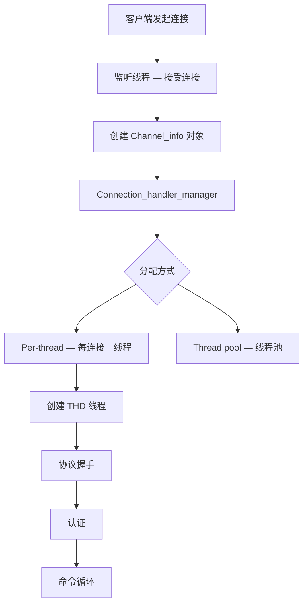
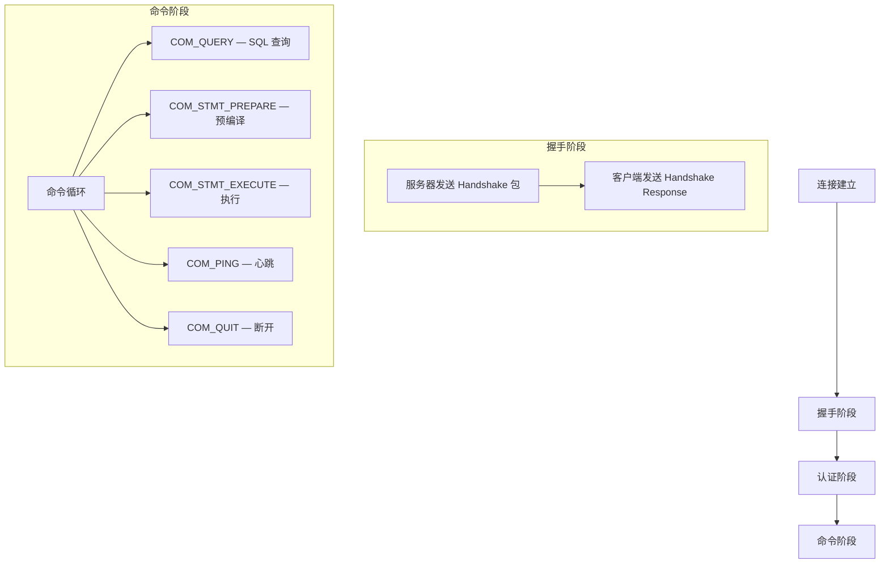
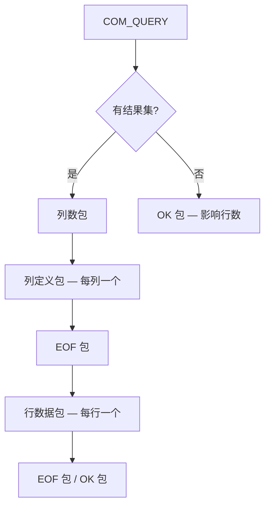
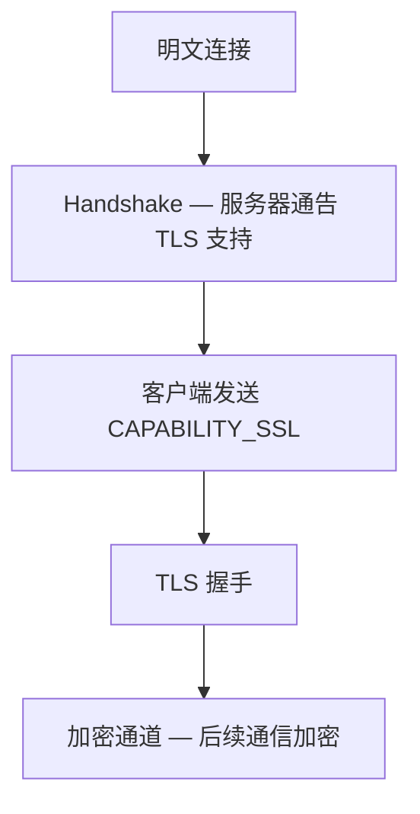

<cite>
**引用文件**
- [sql/protocol_classic.cc](file://sql/protocol_classic.cc)
- [sql/conn_handler/connection_handler_manager.cc](file://sql/conn_handler/connection_handler_manager.cc)
- [sql/conn_handler/connection_handler_per_thread.cc](file://sql/conn_handler/connection_handler_per_thread.cc)
- [sql/conn_handler/socket_connection.cc](file://sql/conn_handler/socket_connection.cc)
- [sql/conn_handler/named_pipe_connection.cc](file://sql/conn_handler/named_pipe_connection.cc)
- [sql/conn_handler/shared_memory_connection.cc](file://sql/conn_handler/shared_memory_connection.cc)
- [sql/conn_handler/init_net_server_extension.cc](file://sql/conn_handler/init_net_server_extension.cc)
- [vio/viosocket.c](file://vio/viosocket.c)
</cite>

## 目录
1. [网络层概述](#网络层概述)
2. [连接处理架构](#连接处理架构)
3. [Classic Protocol](#classic-protocol)
4. [传输方式](#传输方式)
5. [连接管理器](#连接管理器)
6. [TLS 与加密传输](#tls-与加密传输)

## 网络层概述

MySQL 的网络层负责客户端与服务器之间的通信，核心代码分布在 `sql/protocol_classic.cc`（~138KB）和 `sql/conn_handler/` 目录中：

| 文件 | 大小 | 说明 |
|------|------|------|
| `protocol_classic.cc` | ~138KB | Classic Protocol 实现 — 消息编码/解码 |
| `socket_connection.cc` | ~49KB | TCP/IP 和 Unix Socket 连接 |
| `connection_handler_per_thread.cc` | ~15KB | 每线程连接处理器 |
| `shared_memory_connection.cc` | ~13KB | Windows 共享内存连接 |
| `connection_handler_manager.cc` | ~11KB | 连接管理器 |
| `named_pipe_connection.cc` | ~10KB | Windows 命名管道连接 |
| `init_net_server_extension.cc` | ~5KB | 网络服务器初始化 |

```mermaid
graph TB
    subgraph 客户端
        MYSQL[mysql 客户端]
        CONNECTOR[Connector/J Python 等]
    end

    subgraph 传输层
        TCP[TCP/IP — 端口 3306]
        UNIX[Unix Socket]
        PIPE[Named Pipe — Windows]
        SHM[Shared Memory — Windows]
    end

    subgraph 服务器端 — sql/conn_handler/
        LISTENER[监听线程]
        MGR[连接管理器]
        HANDLER[连接处理器]
        PROTOCOL[Classic Protocol]
    end

    MYSQL --> TCP
    CONNECTOR --> TCP
    MYSQL --> UNIX
    TCP --> LISTENER
    UNIX --> LISTENER
    PIPE --> LISTENER
    SHM --> LISTENER
    LISTENER --> MGR
    MGR --> HANDLER
    HANDLER --> PROTOCOL
```

**Sources** · [sql/protocol_classic.cc](file://sql/protocol_classic.cc) · [sql/conn_handler/](file://sql/conn_handler/)

## 连接处理架构

### 连接建立流程



### 连接处理器类型

| 处理器 | 说明 |
|--------|------|
| **Per-thread** | 每个连接创建一个线程（默认） |
| **One-thread** | 所有连接由一个线程处理（调试用） |
| **Thread pool** | 连接池模式（企业版/插件） |

**Sources** · [sql/conn_handler/connection_handler_manager.cc](file://sql/conn_handler/connection_handler_manager.cc)

## Classic Protocol

`protocol_classic.cc`（~138KB）实现 MySQL Classic Protocol — 客户端与服务器之间的通信协议：

### 协议阶段



### 命令类型

| 命令 | 值 | 说明 |
|------|-----|------|
| `COM_QUERY` | 0x03 | 执行 SQL 语句 |
| `COM_STMT_PREPARE` | 0x16 | 预编译语句 |
| `COM_STMT_EXECUTE` | 0x17 | 执行预编译语句 |
| `COM_STMT_CLOSE` | 0x19 | 关闭预编译语句 |
| `COM_PING` | 0x0E | 心跳检测 |
| `COM_QUIT` | 0x01 | 断开连接 |
| `COM_INIT_DB` | 0x02 | 切换数据库 |
| `COM_FIELD_LIST` | 0x04 | 获取列信息 |
| `COM_CHANGE_USER` | 0x11 | 切换用户 |

### 数据包格式

```
+-------------------+------------------+-------------------+
| 包长度 (3 bytes)  | 序列号 (1 byte)  | 载荷 (payload)    |
+-------------------+------------------+-------------------+
```

- 最大包大小：16MB（2^24 - 1）
- 超过 16MB 的数据分多个包发送

### 结果集传输



**Sources** · [sql/protocol_classic.cc](file://sql/protocol_classic.cc)

## 传输方式

### TCP/IP 连接

最常用的传输方式，跨平台支持：

```sql
-- 服务器监听
-- port = 3306 (默认)
-- bind-address = 0.0.0.0

-- 客户端连接
-- mysql -h hostname -P 3306 -u user -p
```

### Unix Socket

仅限本地连接，性能优于 TCP/IP（无网络开销）：

```sql
-- 服务器配置
-- socket = /var/run/mysqld/mysqld.sock

-- 客户端连接
-- mysql -S /var/run/mysqld/mysqld.sock -u user -p
```

### Named Pipe（Windows）

Windows 平台的本地连接方式：

```ini
[mysqld]
enable-named-pipe
# socket = MySQL (管道名称)
```

### Shared Memory（Windows）

Windows 平台的共享内存连接：

```ini
[mysqld]
shared-memory
# shared-memory-base-name = MYSQL
```

**Sources** · [sql/conn_handler/socket_connection.cc](file://sql/conn_handler/socket_connection.cc) · [sql/conn_handler/named_pipe_connection.cc](file://sql/conn_handler/named_pipe_connection.cc)

## 连接管理器

`connection_handler_manager.cc`（~11KB）管理连接的创建、分配和清理：

### 职责

| 职责 | 说明 |
|------|------|
| 连接计数 | 跟踪当前活跃连接数和总连接数 |
| 线程管理 | 创建/回收连接处理线程 |
| 连接队列 | 超过 `max_connections` 时排队等待 |
| 超时处理 | 管理 `wait_timeout` 和 `interactive_timeout` |

```sql
-- 连接管理参数
SET GLOBAL max_connections = 500;
SET GLOBAL max_connect_errors = 100;

-- 查看连接统计
SHOW GLOBAL STATUS LIKE 'Threads_%';
SHOW GLOBAL STATUS LIKE 'Connections';
SHOW GLOBAL STATUS LIKE 'Aborted_%';
```

**Sources** · [sql/conn_handler/connection_handler_manager.cc](file://sql/conn_handler/connection_handler_manager.cc)

## TLS 与加密传输

MySQL 支持 TLS 加密的客户端-服务器通信：

### TLS 模式

| 模式 | 说明 |
|------|------|
| `PREFERRED` | 优先使用 TLS（默认） |
| `REQUIRED` | 强制 TLS |
| `VERIFY_CA` | TLS + 验证 CA |
| `VERIFY_IDENTITY` | TLS + 验证主机名 |
| `DISABLED` | 禁用 TLS |

```sql
-- 强制 TLS 连接
CREATE USER 'secure_user'@'%' REQUIRE SSL;

-- 客户端指定证书
-- mysql --ssl-ca=ca.pem --ssl-cert=client-cert.pem --ssl-key=client-key.pem

-- 检查连接是否加密
SHOW SESSION STATUS LIKE 'Ssl_cipher';
```

### 连接升级

Classic Protocol 连接可以在认证后升级为 TLS：



**Sources** · [sql/conn_handler/init_net_server_extension.cc](file://sql/conn_handler/init_net_server_extension.cc)
