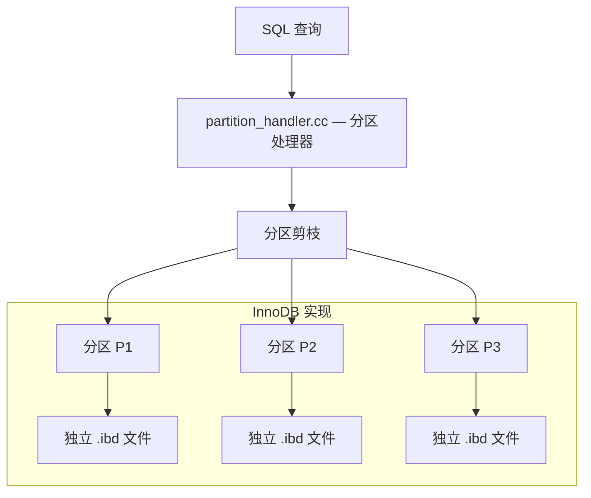
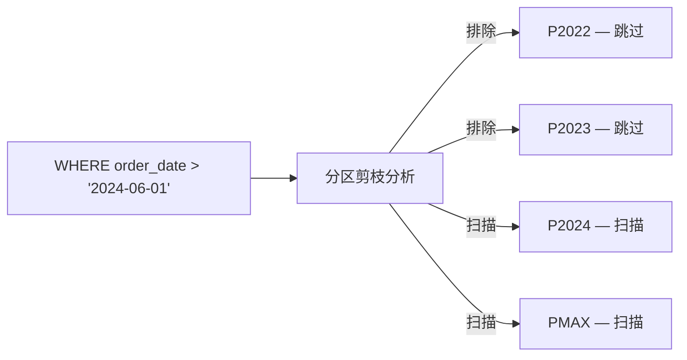
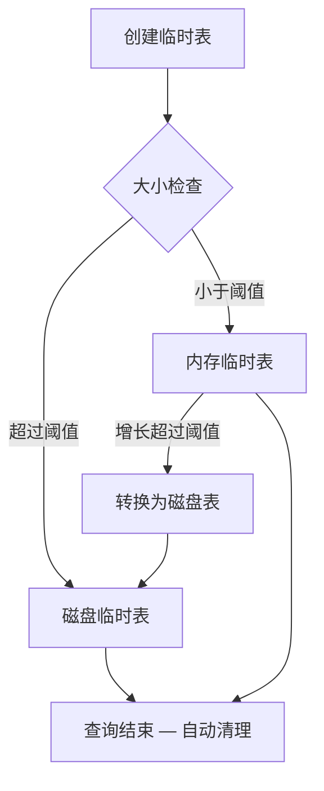

<cite>
**引用文件**
- [storage/innobase/partitioning/ha_innodb_part.cc](file://storage/innobase/partitioning/ha_innodb_part.cc)
- [sql/partitioning/partition_handler.cc](file://sql/partitioning/partition_handler.cc)
- [sql/sql_partition_admin.cc](file://sql/sql_partition_admin.cc)
- [sql/sql_tmp_table.cc](file://sql/sql_tmp_table.cc)
- [storage/temptable/](file://storage/temptable/)
</cite>

## 目录
1. [表分区概述](#表分区概述)
2. [分区类型](#分区类型)
3. [分区管理](#分区管理)
4. [分区剪枝](#分区剪枝)
5. [临时表概述](#临时表概述)
6. [临时表引擎（TempTable）](#临时表引擎temptable)

## 表分区概述

表分区将大表按特定规则划分为多个独立的物理子表，但对外表现为一个逻辑表。分区功能由 SQL 层的 `partition_handler.cc`（~96KB）协调，InnoDB 在 `storage/innobase/partitioning/` 中提供具体实现。



**Sources** · [sql/partitioning/partition_handler.cc](file://sql/partitioning/partition_handler.cc)

## 分区类型

### RANGE 分区

按连续值范围分区，适用于时间序列和有序数据：

```sql
CREATE TABLE orders (
  order_id INT NOT NULL AUTO_INCREMENT,
  order_date DATE NOT NULL,
  customer_id INT,
  total DECIMAL(10,2),
  PRIMARY KEY (order_id, order_date)
)
PARTITION BY RANGE (YEAR(order_date)) (
  PARTITION p2022 VALUES LESS THAN (2023),
  PARTITION p2023 VALUES LESS THAN (2024),
  PARTITION p2024 VALUES LESS THAN (2025),
  PARTITION pmax VALUES LESS THAN MAXVALUE
);
```

### LIST 分区

按离散值列表分区，适用于分类数据：

```sql
CREATE TABLE sales (
  sale_id INT NOT NULL,
  region VARCHAR(20),
  amount DECIMAL(10,2)
)
PARTITION BY LIST COLUMNS(region) (
  PARTITION p_east VALUES IN ('北京', '上海', '江苏'),
  PARTITION p_south VALUES IN ('广东', '深圳', '福建'),
  PARTITION p_west VALUES IN ('四川', '重庆', '云南')
);
```

### HASH 分区

按哈希值均匀分布，适用于无明确范围的数据：

```sql
CREATE TABLE users (
  user_id INT NOT NULL,
  username VARCHAR(50),
  email VARCHAR(100)
)
PARTITION BY HASH(user_id)
PARTITIONS 8;
```

### KEY 分区

类似 HASH 但使用 MySQL 内部哈希函数：

```sql
CREATE TABLE logs (
  log_id INT NOT NULL,
  log_level VARCHAR(10),
  message TEXT
)
PARTITION BY KEY(log_id)
PARTITIONS 16;
```

### 子分区（复合分区）

```sql
CREATE TABLE events (
  event_id INT NOT NULL,
  event_date DATE NOT NULL,
  category INT
)
PARTITION BY RANGE (YEAR(event_date))
SUBPARTITION BY HASH(category) SUBPARTITIONS 4 (
  PARTITION p2023 VALUES LESS THAN (2024),
  PARTITION p2024 VALUES LESS THAN (2025)
);
```

| 分区类型 | 适用场景 | 分区键要求 |
|---------|---------|-----------|
| RANGE | 时间序列、有序范围 | 整数或返回整数的表达式 |
| LIST | 离散分类值 | 整数或字符串（COLUMNS） |
| HASH | 均匀分布 | 整数或返回整数的表达式 |
| KEY | 均匀分布 | 任意类型（内部哈希） |

**Sources** · [sql/partitioning/partition_handler.cc](file://sql/partitioning/partition_handler.cc)

## 分区管理

`sql_partition_admin.cc`（~29KB）处理分区管理 DDL：

### 管理操作

```sql
-- 添加分区
ALTER TABLE orders ADD PARTITION (
  PARTITION p2025 VALUES LESS THAN (2026)
);

-- 删除分区（仅删除分区定义和数据）
ALTER TABLE orders DROP PARTITION p2022;

-- 重新组织分区（合并或拆分）
ALTER TABLE orders REORGANIZE PARTITION p2023 INTO (
  PARTITION p2023h1 VALUES LESS THAN (20230701),
  PARTITION p2023h2 VALUES LESS THAN (2024)
);

-- 截断分区（保留分区定义，清除数据）
ALTER TABLE orders TRUNCATE PARTITION p2022;

-- 交换分区（与普通表交换数据）
ALTER TABLE orders EXCHANGE PARTITION p2022 WITH TABLE orders_archive;

-- 重建分区（碎片整理）
ALTER TABLE orders REBUILD PARTITION p2023;
```

**Sources** · [sql/sql_partition_admin.cc](file://sql/sql_partition_admin.cc)

## 分区剪枝

分区剪枝（Partition Pruning）是查询优化的关键技术，自动排除不相关分区：



剪枝在以下场景生效：
- WHERE 条件直接引用分区键
- JOIN 条件中包含分区键
- 子查询中的分区键比较

使用 `EXPLAIN` 可查看剪枝效果：
```sql
EXPLAIN PARTITIONS SELECT * FROM orders
WHERE order_date BETWEEN '2024-01-01' AND '2024-12-31';
```

## 临时表概述

`sql_tmp_table.cc`（~111KB）管理 MySQL 的临时表系统。临时表在查询处理中广泛使用：

### 使用场景

| 场景 | 说明 |
|------|------|
| **隐式临时表** | GROUP BY、ORDER BY、DISTINCT、UNION 等操作需要中间结果 |
| **显式临时表** | `CREATE TEMPORARY TABLE` 用户创建的临时表 |
| **派生表** | FROM 子句中的子查询 |
| **CTE 物化** | WITH 语句的结果物化 |

### 临时表生命周期



### 关键参数

| 参数 | 默认值 | 说明 |
|------|--------|------|
| `tmp_table_size` | 16MB | 内存临时表最大大小 |
| `max_heap_table_size` | 16MB | MEMORY 引擎表最大大小 |
| `internal_tmp_mem_storage_engine` | TempTable | 内部临时表引擎 |

**Sources** · [sql/sql_tmp_table.cc](file://sql/sql_tmp_table.cc)

## 临时表引擎（TempTable）

`storage/temptable/` 是 MySQL 8.0+ 专用的临时表存储引擎：

### 架构特点

| 特性 | 说明 |
|------|------|
| **内存优先** | 数据优先存储在共享内存池中 |
| **自动溢出** | 超过阈值自动转储到磁盘（InnoDB 表空间） |
| **线程安全** | 使用互斥锁和原子操作保护共享数据结构 |
| **无持久化** | 无 redo/undo 日志，无崩溃恢复 |

### 与 Memory 引擎的对比

| 特性 | TempTable | Memory (HEAP) |
|------|-----------|---------------|
| 磁盘溢出 | 自动 | 不支持 |
| VARCHAR/BLOB | 支持 | 不支持 |
| 并发性能 | 更好（细粒度锁） | 表级锁 |
| 默认引擎 | 8.0+ 默认 | 旧版本默认 |

**Sources** · [storage/temptable/](file://storage/temptable/)
