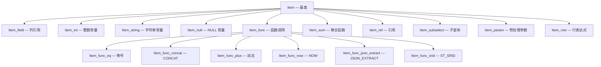
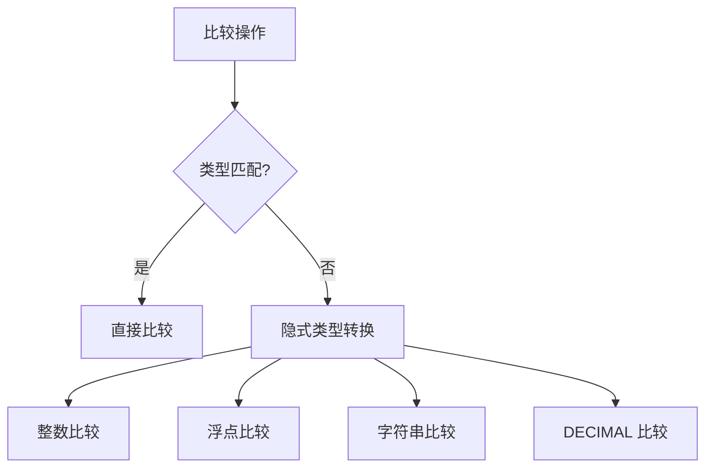
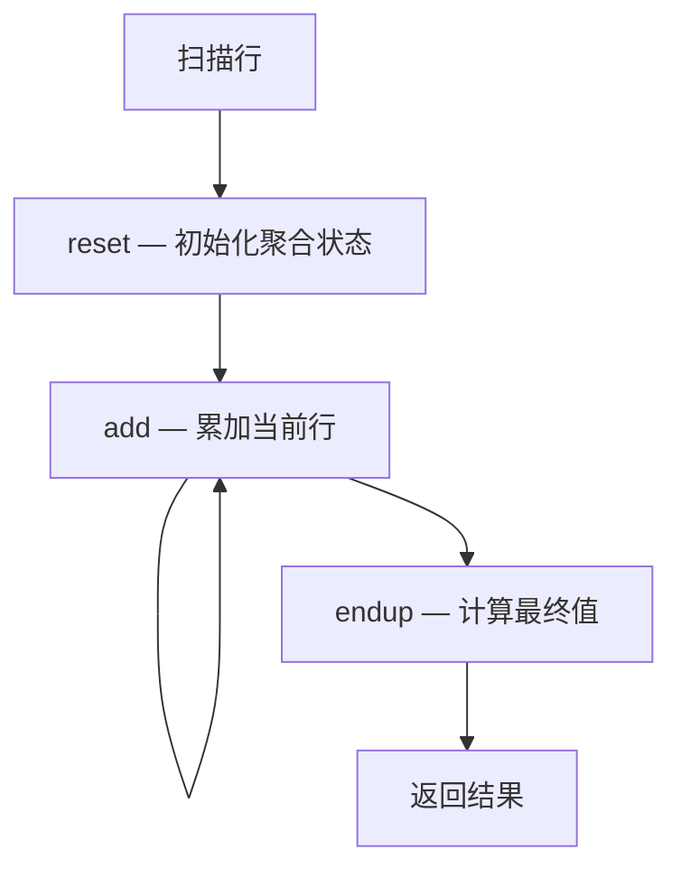
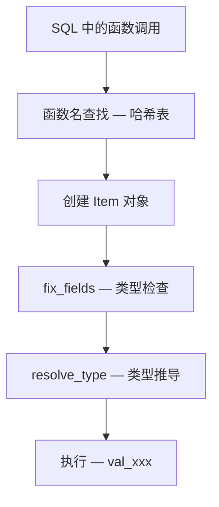

<cite>
**引用文件**
- [sql/item_func.cc](file://sql/item_func.cc)
- [sql/item_cmpfunc.cc](file://sql/item_cmpfunc.cc)
- [sql/item_geofunc.cc](file://sql/item_geofunc.cc)
- [sql/item_sum.cc](file://sql/item_sum.cc)
- [sql/item_strfunc.cc](file://sql/item_strfunc.cc)
- [sql/item_json_func.cc](file://sql/item_json_func.cc)
- [sql/item_subselect.cc](file://sql/item_subselect.cc)
- [sql/item_timefunc.cc](file://sql/item_timefunc.cc)
- [sql/item_create.cc](file://sql/item_create.cc)
</cite>

## 目录
1. [表达式系统概述](#表达式系统概述)
2. [Item 类层次结构](#item-类层次结构)
3. [通用函数 — item_func.cc](#通用函数--item_funccc)
4. [比较函数 — item_cmpfunc.cc](#比较函数--item_cmpfunccc)
5. [聚合函数 — item_sum.cc](#聚合函数--item_sumcc)
6. [字符串函数 — item_strfunc.cc](#字符串函数--item_strfunccc)
7. [时间函数 — item_timefunc.cc](#时间函数--item_timefunccc)
8. [JSON 函数 — item_json_func.cc](#json-函数--item_json_funccc)
9. [子查询表达式 — item_subselect.cc](#子查询表达式--item_subselectcc)
10. [函数注册 — item_create.cc](#函数注册--item_createcc)

## 表达式系统概述

MySQL 的表达式系统基于 `Item` 类层次结构，19 个 `item_*.cc` 文件总计约 2MB，构成了 MySQL 中最大的子系统：

| 文件 | 大小 | 说明 |
|------|------|------|
| `item_func.cc` | ~326KB | 通用函数 — 数学、信息函数等 |
| `item_cmpfunc.cc` | ~288KB | 比较函数 — =, <, >, IN, BETWEEN, LIKE |
| `item_geofunc.cc` | ~232KB | 空间函数 — ST_Distance, ST_Contains 等 |
| `item_sum.cc` | ~214KB | 聚合函数 — SUM, COUNT, AVG, MIN, MAX |
| `item_strfunc.cc` | ~180KB | 字符串函数 — CONCAT, SUBSTRING 等 |
| `item_json_func.cc` | ~169KB | JSON 函数 — JSON_EXTRACT, JSON_OBJECT 等 |
| `item_subselect.cc` | ~143KB | 子查询表达式 |
| `item_timefunc.cc` | ~135KB | 日期/时间函数 |

**Sources** · [sql/item_*.cc](file://sql/item_func.cc)

## Item 类层次结构

`Item` 是所有表达式的基类，形成了一个庞大的类层次：



### 核心接口

| 方法 | 说明 |
|------|------|
| `val_int()` | 返回整数值 |
| `val_real()` | 返回浮点值 |
| `val_str()` | 返回字符串值 |
| `val_decimal()` | 返回 DECIMAL 值 |
| `val_json()` | 返回 JSON 值 |
| `resolve_type()` | 类型推导 |
| `fix_fields()` | 字段解析和类型检查 |
| `print()` | 打印表达式（用于 EXPLAIN） |

**Sources** · [sql/item_func.cc](file://sql/item_func.cc)

## 通用函数 — item_func.cc

`item_func.cc`（~326KB）实现通用函数框架和大量内置函数：

### 数学函数

| 函数 | 类 | 说明 |
|------|-----|------|
| `ABS()` | `Item_func_abs` | 绝对值 |
| `CEIL()/FLOOR()` | `Item_func_ceiling/floor` | 向上/向下取整 |
| `ROUND()` | `Item_func_round` | 四舍五入 |
| `MOD()` | `Item_func_mod` | 取模 |
| `POW()/SQRT()` | `Item_func_pow/sqrt` | 幂/平方根 |
| `LOG()/EXP()` | `Item_func_log/exp` | 对数/指数 |
| `RAND()` | `Item_func_rand` | 随机数 |
| `SIGN()` | `Item_func_sign` | 符号 |

### 信息函数

| 函数 | 说明 |
|------|------|
| `DATABASE()` | 当前数据库 |
| `USER()` | 当前用户 |
| `VERSION()` | MySQL 版本 |
| `CONNECTION_ID()` | 连接 ID |
| `FOUND_ROWS()` | FOUND_ROWS 行数 |
| `ROW_COUNT()` | 影响行数 |
| `LAST_INSERT_ID()` | 最后自增 ID |

**Sources** · [sql/item_func.cc](file://sql/item_func.cc)

## 比较函数 — item_cmpfunc.cc

`item_cmpfunc.cc`（~288KB）实现所有比较操作：

### 比较操作

| 操作 | 类 | 说明 |
|------|-----|------|
| `=`, `!=`, `<`, `>` | `Item_func_eq/ne/lt/gt/le/ge` | 基本比较 |
| `IS NULL` | `Item_func_isnull` | NULL 检查 |
| `IS NOT NULL` | `Item_func_isnotnull` | 非 NULL 检查 |
| `IN ()` | `Item_func_in` | 集合包含 |
| `BETWEEN` | `Item_func_between` | 范围检查 |
| `LIKE` | `Item_func_like` | 模式匹配 |
| `REGEXP` | `Item_func_regexp` | 正则匹配 |
| `STRCMP()` | `Item_func_strcmp` | 字符串比较 |

### 类型转换



**Sources** · [sql/item_cmpfunc.cc](file://sql/item_cmpfunc.cc)

## 聚合函数 — item_sum.cc

`item_sum.cc`（~214KB）实现 SQL 聚合函数：

| 函数 | 类 | 说明 |
|------|-----|------|
| `COUNT()` | `Item_sum_count` | 计数 |
| `SUM()` | `Item_sum_sum` | 求和 |
| `AVG()` | `Item_sum_avg` | 平均值 |
| `MIN()` | `Item_sum_min` | 最小值 |
| `MAX()` | `Item_sum_max` | 最大值 |
| `GROUP_CONCAT()` | `Item_func_group_concat` | 字符串连接 |
| `STD()` | `Item_sum_std` | 标准差 |
| `BIT_AND/OR/XOR()` | `Item_sum_bit` | 位运算聚合 |
| `JSON_ARRAYAGG()` | `Item_sum_json_arrayagg` | JSON 数组聚合 |
| `JSON_OBJECTAGG()` | `Item_sum_json_objectagg` | JSON 对象聚合 |

### 聚合执行流程



**Sources** · [sql/item_sum.cc](file://sql/item_sum.cc)

## 字符串函数 — item_strfunc.cc

`item_strfunc.cc`（~180KB）实现字符串操作函数：

| 函数 | 说明 |
|------|------|
| `CONCAT()` | 字符串连接 |
| `CONCAT_WS()` | 带分隔符连接 |
| `SUBSTRING()` | 子字符串 |
| `REPLACE()` | 替换 |
| `TRIM()` | 去除空白 |
| `UPPER()/LOWER()` | 大小写转换 |
| `LENGTH()/CHAR_LENGTH()` | 长度计算 |
| `LPAD()/RPAD()` | 填充 |
| `REVERSE()` | 反转 |
| `REPEAT()` | 重复 |
| `INSERT()` | 插入 |
| `HEX()/UNHEX()` | 十六进制转换 |

**Sources** · [sql/item_strfunc.cc](file://sql/item_strfunc.cc)

## 时间函数 — item_timefunc.cc

`item_timefunc.cc`（~135KB）实现日期/时间函数：

| 函数 | 说明 |
|------|------|
| `NOW()/CURRENT_TIMESTAMP()` | 当前时间戳 |
| `CURDATE()/CURTIME()` | 当前日期/时间 |
| `DATE_ADD()/DATE_SUB()` | 日期加减 |
| `DATEDIFF()/TIMEDIFF()` | 日期/时间差 |
| `DATE_FORMAT()` | 日期格式化 |
| `STR_TO_DATE()` | 字符串转日期 |
| `UNIX_TIMESTAMP()` | Unix 时间戳 |
| `FROM_UNIXTIME()` | 时间戳转日期 |
| `YEAR()/MONTH()/DAY()` | 日期部分提取 |

**Sources** · [sql/item_timefunc.cc](file://sql/item_timefunc.cc)

## JSON 函数 — item_json_func.cc

`item_json_func.cc`（~169KB）实现 JSON 操作函数（详见 [JSON数据与对偶视图](/JSON数据与对偶视图)）：

| 函数 | 说明 |
|------|------|
| `JSON_EXTRACT()` | 路径提取 |
| `JSON_OBJECT()` | 构建对象 |
| `JSON_ARRAY()` | 构建数组 |
| `JSON_SET()/REPLACE()` | 设置/替换值 |
| `JSON_REMOVE()` | 删除值 |
| `JSON_CONTAINS()` | 包含检查 |
| `JSON_SEARCH()` | 搜索 |
| `JSON_MERGE_PATCH()` | 合并 |
| `JSON_TABLE()` | JSON 转关系表 |

**Sources** · [sql/item_json_func.cc](file://sql/item_json_func.cc)

## 子查询表达式 — item_subselect.cc

`item_subselect.cc`（~143KB）处理子查询作为表达式：

| 类型 | 类 | 说明 |
|------|-----|------|
| 标量子查询 | `Item_singlerow_subselect` | 返回单行单列 |
| EXISTS | `Item_exists_subselect` | 存在性检查 |
| IN 子查询 | `Item_in_subselect` | IN 子查询 |
| ALL/ANY | `Item_allany_subselect` | 比较子查询 |

**Sources** · [sql/item_subselect.cc](file://sql/item_subselect.cc)

## 函数注册 — item_create.cc

`item_create.cc`（~81KB）管理内置函数的注册和查找：



```sql
-- 查看所有内置函数
SELECT * FROM INFORMATION_SCHEMA.ROUTINES
WHERE ROUTINE_SCHEMA = 'mysql' AND ROUTINE_TYPE = 'FUNCTION';

-- 查看函数列表
SHOW FUNCTION STATUS;
```

**Sources** · [sql/item_create.cc](file://sql/item_create.cc)
