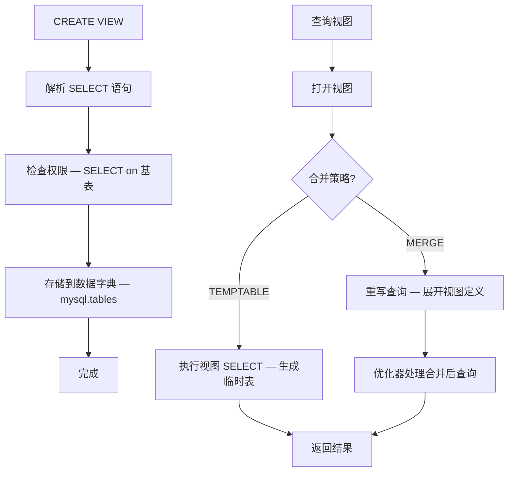
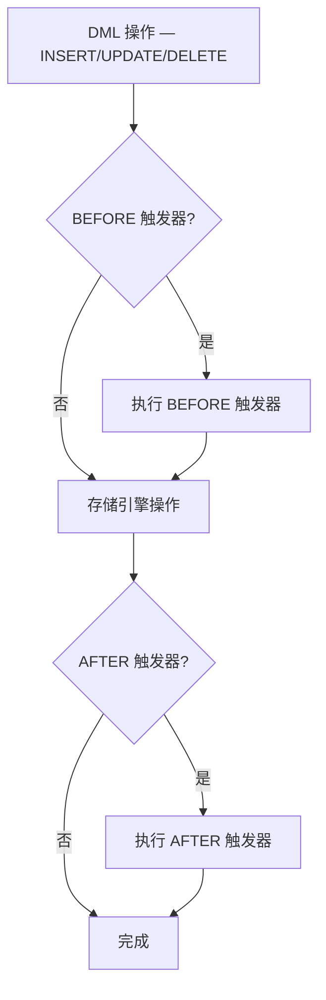
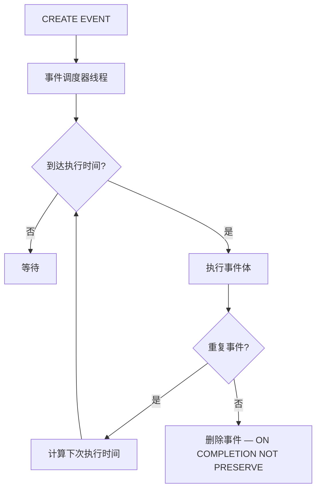

<cite>
**引用文件**
- [sql/sql_view.cc](file://sql/sql_view.cc)
- [sql/sql_trigger.cc](file://sql/sql_trigger.cc)
- [sql/sql_show.cc](file://sql/sql_show.cc)
- [sql/event.cc](file://sql/event.cc)
- [sql/sql_parse.cc](file://sql/sql_parse.cc)
</cite>

## 目录
1. [视图管理](#视图管理)
2. [触发器管理](#触发器管理)
3. [事件调度器](#事件调度器)
4. [元数据对象集成](#元数据对象集成)

## 视图管理

`sql_view.cc`（~75KB）实现视图的创建、修改、删除和查询：

### 视图生命周期



### 视图合并策略

| 策略 | 说明 | 适用场景 |
|------|------|---------|
| **MERGE** | 将视图定义合并到外层查询 | 简单 SELECT、投影 |
| **TEMPTABLE** | 先执行视图查询到临时表 | 含聚合、DISTINCT、UNION |
| **UNDEFINED** | 优化器自动选择（默认） | 优先 MERGE |

### 视图 SQL 语法

```sql
-- 创建视图
CREATE [OR REPLACE] [ALGORITHM = {MERGE | TEMPTABLE | UNDEFINED}]
VIEW v_name AS
SELECT col1, col2 FROM base_table WHERE condition
[WITH [CASCADED | LOCAL] CHECK OPTION];

-- 修改视图
ALTER VIEW v_name AS SELECT ...;

-- 删除视图
DROP VIEW [IF EXISTS] v_name [, v_name2 ...];

-- 查看视图定义
SHOW CREATE VIEW v_name;
```

### 可更新视图

视图满足以下条件时可更新（INSERT/UPDATE/DELETE）：

| 条件 | 说明 |
|------|------|
| 无聚合函数 | 不含 SUM, COUNT 等 |
| 无 DISTINCT/GROUP BY/HAVING | 无去重和分组 |
| 无 UNION | 无集合操作 |
| 单表映射 | 每列映射到基表的一列 |
| 无子查询引用更新表 | WHERE 中不引用同一表 |

**Sources** · [sql/sql_view.cc](file://sql/sql_view.cc)

## 触发器管理

`sql_trigger.cc`（~20KB）实现触发器的管理：

### 触发器类型

| 时机 | 事件 | 说明 |
|------|------|------|
| `BEFORE INSERT` | 插入前 | 验证/修改插入值 |
| `AFTER INSERT` | 插入后 | 审计日志、级联操作 |
| `BEFORE UPDATE` | 更新前 | 验证/修改更新值 |
| `AFTER UPDATE` | 更新后 | 审计日志、通知 |
| `BEFORE DELETE` | 删除前 | 验证删除、归档 |
| `AFTER DELETE` | 删除后 | 审计日志、清理 |

### 触发器执行流程



### 触发器 SQL 语法

```sql
-- 创建触发器
CREATE TRIGGER trigger_name
BEFORE INSERT ON table_name
FOR EACH ROW
BEGIN
    SET NEW.created_at = NOW();
    IF NEW.value < 0 THEN
        SIGNAL SQLSTATE '45000'
        SET MESSAGE_TEXT = 'Value must be positive';
    END IF;
END;

-- 删除触发器
DROP TRIGGER [IF EXISTS] schema_name.trigger_name;

-- 查看触发器
SHOW TRIGGERS [FROM schema_name];
SELECT * FROM INFORMATION_SCHEMA.TRIGGERS;
```

### 触发器限制

| 限制 | 说明 |
|------|------|
| 无事务控制 | 触发器内不能使用 COMMIT/ROLLBACK |
| 无递归 | 默认不递归调用（`max_sp_recursion_depth`） |
| 命名唯一 | 每个表的每个事件只能有一个触发器 |
| 确定性 | 不确定函数（RAND, NOW）影响复制 |

**Sources** · [sql/sql_trigger.cc](file://sql/sql_trigger.cc)

## 事件调度器

`sql/event.cc` 实现 MySQL 事件调度器（类似 cron）：

### 事件生命周期



### 事件 SQL 语法

```sql
-- 创建一次性事件
CREATE EVENT cleanup_old_data
ON SCHEDULE AT CURRENT_TIMESTAMP + INTERVAL 1 DAY
DO DELETE FROM logs WHERE created_at < DATE_SUB(NOW(), INTERVAL 90 DAY);

-- 创建重复事件
CREATE EVENT hourly_stats
ON SCHEDULE EVERY 1 HOUR
STARTS CURRENT_TIMESTAMP
ON COMPLETION PRESERVE
DO CALL compute_hourly_statistics();

-- 管理事件
ALTER EVENT cleanup_old_data DISABLE;
ALTER EVENT cleanup_old_data ENABLE;
DROP EVENT IF EXISTS cleanup_old_data;
```

**Sources** · [sql/event.cc](file://sql/event.cc)

## 元数据对象集成

视图、触发器、事件都存储在 MySQL 数据字典（DD）中：

### DD 存储位置

| 对象 | DD 表 | 说明 |
|------|-------|------|
| 视图 | `mysql.tables` | `table_type = 'VIEW'` |
| 触发器 | `mysql.triggers` | 触发器定义和属性 |
| 事件 | `mysql.events` | 事件定义和调度信息 |
| 存储程序 | `mysql.routines` | 过程和函数 |

### SHOW 命令

```sql
-- 查看所有数据库对象
SHOW TABLES;           -- 表和视图
SHOW VIEWS;            -- 仅视图（8.0+）
SHOW TRIGGERS;         -- 触发器
SHOW EVENTS;           -- 事件
SHOW PROCEDURE STATUS; -- 过程
SHOW FUNCTION STATUS;  -- 函数
```

**Sources** · [sql/sql_view.cc](file://sql/sql_view.cc) · [sql/sql_trigger.cc](file://sql/sql_trigger.cc)
