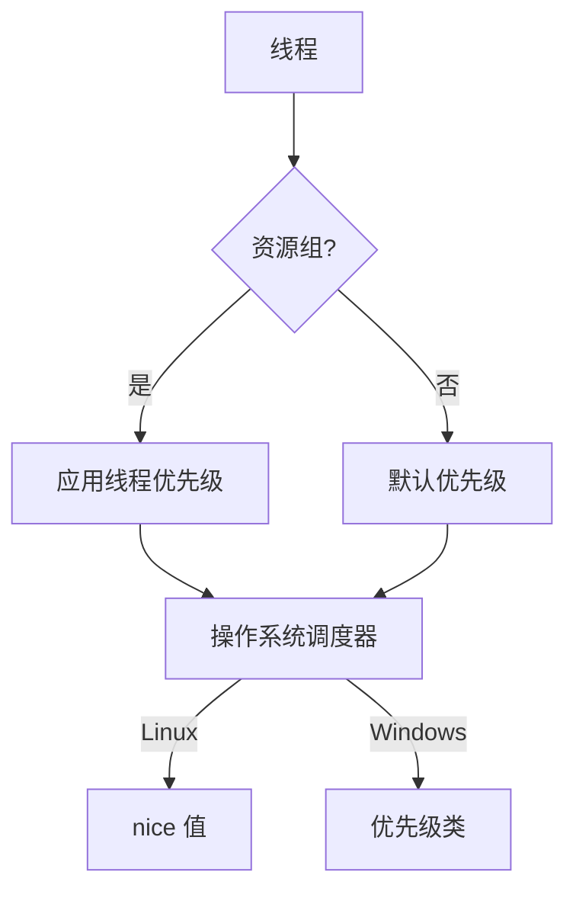
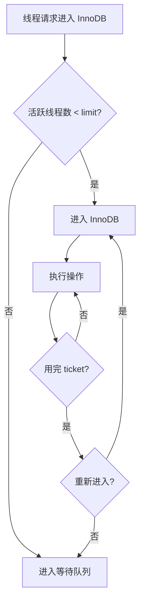
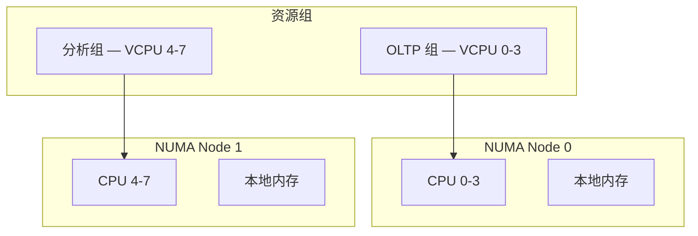

<cite>
**引用文件**
- [sql/resourcegroups/resource_group_mgr.cc](file://sql/resourcegroups/resource_group_mgr.cc)
- [sql/resourcegroups/resource_group_sql_cmd.cc](file://sql/resourcegroups/resource_group_sql_cmd.cc)
- [sql/resourcegroups/thread_resource_control.cc](file://sql/resourcegroups/thread_resource_control.cc)
- [sql/resourcegroups/resource_group.h](file://sql/resourcegroups/resource_group.h)
- [storage/innobase/srv/srv0conc.cc](file://storage/innobase/srv/srv0conc.cc)
</cite>

## 目录
1. [资源组概述](#资源组概述)
2. [资源组管理](#资源组管理)
3. [SQL 命令](#sql-命令)
4. [线程资源控制](#线程资源控制)
5. [InnoDB 并发控制](#innodb-并发控制)
6. [CPU 亲和性](#cpu-亲和性)

## 资源组概述

MySQL 资源组（Resource Group）允许 DBA 将线程分配到不同的资源组中，控制 CPU 和线程优先级。核心实现在 `sql/resourcegroups/`（~70KB）中：

| 文件 | 大小 | 说明 |
|------|------|------|
| `resource_group_sql_cmd.cc` | ~26KB | SQL 命令 — CREATE/ALTER/DROP RESOURCE GROUP |
| `resource_group_mgr.cc` | ~20KB | 资源组管理器 |
| `resource_group_mgr.h` | ~14KB | 管理器头文件 |
| `resource_group.h` | ~5KB | 资源组定义 |
| `thread_resource_control.cc` | ~4KB | 线程资源控制 |

**Sources** · [sql/resourcegroups/](file://sql/resourcegroups/)

## 资源组管理

### 资源组属性

| 属性 | 说明 |
|------|------|
| **名称** | 资源组的标识 |
| **类型** | `SYSTEM` 或 `USER` |
| **VCPU 列表** | 绑定的 CPU 核心 |
| **线程优先级** | -20（最高）到 19（最低） |
| **启用状态** | ENABLED / DISABLED |

### 默认资源组

| 组名 | 类型 | 优先级 | VCPU |
|------|------|--------|------|
| `SYS_default` | SYSTEM | 0 | 所有 |
| `USR_default` | USER | 0 | 所有 |

**Sources** · [sql/resourcegroups/resource_group_mgr.cc](file://sql/resourcegroups/resource_group_mgr.cc)

## SQL 命令

`resource_group_sql_cmd.cc`（~26KB）实现资源组的 SQL 语法：

### 创建资源组

```sql
-- 创建资源组
CREATE RESOURCE GROUP analytics
    TYPE = USER
    VCPU = 4-7
    THREAD_PRIORITY = 10
    ENABLE;

-- 创建高优先级组
CREATE RESOURCE GROUP critical
    TYPE = SYSTEM
    VCPU = 0-3
    THREAD_PRIORITY = -10
    ENABLE;
```

### 管理资源组

```sql
-- 修改资源组
ALTER RESOURCE GROUP analytics
    VCPU = 4-11
    THREAD_PRIORITY = 5;

-- 删除资源组
DROP RESOURCE GROUP analytics;

-- 查看资源组
SELECT * FROM INFORMATION_SCHEMA.RESOURCE_GROUPS;

-- 设置线程的资源组
SET RESOURCE GROUP analytics FOR 12345;  -- 连接 ID

-- 为当前会话设置
SET RESOURCE GROUP analytics;
```

### 查询提示中使用

```sql
-- 在查询中指定资源组
SELECT /*+ RESOURCE_GROUP(analytics) */
    * FROM big_table WHERE complex_condition;
```

**Sources** · [sql/resourcegroups/resource_group_sql_cmd.cc](file://sql/resourcegroups/resource_group_sql_cmd.cc)

## 线程资源控制

`thread_resource_control.cc`（~4KB）实现线程级别的资源控制：

### 线程优先级

| 优先级范围 | 说明 | 适用场景 |
|-----------|------|---------|
| -20 到 -1 | 高优先级 | 关键系统线程 |
| 0 | 默认优先级 | 普通连接 |
| 1 到 19 | 低优先级 | 后台任务、分析查询 |

### 优先级实现



**Sources** · [sql/resourcegroups/thread_resource_control.cc](file://sql/resourcegroups/thread_resource_control.cc)

## InnoDB 并发控制

`storage/innobase/srv/srv0conc.cc`（~9KB）管理 InnoDB 的内部并发控制：

### 并发控制参数

| 参数 | 默认值 | 说明 |
|------|--------|------|
| `innodb_thread_concurrency` | 0 | InnoDB 线程并发限制（0=无限） |
| `innodb_concurrency_tickets` | 5000 | 每个线程进入队列前的操作次数 |
| `innodb_spin_wait_delay` | 6 | 自旋等待延迟 |
| `innodb_sync_spin_loops` | 30 | 自旋循环次数 |

### 并发控制流程



### 配置建议

```sql
-- OLTP 工作负载（短查询）
SET GLOBAL innodb_thread_concurrency = 0;  -- 让 InnoDB 自管理

-- 混合工作负载
SET GLOBAL innodb_thread_concurrency = 64;  -- 限制并发线程
SET GLOBAL innodb_concurrency_tickets = 10000;
```

**Sources** · [storage/innobase/srv/srv0conc.cc](file://storage/innobase/srv/srv0conc.cc)

## CPU 亲和性

资源组可以绑定到特定的 CPU 核心，实现 NUMA 感知的线程调度：

### NUMA 架构



### 最佳实践

```sql
-- 将 OLTP 查询绑定到 NUMA 节点 0
CREATE RESOURCE GROUP oltp
    TYPE = USER
    VCPU = 0-15
    THREAD_PRIORITY = -5
    ENABLE;

-- 将分析查询绑定到 NUMA 节点 1
CREATE RESOURCE GROUP analytics
    TYPE = USER
    VCPU = 16-31
    THREAD_PRIORITY = 10
    ENABLE;
```

**Sources** · [sql/resourcegroups/resource_group_mgr.cc](file://sql/resourcegroups/resource_group_mgr.cc) · [sql/resourcegroups/resource_group_sql_cmd.cc](file://sql/resourcegroups/resource_group_sql_cmd.cc)
