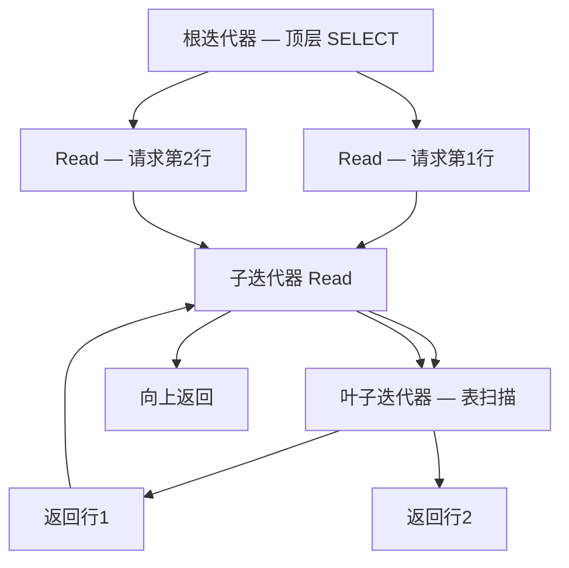
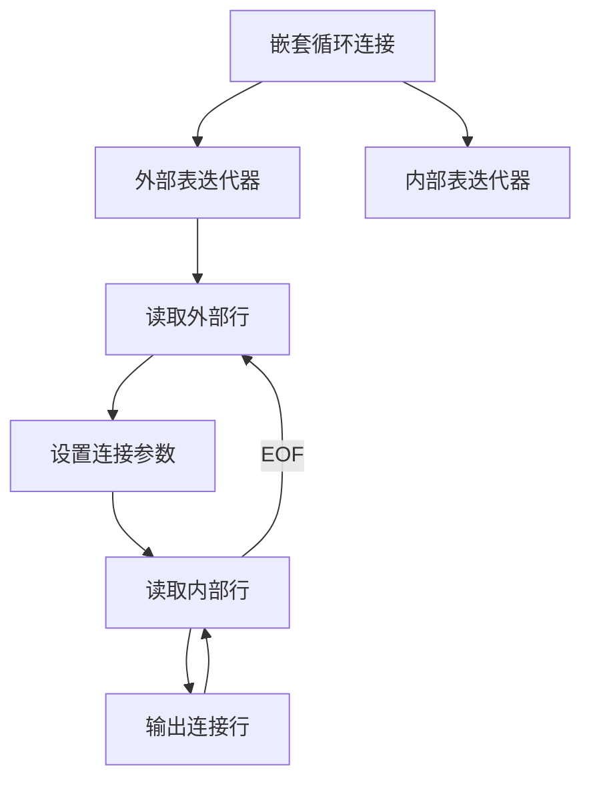
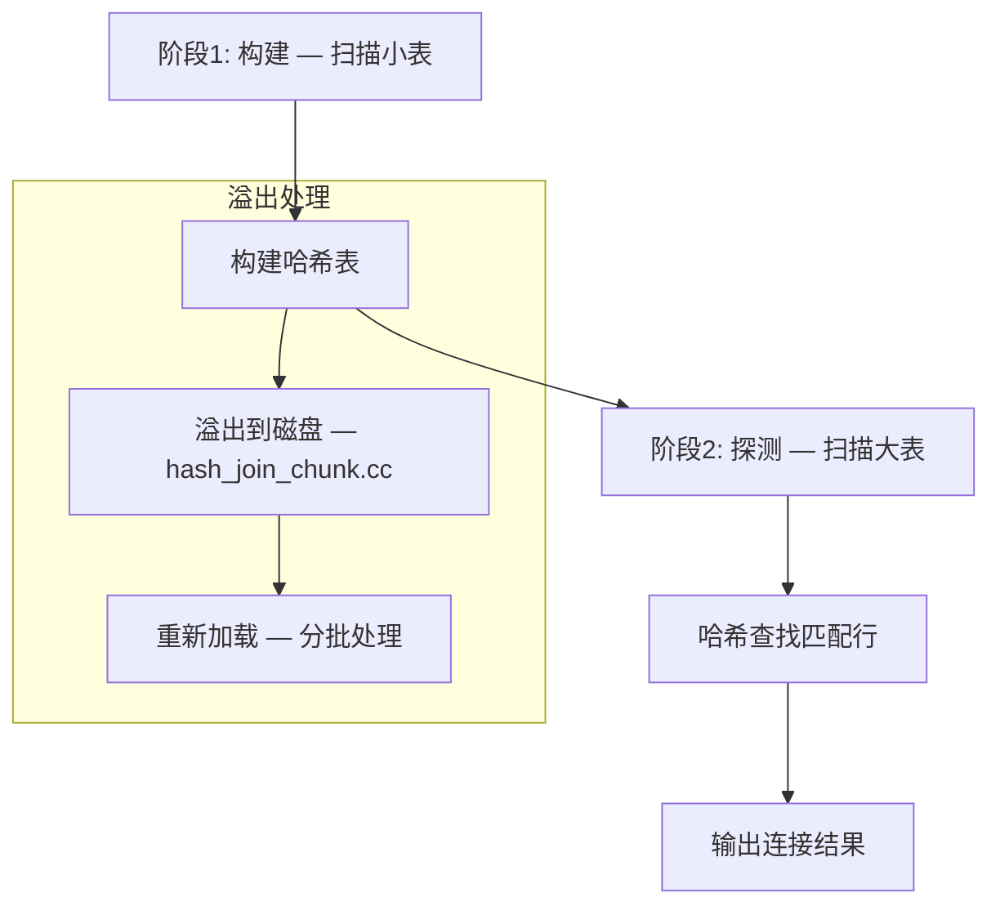
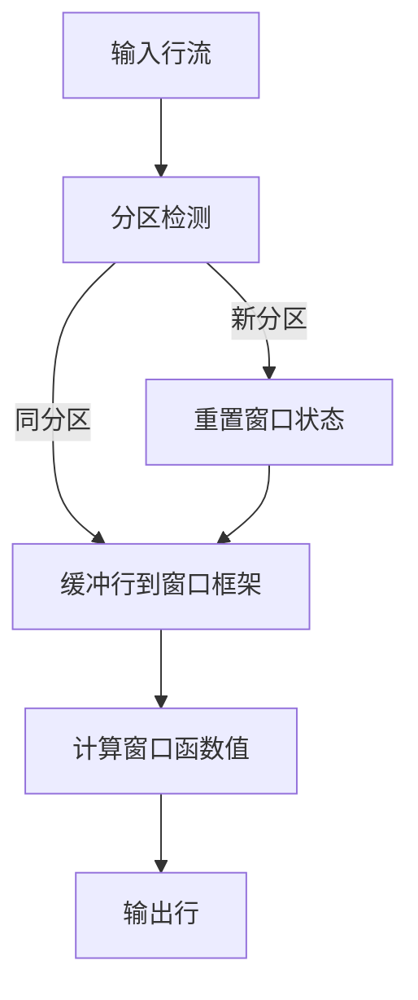
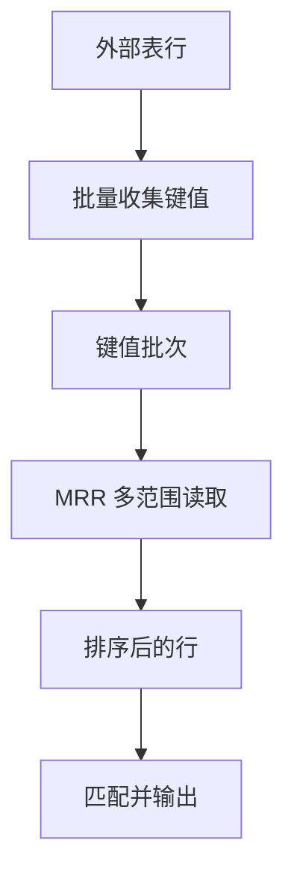

<cite>
**引用文件**
- [sql/iterators/composite_iterators.cc](file://sql/iterators/composite_iterators.cc)
- [sql/iterators/basic_row_iterators.cc](file://sql/iterators/basic_row_iterators.cc)
- [sql/iterators/ref_row_iterators.cc](file://sql/iterators/ref_row_iterators.cc)
- [sql/iterators/hash_join_iterator.cc](file://sql/iterators/hash_join_iterator.cc)
- [sql/iterators/sorting_iterator.cc](file://sql/iterators/sorting_iterator.cc)
- [sql/iterators/window_iterators.cc](file://sql/iterators/window_iterators.cc)
- [sql/iterators/bka_iterator.cc](file://sql/iterators/bka_iterator.cc)
- [sql/iterators/hash_join_buffer.cc](file://sql/iterators/hash_join_buffer.cc)
- [sql/iterators/hash_join_chunk.cc](file://sql/iterators/hash_join_chunk.cc)
</cite>

## 目录
1. [迭代器执行器概述](#迭代器执行器概述)
2. [Volcano 模型](#volcano-模型)
3. [基础行迭代器](#基础行迭代器)
4. [复合迭代器](#复合迭代器)
5. [哈希连接迭代器](#哈希连接迭代器)
6. [排序迭代器](#排序迭代器)
7. [窗口函数迭代器](#窗口函数迭代器)
8. [批量键访问迭代器](#批量键访问迭代器)

## 迭代器执行器概述

MySQL 8.0 引入了基于 Volcano 模型的迭代器执行器，取代了旧版的嵌套循环执行模型。执行计划被表示为迭代器树，每个迭代器实现统一的 `Read()` 接口，按需向上层返回一行数据。

核心实现分布在 `sql/iterators/` 目录的 9 个文件中，总计约 380KB 代码：

| 文件 | 大小 | 职责 |
|------|------|------|
| `composite_iterators.cc` | ~171KB | 复合迭代器 — JOIN、UNION、嵌套循环 |
| `window_iterators.cc` | ~62KB | 窗口函数执行 |
| `hash_join_iterator.cc` | ~46KB | 哈希连接 |
| `ref_row_iterators.cc` | ~30KB | 索引引用访问 |
| `sorting_iterator.cc` | ~19KB | 排序（filesort） |
| `bka_iterator.cc` | ~15KB | 批量键访问（BKA） |
| `basic_row_iterators.cc` | ~15KB | 基础行迭代器 |
| `hash_join_buffer.cc` | ~13KB | 哈希连接缓冲区 |
| `hash_join_chunk.cc` | ~7KB | 哈希连接溢出到磁盘 |

```mermaid
graph TB
    subgraph 迭代器执行器 — sql/iterators/
        BASIC[基础行迭代器]
        REF[索引引用迭代器]
        HASH_JOIN[哈希连接迭代器]
        COMPOSITE[复合迭代器]
        SORT[排序迭代器]
        WINDOW[窗口迭代器]
        BKA[BKA 迭代器]
    end

    PLAN[执行计划] --> COMPOSITE
    COMPOSITE --> BASIC
    COMPOSITE --> REF
    COMPOSITE --> HASH_JOIN
    COMPOSITE --> SORT
    COMPOSITE --> WINDOW
    HASH_JOIN --> HASH_BUF[哈希连接缓冲区]
```

**Sources** · [sql/iterators/](file://sql/iterators/)

## Volcano 模型

迭代器执行器基于 Volcano 模型（也称为火山模型或瀑布模型）：

### 核心接口

```cpp
class IteratorExecutor {
  // 初始化（打开）
  virtual bool Init() = 0;

  // 读取下一行（核心）
  virtual int Read() = 0;

  // 关闭（释放资源）
  virtual void End() = 0;
};
```

### 执行流程



### 优势

| 特性 | 说明 |
|------|------|
| **按需计算** | 只计算需要的行，支持 LIMIT 短路 |
| **内存高效** | 不需要物化整个中间结果 |
| **组合灵活** | 迭代器可任意组合成树 |
| **易于扩展** | 新增算法只需实现 Read() |

**Sources** · [sql/iterators/composite_iterators.cc](file://sql/iterators/composite_iterators.cc)

## 基础行迭代器

`basic_row_iterators.cc`（~15KB）提供最基本的行访问方式：

### 迭代器类型

| 迭代器 | 说明 |
|--------|------|
| `TableScanIterator` | 全表扫描 — 顺序读取所有行 |
| `IteratorExecutorSingleTable` | 单表迭代器包装 |
| `IteratorExecutorRef` | 引用迭代器包装 |
| `WindowingIterator` | 窗口函数迭代器 |
| `IteratorExecutorBit` | 位图索引迭代器 |

```sql
-- 全表扫描触发 TableScanIterator
EXPLAIN FORMAT=TREE SELECT * FROM orders;
-- -> Table scan on orders
```

**Sources** · [sql/iterators/basic_row_iterators.cc](file://sql/iterators/basic_row_iterators.cc)

## 复合迭代器

`composite_iterators.cc`（~171KB）是最核心也最复杂的文件，实现了多表操作的控制流：

### 主要迭代器

| 迭代器 | 说明 |
|--------|------|
| `IteratorExecutorNestedLoopJoin` | 嵌套循环连接 — 最基础的连接算法 |
| `IteratorExecutorHashJoin` | 哈希连接 — 对等值连接更优 |
| `IteratorExecutorUnion` | UNION 操作 — 合并多个结果集 |
| `IteratorExecutorAggregate` | 聚合操作 — GROUP BY |
| `IteratorExecutorDistinct` | 去重 — DISTINCT |
| `IteratorExecutorFilter` | 过滤 — WHERE / HAVING 条件 |
| `IteratorExecutorSort` | 排序 — ORDER BY |
| `IteratorExecutorMaterialize` | 物化 — CTE 和派生表 |
| `IteratorExecutorRecursive` | 递归 — WITH RECURSIVE |
| `IteratorExecutorLimitOffset` | LIMIT / OFFSET |

### 嵌套循环连接



### 聚合迭代器

```sql
-- 触发聚合迭代器
EXPLAIN FORMAT=TREE
SELECT department, COUNT(*), SUM(salary)
FROM employees GROUP BY department;
-- -> Aggregate using temp table
--    -> Table scan on employees
```

**Sources** · [sql/iterators/composite_iterators.cc](file://sql/iterators/composite_iterators.cc)

## 哈希连接迭代器

`hash_join_iterator.cc`（~46KB）实现 MySQL 8.0.18+ 引入的哈希连接：

### 工作原理



### 配置

| 参数 | 说明 |
|------|------|
| `join_buffer_size` | 构建阶段的内存缓冲大小 |
| 自动溢出 | 超过内存限制自动转储到磁盘 |

```sql
-- 哈希连接（优化器自动选择）
EXPLAIN FORMAT=TREE
SELECT * FROM orders o JOIN customers c ON o.customer_id = c.id;
-- -> Hash join (o.customer_id = c.id)
```

**Sources** · [sql/iterators/hash_join_iterator.cc](file://sql/iterators/hash_join_iterator.cc)

## 排序迭代器

`sorting_iterator.cc`（~19KB）实现 ORDER BY 和 filesort：

### 排序策略

| 策略 | 条件 | 说明 |
|------|------|------|
| **索引排序** | ORDER BY 列有索引 | 直接利用索引顺序，无需额外排序 |
| **内存排序** | 数据量小于 `sort_buffer_size` | 在内存中排序 |
| **外部排序** | 数据量大 | 分块排序后归并（多路归并） |

```sql
-- 需要排序迭代器
EXPLAIN FORMAT=TREE
SELECT * FROM orders ORDER BY order_date DESC LIMIT 10;
-- -> Limit: 10 row(s)
--    -> Sort: orders.order_date DESC
--       -> Table scan on orders
```

**Sources** · [sql/iterators/sorting_iterator.cc](file://sql/iterators/sorting_iterator.cc)

## 窗口函数迭代器

`window_iterators.cc`（~62KB）专门处理窗口函数的计算：

### 执行模型



### 优化

| 优化 | 说明 |
|------|------|
| **排序共享** | 相同 PARTITION BY + ORDER BY 的窗口共享排序 |
| **逐行计算** | ROW_NUMBER 等简单函数无需缓冲 |
| **框架缓冲** | 仅缓冲当前框架需要的行 |

**Sources** · [sql/iterators/window_iterators.cc](file://sql/iterators/window_iterators.cc)

## 批量键访问迭代器

`bka_iterator.cc`（~15KB）实现批量键访问（Batched Key Access）：

### 工作原理

BKA 通过批量收集外部行的键值，一次性访问内部表的索引，减少随机 I/O：



```sql
-- 启用 BKA
SET optimizer_switch = 'batched_key_access=on';

-- 使用 MRR
SET optimizer_switch = 'mrr=on,mrr_cost_based=off';
```

**Sources** · [sql/iterators/bka_iterator.cc](file://sql/iterators/bka_iterator.cc)
