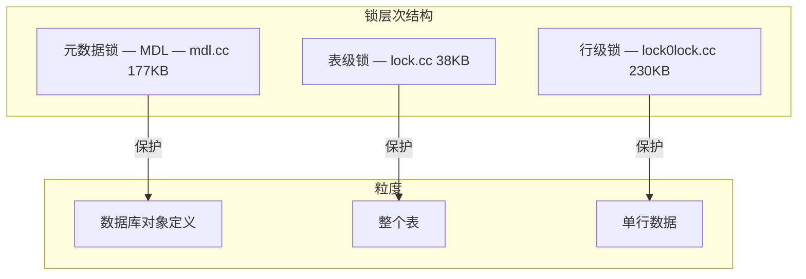
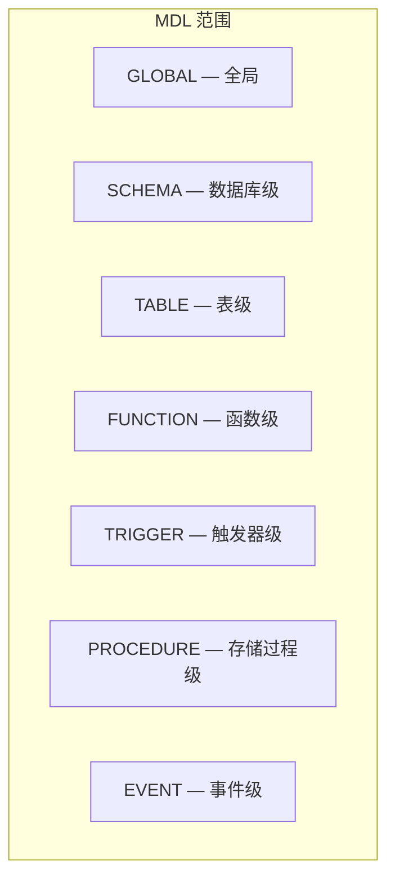
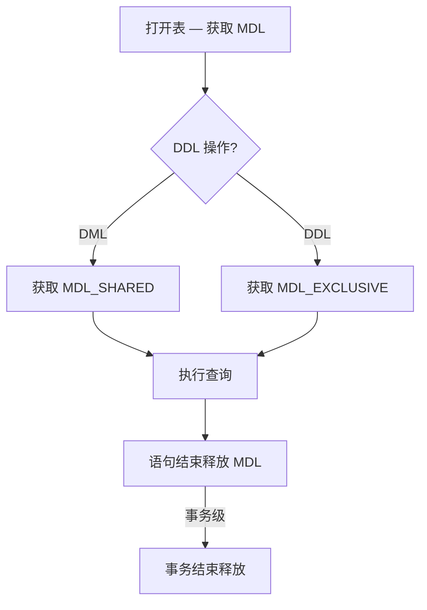
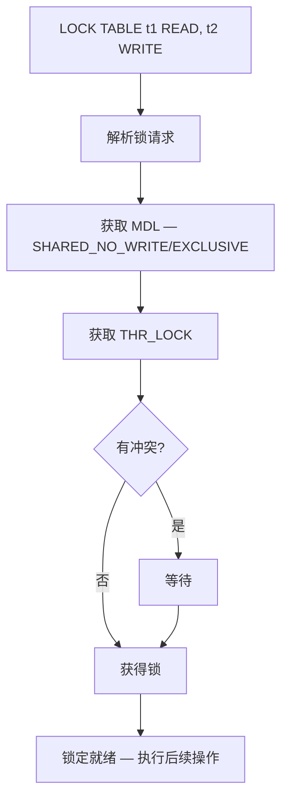
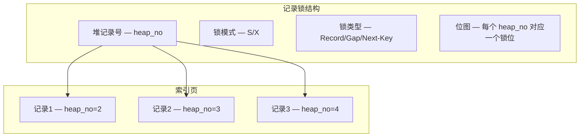
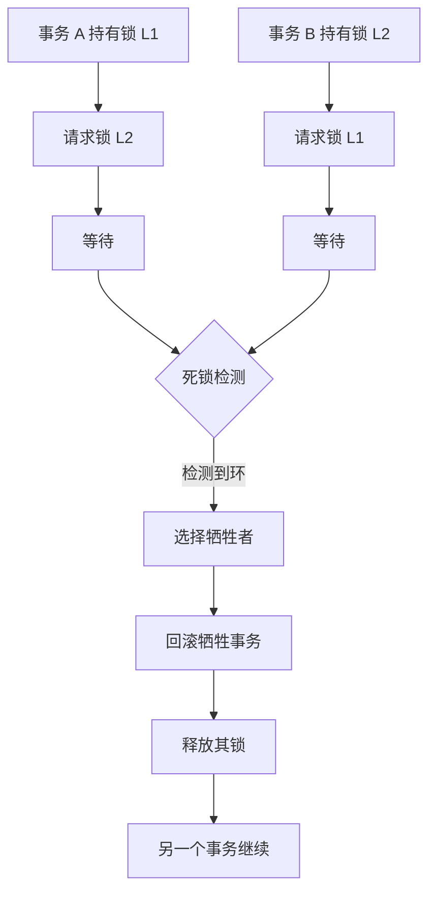

<cite>
**引用文件**
- [sql/lock.cc](file://sql/lock.cc)
- [sql/mdl.cc](file://sql/mdl.cc)
- [sql/locked_tables_list.cc](file://sql/locked_tables_list.cc)
- [sql/locking_service.cc](file://sql/locking_service.cc)
- [storage/innobase/lock/lock0lock.cc](file://storage/innobase/lock/lock0lock.cc)
- [storage/innobase/lock/lock0wait.cc](file://storage/innobase/lock/lock0wait.cc)
</cite>

## 目录
1. [锁与并发控制概述](#锁与并发控制概述)
2. [元数据锁（MDL）](#元数据锁mdl)
3. [表级锁](#表级锁)
4. [InnoDB 行级锁](#innodb-行级锁)
5. [锁等待与死锁检测](#锁等待与死锁检测)
6. [锁定服务](#锁定服务)
7. [并发监控与调优](#并发监控与调优)

## 锁与并发控制概述

MySQL 使用多层级的锁体系来保证并发访问的正确性，从粗粒度的元数据锁到细粒度的行级锁：



**Sources** · [sql/mdl.cc](file://sql/mdl.cc) · [sql/lock.cc](file://sql/lock.cc)

## 元数据锁（MDL）

`mdl.cc`（~177KB）实现 MySQL 的元数据锁，用于保护数据库对象（表、视图、函数等）的定义不被并发 DDL 和 DML 操作破坏：

### MDL 锁类型

| 锁类型 | 缩写 | 说明 | 典型持有者 |
|--------|------|------|-----------|
| `MDL_INTENTION_EXCLUSIVE` | IX | 意向排他 | ALTER TABLE 前的意向锁 |
| `MDL_SHARED` | S | 共享锁 | SELECT 查询 |
| `MDL_SHARED_UPGRADABLE` | SU | 可升级共享 | ALTER TABLE |
| `MDL_SHARED_NO_WRITE` | SNW | 共享 + 禁止写入 | LOCK TABLE READ |
| `MDL_SHARED_NO_READ_WRITE` | SNRW | 共享 + 禁止读写 | LOCK TABLE WRITE |
| `MDL_EXCLUSIVE` | X | 排他锁 | DDL 操作 |

### MDL 锁兼容性矩阵

| 请求↓\持有→ | S | SU | SNW | SNRW | X |
|-------------|:-:|:--:|:---:|:----:|:-:|
| **S** | ✓ | ✓ | ✓ | ✗ | ✗ |
| **SU** | ✓ | ✓ | ✗ | ✗ | ✗ |
| **SNW** | ✓ | ✗ | ✗ | ✗ | ✗ |
| **SNRW** | ✗ | ✗ | ✗ | ✗ | ✗ |
| **X** | ✗ | ✗ | ✗ | ✗ | ✗ |

### MDL 锁范围



### MDL 锁生命周期



**Sources** · [sql/mdl.cc](file://sql/mdl.cc)

## 表级锁

`lock.cc`（~38KB）和 `locked_tables_list.cc`（~17KB）实现表级锁管理：

### 表级锁类型

| 锁类型 | 说明 |
|--------|------|
| **READ** | 读锁 — 允许所有读操作 |
| **READ LOCAL** | 本地读锁 — 允许并发 INSERT |
| **WRITE** | 写锁 — 排他访问 |
| **LOW_PRIORITY WRITE** | 低优先级写锁 — 允许读请求先获取 |

### LOCK TABLE 流程



```sql
-- 显式表锁定
LOCK TABLES orders READ, products WRITE;
-- 执行操作...
UNLOCK TABLES;

-- 查看锁等待
SELECT * FROM performance_schema.metadata_locks;
```

**Sources** · [sql/lock.cc](file://sql/lock.cc) · [sql/locked_tables_list.cc](file://sql/locked_tables_list.cc)

## InnoDB 行级锁

`lock0lock.cc`（~230KB）是 InnoDB 行级锁的核心实现，`lock0wait.cc`（~64KB）处理锁等待逻辑：

### 锁类型

| 锁类型 | 说明 | 用途 |
|--------|------|------|
| **Record Lock** | 记录锁 | 锁定索引记录 |
| **Gap Lock** | 间隙锁 | 锁定索引间隙，防止幻读 |
| **Next-Key Lock** | 临键锁 | Record + Gap 的组合 |
| **Insert Intention Lock** | 插入意向锁 | INSERT 的意向锁 |

### 锁模式

| 模式 | 缩写 | 说明 |
|------|------|------|
| `LOCK_S` | S | 共享锁 — SELECT ... LOCK IN SHARE MODE |
| `LOCK_X` | X | 排他锁 — SELECT ... FOR UPDATE |
| `LOCK_IS` | IS | 意向共享 |
| `LOCK_IX` | IX | 意向排他 |

### 行锁实现原理



### Gap Lock 示例

```sql
-- 在 REPEATABLE READ 隔离级别下
BEGIN;
SELECT * FROM orders WHERE id BETWEEN 10 AND 20 FOR UPDATE;
-- 持有 Next-Key Lock: (10, 20]
-- 防止幻读：其他事务无法 INSERT id=15

-- 在 READ COMMITTED 隔离级别下
-- Gap Lock 被禁用（除 FK 检查外），允许幻读
```

**Sources** · [storage/innobase/lock/lock0lock.cc](file://storage/innobase/lock/lock0lock.cc) · [storage/innobase/lock/lock0wait.cc](file://storage/innobase/lock/lock0wait.cc)

## 锁等待与死锁检测

### 死锁检测流程



### 死锁检测配置

```sql
-- 启用/禁用死锁检测
SET GLOBAL innodb_deadlock_detect = ON;

-- 设置锁等待超时（秒）
SET GLOBAL innodb_lock_wait_timeout = 50;

-- 查看最近的死锁信息
SHOW ENGINE INNODB STATUS;

-- 通过 PFS 查看锁等待
SELECT * FROM performance_schema.data_lock_waits;
SELECT * FROM performance_schema.data_locks;
```

### 锁等待链分析

```sql
-- 查找锁等待的事务
SELECT r.trx_id AS waiting_trx,
       r.trx_mysql_thread_id AS waiting_thread,
       b.trx_id AS blocking_trx,
       b.trx_mysql_thread_id AS blocking_thread
FROM performance_schema.data_lock_waits w
JOIN performance_schema.data_locks r ON w.REQUESTING_ENGINE_LOCK_ID = r.ENGINE_LOCK_ID
JOIN performance_schema.data_locks b ON w.BLOCKING_ENGINE_LOCK_ID = b.ENGINE_LOCK_ID;
```

**Sources** · [storage/innobase/lock/lock0wait.cc](file://storage/innobase/lock/lock0wait.cc)

## 锁定服务

`locking_service.cc`（~6KB）和 `locking_service_udf.cc`（~5KB）提供通用的锁定服务：

| 服务 | 说明 |
|------|------|
| **MDL 锁服务** | 通过 Component API 暴露 MDL 操作 |
| **锁定 UDF** | `GET_LOCK()`, `RELEASE_LOCK()` 等用户自定义函数 |

```sql
-- 应用级命名锁
SELECT GET_LOCK('my_resource', 10);     -- 获取命名锁，超时10秒
-- ... 使用资源 ...
SELECT RELEASE_LOCK('my_resource');     -- 释放命名锁

-- 查看锁定状态
SELECT IS_USED_LOCK('my_resource');     -- 检查锁是否被持有
SELECT IS_FREE_LOCK('my_resource');     -- 检查锁是否空闲
```

**Sources** · [sql/locking_service.cc](file://sql/locking_service.cc) · [sql/locking_service_udf.cc](file://sql/locking_service_udf.cc)

## 并发监控与调优

### 关键性能指标

| 指标 | 说明 |
|------|------|
| `Innodb_row_lock_waits` | 行锁等待次数 |
| `Innodb_row_lock_time` | 行锁等待总时间（ms） |
| `Innodb_row_lock_time_avg` | 行锁平均等待时间 |
| `Innodb_deadlocks` | 死锁次数 |

### 并发调优建议

| 参数 | 建议 |
|------|------|
| `innodb_thread_concurrency` | 0（InnoDB 自管理）或 CPU 核心数 × 2 |
| `innodb_spin_wait_delay` | 默认 6，高争用时增大 |
| `innodb_sync_spin_loops` | 默认 30，自旋等待次数 |
| `innodb_adaptive_hash_index` | ON（自适应哈希索引，减少锁争用） |

```sql
-- 查看并发相关状态
SHOW STATUS LIKE 'Innodb_row_lock%';
SHOW VARIABLES LIKE 'innodb_%lock%';
```

**Sources** · [sql/lock.cc](file://sql/lock.cc) · [storage/innobase/lock/lock0lock.cc](file://storage/innobase/lock/lock0lock.cc)
